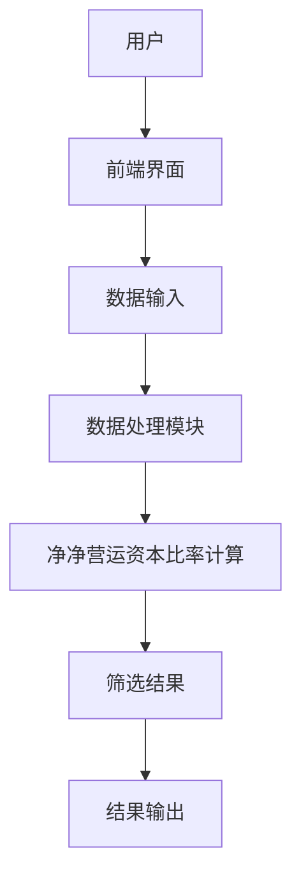

                 


```markdown
# 净净营运资本比率在股票筛选中的应用

> 关键词：净净营运资本比率，股票筛选，财务指标，投资决策，企业评估

> 摘要：净净营运资本比率是评估企业财务健康状况的重要指标，广泛应用于股票筛选和投资决策中。本文详细探讨了该比率的定义、计算方法、实际应用案例、系统设计与实现，以及最佳实践，帮助投资者更好地利用这一指标进行投资决策。

---

## 第一部分: 净净营运资本比率的基本概念与意义

### 第1章: 净净营运资本比率的定义与背景

#### 1.1 净净营运资本比率的定义
净净营运资本比率（Net Net Working Capital Ratio），又称净现金流营运资产比率，用于衡量企业的短期偿债能力和财务健康状况。它通过比较企业的净营运资本和流动负债，评估企业在短期内偿还债务的能力。

#### 1.2 净净营运资本比率的背景与重要性
- **背景**：在金融投资中，投资者需要评估企业的财务状况，以做出明智的投资决策。净净营运资本比率作为重要的财务指标之一，帮助投资者识别企业的短期偿债能力。
- **重要性**：该比率不仅用于评估企业的财务健康状况，还用于筛选具有稳定财务表现的股票，从而降低投资风险。

---

## 第2章: 净净营运资本比率的计算与分析

### 2.1 净净营运资本比率的计算公式
$$\text{净净营运资本比率} = \frac{\text{净营运资本}}{\text{流动负债}}$$
其中，净营运资本 = 流动资产 - 流动负债。

### 2.2 净净营运资本比率的分析方法
- **单个企业分析**：计算企业的净净营运资本比率，判断其短期偿债能力。
- **行业比较分析**：将企业的比率与同行业平均水平进行比较，识别行业内的优劣企业。
- **时间序列分析**：分析企业净净营运资本比率的变化趋势，评估企业的财务稳定性。

### 2.3 净净营运资本比率的可视化展示
- 使用折线图展示企业净净营运资本比率的变化趋势。
- 通过仪表盘实时监控企业的财务状况。

---

## 第3章: 净净营运资本比率在股票筛选中的应用案例

### 3.1 案例一: 高成长企业的筛选
- **案例背景**：某科技公司近年来收入增长迅速，但净净营运资本比率较低。
- **应用过程**：通过计算净净营运资本比率，结合其他财务指标，筛选出高成长企业。
- **结果分析**：该公司的高成长性与其稳定的财务状况密切相关。

### 3.2 案例二: 高风险企业的识别
- **案例背景**：某制造企业面临流动负债增加，净净营运资本比率下降。
- **应用过程**：通过分析净净营运资本比率，识别企业的高风险状况。
- **结果分析**：该企业可能面临短期偿债压力，投资者需谨慎考虑。

### 3.3 案例三: 行业周期性分析
- **案例背景**：某行业受经济周期影响较大，企业净净营运资本比率波动显著。
- **应用过程**：分析行业内的企业净净营运资本比率变化，识别周期性波动对企业的影响。
- **结果分析**：行业周期性波动对企业财务状况的影响需长期关注。

---

## 第4章: 净净营运资本比率的系统设计与实现

### 4.1 系统功能设计
- **数据采集**：收集企业的财务数据，包括流动资产和流动负债。
- **计算净净营运资本比率**：根据公式计算企业的净净营运资本比率。
- **筛选股票**：根据设定的阈值，筛选出符合条件的股票。

### 4.2 系统架构设计


### 4.3 系统实现
- **环境安装**：安装Python、pandas、numpy等工具。
- **代码实现**：
  ```python
  import pandas as pd

  def calculate_net_net_ratio(df):
      net_operating_capital = df['流动资产'] - df['流动负债']
      net_net_ratio = net_operating_capital / df['流动负债']
      return net_net_ratio

  # 数据加载与处理
  data = pd.read_csv('financial_data.csv')
  ratios = calculate_net_net_ratio(data)
  ```

---

## 第5章: 项目实战与分析

### 5.1 实战环境安装
- 安装必要的Python库：`pip install pandas numpy matplotlib`

### 5.2 代码实现与解读
```python
import pandas as pd
import matplotlib.pyplot as plt

def calculate_net_net_ratio(df):
    return (df['流动资产'] - df['流动负债']) / df['流动负债']

# 加载数据
data = pd.read_csv('financial_data.csv')

# 计算比率
ratios = calculate_net_net_ratio(data)

# 可视化
plt.hist(ratios, bins=10, label='净净营运资本比率分布')
plt.xlabel('净净营运资本比率')
plt.ylabel('频数')
plt.legend()
plt.show()
```

### 5.3 案例分析
- 分析某行业的净净营运资本比率分布，识别行业内的优质企业。

### 5.4 项目小结
- 净净营运资本比率在股票筛选中的应用需要结合实际数据和行业背景进行分析。

---

## 第6章: 净净营运资本比率的应用注意事项与最佳实践

### 6.1 注意事项
- 单一指标分析的局限性：需结合其他财务指标进行综合评估。
- 数据质量的重要性：确保数据的准确性和完整性。

### 6.2 最佳实践
- 定期更新数据：根据最新的财务报告重新计算比率。
- 设置合理的筛选阈值：根据行业特点和投资目标调整筛选标准。

### 6.3 拓展阅读
- 推荐阅读相关财务分析书籍和学术论文，深入理解净净营运资本比率的应用。

---

## 第7章: 总结与展望

### 7.1 总结
净净营运资本比率是评估企业短期偿债能力和财务健康状况的重要指标，广泛应用于股票筛选和投资决策中。

### 7.2 展望
未来，随着大数据和人工智能技术的发展，净净营运资本比率的应用将更加智能化和个性化。

---

## 作者

作者：AI天才研究院/AI Genius Institute & 禅与计算机程序设计艺术 /Zen And The Art of Computer Programming
```

