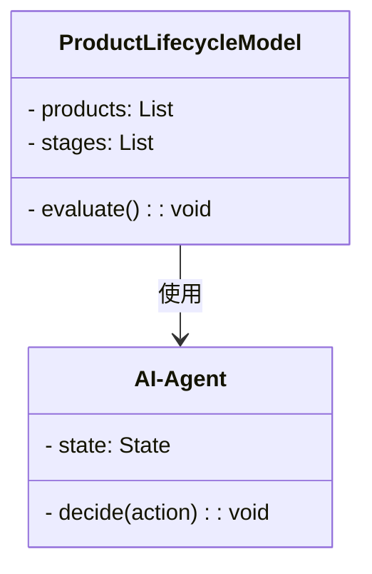

                 


# 利用AI Agents构建动态产品生命周期模型：评估公司产品组合

## 关键词：
- AI代理
- 产品生命周期
- 动态模型
- 产品组合评估
- 系统架构
- 强化学习

## 摘要：
本文详细探讨了如何利用AI代理构建动态产品生命周期模型，以评估和优化公司产品组合。通过分析传统方法的局限性，本文提出了基于AI代理的解决方案，并从背景、核心概念、算法原理、系统架构到项目实战，全面阐述了实现这一模型的步骤和方法。文章结合实际案例，深入分析了动态模型的优势，并提供了系统设计和架构的具体实现方案。

---

# 第一部分: 背景与概述

## 第1章: AI代理与产品生命周期概述

### 1.1 问题背景与挑战
#### 1.1.1 传统产品生命周期管理的局限性
传统的的产品生命周期管理依赖于固定的时间表和人工决策，难以适应快速变化的市场环境。企业需要实时调整产品策略以应对市场竞争、客户需求和技术变化。

#### 1.1.2 动态市场环境对企业产品组合的影响
在现代市场中，产品生命周期的阶段和时间跨度因市场环境、竞争对手策略和客户需求的变化而不断调整。企业需要动态评估产品组合，以确保资源的最优配置和市场竞争力。

#### 1.1.3 AI代理在现代企业中的应用潜力
AI代理具有实时感知、自主决策和自适应优化的能力，能够有效应对复杂多变的市场环境。通过AI代理，企业可以实时监控产品生命周期的状态，并根据反馈快速调整策略。

### 1.2 动态产品生命周期模型的核心概念
#### 1.2.1 产品生命周期的基本阶段
产品生命周期一般包括引入期、成长期、成熟期和衰退期。每个阶段的特点和策略不同，需要动态调整。

#### 1.2.2 动态模型的定义与特点
动态产品生命周期模型是一个能够实时更新和调整的模型，能够根据市场反馈和内部数据自动优化产品组合。

#### 1.2.3 AI代理在动态模型中的作用
AI代理负责数据采集、模型训练和决策执行，是动态模型的核心驱动力。

### 1.3 问题描述与解决思路
#### 1.3.1 产品组合评估的复杂性
产品组合评估需要考虑市场、技术、成本等多个因素，传统的静态模型难以满足需求。

#### 1.3.2 AI代理如何优化产品生命周期管理
AI代理通过实时数据采集、分析和决策，优化产品生命周期中的资源配置和策略制定。

#### 1.3.3 动态模型的构建目标与边界
构建目标：实时监控和优化产品生命周期；构建边界：基于AI代理的动态模型，不涉及具体的业务流程。

---

## 第2章: 动态产品生命周期模型的构建基础

### 2.1 核心概念与联系
#### 2.1.1 AI代理的核心属性对比
| 属性 | 描述 |
|------|------|
| 感知能力 | 数据采集和分析能力 |
| 决策能力 | 基于数据的决策能力 |
| 自适应能力 | 根据反馈调整行为的能力 |

#### 2.1.2 产品生命周期模型的实体关系图
```mermaid
er
  actor: 企业
  product: 产品
  lifecycle_stage: 生命周期阶段
  relation: 关联
  actor --> product: 管理
  product --> lifecycle_stage: 经历
  product --> relation: 关联
```

### 2.2 算法原理概述
#### 2.2.1 基于AI代理的动态模型算法流程


---

# 第二部分: 核心概念与算法原理

## 第3章: AI代理的核心原理

### 3.1 代理的结构与功能
#### 3.1.1 状态空间与动作空间的定义
- **状态空间**：代理所处的环境状态，例如市场需求、产品性能等。
- **动作空间**：代理可以执行的操作，例如调整价格、优化生产等。

#### 3.1.2 代理的感知与决策机制
代理通过感知环境状态，选择最优动作以实现目标。感知和决策过程可以通过强化学习实现。

#### 3.1.3 基于强化学习的代理训练
```mermaid
graph LR
  A[状态s_t] --> B[选择动作a_t]
  B --> C[执行动作a_t]
  C --> D[获得奖励r_t]
  D --> E[更新策略]
  E --> F[新状态s_{t+1}]
```

### 3.2 动态模型的数学基础
#### 3.2.1 状态转移方程
$$ P(s_{t+1}|s_t, a_t) $$

---

## 第4章: 系统架构与设计

### 4.1 系统架构设计
#### 4.1.1 问题场景介绍
企业需要实时监控和优化产品生命周期，因此需要一个动态模型来支持决策。

#### 4.1.2 系统功能设计


#### 4.1.3 系统架构设计


---

## 第5章: 项目实战

### 5.1 环境安装与配置
需要安装Python、TensorFlow、Mermaid等工具。

### 5.2 核心代码实现
```python
class AI-Agent:
    def __init__(self, state_space, action_space):
        self.state_space = state_space
        self.action_space = action_space
        self.current_state = None

    def decide(self, state):
        # 基于强化学习的决策
        pass

class ProductLifecycleModel:
    def __init__(self, products):
        self.products = products
        self.current_stage = None

    def evaluate(self):
        # 评估产品生命周期
        pass
```

---

## 第6章: 总结与展望

### 6.1 小结
本文详细介绍了如何利用AI代理构建动态产品生命周期模型，并通过实际案例展示了其应用价值。

### 6.2 最佳实践
- 确保数据质量和实时性
- 定期更新模型和代理策略
- 结合企业实际情况进行调整

### 6.3 未来展望
随着AI技术的发展，动态模型将更加智能化和高效化。

---

## 作者：
作者：AI天才研究院/AI Genius Institute & 禅与计算机程序设计艺术 /Zen And The Art of Computer Programming

---

这篇文章详细介绍了利用AI代理构建动态产品生命周期模型的背景、核心概念、算法原理、系统架构和项目实战。通过结合实际案例，深入分析了动态模型的优势，并提供了系统设计和架构的具体实现方案。

