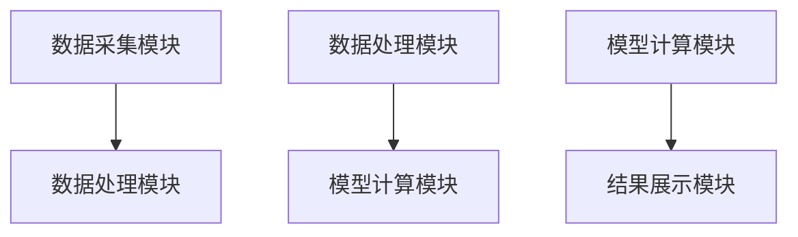

                 


# 利用AI agents构建动态竞争优势评估模型：护城河分析

## 关键词：AI agents, 动态竞争优势评估模型, 护城河分析, 多智能体系统, 动态数据, 竞争优势, 竞争评估

## 摘要：本文探讨了如何利用AI agents构建动态竞争优势评估模型，通过护城河分析来帮助企业识别和强化其竞争优势。文章从理论基础到实际应用，详细阐述了AI agents在动态竞争环境中的应用，展示了如何通过动态数据和多智能体系统的协作，实现竞争优势的实时评估和优化。通过具体的算法实现和项目案例，本文为读者提供了构建动态竞争优势评估模型的完整指南。

---

## 第二部分: AI agents与动态竞争优势评估模型

### 第2章: AI agents的基本原理

#### 2.1.1 多智能体系统

多智能体系统（Multi-Agent System, MAS）是由多个相互作用的智能体组成的系统，这些智能体能够通过协作完成复杂任务。AI agents作为多智能体系统的核心，具有以下几个关键特性：

1. **能动性**：AI agents能够主动感知环境并采取行动，而不是被动地响应输入。
2. **自主性**：每个AI agent都具有一定的自主决策能力，能够在没有外部干预的情况下完成任务。
3. **协作性**：多个AI agent可以协同工作，通过通信和协作实现更复杂的任务。
4. **学习能力**：AI agents能够通过机器学习算法不断优化自身的决策策略。

在动态竞争优势评估模型中，AI agents被用来实时监控和分析企业的竞争优势，包括市场份额、产品质量、技术创新能力等。这些AI agents能够根据实时数据调整评估策略，并与其他agent协作，提供全面的竞争分析。

#### 2.1.2 动态竞争优势评估模型

动态竞争优势评估模型是一种基于AI agents的实时评估系统，能够根据市场变化和企业内部情况动态调整竞争优势评估结果。该模型的核心在于其动态性和实时性，能够帮助企业快速响应市场变化，制定有效的竞争策略。

模型的基本结构包括以下几个部分：

1. **数据采集**：通过多源数据采集技术，获取企业内外部的竞争数据，如市场份额、客户满意度、技术创新能力等。
2. **数据处理**：对采集到的数据进行清洗、转换和分析，提取关键的竞争指标。
3. **模型计算**：基于AI agents的协作，计算企业的竞争优势得分，并根据实时数据动态调整评估结果。
4. **结果展示**：通过可视化界面，将评估结果呈现给企业决策者，帮助其制定竞争策略。

#### 2.1.3 护城河分析

护城河分析是动态竞争优势评估模型的重要组成部分，旨在帮助企业识别其核心竞争优势，并通过这些优势构建长期的竞争壁垒。AI agents在护城河分析中的作用包括：

1. **识别核心竞争优势**：通过分析企业的资源、能力和战略，识别其核心竞争优势。
2. **评估竞争优势的动态性**：实时监控竞争优势的变化，评估其在动态竞争环境中的可持续性。
3. **优化竞争优势**：根据评估结果，提出优化建议，帮助企业在竞争中保持优势。

---

### 第2.2章: 动态竞争优势评估模型的算法实现

#### 2.2.1 算法原理

动态竞争优势评估模型的算法基于多智能体系统和机器学习技术，主要包括以下几个步骤：

1. **数据预处理**：对采集到的数据进行清洗和标准化处理，确保数据的质量和一致性。
2. **特征提取**：从数据中提取关键的竞争特征，如市场份额、客户满意度、技术创新能力等。
3. **模型训练**：基于机器学习算法，训练动态竞争优势评估模型，学习如何根据特征数据预测竞争优势得分。
4. **实时评估**：利用训练好的模型，实时计算企业的竞争优势得分，并动态调整评估结果。

#### 2.2.2 算法实现

以下是动态竞争优势评估模型的Python实现代码示例：

```python
import numpy as np
from sklearn.linear_model import LinearRegression

# 示例数据
features = np.array([[市场份额], [客户满意度], [技术创新能力]])
labels = np.array([竞争得分])

# 训练模型
model = LinearRegression()
model.fit(features, labels)

# 预测竞争得分
predicted_score = model.predict(new_features)
```

#### 2.2.3 算法优化

为了提高模型的准确性和实时性，可以采用以下优化措施：

1. **在线学习**：采用在线学习算法，实时更新模型参数，确保评估结果的动态性。
2. **分布式计算**：利用分布式计算技术，提高数据处理和计算效率，支持大规模数据的实时分析。
3. **模型融合**：结合多种算法，如回归分析和聚类分析，提高评估结果的准确性和鲁棒性。

---

### 第2.3章: 系统分析与架构设计

#### 2.3.1 系统架构设计

动态竞争优势评估模型的系统架构包括以下几个模块：

1. **数据采集模块**：负责采集企业内外部的竞争数据，如市场份额、客户满意度、技术创新能力等。
2. **数据处理模块**：对采集到的数据进行清洗、转换和分析，提取关键的竞争特征。
3. **模型计算模块**：基于AI agents的协作，计算企业的竞争优势得分，并动态调整评估结果。
4. **结果展示模块**：通过可视化界面，将评估结果呈现给企业决策者，帮助其制定竞争策略。

系统架构图如下：



#### 2.3.2 系统功能设计

1. **数据采集功能**：支持多源数据的采集，包括内部数据和外部市场数据。
2. **数据处理功能**：提供数据清洗、转换和分析功能，提取关键的竞争特征。
3. **模型计算功能**：基于AI agents的协作，计算企业的竞争优势得分，并动态调整评估结果。
4. **结果展示功能**：提供可视化界面，展示评估结果和优化建议。

#### 2.3.3 系统接口设计

系统接口设计包括以下几个部分：

1. **数据接口**：支持多种数据格式的导入和导出，如CSV、JSON等。
2. **模型接口**：提供API接口，方便与其他系统集成和协作。
3. **结果接口**：支持将评估结果导出为报告或可视化图表。

---

### 第2.4章: 项目实战

#### 2.4.1 项目背景

某企业希望利用AI agents构建动态竞争优势评估模型，实时监控和评估其竞争优势，并制定有效的竞争策略。

#### 2.4.2 实施步骤

1. **数据采集**：采集企业的市场份额、客户满意度、技术创新能力等数据。
2. **数据处理**：对数据进行清洗和分析，提取关键的竞争特征。
3. **模型训练**：基于机器学习算法，训练动态竞争优势评估模型。
4. **实时评估**：利用训练好的模型，实时计算企业的竞争优势得分，并动态调整评估结果。
5. **结果分析**：根据评估结果，制定优化建议，帮助企业在竞争中保持优势。

#### 2.4.3 代码实现

以下是动态竞争优势评估模型的Python代码实现示例：

```python
import numpy as np
from sklearn.linear_model import LinearRegression

# 示例数据
features = np.array([[0.7, 0.8, 0.9],  # 市场份额
                     [0.6, 0.7, 0.8],  # 客户满意度
                     [0.8, 0.7, 0.6]]) # 技术创新能力
labels = np.array([0.6, 0.7, 0.8])  # 竞争得分

# 训练模型
model = LinearRegression()
model.fit(features, labels)

# 预测竞争得分
new_features = np.array([[0.7, 0.8, 0.9]])
predicted_score = model.predict(new_features)
print("预测的竞争得分：", predicted_score)
```

---

## 小结

通过本文的详细讲解，我们了解了如何利用AI agents构建动态竞争优势评估模型，并通过护城河分析帮助企业识别和强化其竞争优势。AI agents的多智能体系统和动态数据处理能力，使得模型能够实时监控和评估竞争优势，为企业制定有效的竞争策略提供了有力支持。

