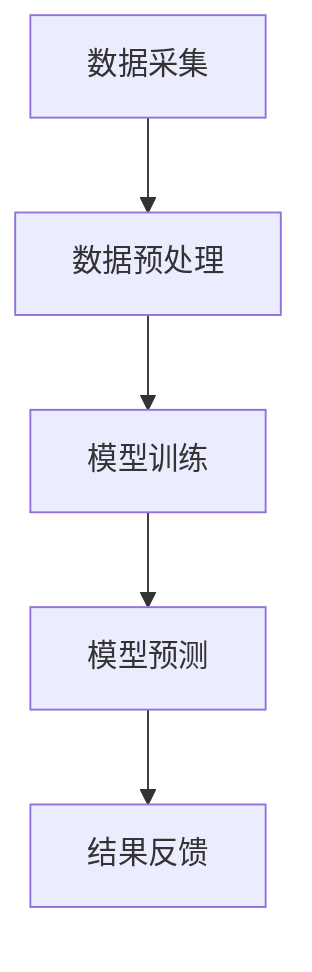
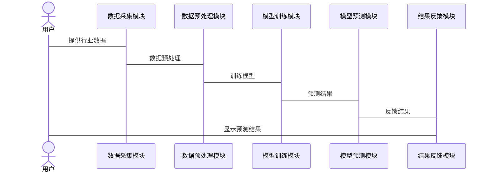

                 


# 利用AI agents构建动态行业生命周期模型：把握产业演变

**关键词**：AI代理、动态行业生命周期模型、行业演变、强化学习、推荐系统、系统架构设计

**摘要**：  
本文探讨了如何利用AI代理构建动态行业生命周期模型，以帮助企业和研究者更好地把握产业演变趋势。通过结合AI代理的算法原理和行业生命周期模型的动态特性，本文详细阐述了如何利用强化学习和推荐系统等技术，动态调整模型参数、实时反馈行业演变情况，并通过系统架构设计实现模型的高效运行。文章还通过实际案例展示了如何利用这些技术构建动态行业生命周期模型，并提出了最佳实践和未来研究方向。

---

## 第1章: AI代理与动态行业生命周期模型概述

### 1.1 AI代理的基本概念
#### 1.1.1 什么是AI代理
AI代理（Artificial Intelligence Agent）是指能够感知环境、自主决策并执行任务的智能实体。AI代理可以是软件程序，也可以是机器人，其核心目标是通过算法和数据驱动的方式，实现对复杂问题的自主解决。

#### 1.1.2 AI代理的核心特征
AI代理的核心特征包括：
1. **自主性**：能够在没有人工干预的情况下自主运行。
2. **反应性**：能够实时感知环境变化并做出反应。
3. **目标导向性**：通过设定目标，驱动代理的行为。
4. **学习能力**：能够通过经验优化自身的决策能力。

#### 1.1.3 AI代理与传统算法的区别
与传统算法相比，AI代理具有更强的自主性和适应性。传统算法通常需要人工预定义规则，而AI代理能够通过强化学习、深度学习等技术，动态调整自身的决策策略。

---

### 1.2 行业生命周期模型的基本概念
#### 1.2.1 行业生命周期的定义
行业生命周期是指一个行业从引入期、成长期、成熟期到衰退期的演变过程。每个阶段的特点不同，企业需要根据行业所处的阶段调整战略。

#### 1.2.2 行业生命周期的阶段划分
行业生命周期通常分为四个阶段：
1. **引入期**：行业刚刚进入市场，产品尚未成熟。
2. **成长期**：市场需求快速增长，企业数量增加。
3. **成熟期**：市场趋于饱和，竞争加剧。
4. **衰退期**：市场需求下降，企业逐渐退出。

#### 1.2.3 行业生命周期模型的动态特征
行业生命周期模型是一个动态系统，其变化受到市场需求、技术进步、政策环境等多种因素的影响。传统的静态模型难以捕捉这些动态变化，而动态模型能够实时更新行业状态。

---

### 1.3 AI代理在行业生命周期中的作用
#### 1.3.1 AI代理如何动态调整行业模型
AI代理能够实时感知行业数据的变化，动态调整行业生命周期模型的参数，使其更准确地反映行业的演变趋势。

#### 1.3.2 AI代理在行业预测中的优势
AI代理通过强化学习和深度学习技术，能够预测行业的未来趋势，帮助企业和投资者做出更明智的决策。

#### 1.3.3 AI代理与行业生命周期的结合
AI代理可以嵌入到行业生命周期模型中，通过实时数据反馈和动态调整，实现对行业演变的精准预测和管理。

---

## 第2章: 动态行业生命周期模型的构建

### 2.1 行业生命周期模型的构建过程
#### 2.1.1 数据收集与预处理
构建动态行业生命周期模型的第一步是收集行业相关的数据，包括市场需求、企业数量、技术创新等。数据预处理包括清洗、标准化和特征提取。

#### 2.1.2 模型构建与训练
基于收集的数据，构建行业生命周期模型，并通过训练数据优化模型参数。常用的模型包括时间序列模型和机器学习模型。

#### 2.1.3 模型验证与优化
通过验证数据对模型进行测试，并根据测试结果优化模型。优化过程包括调整模型参数、选择最优算法等。

---

### 2.2 AI代理在模型构建中的应用
#### 2.2.1 AI代理如何动态调整模型参数
AI代理通过强化学习算法，动态调整模型参数，以提高预测的准确性。

#### 2.2.2 AI代理在特征提取中的作用
AI代理能够自动提取行业数据中的特征，帮助模型更好地理解行业演变的规律。

#### 2.2.3 AI代理与模型迭代优化
AI代理通过实时反馈机制，不断优化模型的预测能力，使其能够适应行业的动态变化。

---

### 2.3 动态行业生命周期模型的实现
#### 2.3.1 模型的动态更新机制
模型的动态更新机制包括定期重新训练模型、实时更新模型参数等。

#### 2.3.2 模型的实时反馈机制
通过实时数据反馈，模型能够快速调整预测结果，确保预测的准确性。

#### 2.3.3 模型的可扩展性设计
模型需要具备良好的可扩展性，能够适应不同行业和不同规模的数据。

---

## 第3章: AI代理的算法原理

### 3.1 强化学习算法
#### 3.1.1 强化学习的基本原理
强化学习是一种通过试错机制，学习最优策略的算法。代理通过与环境交互，获得奖励或惩罚，逐步优化决策策略。

#### 3.1.2 Q-learning算法
Q-learning是一种常用的强化学习算法，其数学模型如下：
$$ Q(s, a) = r + \gamma \max_{a'} Q(s', a') $$
其中，$s$ 是当前状态，$a$ 是当前动作，$r$ 是奖励，$\gamma$ 是折扣因子。

#### 3.1.3 Deep Q-Networks (DQN) 算法
DQN算法通过深度神经网络近似Q值函数，其数学模型如下：
$$ \text{损失函数} = \frac{1}{2} (y - Q(s, a))^2 $$

---

### 3.2 推荐系统算法
#### 3.2.1 基于协同过滤的推荐算法
协同过滤算法通过分析用户行为，推荐相似用户的偏好。

#### 3.2.2 基于内容的推荐算法
内容推荐算法通过分析商品或服务的特征，推荐相关的产品。

#### 3.2.3 基于深度学习的推荐算法
深度学习推荐算法通过神经网络模型，捕捉数据中的复杂特征，推荐更精准的结果。

---

### 3.3 算法的数学模型与公式
#### 3.3.1 Q-learning算法的数学模型
$$ Q(s, a) = r + \gamma \max_{a'} Q(s', a') $$

#### 3.3.2 DQN算法的数学模型
$$ \text{损失函数} = \frac{1}{2} (y - Q(s, a))^2 $$

---

## 第4章: 系统分析与架构设计方案

### 4.1 系统功能设计
#### 4.1.1 问题场景介绍
行业生命周期模型需要实时更新，以反映行业的动态变化。传统静态模型难以满足这一需求。

#### 4.1.2 项目介绍
本项目旨在利用AI代理构建动态行业生命周期模型，实现对行业演变的精准预测。

#### 4.1.3 系统功能设计
- 数据采集模块：实时采集行业数据。
- 模型训练模块：利用AI代理优化模型参数。
- 预测模块：输出行业的未来趋势。
- 反馈模块：根据实际结果调整模型。

---

### 4.2 系统架构设计
#### 4.2.1 数据流图
数据流从采集模块流向训练模块，再流向预测模块，最后通过反馈模块调整模型参数。

#### 4.2.2 系统架构图


#### 4.2.3 系统接口设计
- 数据接口：负责数据的输入和输出。
- 模型接口：负责模型的训练和预测。
- 用户接口：提供用户交互界面。

#### 4.2.4 系统交互流程图


---

## 第5章: 项目实战

### 5.1 环境安装
- 安装Python和必要的库（如TensorFlow、Keras）。
- 安装Mermaid和Graphviz用于绘制图表。

### 5.2 核心代码实现
#### 5.2.1 数据采集模块
```python
import requests

def fetch_data(api_url):
    response = requests.get(api_url)
    return response.json()
```

#### 5.2.2 模型训练模块
```python
import tensorflow as tf
from tensorflow.keras import layers

model = tf.keras.Sequential([
    layers.Dense(64, activation='relu'),
    layers.Dense(1, activation='sigmoid')
])
model.compile(optimizer='adam', loss='binary_crossentropy', metrics=['accuracy'])
model.fit(x_train, y_train, epochs=10, batch_size=32)
```

#### 5.2.3 模型预测模块
```python
predictions = model.predict(x_test)
```

### 5.3 案例分析
以某行业为例，展示如何利用AI代理构建动态行业生命周期模型，并预测其未来发展趋势。

### 5.4 项目总结
总结项目实施过程中的经验教训，提出改进建议。

---

## 第6章: 最佳实践、小结、注意事项和拓展阅读

### 6.1 最佳实践
- 定期更新模型参数，保持模型的准确性。
- 结合行业专家的知识，优化模型的预测能力。
- 建立完善的监控机制，及时发现模型的异常。

### 6.2 小结
本文详细介绍了如何利用AI代理构建动态行业生命周期模型，通过算法原理、系统设计和项目实战，展示了如何实现对行业演变的精准预测。

### 6.3 注意事项
- 数据质量对模型的准确性至关重要。
- 模型的实时更新需要强大的计算能力支持。
- 需要结合行业知识，避免模型的过度拟合。

### 6.4 拓展阅读
- 加强对强化学习和推荐系统的研究。
- 探索更多AI代理在行业分析中的应用。

---

## 作者：AI天才研究院/AI Genius Institute & 禅与计算机程序设计艺术/Zen And The Art of Computer Programming

---

希望这篇文章能够帮助读者更好地理解如何利用AI代理构建动态行业生命周期模型，并在实际应用中取得成功！

