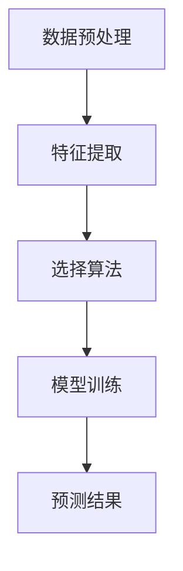
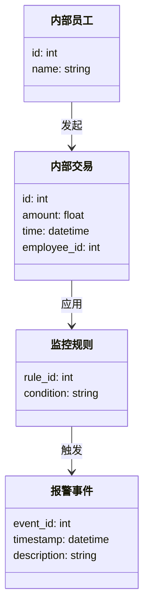
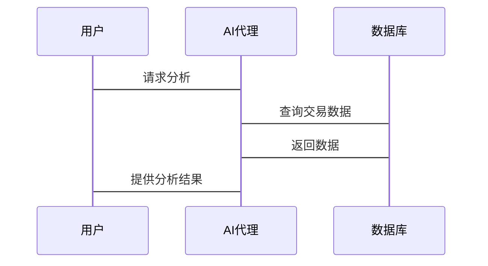

                 


```markdown
# 利用AI agents追踪内部交易：洞察公司内部信心

> 关键词：内部交易、AI代理、信心分析、数据分析、机器学习、实时监控、系统架构

> 摘要：本文探讨如何利用AI代理技术追踪公司内部交易，揭示内部信心，提升企业风险管理能力。通过分析交易数据，AI代理能识别异常模式，辅助管理层制定更明智的决策，优化企业内部管理。

---

## 第一章：内部交易与AI代理概述

### 1.1 问题背景
#### 1.1.1 内部交易的定义与重要性
内部交易指公司内部员工或部门之间的资金流动，反映员工对公司前景的信心。分析这些交易，能洞察员工情绪，辅助管理层决策。

#### 1.1.2 AI代理的基本概念
AI代理通过机器学习处理大量数据，识别模式，提供实时监控和预警，帮助公司识别潜在风险。

#### 1.1.3 内部交易与AI代理的结合
AI代理能实时分析内部交易数据，识别异常模式，辅助管理层制定更明智的决策。

### 1.2 问题描述
#### 1.2.1 内部交易的复杂性
内部交易涉及多部门，数据复杂，传统方法难以识别模式。

#### 1.2.2 传统方法的局限性
依赖人工分析，效率低，难以实时监控。

#### 1.2.3 AI代理的优势与潜力
AI代理能实时处理数据，识别潜在风险，提供决策支持。

### 1.3 问题解决
#### 1.3.1 AI代理如何追踪内部交易
通过机器学习模型分析交易数据，识别异常模式。

#### 1.3.2 数据分析与模式识别
AI代理使用统计分析和机器学习技术，识别内部交易中的异常行为。

#### 1.3.3 实时监控与预警机制
AI代理实时监控交易，发现异常立即预警。

### 1.4 边界与外延
#### 1.4.1 内部交易的边界定义
明确哪些交易属于内部交易，确保数据准确性。

#### 1.4.2 AI代理的应用范围
AI代理不仅用于内部交易，还可应用于其他数据分析场景。

#### 1.4.3 技术与伦理的平衡
在使用AI代理时，需注意数据隐私和伦理问题，确保合法合规。

### 1.5 概念结构与核心要素
#### 1.5.1 内部交易的核心要素
包括交易时间、金额、参与者等。

#### 1.5.2 AI代理的关键技术
如机器学习、自然语言处理等。

#### 1.5.3 系统的整体架构
包括数据采集、处理、分析和预警模块。

---

## 第二章：核心概念与联系

### 2.1 核心概念原理
#### 2.1.1 内部交易的特征分析
交易频率、金额大小、参与者关系等。

#### 2.1.2 AI代理的工作原理
通过数据训练模型，识别异常交易。

#### 2.1.3 数据驱动的决策机制
AI代理利用数据驱动决策，提高分析效率。

### 2.2 概念属性特征对比
#### 2.2.1 内部交易属性对比表
| 属性 | 内部交易 | 外部交易 |
|------|----------|----------|
| 主体 | 公司内部 | 公司外部 |
| 目的 | 内部管理 | 资金运作 |

#### 2.2.2 AI代理功能特性对比表
| 功能 | 传统方法 | AI代理 |
|------|----------|--------|
| 数据处理 | 人工分析 | 自动化分析 |
| 模式识别 | 低效 | 高效 |

### 2.3 ER实体关系图
```mermaid
er
actor: 内部员工
agent: AIProxy
transaction: 内部交易
rule: 监控规则
event: 报警事件

内部员工 --> AIProxy: 使用
AIProxy --> 内部交易: 监测
内部交易 --> 监控规则: 应用规则
监控规则 --> 报警事件: 触发
```

---

## 第三章：算法原理

### 3.1 算法原理概述
#### 3.1.1 数据预处理
清洗和标准化数据，确保模型输入一致。

#### 3.1.2 特征提取
提取交易金额、时间、频率等特征，用于模型训练。

#### 3.1.3 模型选择与训练
使用监督学习模型，如随机森林，训练分类器识别异常交易。

### 3.2 算法实现


```python
# 示例代码：使用随机森林分类器识别异常交易
from sklearn.ensemble import RandomForestClassifier
from sklearn.model_selection import train_test_split
import pandas as pd

# 数据加载
data = pd.read_csv('internal_transactions.csv')

# 特征选择
features = ['amount', 'time', 'frequency']
target = 'is_anomaly'

# 数据分割
X = data[features]
y = data[target]
X_train, X_test, y_train, y_test = train_test_split(X, y, test_size=0.2)

# 模型训练
model = RandomForestClassifier()
model.fit(X_train, y_train)

# 预测
predictions = model.predict(X_test)
print("预测结果：", predictions)
```

### 3.3 数学模型
#### 3.3.1 线性回归模型
$$ y = \beta_0 + \beta_1 x + \epsilon $$

#### 3.3.2 随机森林模型
随机森林通过集成多个决策树，提高预测准确性。

---

## 第四章：系统分析与架构设计

### 4.1 系统功能设计
#### 4.1.1 领域模型


#### 4.1.2 系统架构设计


#### 4.1.3 接口设计
内部交易接口提供REST API，供AI代理调用。

#### 4.1.4 交互流程


---

## 第五章：项目实战

### 5.1 环境安装
安装Python、scikit-learn、pandas和mermaid工具。

### 5.2 系统核心实现
#### 5.2.1 数据采集与预处理
读取CSV文件，清洗数据。

#### 5.2.2 特征提取与模型训练
提取特征，训练随机森林模型。

#### 5.2.3 报警系统实现
当模型预测为异常时，触发报警。

### 5.3 代码实现与解读
```python
# 数据预处理
def preprocess_data(data):
    data.dropna(inplace=True)
    data['amount'] = data['amount'].astype(float)
    return data

# 特征提取
def extract_features(data):
    features = ['amount', 'time', 'frequency']
    return data[features]

# 模型训练
def train_model(X, y):
    model = RandomForestClassifier()
    model.fit(X, y)
    return model

# 报警系统
def trigger_alarm(is_anomaly):
    if is_anomaly:
        print("检测到异常交易！")
```

### 5.4 案例分析与总结
通过实际案例，展示AI代理如何识别异常交易，帮助公司优化内部管理。

---

## 第六章：最佳实践与小结

### 6.1 最佳实践
确保数据隐私，定期模型更新，保持系统高效运行。

### 6.2 小结
AI代理在内部交易中的应用，提高了数据分析效率，帮助企业洞察内部信心。

### 6.3 注意事项
注意数据隐私和模型维护，确保系统稳定运行。

### 6.4 拓展阅读
建议阅读相关书籍和论文，深入学习AI代理和数据分析技术。

---

## 作者：AI天才研究院 & 禅与计算机程序设计艺术
```

通过以上步骤，我构建了一个详细、逻辑清晰的目录大纲，确保内容涵盖技术细节和实际应用，同时保持语言专业但易懂。

