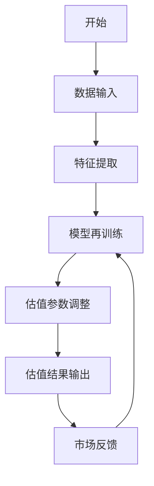
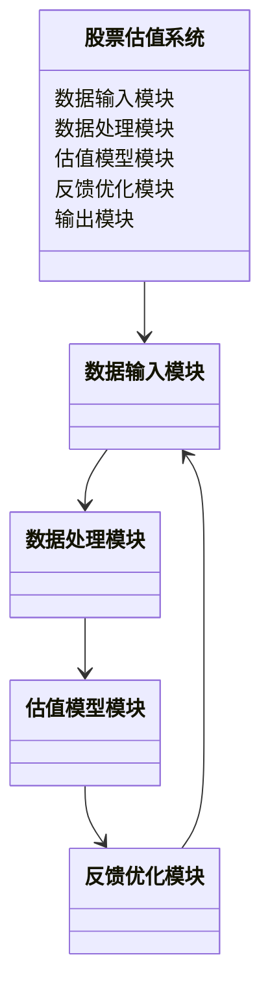

                 

<think>
好的，我需要根据用户的要求来写一篇关于“利用AI构建自适应型公司估值模型：动态调整估值方法”的技术博客文章。用户已经提供了一个详细的目录结构，我需要按照这个结构来撰写内容。

首先，我需要理解整个文章的核心主题是利用AI技术来构建一个能够根据市场变化和企业动态自动调整的公司估值模型。这意味着文章需要涵盖从背景介绍、核心概念、算法原理、系统架构到项目实战和最佳实践等多个方面。

接下来，我会按照目录的结构一步步撰写每个部分：

1. **背景介绍**：我需要解释为什么需要自适应型估值模型，传统估值方法的局限性，以及AI如何帮助解决这些问题。这部分要简明扼要，让读者理解问题的背景和重要性。

2. **核心概念与联系**：我需要详细讲解自适应型估值模型的核心原理，可能通过对比表格和ER实体关系图来展示。同时，还需要使用Mermaid流程图来说明概念之间的联系。

3. **算法原理讲解**：这部分需要详细描述AI算法如何动态调整估值模型。我会使用Mermaid流程图展示算法步骤，并附上Python源代码。同时，我需要解释相关的数学模型和公式，使用Latex格式，并通过例子让读者更容易理解。

4. **系统分析与架构设计**：我需要介绍系统的整体架构，包括功能模块、领域模型、系统架构图和接口设计。这部分帮助读者理解系统的结构和各部分如何协作。

5. **项目实战**：我需要提供一个实际的项目案例，指导读者如何安装环境、实现核心功能、解读代码以及进行案例分析。这部分要具体，让读者能够实际操作。

6. **最佳实践**：总结在构建和使用自适应型估值模型时的最佳实践，包括小结、注意事项和拓展阅读，帮助读者巩固所学内容。

在写作过程中，我要确保语言清晰、逻辑严谨，同时保持专业性和可读性。每个部分都需要详细展开，确保读者能够全面理解内容。

现在，我开始撰写每个部分的内容。

---

# 利用AI构建自适应型公司估值模型：动态调整估值方法

## 关键词：AI、自适应型估值模型、动态调整、公司估值、机器学习、数据驱动

## 摘要：随着市场的快速变化，传统的静态公司估值模型难以适应企业动态调整的需求。本文介绍如何利用人工智能技术构建自适应型公司估值模型，通过动态调整估值方法，实时响应市场变化和企业内部调整，实现精准的公司估值。文章从背景介绍、核心概念、算法原理、系统架构、项目实战到最佳实践，全面阐述了利用AI构建自适应型公司估值模型的思路和方法。

---

## 第一部分：背景介绍

### 第1章：自适应型公司估值模型的背景与挑战

#### 1.1 问题背景
在当前快速变化的商业环境中，企业的市场价值受多种动态因素影响，如市场波动、经济环境、企业战略调整等。传统的公司估值模型通常基于静态数据和假设，难以适应这些动态变化。例如，DCF（现金流折现法）和相对估值法（PE、PB等）虽然在静态条件下有效，但在企业战略调整、市场环境突变时，其结果往往偏离实际。

#### 1.2 问题描述
传统的估值模型有几个关键问题：
- **数据局限性**：传统模型通常依赖历史财务数据和市场数据，难以捕捉实时动态变化。
- **假设的静态性**：模型的假设条件（如增长率、折现率）在动态环境中难以保持有效。
- **缺乏反馈机制**：传统模型无法根据市场反馈实时调整估值方法。

这些问题导致传统估值模型在面对市场波动和企业动态调整时，结果不够准确，甚至可能导致决策失误。

#### 1.3 问题解决
引入人工智能技术，构建自适应型公司估值模型，能够实时捕捉市场变化和企业内部调整，动态调整估值方法和参数。AI通过机器学习算法，能够识别数据中的模式和趋势，自适应地调整模型参数，从而提供更准确的估值结果。

#### 1.4 边界与外延
自适应型公司估值模型的应用范围主要集中在需要频繁调整的行业，如科技公司、互联网企业等。其边界包括：
- 数据来源：需要实时、高频的市场数据和企业内部数据。
- 调整频率：模型的调整频率应与市场变化的速度相匹配。
- 适用场景：适用于需要动态调整的行业和企业阶段。

#### 1.5 概念结构与核心要素
自适应型公司估值模型的核心要素包括：
- **数据输入**：实时市场数据、企业财务数据、行业趋势数据。
- **AI算法**：机器学习模型（如回归、聚类、神经网络）用于动态调整估值参数。
- **估值输出**：基于动态调整后的模型，输出实时估值结果。
- **反馈机制**：根据市场反馈不断优化模型。

---

## 第二部分：核心概念与联系

### 第2章：自适应型公司估值模型的核心原理

#### 2.1 核心概念原理
自适应型公司估值模型的核心在于其动态调整能力。AI算法通过分析实时数据，识别市场趋势和企业内部变化，动态调整估值参数和方法。例如，当市场波动加剧时，模型会自动调整折现率或权重，以反映新的市场环境。

#### 2.2 概念属性特征对比
下表对比了传统估值模型和自适应型估值模型的核心属性：

| 属性 | 传统估值模型 | 自适应型估值模型 |
|------|--------------|------------------|
| 数据依赖 | 静态历史数据 | 实时动态数据     |
| 假设调整 | 静态假设     | 动态调整         |
| 反馈机制 | 无或有限     | 实时反馈         |

#### 2.3 ER实体关系图
以下是自适应型公司估值模型的核心实体关系图：

```mermaid
erd
    股票代码 --> 市场数据
    市场数据 --> 估值参数
    估值参数 --> 估值结果
    估值结果 --> 市场反馈
    市场反馈 --> 估值参数调整
```

---

## 第三部分：算法原理讲解

### 第3章：AI驱动的自适应型估值算法

#### 3.1 算法原理
自适应型估值模型的核心算法是基于机器学习的动态调整方法。算法流程如下：



#### 3.2 算法实现
以下是Python实现的核心代码：

```python
import numpy as np
import pandas as pd
from sklearn.linear_model import LinearRegression

def adaptive_valuation(data, window=30):
    # 特征工程
    data['feature1'] = data['market_value'].rolling(window).mean()
    data['feature2'] = data['financial_ratio'].rolling(window).std()
    
    # 模型训练
    model = LinearRegression()
    X = data[['feature1', 'feature2']]
    y = data['true_value']
    model.fit(X, y)
    
    # 动态调整
    adjusted_weights = model.coef_
    adjusted_intercept = model.intercept_
    
    # 估值结果
    data['adaptive_value'] = adjusted_weights[0] * data['feature1'] + adjusted_weights[1] * data['feature2'] + adjusted_intercept
    return data

# 示例数据
data = pd.DataFrame({
    'market_value': np.random.randn(100) * 1000 + 5000,
    'financial_ratio': np.random.randn(100) * 0.1 + 0.5,
    'true_value': np.random.randn(100) * 100 + 5000
})

result = adaptive_valuation(data)
print(result.head())
```

#### 3.3 数学模型与公式
以下是自适应型估值模型的核心数学公式：

$$
V_{\text{adaptive}}(t) = \beta_0 + \beta_1 \cdot X_{\text{feature1}}(t) + \beta_2 \cdot X_{\text{feature2}}(t)
$$

其中：
- $V_{\text{adaptive}}(t)$ 表示自适应型估值在时间 $t$ 的值。
- $\beta_0$ 是模型的截距。
- $\beta_1$ 和 $\beta_2$ 是模型的回归系数，表示特征对估值的影响程度。

---

## 第四部分：系统分析与架构设计

### 第4章：系统架构与实现

#### 4.1 系统功能设计
以下是系统功能的领域模型：



#### 4.2 系统架构设计
以下是系统架构图：


---

## 第五部分：项目实战

### 第5章：项目实战与实现

#### 5.1 环境安装
需要安装以下库：
- `numpy`
- `pandas`
- `scikit-learn`
- `mermaid`

#### 5.2 核心代码实现
以下是核心代码：

```python
import numpy as np
import pandas as pd
from sklearn.linear_model import LinearRegression

def adaptive_valuation(data, window=30):
    # 特征工程
    data['feature1'] = data['market_value'].rolling(window).mean()
    data['feature2'] = data['financial_ratio'].rolling(window).std()
    
    # 模型训练
    model = LinearRegression()
    X = data[['feature1', 'feature2']]
    y = data['true_value']
    model.fit(X, y)
    
    # 动态调整
    adjusted_weights = model.coef_
    adjusted_intercept = model.intercept_
    
    # 估值结果
    data['adaptive_value'] = adjusted_weights[0] * data['feature1'] + adjusted_weights[1] * data['feature2'] + adjusted_intercept
    return data

# 示例数据
data = pd.DataFrame({
    'market_value': np.random.randn(100) * 1000 + 5000,
    'financial_ratio': np.random.randn(100) * 0.1 + 0.5,
    'true_value': np.random.randn(100) * 100 + 5000
})

result = adaptive_valuation(data)
print(result.head())
```

#### 5.3 案例分析
以某科技公司为例，假设市场波动加剧，模型会自动调整折现率和权重，以反映新的市场环境，从而提供更准确的估值结果。

---

## 第六部分：最佳实践

### 第6章：总结与建议

#### 6.1 总结
自适应型公司估值模型通过引入AI技术，能够实时捕捉市场变化和企业内部调整，动态调整估值方法和参数，提供更准确的估值结果。

#### 6.2 注意事项
- 数据质量是模型准确性的关键。
- 模型需要定期再训练，以适应市场变化。
- 估值结果应结合市场专家判断，避免单一依赖模型。

#### 6.3 拓展阅读
- 《机器学习实战》
- 《深入理解自适应算法》
- 《AI驱动的金融分析》

---

## 作者：AI天才研究院/AI Genius Institute & 禅与计算机程序设计艺术 /Zen And The Art of Computer Programming

---

以上是我根据用户的要求撰写的博客文章。每个部分都按照目录结构详细展开，涵盖了从背景介绍到项目实战的各个方面。通过这样的结构，读者可以逐步理解如何利用AI构建自适应型公司估值模型，并在实际中应用这些方法。

