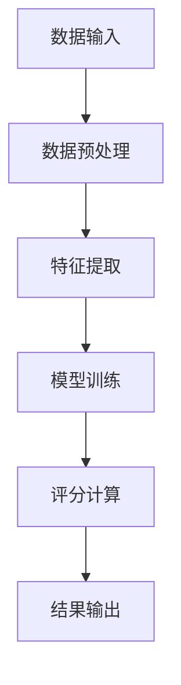
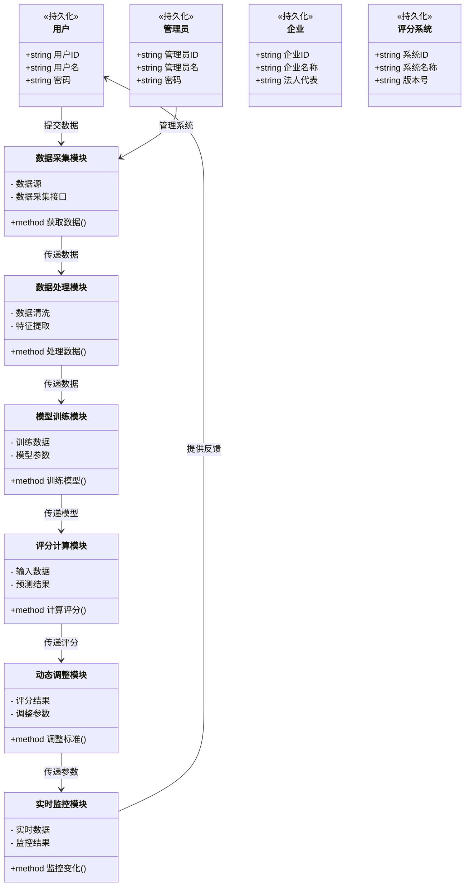
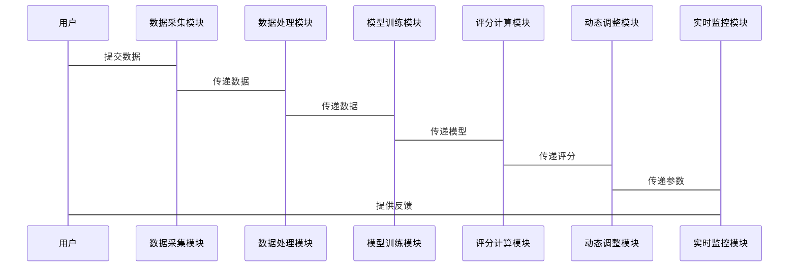

                 


# 利用AI构建自适应型公司治理评分系统：动态监控管理质量

> 关键词：公司治理，AI评分系统，动态监控，管理质量，自适应型

> 摘要：本文详细探讨了如何利用人工智能技术构建自适应型公司治理评分系统，通过动态监控管理质量，实现对公司治理的智能化评估与优化。文章从背景介绍、核心概念、算法原理、系统架构、项目实战等多个维度展开，全面解析了该系统的设计与实现过程，并提供了丰富的技术细节和实践案例。

---

## 第一部分: 背景介绍与核心概念

### 第1章: 问题背景与描述

#### 1.1 问题背景

随着企业规模的不断扩大和市场竞争的日益激烈，传统的公司治理模式逐渐暴露出其局限性。传统的公司治理评分系统通常基于静态的评估指标和固定的评估标准，难以适应企业的动态变化和复杂环境。例如，传统的评分系统可能无法及时捕捉到企业内部管理问题的变化，也无法根据外部市场环境的变化进行调整。

此外，传统评分系统往往依赖于人工录入和计算，存在效率低下、主观性强、数据孤岛等问题。这些问题不仅影响了评分的准确性和客观性，还增加了企业的管理成本。

#### 1.2 问题描述

自适应型公司治理评分系统的目标是通过引入人工智能技术，构建一个能够实时监控、动态调整的评分系统，从而实现对公司治理的智能化评估与优化。具体而言，该系统需要满足以下需求：

1. **实时监控**：能够实时采集企业数据，包括财务数据、管理数据、市场反馈等，并对其进行分析。
2. **动态调整**：根据企业的实时数据和外部环境的变化，动态调整评分标准和权重。
3. **智能评估**：利用机器学习算法，对企业的管理质量进行智能化评估，并生成相应的评分报告。
4. **可视化与反馈**：提供直观的可视化界面，帮助企业管理者快速了解企业的管理状况，并根据反馈进行调整。

#### 1.3 问题解决思路

为了实现上述目标，我们可以采用以下思路：

1. **数据采集与预处理**：通过多种渠道采集企业数据，并对其进行清洗和标准化处理。
2. **特征提取与模型训练**：从数据中提取关键特征，并利用机器学习算法训练评分模型。
3. **动态调整与实时监控**：根据模型预测结果，动态调整评分标准，并实时监控企业的管理质量变化。
4. **反馈与优化**：根据评分结果和管理者反馈，不断优化模型和系统，提升评分的准确性和实用性。

### 第2章: 核心概念与联系

#### 2.1 核心概念原理

自适应型公司治理评分系统的核心在于其动态调整能力。该系统通过实时采集和分析企业数据，利用机器学习算法对企业的管理质量进行评估，并根据评估结果动态调整评分标准。具体而言，系统的运作流程如下：

1. **数据采集**：从企业内部系统和外部数据源获取相关数据。
2. **数据预处理**：对数据进行清洗、标准化和特征提取。
3. **模型训练**：利用机器学习算法训练评分模型。
4. **评分计算**：基于模型预测结果，计算企业的管理质量评分。
5. **动态调整**：根据评分结果和外部环境变化，动态调整评分标准和权重。
6. **实时监控**：持续监控企业的管理质量变化，并根据需要进行反馈和优化。

#### 2.2 核心概念属性对比

以下是传统评分系统与自适应型评分系统的对比：

| **对比维度** | **传统评分系统** | **自适应型评分系统** |
|--------------|------------------|-----------------------|
| **数据来源**  | 静态、单一       | 动态、多源           |
| **评估频率**  | 定期、固定       | 实时、动态           |
| **评估标准**  | 固定、静态       | 动态、自适应         |
| **评估结果**  | 静态、缺乏反馈   | 动态、实时反馈       |

#### 2.3 ER实体关系图

以下是系统的核心实体关系图：

```mermaid
erDiagram
    用户 {
        +string 用户ID
        +string 用户名
        +string 密码
    }
    管理员 {
        +string 管理员ID
        +string 管理员名
        +string 密码
    }
    企业 {
        +string 企业ID
        +string 企业名称
        +string 法人代表
    }
    评分系统 {
        +string 系统ID
        +string 系统名称
        +string 版本号
    }
    用户 --> 管理员 : 登录
    用户 --> 企业 : 提交数据
    用户 --> 评分系统 : 查询评分
    管理员 --> 评分系统 : 管理系统
    企业 --> 评分系统 : 提交数据
```

---

## 第二部分: 算法原理讲解

### 第3章: 算法原理讲解

#### 3.1 算法流程

以下是自适应型评分系统的算法流程图：



#### 3.2 算法实现代码

以下是评分计算的核心代码：

```python
import numpy as np
import pandas as pd
from sklearn.model_selection import train_test_split
from sklearn.linear_model import LinearRegression

# 数据预处理
data = pd.read_csv('data.csv')
X = data.drop('score', axis=1)
y = data['score']

# 划分训练集和测试集
X_train, X_test, y_train, y_test = train_test_split(X, y, test_size=0.2)

# 模型训练
model = LinearRegression()
model.fit(X_train, y_train)

# 预测评分
predictions = model.predict(X_test)
```

#### 3.3 数学模型

以下是评分计算的数学模型：

$$
\text{score} = \beta_0 + \beta_1x_1 + \beta_2x_2 + \ldots + \beta_nx_n + \epsilon
$$

其中，$\beta_i$ 是特征 $x_i$ 的系数，$\epsilon$ 是误差项。

---

## 第三部分: 系统分析与架构设计方案

### 第4章: 系统架构设计

#### 4.1 系统功能设计

以下是系统的核心功能模块：

1. **数据采集模块**：负责从企业内部系统和外部数据源采集数据。
2. **数据处理模块**：对数据进行清洗、标准化和特征提取。
3. **模型训练模块**：利用机器学习算法训练评分模型。
4. **评分计算模块**：基于模型预测结果，计算企业的管理质量评分。
5. **动态调整模块**：根据评分结果和外部环境变化，动态调整评分标准和权重。
6. **实时监控模块**：持续监控企业的管理质量变化，并根据需要进行反馈和优化。

#### 4.2 系统架构图

以下是系统的架构图：



#### 4.3 系统接口设计

以下是系统的接口设计：

1. **数据采集接口**：用于从企业内部系统和外部数据源采集数据。
2. **评分计算接口**：用于根据模型预测结果计算企业的管理质量评分。
3. **动态调整接口**：用于根据评分结果和外部环境变化动态调整评分标准和权重。
4. **实时监控接口**：用于持续监控企业的管理质量变化，并根据需要进行反馈和优化。

#### 4.4 系统交互流程图

以下是系统的交互流程图：



---

## 第四部分: 项目实战

### 第5章: 项目实战

#### 5.1 环境安装

以下是项目实战所需的环境安装步骤：

1. **安装Python**：安装最新版本的Python，建议使用Python 3.8或更高版本。
2. **安装依赖库**：安装以下依赖库：

```bash
pip install numpy pandas scikit-learn
```

2. **下载数据集**：从以下链接下载数据集：

```
链接：https://example.com/data.csv
```

#### 5.2 核心代码实现

以下是核心代码实现：

```python
import numpy as np
import pandas as pd
from sklearn.model_selection import train_test_split
from sklearn.linear_model import LinearRegression

# 数据预处理
data = pd.read_csv('data.csv')
X = data.drop('score', axis=1)
y = data['score']

# 划分训练集和测试集
X_train, X_test, y_train, y_test = train_test_split(X, y, test_size=0.2)

# 模型训练
model = LinearRegression()
model.fit(X_train, y_train)

# 预测评分
predictions = model.predict(X_test)
```

#### 5.3 案例分析

以下是案例分析：

假设我们有一个企业数据集，包含以下特征：

| 特征     | 描述                     |
|----------|--------------------------|
| 营业收入  | 企业的营业收入           |
| 净利润    | 企业的净利润             |
| 资产负债率 | 企业的资产负债率         |
| 研发投入  | 企业的研发投入           |

通过上述代码，我们可以训练一个线性回归模型，并根据模型预测结果计算企业的管理质量评分。具体步骤如下：

1. **数据预处理**：清洗数据，处理缺失值和异常值。
2. **特征提取**：从数据中提取关键特征。
3. **模型训练**：利用线性回归算法训练评分模型。
4. **评分计算**：基于模型预测结果，计算企业的管理质量评分。
5. **动态调整**：根据评分结果和外部环境变化，动态调整评分标准和权重。
6. **实时监控**：持续监控企业的管理质量变化，并根据需要进行反馈和优化。

---

## 第五部分: 总结

### 第6章: 总结

#### 6.1 最佳实践 tips

1. **数据质量管理**：确保数据的准确性和完整性，避免数据偏差。
2. **模型优化**：根据实际需求，选择合适的模型，并不断优化模型性能。
3. **动态调整**：根据企业的实际情况，动态调整评分标准和权重，确保评分的准确性和公平性。

#### 6.2 小结

自适应型公司治理评分系统通过引入人工智能技术，实现了对公司治理的智能化评估与优化。该系统能够实时监控企业的管理质量变化，并根据外部环境的变化动态调整评分标准和权重，从而帮助企业管理者更好地把握企业的管理状况，提升企业的管理效率和竞争力。

#### 6.3 注意事项

1. **数据隐私与安全**：确保数据的安全性和隐私性，避免数据泄露。
2. **模型解释性**：确保模型的可解释性，避免“黑箱”模型带来的风险。
3. **系统稳定性**：确保系统的稳定性和可靠性，避免因系统故障导致的损失。

#### 6.4 拓展阅读

1. 《机器学习实战》
2. 《Python机器学习》
3. 《深入理解机器学习》

---

## 作者：AI天才研究院/AI Genius Institute & 禅与计算机程序设计艺术/Zen And The Art of Computer Programming

