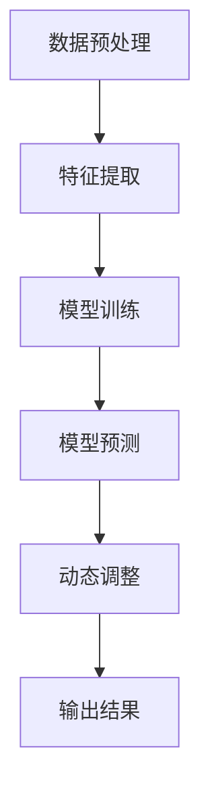
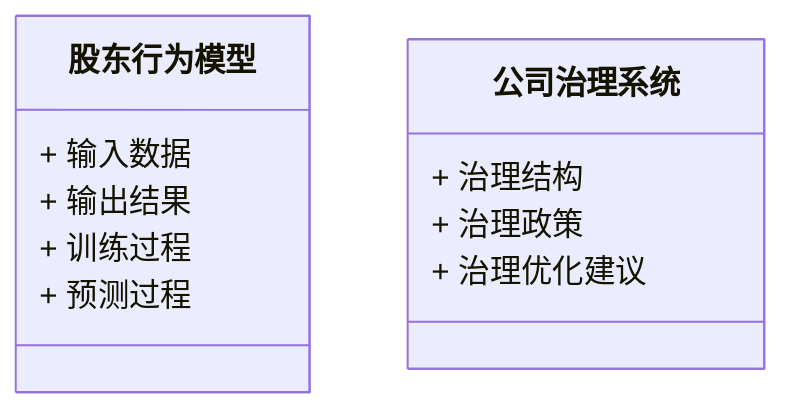
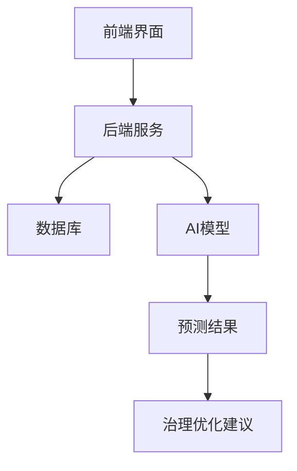
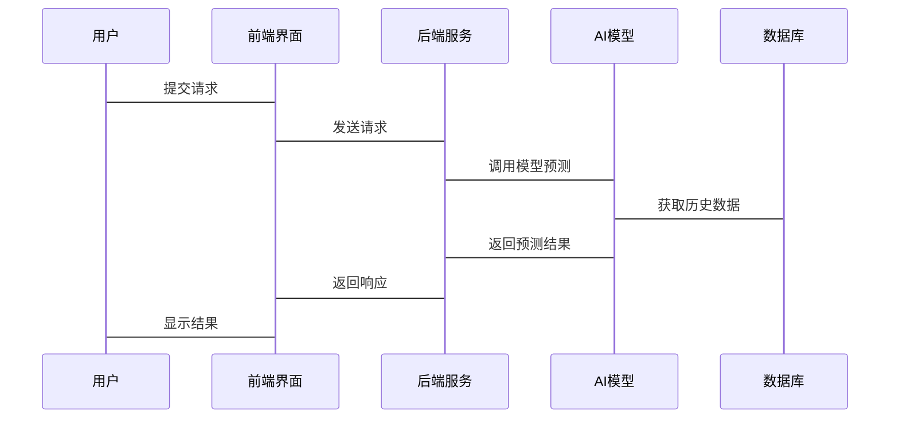

                 


# 利用AI构建自适应型股东行为模型：预测公司治理变化

## 关键词：自适应型股东行为模型，公司治理，人工智能，预测模型，股东行为分析

## 摘要：本文介绍如何利用人工智能构建自适应型股东行为模型，通过分析股东行为和公司治理的关系，设计和实现一个能够预测公司治理变化的自适应模型。文章详细讲解模型的核心概念、算法原理、系统架构设计和项目实战，帮助读者理解如何利用AI技术优化公司治理决策。

---

# 第一部分: 股东行为与公司治理概述

## 第1章: 股东行为的定义与分类

### 1.1 股东行为的基本概念

股东行为是指股东在公司中的各种决策和行动，包括投票、投资、参与管理等。股东行为是公司治理的重要组成部分，直接影响公司的运营和战略发展。

### 1.2 股东行为的主要分类

根据股东的影响力和参与程度，股东行为可以分为：

1. **积极股东行为**：股东积极参与公司治理，如参与股东大会、提出议案、监督管理层等。
2. **消极股东行为**：股东对公司治理不参与或不关注，主要以被动投资为主。
3. **短期行为**：股东基于短期利益进行决策，如频繁买卖股票、追求短期收益。
4. **长期行为**：股东基于长期投资目标进行决策，关注公司长期发展和价值提升。

### 1.3 股东行为对公司治理的影响

股东行为直接影响公司治理的效率和效果。积极的股东行为可以促进公司透明化、规范化和高效化；而消极或短期的股东行为可能导致公司治理混乱、管理不善，影响公司长期发展。

---

## 第2章: 公司治理的基本概念

### 2.1 公司治理的定义

公司治理是指公司内部和外部利益相关者之间的关系和互动机制，包括董事会、管理层、股东、债权人、员工等多方利益的协调与制衡。

### 2.2 公司治理的主要模式

公司治理主要采用以下几种模式：

1. **股东治理模式**：以股东为核心，强调股东对公司重大决策的控制和监督。
2. **利益相关者治理模式**：注重平衡股东、管理层、员工、债权人等多方利益，实现共赢。
3. **法律治理模式**：通过法律法规规范公司治理行为，确保公司合法合规运营。

### 2.3 公司治理的核心要素

公司治理的核心要素包括：

1. **治理结构**：包括董事会、监事会、高管层等组织结构的设计。
2. **治理机制**：包括决策机制、监督机制、激励机制等。
3. **治理文化**：包括企业价值观、道德规范、企业社会责任等。

---

## 第3章: 股东行为与公司治理的关系

### 3.1 股东行为对公司治理的影响

股东行为是公司治理的重要驱动因素。积极的股东行为可以推动公司治理的优化和提升，而消极的行为可能导致公司治理效率低下甚至失败。

### 3.2 公司治理对股东行为的调节作用

公司治理通过制度设计和机制安排，可以引导和规范股东行为，确保股东行为符合公司整体利益。

### 3.3 股东行为与公司治理的互动机制

股东行为与公司治理之间存在复杂的互动关系。公司治理的优化可以促进股东行为的积极化，而股东行为的积极化又能进一步推动公司治理的完善。

---

## 第4章: 自适应型股东行为模型的背景与意义

### 4.1 传统股东行为模型的局限性

传统股东行为模型通常基于静态假设，难以适应复杂多变的市场环境和公司治理需求。其主要局限性包括：

1. **缺乏动态性**：传统模型难以捕捉股东行为的动态变化。
2. **预测精度低**：基于静态假设的模型在预测复杂行为时准确性较低。
3. **适应性差**：传统模型难以应对不同公司、不同市场环境下的多样化需求。

### 4.2 自适应型股东行为模型的提出

自适应型股东行为模型是一种基于动态调整和学习的模型，能够根据市场环境和公司治理的变化，实时调整股东行为预测策略。

### 4.3 利用AI构建自适应型股东行为模型的意义

通过人工智能技术构建自适应型股东行为模型，可以实现以下目标：

1. **提高预测精度**：利用AI的强大计算能力和学习能力，提升股东行为预测的准确性。
2. **优化公司治理决策**：通过精准预测股东行为，帮助公司制定更科学的治理策略。
3. **促进企业长期发展**：通过动态调整股东行为模型，支持企业的长期战略规划和可持续发展。

---

## 第5章: 自适应型股东行为模型的核心概念与联系

### 5.1 自适应型股东行为模型的原理

自适应型股东行为模型基于机器学习算法，通过不断学习和优化，实现对股东行为的动态预测和调整。其核心原理包括：

1. **数据采集**：收集股东行为数据，包括股东投票、投资行为、市场反应等。
2. **特征提取**：从数据中提取关键特征，如股东类型、行为频率、行为动机等。
3. **模型训练**：利用机器学习算法（如神经网络、随机森林等）进行模型训练。
4. **动态调整**：根据市场环境和公司治理的变化，实时调整模型参数和预测策略。

### 5.2 核心概念的属性特征对比

以下是股东行为、公司治理和模型性能的核心属性特征对比：

| **属性**       | **股东行为**                | **公司治理**               | **模型性能**              |
|----------------|-----------------------------|-----------------------------|---------------------------|
| **输入数据**   | 股东投票、投资行为等       | 公司治理结构、政策等       | 预测准确率、响应时间等    |
| **输出结果**   | 股东行为预测结果           | 治理优化建议               | 模型预测精度、稳定性等     |
| **动态调整**   | 根据市场变化实时调整       | 根据股东行为优化治理结构   | 根据反馈优化模型参数       |

### 5.3 ER实体关系图架构

以下是自适应型股东行为模型的ER实体关系图：

```mermaid
erd
    股东行为
    投票记录
    投资行为
    公司治理
    治理结构
    治理政策
```

### 5.4 本章小结

本章详细介绍了自适应型股东行为模型的核心概念和其与公司治理的关系，为后续的算法设计和系统实现奠定了基础。

---

## 第6章: 自适应型股东行为模型的算法原理

### 6.1 算法原理概述

自适应型股东行为模型基于深度学习算法，通过神经网络结构实现对股东行为的动态预测和调整。其算法流程如下：

1. **数据预处理**：清洗和标准化数据，提取关键特征。
2. **模型训练**：利用神经网络进行训练，优化模型参数。
3. **模型预测**：基于训练好的模型，预测股东行为。
4. **动态调整**：根据预测结果和实际数据反馈，实时调整模型参数。

### 6.2 算法流程图

以下是自适应型股东行为模型的算法流程图：



### 6.3 算法实现

以下是自适应型股东行为模型的核心代码实现：

```python
import numpy as np
import tensorflow as tf

class AdaptiveShareholderModel:
    def __init__(self, input_dim, output_dim):
        self.model = tf.keras.Sequential([
            tf.keras.layers.Dense(64, activation='relu', input_dim=input_dim),
            tf.keras.layers.Dense(32, activation='relu'),
            tf.keras.layers.Dense(output_dim, activation='sigmoid')
        ])
        self.model.compile(optimizer='adam', loss='binary_crossentropy', metrics=['accuracy'])

    def train(self, x_train, y_train, epochs=100):
        self.model.fit(x_train, y_train, epochs=epochs, batch_size=32)

    def predict(self, x_test):
        return self.model.predict(x_test)

# 示例用法
input_dim = 10
output_dim = 1
model = AdaptiveShareholderModel(input_dim, output_dim)
x_train = np.random.random((1000, input_dim))
y_train = np.random.randint(2, size=(1000, output_dim))
model.train(x_train, y_train)
x_test = np.random.random((200, input_dim))
y_pred = model.predict(x_test)
```

### 6.4 数学模型与公式

以下是自适应型股东行为模型的核心数学公式：

1. **损失函数**：
$$ L = -\frac{1}{n}\sum_{i=1}^{n} y_i \log(\hat{y}_i) + (1 - y_i)\log(1 - \hat{y}_i) $$

2. **优化算法**：
$$ \theta = \theta - \eta \frac{\partial L}{\partial \theta} $$

其中，$\theta$ 是模型参数，$\eta$ 是学习率。

---

## 第7章: 系统分析与架构设计方案

### 7.1 项目背景与目标

本项目旨在通过构建自适应型股东行为模型，预测公司治理的变化，优化公司治理决策。

### 7.2 系统功能设计

以下是系统功能设计的领域模型类图：



### 7.3 系统架构设计

以下是系统架构设计的架构图：



### 7.4 系统接口设计

以下是系统接口设计的接口图：



---

## 第8章: 项目实战

### 8.1 环境安装

需要安装以下环境和工具：

1. Python 3.6+
2. TensorFlow 2.0+
3. Mermaid CLI
4. Jupyter Notebook（可选）

### 8.2 核心代码实现

以下是项目的核心代码实现：

```python
import numpy as np
import tensorflow as tf
import pandas as pd
from sklearn.model_selection import train_test_split
from sklearn.preprocessing import StandardScaler

# 数据加载与预处理
data = pd.read_csv('shareholder_behavior.csv')
X = data.drop('target', axis=1).values
y = data['target'].values

X_train, X_test, y_train, y_test = train_test_split(X, y, test_size=0.2, random_state=42)
scaler = StandardScaler()
X_train = scaler.fit_transform(X_train)
X_test = scaler.transform(X_test)

# 模型构建与训练
model = tf.keras.Sequential([
    tf.keras.layers.Dense(64, activation='relu', input_dim=X_train.shape[1]),
    tf.keras.layers.Dense(32, activation='relu'),
    tf.keras.layers.Dense(1, activation='sigmoid')
])
model.compile(optimizer='adam', loss='binary_crossentropy', metrics=['accuracy'])
model.fit(X_train, y_train, epochs=100, batch_size=32)

# 模型预测与评估
y_pred = model.predict(X_test)
print('预测结果:', y_pred)
print('准确率:', model.evaluate(X_test, y_test)[1])
```

### 8.3 实际案例分析

以下是一个实际案例的分析：

假设我们有一家上市公司，希望通过自适应型股东行为模型预测未来股东行为对公司治理的影响。我们收集了过去5年的股东行为数据，包括股东投票、投资行为、市场反应等。通过模型训练和预测，我们发现股东行为的变化将导致公司治理结构的优化，进而提升公司整体绩效。

---

## 第9章: 总结与展望

### 9.1 最佳实践 tips

1. 在实际应用中，建议结合具体业务场景调整模型参数和算法。
2. 数据质量是模型性能的关键，需确保数据的完整性和准确性。
3. 定期更新模型数据和参数，确保模型的适应性和准确性。

### 9.2 小结

本文详细介绍了如何利用AI构建自适应型股东行为模型，预测公司治理的变化。通过理论分析和实际案例，展示了该模型在优化公司治理决策中的重要作用。

### 9.3 注意事项

1. 模型的预测结果仅供参考，需结合实际情况进行决策。
2. 模型的优化和调整需要根据具体业务需求进行。

### 9.4 拓展阅读

1. 《公司治理与股东行为分析》
2. 《人工智能在金融领域的应用》
3. 《深度学习与股票预测》

---

## 作者信息

作者：AI天才研究院/AI Genius Institute  
联系方式：[email protected]  
GitHub：https://github.com/AI-Genius-Institute

---

以上是《利用AI构建自适应型股东行为模型：预测公司治理变化》的技术博客文章的完整目录大纲。希望对您有所帮助！

