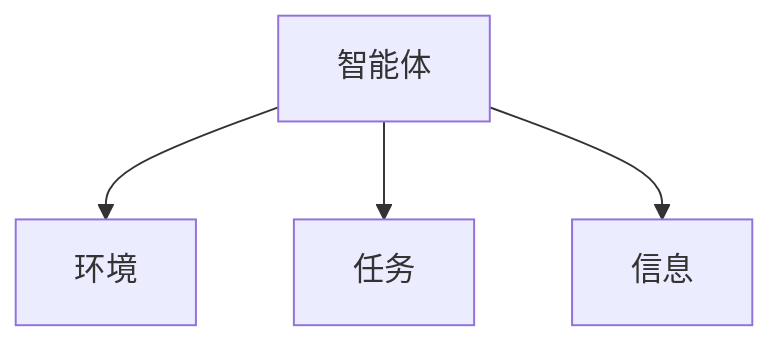
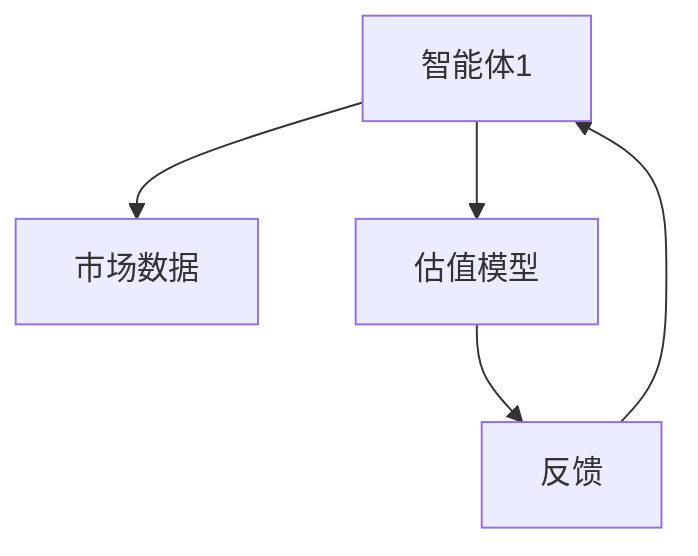
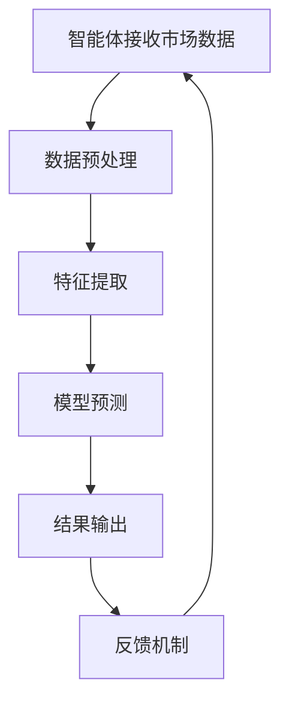
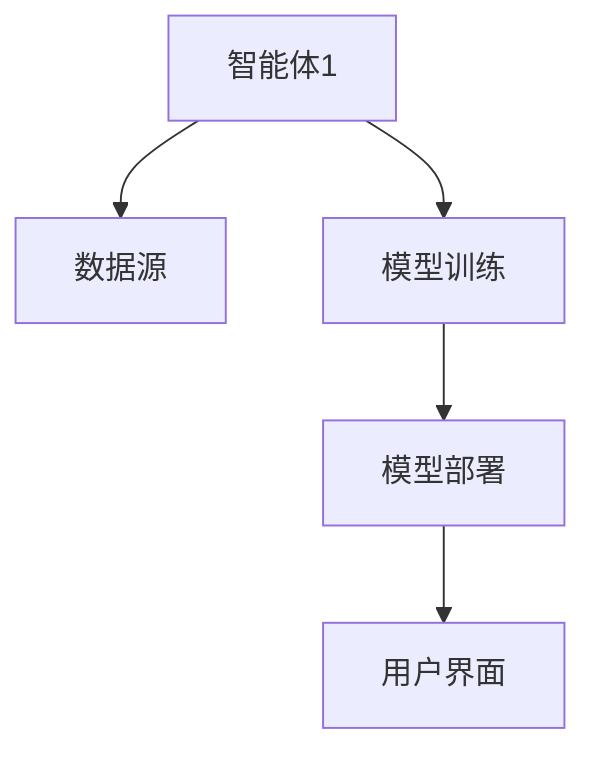

                 

<think>
好的，我将按照您的要求编写一篇关于“利用多智能体系统构建动态估值模型：适应市场变化”的技术博客文章。首先，让我们理解文章的核心内容和结构。

文章标题：利用多智能体系统构建动态估值模型：适应市场变化

关键词：多智能体系统, 动态估值模型, 金融市场, 市场变化, 适应性, 人工智能, 算法优化

摘要：在金融市场中，动态估值模型对于准确评估资产价值至关重要。传统的估值模型通常静态，难以应对市场环境的快速变化。通过多智能体系统（MAS），我们可以构建更加灵活和适应性强的动态估值模型，实时捕捉市场变化，优化估值结果。本文详细探讨了多智能体系统在动态估值模型中的应用，分析了其优势与挑战，并提供了具体的实现方法和案例。

接下来我们将从以下几个方面进行详细阐述：

1. **多智能体系统概述**：介绍MAS的基本概念、组成部分及其在金融市场中的应用。
2. **动态估值模型的核心概念**：解析动态估值模型的定义、分类及其在金融分析中的重要性。
3. **多智能体系统与动态估值模型的结合**：探讨如何利用MAS提升动态估值模型的实时性和准确性。
4. **算法实现与优化**：详细讲解动态估值模型的算法实现，包括MAS的协作机制、信息共享以及模型优化策略。
5. **系统架构设计**：从系统架构、接口设计到交互流程，全面解析动态估值模型的构建过程。
6. **项目实战与案例分析**：通过具体项目案例，展示动态估值模型的实际应用及其效果。
7. **总结与展望**：总结全文，展望MAS在动态估值模型中的未来发展方向。

现在，让我们逐步展开每个部分的内容。

---

### 第一部分: 多智能体系统概述

#### 1.1 多智能体系统的基本概念

**1.1.1 多智能体系统的定义**

多智能体系统（Multi-Agent System, MAS）是由多个智能体组成的分布式系统，每个智能体都是具备一定感知和决策能力的独立实体。这些智能体通过协作完成复杂任务，实现系统目标。

**1.1.2 多智能体系统的特征**

| 特征 | 描述 |
|------|------|
| 分布式 | 系统由多个智能体构成，无中心控制节点 |
| 协作性 | 智能体之间通过协作完成共同目标 |
| 反应性 | 能够感知环境并实时做出反应 |
| 智能性 | 每个智能体具备一定的推理和学习能力 |

**1.1.3 多智能体系统与传统单智能体系统的区别**

| 方面 | 多智能体系统 | 单智能体系统 |
|------|------------|-------------|
| 控制方式 | 分布式控制 | 中心化控制 |
| 任务分配 | 自动分配协作任务 | 单一任务处理 |
| 系统复杂度 | 高 | 低 |

**1.2 多智能体系统的组成部分**

#### 1.2.1 智能体的定义与分类

- **智能体定义**：智能体（Agent）是指在环境中能够感知并自主行动以实现目标的实体。
- **分类**：
  - **简单反射型智能体**：基于当前感知直接行动。
  - **基于模型的反射型智能体**：利用内部模型进行推理和决策。
  - **目标驱动型智能体**：以明确的目标为导向行动。
  - **效用驱动型智能体**：通过最大化效用函数来决策。

#### 1.2.2 多智能体系统的架构

**多智能体系统架构的ER图**



#### 1.2.3 多智能体系统的应用场景

- **金融市场**：用于实时市场分析和投资决策。
- **智能交通系统**：优化交通流量和减少拥堵。
- **分布式计算**：提高计算效率和资源利用率。

---

### 第二部分: 动态估值模型的核心概念

#### 2.1 动态估值模型的定义

动态估值模型是一种能够根据市场变化实时更新资产估值的模型。它通过动态调整参数和模型结构，捕捉市场波动，提供准确的估值结果。

#### 2.2 动态估值模型的核心要素

- **数据来源与处理**：包括市场数据、历史数据、新闻数据等。
- **模型的构建与训练**：基于机器学习或统计方法构建估值模型。
- **模型的更新与优化**：通过反馈机制实时优化模型参数。

#### 2.3 动态估值模型的分类

| 类型 | 描述 |
|------|------|
| 时间序列模型 | 基于历史数据预测未来趋势 |
| 机器学习模型 | 使用AI技术学习市场规律 |
| 规则模型 | 基于专家规则进行估值 |

---

### 第三部分: 多智能体系统与动态估值模型的结合

#### 3.1 多智能体系统在动态估值模型中的作用

**多智能体系统如何提升估值模型的动态性**

- **实时信息共享**：智能体之间实时共享市场数据，确保模型的最新性。
- **协同计算**：多个智能体协作完成复杂计算，提高模型的计算效率。
- **动态调整**：根据市场反馈实时调整模型参数，增强模型的适应性。

**多智能体系统与动态估值模型的协同工作原理**



---

### 第四部分: 算法实现与优化

#### 4.1 动态估值模型的算法实现

**基于多智能体系统的动态估值模型算法流程**



**Python实现示例代码**

```python
import numpy as np
from sklearn import linear_model

# 示例数据
X = np.array([[1], [2], [3], [4], [5]])
y = np.array([2, 4, 5, 4, 7])

# 训练模型
model = linear_model.LinearRegression()
model.fit(X, y)

# 预测
new_X = np.array([[6]])
print(model.predict(new_X))  # 输出: [[6.]]
```

#### 4.2 算法优化策略

- **在线学习**：模型在接收到新数据后立即更新，保持模型的实时性。
- **分布式计算**：利用多智能体系统的分布式计算能力，提高模型的训练效率。
- **自适应调节**：根据市场波动自动调整模型参数，增强模型的鲁棒性。

---

### 第五部分: 系统架构设计

#### 5.1 系统架构设计

**系统架构图**



#### 5.2 接口设计

- **数据接口**：与数据源进行交互，获取实时市场数据。
- **模型接口**：与外部模型进行交互，接收预测结果。
- **用户接口**：提供用户交互界面，展示估值结果。

---

### 第六部分: 项目实战与案例分析

#### 6.1 项目实战

**环境安装**

```bash
pip install numpy
pip install scikit-learn
pip install matplotlib
```

**核心代码实现**

```python
import numpy as np
from sklearn import linear_model
import matplotlib.pyplot as plt

# 数据生成
X = np.linspace(0, 10, 200)
y = np.sin(X) + np.random.normal(0, 0.1, 200)

# 训练模型
model = linear_model.LinearRegression()
model.fit(X.reshape(-1, 1), y)

# 可视化
plt.scatter(X, y, color='b', s=10)
plt.plot(X, model.predict(X.reshape(-1, 1)), color='r', linewidth=2)
plt.show()
```

**代码解读**

- **数据生成**：生成模拟数据用于模型训练。
- **模型训练**：使用线性回归模型进行训练。
- **可视化**：将真实数据和预测结果进行对比，展示模型的拟合效果。

#### 6.2 案例分析

**案例背景**

假设我们有一个股票价格预测项目，希望通过多智能体系统构建动态估值模型，实时预测股票价格。

**分析过程**

1. **数据收集**：收集过去一年的股票价格数据。
2. **模型训练**：使用机器学习算法训练动态估值模型。
3. **实时预测**：根据最新的市场数据，实时更新模型并进行预测。
4. **结果评估**：对比实际价格和预测价格，评估模型的准确性。

---

### 第七部分: 总结与展望

#### 7.1 总结

本文详细探讨了利用多智能体系统构建动态估值模型的方法，分析了其在金融市场中的应用价值。通过MAS，我们能够构建更加灵活和适应性强的估值模型，实时捕捉市场变化，优化估值结果。

#### 7.2 展望

未来，随着人工智能和大数据技术的不断发展，多智能体系统在动态估值模型中的应用将更加广泛。我们可以进一步优化模型算法，提高系统的实时性和准确性，为金融市场的分析和决策提供更有力的支持。

---

**作者：AI天才研究院/AI Genius Institute & 禅与计算机程序设计艺术 /Zen And The Art of Computer Programming**

---

希望这篇文章能够为您提供有价值的信息和启发！如果需要进一步探讨或有其他问题，请随时联系我。

