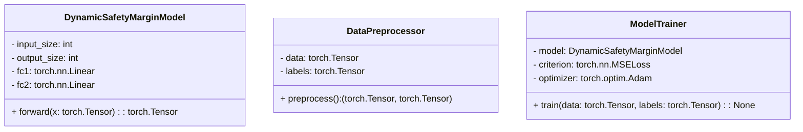
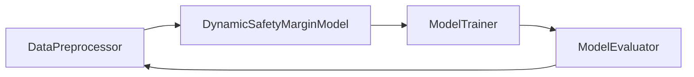
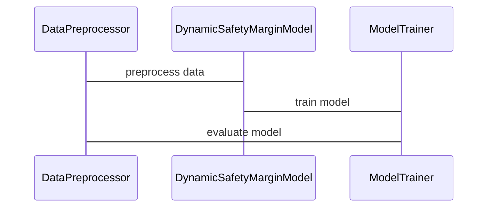

                 


# 利用多智能体系统构建动态安全边际模型

> 关键词：多智能体系统，动态安全边际模型，博弈论，分布式计算，系统架构设计

> 摘要：本文详细探讨了如何利用多智能体系统构建动态安全边际模型。通过分析多智能体系统的核心概念、动态安全边际模型的数学基础、系统架构设计以及项目实战，本文为读者提供了一套完整的解决方案。文章结合实际案例和数学公式，深入浅出地解释了相关技术原理和实现方法。

---

## 第1章: 多智能体系统概述

### 1.1 多智能体系统的基本概念

#### 1.1.1 多智能体系统的定义
多智能体系统（Multi-Agent System, MAS）是由多个智能体（Agent）组成的分布式系统。这些智能体通过协同合作，完成复杂的任务。智能体是具有感知、决策和执行能力的实体，可以是软件程序，也可以是物理设备。

#### 1.1.2 多智能体系统的特征
- **自主性**：智能体能够自主决策，无需外部干预。
- **反应性**：智能体能够实时感知环境并做出响应。
- **协作性**：多个智能体之间能够协同合作，完成共同目标。
- **分布式性**：智能体分布在不同的位置，通过通信进行交互。

#### 1.1.3 多智能体系统的分类
- **简单协调系统**：智能体之间通过简单的协调机制完成任务。
- **复杂协调系统**：智能体之间需要通过复杂的博弈和优化算法进行协作。
- **自主决策系统**：智能体能够自主决策，无需中央控制。

### 1.2 动态安全边际模型的定义与特点

#### 1.2.1 动态安全边际模型的定义
动态安全边际模型是一种动态风险评估模型，用于评估系统在复杂环境中的安全状态。该模型能够根据环境的变化实时调整安全策略，确保系统的安全性。

#### 1.2.2 动态安全边际模型的核心特征
- **动态性**：模型能够实时感知环境变化，调整安全策略。
- **安全性**：模型能够评估系统在各种环境下的安全状态。
- **适应性**：模型能够根据环境变化自适应调整。

#### 1.2.3 动态安全边际模型的应用场景
- **网络安全**：用于评估网络系统的安全性。
- **自动驾驶**：用于评估自动驾驶车辆的安全状态。
- **智能城市**：用于评估城市系统的安全性。

---

## 第2章: 多智能体系统与动态安全边际模型的关系

### 2.1 多智能体系统在动态安全边际模型中的作用

#### 2.1.1 多智能体系统的协同机制
多智能体系统通过协同机制，实现智能体之间的信息共享和任务分配。协同机制包括：

- **通信机制**：智能体之间通过通信共享信息。
- **协调机制**：智能体之间通过协调机制完成任务分配。
- **合作机制**：智能体之间通过合作机制实现共同目标。

#### 2.1.2 多智能体系统与动态安全边际模型的结合
多智能体系统为动态安全边际模型提供了分布式计算和协同合作的能力。通过多智能体系统的协同机制，动态安全边际模型能够实时感知环境变化，调整安全策略。

### 2.2 动态安全边际模型的构建过程

#### 2.2.1 模型的输入与输出
- **输入**：环境状态、智能体行为。
- **输出**：安全评估结果、安全策略。

#### 2.2.2 模型的训练与优化
动态安全边际模型的训练与优化过程包括：

- **数据收集**：收集环境数据和智能体行为数据。
- **模型训练**：使用机器学习算法训练模型。
- **模型优化**：通过优化算法提高模型性能。

#### 2.2.3 模型的评估与验证
动态安全边际模型的评估与验证过程包括：

- **模型测试**：测试模型的性能。
- **模型验证**：验证模型的准确性和可靠性。
- **模型优化**：根据测试结果优化模型。

---

## 第3章: 多智能体系统的协同机制

### 3.1 分布式计算与多智能体系统

#### 3.1.1 分布式计算的基本原理
分布式计算是一种计算模式，将计算任务分布在多个计算节点上，通过协同完成任务。分布式计算的核心思想是将任务分解为多个子任务，分别在不同的节点上执行。

#### 3.1.2 多智能体系统中的分布式计算
多智能体系统通过分布式计算实现智能体之间的协同合作。每个智能体负责一部分任务，通过通信和协调完成整体任务。

### 3.2 博弈论与多智能体系统的结合

#### 3.2.1 博弈论的基本概念
博弈论是研究多个决策主体在冲突与合作中如何选择策略的数学理论。博弈论的核心概念包括：

- **博弈**：多个决策主体之间的互动。
- **策略**：决策主体为达到目标而采取的行动。
- **纳什均衡**：博弈中所有参与者的策略稳定状态。

#### 3.2.2 博弈论在多智能体系统中的应用
博弈论在多智能体系统中的应用包括：

- **任务分配**：通过博弈论算法分配任务给不同的智能体。
- **决策优化**：通过博弈论优化智能体的决策过程。
- **冲突解决**：通过博弈论解决智能体之间的冲突。

---

## 第4章: 动态安全边际模型的数学基础

### 4.1 动态安全边际模型的数学公式

#### 4.1.1 模型的基本公式
动态安全边际模型的基本公式包括：

- **风险评估公式**：
  $$
  R = \sum_{i=1}^{n} w_i \cdot r_i
  $$
  其中，$R$ 是风险评估结果，$w_i$ 是风险因子的权重，$r_i$ 是风险因子的值。

- **安全策略公式**：
  $$
  S = \arg\min R
  $$
  其中，$S$ 是安全策略。

#### 4.1.2 模型的优化算法
动态安全边际模型的优化算法包括：

- **梯度下降法**：通过计算损失函数的梯度，调整参数以最小化损失。
- **遗传算法**：通过模拟自然选择和遗传变异，优化模型参数。

### 4.2 动态安全边际模型的算法实现

#### 4.2.1 算法的步骤分解
动态安全边际模型的算法实现步骤包括：

1. 数据收集：收集环境数据和智能体行为数据。
2. 数据预处理：对数据进行清洗和特征提取。
3. 模型训练：使用机器学习算法训练模型。
4. 模型优化：通过优化算法提高模型性能。
5. 模型评估：评估模型的准确性和可靠性。

#### 4.2.2 算法的代码实现
以下是动态安全边际模型的代码实现示例：

```python
import numpy as np

# 数据预处理
data = np.array([...])

# 模型训练
model = ...  # 初始化模型

# 模型优化
optimizer = ...  # 初始化优化器

for epoch in range(num_epochs):
    # 前向传播
    outputs = model(data)
    # 计算损失
    loss = criterion(outputs, labels)
    # 反向传播
    optimizer.zero_grad()
    loss.backward()
    optimizer.step()

# 模型评估
with torch.no_grad():
    outputs = model(test_data)
    predicted = torch.argmax(outputs, dim=1)
    accuracy = (predicted == test_labels).mean()
```

---

## 第5章: 动态安全边际模型的系统架构设计

### 5.1 系统架构的设计原则

#### 5.1.1 系统架构的模块划分
动态安全边际模型的系统架构模块包括：

- **数据采集模块**：负责采集环境数据和智能体行为数据。
- **数据处理模块**：负责对数据进行清洗和特征提取。
- **模型训练模块**：负责训练动态安全边际模型。
- **模型评估模块**：负责评估模型的准确性和可靠性。
- **模型优化模块**：负责优化模型性能。

#### 5.1.2 系统架构的优化策略
系统架构的优化策略包括：

- **模块化设计**：将系统划分为多个模块，每个模块负责不同的功能。
- **分布式计算**：通过分布式计算提高系统性能。
- **并行计算**：通过并行计算加速模型训练。

### 5.2 多智能体系统的交互设计

#### 5.2.1 系统交互的流程图
以下是多智能体系统交互的流程图：


#### 5.2.2 系统交互的协议设计
多智能体系统的交互协议设计包括：

- **通信协议**：智能体之间通过特定的协议进行通信。
- **协调协议**：智能体之间通过协调协议完成任务分配。
- **合作协议**：智能体之间通过合作协议实现协同合作。

---

## 第6章: 动态安全边际模型的系统实现

### 6.1 系统实现的环境配置

#### 6.1.1 开发环境的选择
动态安全边际模型的开发环境包括：

- **操作系统**：Linux/Windows/macOS
- **编程语言**：Python
- **深度学习框架**：TensorFlow/PyTorch
- **硬件设备**：GPU/CPU

#### 6.1.2 开发工具的安装
动态安全边际模型的开发工具安装步骤包括：

1. 安装Python：
   ```
   apt-get install python3
   ```

2. 安装TensorFlow：
   ```
   pip install tensorflow
   ```

3. 安装PyTorch：
   ```
   pip install torch
   ```

### 6.2 系统实现的核心代码

#### 6.2.1 模型训练的代码实现
以下是动态安全边际模型的训练代码示例：

```python
import torch

# 模型定义
class DynamicSafetyMarginModel(torch.nn.Module):
    def __init__(self, input_size, output_size):
        super(DynamicSafetyMarginModel, self).__init__()
        self.fc1 = torch.nn.Linear(input_size, 64)
        self.fc2 = torch.nn.Linear(64, output_size)
    
    def forward(self, x):
        x = torch.relu(self.fc1(x))
        x = torch.sigmoid(self.fc2(x))
        return x

# 模型训练
model = DynamicSafetyMarginModel(input_size, output_size)
criterion = torch.nn.MSELoss()
optimizer = torch.optim.Adam(model.parameters(), lr=0.001)

for epoch in range(num_epochs):
    outputs = model(data)
    loss = criterion(outputs, labels)
    optimizer.zero_grad()
    loss.backward()
    optimizer.step()
```

#### 6.2.2 模型评估的代码实现
以下是动态安全边际模型的评估代码示例：

```python
with torch.no_grad():
    outputs = model(test_data)
    predicted = torch.argmax(outputs, dim=1)
    accuracy = (predicted == test_labels).mean()
```

---

## 第7章: 项目实战

### 7.1 项目背景与目标

#### 7.1.1 项目背景
动态安全边际模型的应用场景包括网络安全、自动驾驶和智能城市等领域。本项目以网络安全为例，构建动态安全边际模型，评估网络系统的安全性。

#### 7.1.2 项目目标
通过本项目，实现以下目标：

- **模型构建**：构建动态安全边际模型。
- **模型训练**：通过机器学习算法训练模型。
- **模型评估**：评估模型的准确性和可靠性。

### 7.2 系统功能设计

#### 7.2.1 领域模型类图
以下是领域模型类图：



#### 7.2.2 系统架构图
以下是系统架构图：



#### 7.2.3 系统接口设计
系统接口设计包括：

- **数据接口**：数据预处理模块与数据采集模块的接口。
- **模型接口**：模型训练模块与模型评估模块的接口。
- **通信接口**：智能体之间的通信接口。

#### 7.2.4 系统交互序列图
以下是系统交互序列图：



---

## 第8章: 最佳实践与总结

### 8.1 最佳实践 tips

1. **数据预处理**：确保数据的准确性和完整性。
2. **模型优化**：选择合适的优化算法，提高模型性能。
3. **系统架构设计**：合理划分模块，确保系统可扩展性。

### 8.2 小结

通过本文的介绍，我们详细探讨了如何利用多智能体系统构建动态安全边际模型。从多智能体系统的概念到动态安全边际模型的数学基础，再到系统的实现与实战，我们为读者提供了一套完整的解决方案。

### 8.3 注意事项

- **数据隐私**：注意数据的隐私保护，避免数据泄露。
- **系统安全**：确保系统的安全性，防止攻击。
- **模型更新**：定期更新模型，确保模型的准确性和可靠性。

### 8.4 拓展阅读

- **多智能体系统**：深入学习多智能体系统的理论与应用。
- **动态安全边际模型**：研究动态安全边际模型的最新进展。
- **博弈论**：学习博弈论在多智能体系统中的应用。

---

## 作者

作者：AI天才研究院/AI Genius Institute & 禅与计算机程序设计艺术 /Zen And The Art of Computer Programming

---

**感谢您的阅读！希望本文对您理解多智能体系统和动态安全边际模型有所帮助！**

