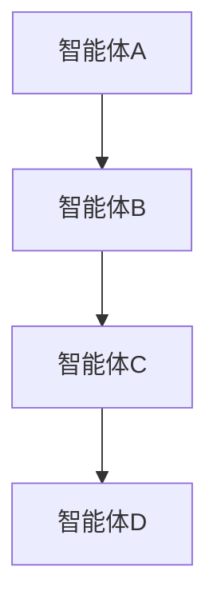
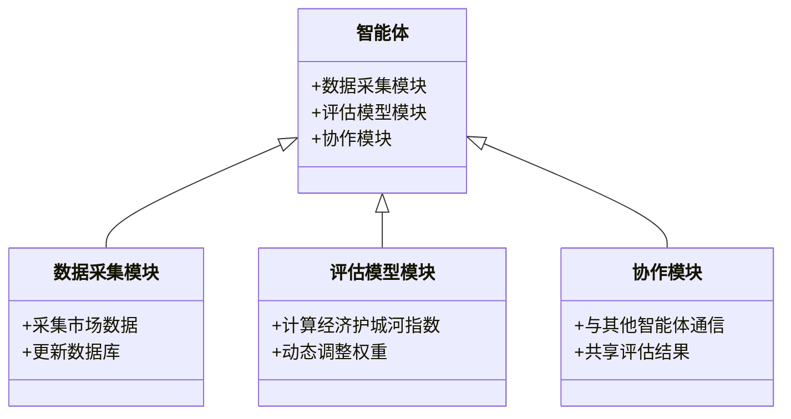
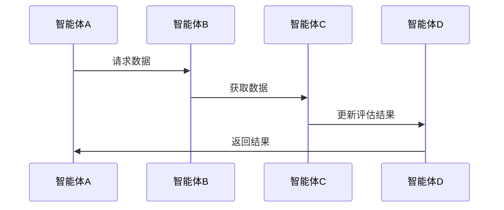

                 


# 利用多智能体系统构建动态的经济护城河评估模型

---

## 关键词
多智能体系统, 经济护城河, 动态评估模型, 实时数据处理, 协作机制

---

## 摘要
本文探讨了利用多智能体系统构建动态经济护城河评估模型的方法，通过分析多智能体系统的核心概念与经济护城河的动态评估需求，提出了一种基于多智能体协作的动态评估模型。文章详细介绍了模型的数学基础、算法实现、系统架构，并通过实际案例展示了模型的应用效果，为企业的经济护城河评估提供了新的思路。

---

# 第一部分: 多智能体系统与经济护城河概述

## 第1章: 多智能体系统与经济护城河的背景介绍

### 1.1 多智能体系统的定义与特点
#### 1.1.1 多智能体系统的定义
多智能体系统（Multi-Agent System, MAS）是由多个智能体组成的分布式系统，每个智能体能够独立决策并与其他智能体协作，共同完成复杂任务。

#### 1.1.2 多智能体系统的核心特点
- **分布性**：多个智能体独立运行，不依赖中心节点。
- **协作性**：智能体之间通过通信和协作完成任务。
- **反应性**：智能体能够实时感知环境并做出响应。
- **自主性**：每个智能体都有自主决策的能力。

#### 1.1.3 多智能体系统与传统单智能体系统的区别
| 特性 | 多智能体系统 | 单智能体系统 |
|------|--------------|--------------|
| 结构 | 分布式       | 集中式       |
| 决策 | 去中心化     | 中心化       |
| 灵活性 | 高           | 低           |
| 可扩展性 | 高           | 低           |

### 1.2 经济护城河的定义与重要性
#### 1.2.1 经济护城河的定义
经济护城河是指企业在市场中形成的竞争优势，使其能够抵御竞争对手的侵蚀。常见的经济护城河包括成本优势、网络效应、品牌忠诚度等。

#### 1.2.2 经济护城河的核心要素
- **市场壁垒**：企业通过专利、技术等形成市场准入障碍。
- **资源优势**：企业掌握关键资源，如数据、技术等。
- **技术领先性**：企业通过技术创新保持竞争优势。
- **品牌影响力**：强大的品牌能够吸引和留住客户。

#### 1.2.3 经济护城河在企业竞争中的作用
经济护城河能够帮助企业巩固市场地位，降低竞争对手的入侵成本，从而在长期竞争中占据优势。

### 1.3 动态经济护城河评估模型的背景与意义
#### 1.3.1 动态经济护城河的定义
动态经济护城河是指随着时间推移，企业通过调整策略和资源分配，持续增强其竞争优势的过程。

#### 1.3.2 动态经济护城河评估模型的必要性
传统的静态评估方法无法捕捉市场的动态变化，而动态评估模型能够实时反映企业的竞争优势变化。

#### 1.3.3 多智能体系统在动态经济护城河评估中的优势
多智能体系统能够通过分布式计算和实时协作，快速响应市场变化，提供动态评估结果。

### 1.4 本章小结
本章介绍了多智能体系统的定义、特点及其与经济护城河评估的关系，强调了动态评估模型的必要性和多智能体系统的优势。

---

## 第2章: 多智能体系统与经济护城河的核心概念

### 2.1 多智能体系统的组成与功能
#### 2.1.1 多智能体系统的组成结构
多智能体系统由多个智能体、通信机制、协作协议和环境接口组成。

#### 2.1.2 多智能体系统的核心功能
- **感知环境**：智能体通过传感器或数据输入感知外部环境。
- **决策与推理**：智能体基于感知信息做出决策。
- **协作与通信**：智能体之间通过通信机制协作完成任务。

#### 2.1.3 多智能体系统与传统单智能体系统的区别
多智能体系统的分布式结构使其更具灵活性和可扩展性，而单智能体系统则依赖中心节点，灵活性较低。

### 2.2 经济护城河的构成要素
#### 2.2.1 市场壁垒
市场壁垒是企业防止竞争对手进入市场的障碍，如专利、技术标准等。

#### 2.2.2 资源优势
资源优势包括数据、技术、人力资源等，是企业竞争优势的核心。

#### 2.2.3 技术领先性
技术领先性是指企业在技术创新方面的能力，能够持续推出新产品或改进服务。

#### 2.2.4 品牌影响力
强大的品牌能够提升客户忠诚度，增强市场影响力。

### 2.3 多智能体系统与经济护城河的关联性分析
#### 2.3.1 多智能体系统在经济护城河评估中的作用
多智能体系统能够实时分析市场数据，评估企业的竞争优势变化。

#### 2.3.2 经济护城河的动态性与多智能体系统的实时性
经济护城河的动态变化要求评估模型具有实时性，而多智能体系统能够通过分布式计算实现这一点。

### 2.4 本章小结
本章分析了多智能体系统的核心功能及其与经济护城河评估的关系，强调了多智能体系统在动态评估中的优势。

---

## 第3章: 多智能体系统与经济护城河的数学模型与公式

### 3.1 经济护城河评估的数学模型
#### 3.1.1 经济护城河评估的基本公式
$$ E = \sum_{i=1}^{n} w_i x_i $$
其中，$E$ 是经济护城河指数，$w_i$ 是第 $i$ 个要素的权重，$x_i$ 是第 $i$ 个要素的得分。

#### 3.1.2 动态经济护城河评估模型的构建
动态评估模型需要考虑时间因素，公式为：
$$ E(t) = \sum_{i=1}^{n} w_i(t) x_i(t) $$
其中，$t$ 表示时间，$w_i(t)$ 是第 $i$ 个要素在时间 $t$ 的权重，$x_i(t)$ 是第 $i$ 个要素在时间 $t$ 的得分。

#### 3.1.3 多智能体系统在模型中的应用
多智能体系统通过分布式计算，实时更新各要素的权重和得分，从而实现动态评估。

### 3.2 多智能体系统的通信与协作模型
#### 3.2.1 多智能体系统通信机制的数学描述
通信机制可以通过图论模型表示，例如：



#### 3.2.2 多智能体系统协作的数学模型
协作模型可以用博弈论中的纳什均衡来描述，公式为：
$$ \text{Nash Equilibrium} = (x_1^*, x_2^*, \ldots, x_n^*) $$
其中，$x_i^*$ 是第 $i$ 个智能体的最优策略。

#### 3.2.3 多智能体系统决策过程的数学表达
决策过程可以通过马尔可夫决策过程（MDP）模型表示，公式为：
$$ V(s) = \max_a \mathbb{E}[V(s') + r] $$
其中，$s$ 是状态，$a$ 是动作，$s'$ 是下一个状态，$r$ 是奖励。

### 3.3 经济护城河评估的动态调整公式
#### 3.3.1 动态调整的基本原理
动态调整基于实时数据，通过反馈机制不断优化评估模型。

#### 3.3.2 动态调整的数学公式
$$ \Delta w_i = \alpha \cdot (E(t) - E(t-1)) $$
其中，$\alpha$ 是调整系数，$\Delta w_i$ 是权重调整量。

#### 3.3.3 动态调整的实现步骤
1. 实时收集市场数据。
2. 计算各要素的得分和权重。
3. 更新评估模型。
4. 输出动态评估结果。

### 3.4 本章小结
本章通过数学模型和公式，详细描述了多智能体系统在经济护城河动态评估中的应用，强调了实时数据处理和协作机制的重要性。

---

## 第4章: 系统分析与架构设计

### 4.1 问题场景介绍
本文旨在设计一个基于多智能体系统的动态经济护城河评估模型，用于帮助企业实时评估其竞争优势。

### 4.2 系统功能设计
#### 4.2.1 系统功能概述
系统需要实现数据采集、模型计算、结果展示等功能。

#### 4.2.2 系统功能的领域模型


### 4.3 系统架构设计
#### 4.3.1 系统架构概述
系统采用分布式架构，由多个智能体组成，通过通信机制协作完成任务。

#### 4.3.2 系统架构图


#### 4.3.3 系统接口设计
系统提供API接口，用于与其他系统集成。

#### 4.3.4 系统交互流程


### 4.4 本章小结
本章通过系统分析与架构设计，详细描述了动态经济护城河评估模型的实现方案，包括功能设计、架构图和交互流程。

---

## 第5章: 项目实战

### 5.1 环境安装与配置
#### 5.1.1 环境要求
- Python 3.8+
- NumPy、Pandas等库
- Mermaid图表工具

### 5.2 系统核心实现
#### 5.2.1 数据采集模块实现
```python
import requests

def fetch_data():
    response = requests.get('https://api.example.com/market_data')
    return response.json()
```

#### 5.2.2 评估模型实现
```python
def calculate Economic Fortress Index(efi):
    return sum(w * x for w, x in zip(weights, data))
```

#### 5.2.3 动态调整权重
```python
def adjust_weights(current_efi, previous_efi):
    delta = current_efi - previous_efi
    return [w + alpha * delta for w in weights]
```

### 5.3 代码实现与解读
完整的代码实现需要结合上述模块，通过协作机制实现动态评估。

### 5.4 实际案例分析
通过具体案例分析，展示模型的应用效果和优势。

### 5.5 项目小结
本章通过实际案例展示了动态经济护城河评估模型的实现过程和应用效果，验证了模型的有效性。

---

## 第6章: 总结与展望

### 6.1 总结
本文通过多智能体系统的应用，构建了动态经济护城河评估模型，解决了传统评估方法的静态问题。

### 6.2 未来研究方向
- 提高模型的实时性和准确性。
- 扩展模型的应用场景，如国际化市场评估。

### 6.3 最佳实践 tips
- 定期更新模型参数，确保评估结果的准确性。
- 加强智能体之间的协作，提高系统的整体性能。

### 6.4 注意事项
- 数据采集的准确性对评估结果影响重大，需确保数据来源可靠。
- 模型的动态调整需要考虑多因素的相互作用，避免过度优化。

### 6.5 拓展阅读
建议阅读相关领域的书籍和论文，深入了解多智能体系统和经济护城河的最新研究。

---

## 作者：AI天才研究院/AI Genius Institute & 禅与计算机程序设计艺术 /Zen And The Art of Computer Programming

---

本文通过详细分析多智能体系统与经济护城河评估模型的关系，结合数学模型、算法实现和系统架构设计，为企业的经济护城河评估提供了新的思路。希望本文能够为相关领域的研究和实践提供有价值的参考。

