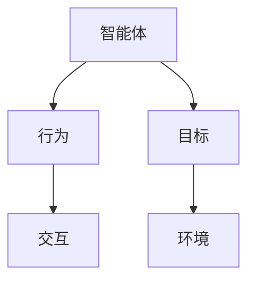
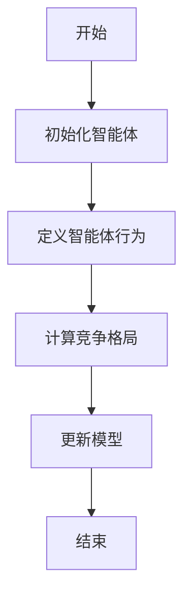
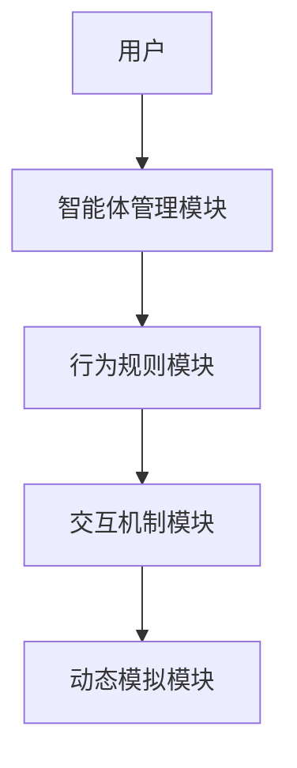

                 


# 利用多智能体系统构建动态竞争格局模型：把握行业变迁

## 关键词：多智能体系统、动态竞争格局、竞争分析、博弈论、系统架构、行业变迁、智能体交互

## 摘要：  
在当今快速变化的商业环境中，行业竞争格局的动态性使得传统的静态分析方法难以捕捉复杂的市场变化。本文通过引入多智能体系统（Multi-Agent System, MAS），提出了一种构建动态竞争格局模型的方法。该方法结合了智能体的自主性、交互性和适应性，能够实时模拟和预测行业竞争的动态变化。文章详细探讨了多智能体系统的核心概念、算法原理、系统架构以及实际应用案例，为行业竞争分析提供了新的视角和工具。

---

# 第一部分: 多智能体系统与动态竞争格局模型基础

## 第1章: 多智能体系统与动态竞争格局模型概述

### 1.1 多智能体系统的基本概念
#### 1.1.1 多智能体系统的定义与特点
多智能体系统（Multi-Agent System, MAS）是由多个智能体（Agent）组成的分布式系统，这些智能体能够感知环境、自主决策并进行交互。MAS的特点包括：
- **自主性**：智能体能够自主决策，无需外部干预。
- **反应性**：智能体能够实时感知环境并做出反应。
- **协作性**：智能体之间可以协作完成复杂任务。
- **分布性**：智能体分布在不同的空间或时间维度上。

#### 1.1.2 动态竞争格局模型的定义
动态竞争格局模型是一种用于描述行业内各参与者之间动态关系的数学模型，能够捕捉市场竞争的实时变化。该模型的核心在于模拟竞争者之间的互动、市场环境的变化以及资源分配的动态调整。

#### 1.1.3 多智能体系统与动态竞争格局模型的关系
多智能体系统为动态竞争格局模型提供了实现基础，通过智能体的交互模拟市场竞争的动态变化。动态竞争格局模型则为多智能体系统提供了应用场景，使其能够在复杂竞争环境中发挥作用。

### 1.2 问题背景与问题描述
#### 1.2.1 行业竞争格局的动态变化
现代市场竞争具有高度动态性，企业之间的竞争不仅体现在市场份额上，还包括技术创新、资源整合、品牌影响力等多个维度。传统的静态竞争模型难以捕捉这些动态变化。

#### 1.2.2 竞争格局模型的构建需求
为了准确分析和预测行业竞争趋势，需要构建一种能够动态调整的模型，能够实时反映市场变化并为企业决策提供支持。

#### 1.2.3 多智能体系统在竞争分析中的优势
多智能体系统通过模拟竞争者的行为和交互，能够实时捕捉市场竞争的动态变化，为企业提供更精准的竞争分析和决策支持。

### 1.3 问题解决与边界
#### 1.3.1 多智能体系统在竞争格局建模中的应用
通过构建多智能体系统，模拟行业内各参与者的行为和互动，从而构建动态竞争格局模型。

#### 1.3.2 模型的边界与外延
动态竞争格局模型的边界包括竞争者数量、市场环境、资源分配等因素，外延则涉及企业战略调整、市场反馈等。

#### 1.3.3 核心要素与组成结构
动态竞争格局模型的核心要素包括：
- 竞争者智能体
- 市场环境
- 资源分配
- 行为规则

## 第2章: 多智能体系统的核心概念与联系

### 2.1 多智能体系统的核心原理
#### 2.1.1 多智能体系统的组成与功能
多智能体系统由以下几部分组成：
- **智能体**：具有自主性、反应性、目标导向的智能体。
- **环境**：智能体所处的外部环境，包括市场环境、资源分布等。
- **交互机制**：智能体之间以及与环境之间的交互规则。

#### 2.1.2 智能体的属性与行为特征
智能体具有以下属性：
- **自主性**：智能体能够自主决策。
- **反应性**：智能体能够实时感知环境并做出反应。
- **目标导向**：智能体的行为以实现特定目标为导向。

#### 2.1.3 多智能体系统与动态竞争格局模型的关系
多智能体系统为动态竞争格局模型提供了实现基础，动态竞争格局模型则为多智能体系统提供了应用场景。

### 2.2 核心概念对比分析
#### 2.2.1 多智能体系统与传统竞争模型的对比
| 对比维度 | 多智能体系统 | 传统竞争模型 |
|----------|--------------|---------------|
| 模型复杂性 | 高 | 低 |
| 交互性 | 强 | 弱 |
| 动态性 | 高 | 低 |

#### 2.2.2 动态竞争格局模型的特征分析
动态竞争格局模型具有以下特征：
- **动态性**：能够实时反映市场竞争的变化。
- **交互性**：能够模拟竞争者之间的互动。
- **适应性**：能够根据环境变化调整模型参数。

#### 2.2.3 智能体之间的关系与交互
智能体之间的关系可以分为竞争关系和合作关系。在动态竞争格局模型中，竞争关系是主要的交互形式。

### 2.3 ER实体关系图


---

## 第3章: 动态竞争格局模型的算法原理

### 3.1 算法原理概述
#### 3.1.1 基于博弈论的多智能体建模
博弈论为多智能体系统的建模提供了理论基础，通过模拟竞争者之间的博弈关系，构建动态竞争格局模型。

#### 3.1.2 动态竞争格局的构建步骤
1. **定义智能体**：确定行业内主要竞争者。
2. **定义行为规则**：设定智能体的行为规则和决策逻辑。
3. **构建交互机制**：定义智能体之间的交互规则。
4. **模拟市场竞争**：通过多智能体系统的模拟，生成动态竞争格局。

#### 3.1.3 算法的数学模型与公式
收益函数的定义：
$$ R_i = \sum_{j=1}^{n} w_{ij} \cdot s_j $$
其中，$R_i$ 是第$i$个智能体的收益，$w_{ij}$ 是第$j$个智能体的权重，$s_j$ 是第$j$个智能体的策略。

### 3.2 算法流程图


---

## 第4章: 系统分析与架构设计

### 4.1 系统功能设计
#### 4.1.1 系统目标
构建一个能够实时模拟和预测行业竞争格局的系统。

#### 4.1.2 功能模块
- **智能体管理模块**：管理智能体的创建、删除和更新。
- **行为规则模块**：定义智能体的行为规则。
- **交互机制模块**：模拟智能体之间的交互。
- **动态模拟模块**：实时模拟市场竞争。

### 4.2 系统架构设计


### 4.3 接口设计
- **智能体接口**：定义智能体的行为接口。
- **环境接口**：定义环境的接口。
- **用户接口**：供用户查看和控制模拟过程。

### 4.4 交互序列图


---

## 第5章: 项目实战

### 5.1 环境安装
需要安装以下工具：
- Python 3.x
- Mermaid图生成工具
- 算法模拟工具

### 5.2 核心代码实现
以下是核心代码实现：
```python
class Agent:
    def __init__(self, id, target):
        self.id = id
        self.target = target
        self.strategy = None

    def set_strategy(self, strategy):
        self.strategy = strategy

    def execute_behavior(self):
        # 根据策略执行行为
        pass
```

### 5.3 案例分析与结果解读
通过模拟某行业的竞争格局，展示动态竞争格局模型的应用效果。

### 5.4 项目小结
总结项目实施的经验和教训，提出改进建议。

---

## 第6章: 总结与展望

### 6.1 总结
本文通过引入多智能体系统，构建了动态竞争格局模型，能够实时模拟和预测行业竞争的动态变化。

### 6.2 展望
未来的研究方向包括：
- 提高模型的复杂性
- 增强模型的实时性
- 扩展模型的应用领域

---

## 作者：AI天才研究院 & 禅与计算机程序设计艺术

