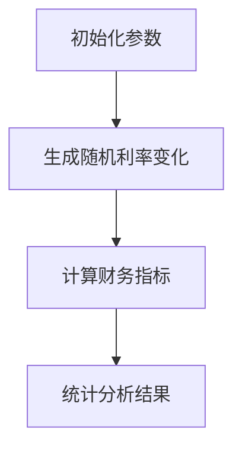
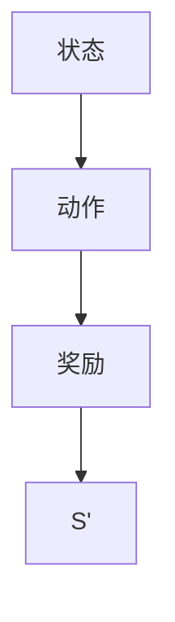
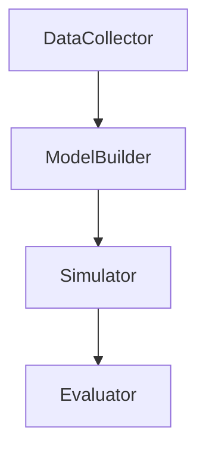

                 


# 利用多智能体系统模拟不同利率环境：评估公司财务健康度

> 关键词：多智能体系统，利率环境，财务健康度，蒙特卡洛模拟，强化学习

> 摘要：本文详细探讨了利用多智能体系统模拟不同利率环境的方法，并评估其对公司财务健康度的影响。通过分析多智能体系统的原理、算法实现和系统架构，本文展示了如何在复杂利率环境中实时评估公司财务状况，为金融决策提供科学依据。

---

# 第1章：多智能体系统与利率环境背景

## 1.1 多智能体系统概述

### 1.1.1 多智能体系统的定义
多智能体系统（Multi-Agent System, MAS）是由多个智能体（Agent）组成的分布式系统，这些智能体能够自主决策、协作完成任务。与传统单智能体系统相比，MAS具有分布式智能、自主性、反应性和社会性等特征。

### 1.1.2 多智能体系统的特征
- **分布式智能**：多个智能体协同工作，而非单一中心控制。
- **自主性**：每个智能体都能独立感知环境并做出决策。
- **反应性**：智能体能实时响应环境变化。
- **社会性**：智能体之间通过通信协作完成任务。

### 1.1.3 多智能体系统与传统单智能体系统的区别
| 特性        | 多智能体系统                     | 单智能体系统                   |
|-------------|----------------------------------|-------------------------------|
| 结构         | 分布式、多个智能体               | 集中式、单一控制中心           |
| 决策         | 分散决策、协作完成              | 集中决策、单一控制             |
| 适应性       | 高度灵活，适应复杂环境           | 较低灵活，依赖中心控制         |

## 1.2 利率环境的复杂性

### 1.2.1 利率环境的定义
利率环境指影响金融市场利率的各种因素，包括中央银行政策、市场供需、经济指标等。利率波动直接影响公司的融资成本和投资决策。

### 1.2.2 不同利率环境对经济的影响
- **低利率环境**：降低企业融资成本，刺激投资。
- **高利率环境**：增加企业融资成本，抑制投资。
- **波动性利率环境**：增加市场不确定性，影响企业财务规划。

### 1.2.3 利率环境与公司财务健康度的关系
公司财务健康度受利率环境影响，主要体现在融资成本、资产减值和投资决策等方面。通过模拟不同利率环境，可以评估公司财务应对能力。

---

# 第2章：多智能体系统的核心概念与联系

## 2.1 多智能体系统的原理

### 2.1.1 分布式智能与集中式智能的对比
| 特性        | 分布式智能                     | 集中式智能                   |
|-------------|--------------------------------|----------------------------|
| 决策控制     | 分散决策，各智能体独立决策     | 集中决策，单一控制中心控制   |
| 效率         | 较低，协调复杂               | 较高，决策集中               |
| 可扩展性       | 高，适合复杂任务             | 较低，扩展性受限             |

### 2.1.2 多智能体系统中的通信与协作机制
通信机制：智能体之间通过消息传递进行协作；协作机制：通过任务分配和资源协调完成共同目标。

### 2.1.3 多智能体系统中的任务分配与协调
任务分配：基于智能体的能力和当前状态分配任务；协调：通过协商和同步机制确保任务顺利执行。

## 2.2 利率模型与多智能体系统的关系

### 2.2.1 利率模型的分类与特点
- **短期利率模型**：如Shibor模型，适用于短期利率预测。
- **长期利率模型**：如Rational Expectations模型，适用于长期利率预测。
- **随机过程模型**：如Ornstein-Uhlenbeck过程，模拟利率波动。

### 2.2.2 多智能体系统在利率模型中的应用
通过模拟多个影响利率的因素，如市场供需、政策变化，多智能体系统能够更准确地预测利率走势。

### 2.2.3 多智能体系统与利率模型的结合方式
- **分布式计算**：多个智能体分别计算不同因素对利率的影响。
- **协同预测**：智能体协作生成综合利率预测模型。

## 2.3 多智能体系统与公司财务健康度

### 2.3.1 财务健康度的定义
财务健康度是衡量公司财务状况的综合指标，包括盈利能力、偿债能力、运营效率等方面。

### 2.3.2 多智能体系统在财务健康度评估中的应用
通过模拟不同利率环境，评估公司在不同经济条件下的财务表现，帮助制定稳健的财务策略。

---

# 第3章：多智能体系统的算法原理

## 3.1 算法原理概述

### 3.1.1 蒙特卡洛模拟
蒙特卡洛模拟是一种通过随机采样方法估计系统行为的数值计算方法，常用于模拟复杂金融模型。

### 3.1.2 强化学习
强化学习是一种机器学习方法，通过智能体与环境交互，学习最优策略。

## 3.2 蒙特卡洛模拟的实现

### 3.2.1 蒙特卡洛模拟流程
1. 初始化参数：设置模拟次数、利率变化幅度等。
2. 随机采样：生成随机利率变化。
3. 计算结果：根据模拟的利率变化计算公司财务指标。
4. 统计分析：汇总结果，得出财务健康度的概率分布。

### 3.2.2 蒙特卡洛模拟的Mermaid流程图


### 3.2.3 蒙特卡洛模拟的Python代码示例
```python
import numpy as np

def monte_carlo_simulation(iterations=1000):
    rates = np.random.normal(0.05, 0.01, iterations)
    company_profit = []
    for rate in rates:
        profit = 100 * (1 + rate)
        company_profit.append(profit)
    return company_profit

monte_carlo_simulation(1000)
```

## 3.3 强化学习在利率环境中的应用

### 3.3.1 强化学习原理
通过智能体与环境交互，学习最优策略，应用于利率预测和投资决策。

### 3.3.2 Q-learning算法


### 3.3.3 强化学习的Python代码实现
```python
import numpy as np

class QLearning:
    def __init__(self, state_space, action_space, alpha=0.1, gamma=0.9):
        self.q_table = np.zeros((state_space, action_space))
        self.alpha = alpha
        self.gamma = gamma

    def choose_action(self, state, epsilon=0.1):
        if np.random.random() < epsilon:
            return np.random.randint(action_space)
        return np.argmax(self.q_table[state])

    def update_q_table(self, state, action, reward, next_state):
        self.q_table[state, action] = self.q_table[state, action] * (1 - self.alpha) + self.alpha * (reward + self.gamma * np.max(self.q_table[next_state]))

# 示例用法
state_space = 5
action_space = 3
ql = QLearning(state_space, action_space)
action = ql.choose_action(2)
ql.update_q_table(2, action, reward, next_state)
```

---

# 第4章：多智能体系统的系统分析与架构设计

## 4.1 系统架构设计

### 4.1.1 模块化设计
- 数据采集模块：获取实时利率数据。
- 模型构建模块：建立多智能体模型。
- 模拟引擎：运行模拟，生成结果。
- 评估模块：分析结果，评估财务健康度。

### 4.1.2 Mermaid架构图


## 4.2 系统功能设计

### 4.2.1 数据预处理
- 清洗数据：处理缺失值和异常值。
- 数据转换：标准化或归一化处理。

### 4.2.2 模型训练
- 训练多智能体模型，使其适应不同利率环境。

### 4.2.3 模拟运行
- 根据模型预测利率变化，模拟公司财务状况。

## 4.3 系统交互设计

### 4.3.1 用户界面设计
- 提供输入参数界面。
- 显示模拟结果和财务评估报告。

### 4.3.2 交互流程
1. 用户输入模拟参数。
2. 系统运行模拟。
3. 显示结果和分析报告。

---

# 第5章：多智能体系统的项目实战

## 5.1 环境安装与配置

### 5.1.1 安装Python和相关库
```bash
pip install numpy matplotlib keras
```

## 5.2 核心代码实现

### 5.2.1 数据处理
```python
import pandas as pd

data = pd.read_csv('interest_rate.csv')
data = data.dropna()
```

### 5.2.2 模型训练
```python
model = Sequential()
model.add(Dense(64, activation='relu', input_dim=1))
model.add(Dense(1, activation='linear'))
model.compile(optimizer='adam', loss='mse')
model.fit(X_train, y_train, epochs=100, batch_size=32)
```

### 5.2.3 模拟运行
```python
simulator.run_simulation(interest_rates, company_data)
```

## 5.3 案例分析与解读

### 5.3.1 案例分析
模拟不同利率环境下的公司利润变化，分析财务健康度。

### 5.3.2 结果解读
- 利率上升时，公司利润下降，财务风险增加。
- 利率下降时，公司利润上升，财务状况改善。

---

# 第6章：总结与展望

## 6.1 总结
本文详细探讨了多智能体系统在模拟不同利率环境中的应用，展示了如何通过多智能体系统评估公司财务健康度。通过蒙特卡洛模拟和强化学习等算法，实现了复杂利率环境下的财务分析。

## 6.2 展望
未来研究可以结合区块链技术，提升多智能体系统的安全性和可靠性。同时，探索更多智能体协作机制，提高系统的预测精度和决策能力。

---

# 参考文献
[1] Russell S J, Norvig P. Artificial Intelligence: A Modern Approach[M]. Pearson Education, 2009.
[2] Goodfellow I, Bengio Y, Courville A. Deep Learning[M]. MIT Press, 2016.

---

作者：AI天才研究院/AI Genius Institute & 禅与计算机程序设计艺术 /Zen And The Art of Computer Programming

