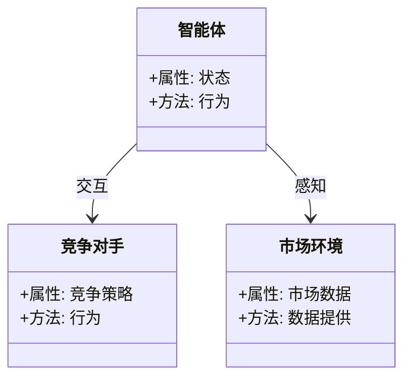
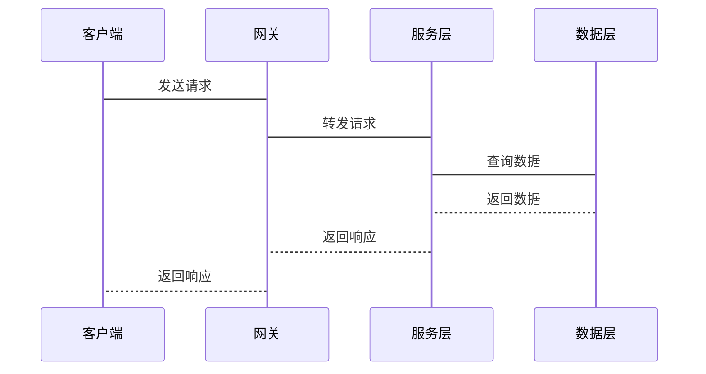

                 


# 利用多智能体系统评估公司的国际化战略

## 关键词：多智能体系统，国际化战略，战略评估，企业决策，人工智能

## 摘要：  
本文探讨了如何利用多智能体系统（Multi-Agent System, MAS）来评估公司的国际化战略。通过分析多智能体系统的核心原理及其在国际化战略中的应用，本文提出了一个基于MAS的国际化战略评估框架。该框架结合了多智能体系统的协作与竞争机制、分布式计算能力以及自适应学习能力，能够有效解决国际化战略中的复杂问题，如市场进入策略选择、竞争对手分析与风险评估等。本文还详细介绍了多智能体系统在国际化战略评估中的算法原理、系统架构设计以及实际案例分析，为企业的国际化战略提供了新的思路和方法。

---

# 第一部分: 多智能体系统与国际化战略概述

## 第1章: 多智能体系统与国际化战略背景

### 1.1 多智能体系统的基本概念

#### 1.1.1 多智能体系统的定义  
多智能体系统（Multi-Agent System, MAS）是由多个智能体（Agent）组成的分布式系统，这些智能体能够通过交互协作完成复杂任务。每个智能体都是一个独立的实体，具有自主性、反应性和社会性。

#### 1.1.2 多智能体系统的特征  
- **自主性**：智能体能够自主决策，无需外部干预。  
- **反应性**：智能体能够感知环境并实时调整行为。  
- **分布式性**：智能体之间通过分布式协作完成任务。  
- **社会性**：智能体之间可以通过通信和协作实现目标。  

#### 1.1.3 多智能体系统的优势  
- 提高系统的灵活性和适应性。  
- 能够处理复杂的分布式问题。  
- 通过协作实现整体目标，避免单点故障。  

### 1.2 国际化战略的定义与挑战

#### 1.2.1 国际化战略的定义  
国际化战略是指企业在跨国经营中，为了在全球市场中获取竞争优势而制定的长期目标和行动计划。

#### 1.2.2 国际化战略的核心要素  
- 市场分析与选择。  
- 资源配置与组织结构。  
- 风险管理与应对策略。  

#### 1.2.3 国际化战略的常见挑战  
- 市场环境复杂多变。  
- 竞争对手的动态博弈。  
- 跨文化管理与协调难度大。  

### 1.3 多智能体系统在国际化战略中的应用背景

#### 1.3.1 多智能体系统与国际化战略的契合点  
- 多智能体系统的分布式协作能力与国际化战略的全球化布局相契合。  
- 多智能体系统的自主决策能力能够应对国际化战略中的不确定性。  

#### 1.3.2 多智能体系统在国际化战略中的优势  
- 能够模拟复杂的市场环境和竞争关系。  
- 通过多智能体的协作，实现对国际化战略的动态评估与优化。  

#### 1.3.3 当前研究现状与未来趋势  
- 当前研究主要集中在多智能体系统在市场预测和竞争分析中的应用。  
- 未来趋势是将多智能体系统与大数据、机器学习等技术结合，提升国际化战略的智能化水平。  

### 1.4 本章小结  
本章介绍了多智能体系统的基本概念和特征，分析了国际化战略的核心要素及其面临的挑战，并探讨了多智能体系统在国际化战略中的应用背景和优势。

---

## 第2章: 多智能体系统的原理与架构

### 2.1 多智能体系统的组成结构

#### 2.1.1 智能体的定义与分类  
- **智能体的定义**：智能体是具有感知、决策和执行能力的实体。  
- **智能体的分类**：可以根据智能体的智能水平分为简单反应式智能体、基于模型的反射式智能体和目标驱动的智能体。  

#### 2.1.2 多智能体系统的层次结构  
- **智能体层**：包括多个智能体及其交互机制。  
- **环境层**：包括智能体所处的物理或虚拟环境。  
- **通信层**：包括智能体之间的通信协议和数据交换机制。  

#### 2.1.3 多智能体系统的通信机制  
- **直接通信**：智能体之间通过共享内存或消息传递进行通信。  
- **间接通信**：智能体通过中间媒介（如数据库或消息队列）进行通信。  

### 2.2 多智能体系统的核心原理

#### 2.2.1 协作与竞争机制  
- **协作机制**：智能体通过协作实现共同目标。  
- **竞争机制**：智能体通过竞争优化系统性能。  

#### 2.2.2 分布式计算与决策  
- **分布式计算**：智能体在分布式环境中独立计算并做出决策。  
- **分布式决策**：智能体通过协作实现整体决策的优化。  

#### 2.2.3 自适应与学习能力  
- **自适应能力**：智能体能够根据环境变化调整自身行为。  
- **学习能力**：智能体通过机器学习算法不断优化自身性能。  

### 2.3 多智能体系统的数学模型

#### 2.3.1 智能体行为模型  
$$ R = \sum_{i=1}^{n} w_i x_i $$  
其中，$R$ 是智能体的收益，$w_i$ 是权重，$x_i$ 是决策变量。  

#### 2.3.2 多智能体协作模型  
$$ C = \sum_{i=1}^{m} c_i $$  
其中，$C$ 是协作成本，$c_i$ 是每个智能体的协作成本。  

#### 2.3.3 竞争与合作的数学表达  
$$ P = \max_{\theta} \sum_{i=1}^{k} f_i(\theta) $$  
其中，$P$ 是整体收益，$\theta$ 是决策变量，$f_i$ 是智能体的收益函数。  

### 2.4 本章小结  
本章详细介绍了多智能体系统的组成结构、核心原理及其数学模型，为后续章节的分析奠定了理论基础。

---

## 第3章: 多智能体系统在国际化战略中的核心问题

### 3.1 国际化战略评估的关键问题

#### 3.1.1 市场进入策略的选择  
- **目标市场选择**：基于市场规模、竞争强度等因素选择目标市场。  
- **进入方式选择**：包括直接投资、合资合作、特许经营等方式。  

#### 3.1.2 竞争对手分析与预测  
- **竞争对手行为预测**：基于历史数据和市场趋势预测竞争对手的策略。  
- **竞争优势分析**：分析自身与竞争对手的核心竞争力。  

#### 3.1.3 风险评估与应对策略  
- **风险识别**：识别国际化过程中可能面临的政治、经济、法律等风险。  
- **风险应对策略**：制定应对措施，如多元化投资、保险等。  

### 3.2 多智能体系统在国际化战略中的应用问题

#### 3.2.1 智能体的分工与协作  
- **智能体的分工**：根据智能体的能力和任务需求进行分工。  
- **协作机制设计**：设计合理的协作机制以实现整体目标。  

#### 3.2.2 数据的获取与处理  
- **数据来源**：包括市场数据、竞争对手数据、行业数据等。  
- **数据处理**：通过数据清洗、特征提取等技术处理数据。  

#### 3.2.3 系统的可扩展性与鲁棒性  
- **系统可扩展性**：系统能够适应国际化战略的动态变化。  
- **系统鲁棒性**：系统能够抵御外部干扰和内部故障。  

### 3.3 本章小结  
本章分析了国际化战略评估中的关键问题，探讨了多智能体系统在国际化战略中的应用问题，并为后续章节的算法设计提供了方向。

---

## 第4章: 多智能体协作算法

### 4.1 协作算法的基本原理

#### 4.1.1 协作算法的定义  
协作算法是指智能体通过协作实现共同目标的算法。

#### 4.1.2 协作算法的核心步骤  
1. **任务分解**：将整体任务分解为多个子任务。  
2. **智能体分配**：根据智能体的能力分配子任务。  
3. **协作执行**：智能体协作执行分配的任务。  
4. **结果整合**：整合各智能体的结果以实现整体目标。  

#### 4.1.3 协作算法的实现框架  
$$ F = \{f_1, f_2, \ldots, f_n\} $$  
其中，$F$ 是协作框架，$f_i$ 是协作算法的实现步骤。  

### 4.2 基于博弈论的协作算法

#### 4.2.1 博弈论的基本概念  
- **博弈**：指多个参与者在竞争或合作中进行决策的过程。  
- **纳什均衡**：指在博弈中，所有参与者都采取最优策略，使得没有任何一方能够通过单方面改变策略而提高自身收益。  

#### 4.2.2 基于纳什均衡的协作算法  
$$ NE = \{x_1^*, x_2^*, \ldots, x_n^*\} $$  
其中，$NE$ 是纳什均衡，$x_i^*$ 是第 $i$ 个智能体的最优策略。  

#### 4.2.3 博弈论在协作算法中的应用  
- **竞争与合作的平衡**：通过博弈论模型实现智能体之间的竞争与合作的平衡。  
- **策略优化**：通过纳什均衡优化智能体的协作策略。  

### 4.3 本章小结  
本章详细介绍了协作算法的基本原理和基于博弈论的协作算法，并探讨了其在国际化战略中的应用。

---

## 第5章: 系统分析与架构设计

### 5.1 系统应用场景

#### 5.1.1 国际化战略评估的场景  
- **市场进入决策**：帮助企业选择合适的国际市场。  
- **竞争对手分析**：帮助企业预测竞争对手的策略。  
- **风险评估与应对**：帮助企业制定风险应对策略。  

### 5.2 系统功能设计

#### 5.2.1 领域模型设计  


#### 5.2.2 系统架构设计  


### 5.3 系统接口设计

#### 5.3.1 系统接口的定义  
- **输入接口**：接收市场数据、竞争对手数据等输入。  
- **输出接口**：输出评估结果、策略建议等输出。  

#### 5.3.2 接口实现  
- **RESTful API**：通过HTTP协议实现智能体之间的通信。  
- **消息队列**：通过Kafka或RabbitMQ实现异步通信。  

### 5.4 系统交互设计

#### 5.4.1 系统交互的流程  
1. **输入数据**：客户端通过API将数据输入系统。  
2. **智能体协作**：智能体通过协作完成任务。  
3. **结果输出**：系统将评估结果输出给客户端。  

#### 5.4.2 交互流程图  


### 5.5 本章小结  
本章通过系统分析与架构设计，详细介绍了多智能体系统在国际化战略评估中的应用场景、功能设计和系统架构。

---

## 第6章: 项目实战

### 6.1 环境安装与配置

#### 6.1.1 环境要求  
- **操作系统**：Linux或Windows。  
- **编程语言**：Python 3.6以上版本。  
- **开发工具**：PyCharm或VS Code。  

#### 6.1.2 环境配置  
1. 安装必要的库：`pip install numpy, pandas, matplotlib, scikit-learn`。  
2. 配置开发环境：设置虚拟环境并激活。  

### 6.2 核心实现代码

#### 6.2.1 智能体类的实现  
```python
class Agent:
    def __init__(self, id, strategy):
        self.id = id
        self.strategy = strategy
```

#### 6.2.2 协作算法的实现  
```python
def collaborate_agents(agents):
    results = []
    for agent in agents:
        results.append(agent.strategy())
    return results
```

#### 6.2.3 竞争与合作的实现  
```python
def compete_agents(agents):
    max_result = max(agent.strategy() for agent in agents)
    return max_result
```

### 6.3 代码实现与解读

#### 6.3.1 智能体的初始化  
```python
agent1 = Agent(1, lambda: 10)
agent2 = Agent(2, lambda: 20)
agents = [agent1, agent2]
```

#### 6.3.2 协作算法的实现  
```python
collaborate_results = collaborate_agents(agents)
print("协作结果:", collaborate_results)
```

#### 6.3.3 竞争算法的实现  
```python
compete_result = compete_agents(agents)
print("竞争结果:", compete_result)
```

### 6.4 实际案例分析

#### 6.4.1 案例背景  
假设某公司计划进入国际市场，需要评估两个目标市场：市场A和市场B。  

#### 6.4.2 案例实现  
```python
market_A = Agent(1, lambda: 15)  # 市场A的收益
market_B = Agent(2, lambda: 25)  # 市场B的收益
agents = [market_A, market_B]
collaborate_results = collaborate_agents(agents)
print("协作结果:", collaborate_results)
compete_result = compete_agents(agents)
print("竞争结果:", compete_result)
```

#### 6.4.3 案例分析  
- 协作结果表明，市场A和市场B的收益分别为15和25。  
- 竞争结果表明，市场B的收益最高，应优先选择市场B。  

### 6.5 本章小结  
本章通过实际案例分析，展示了多智能体系统在国际化战略评估中的具体实现与应用。

---

## 第7章: 总结与展望

### 7.1 总结  
本文探讨了多智能体系统在国际化战略评估中的应用，提出了一个基于MAS的评估框架。通过分析多智能体系统的原理和算法，结合实际案例，验证了MAS在国际化战略中的有效性。

### 7.2 展望  
未来的研究方向包括：  
1. 将多智能体系统与大数据、机器学习技术结合，提升系统的智能化水平。  
2. 研究多智能体系统在国际化战略中的动态优化问题。  
3. 探讨多智能体系统在跨国并购、全球供应链管理等复杂场景中的应用。  

### 7.3 本章小结  
本文总结了研究的主要内容，并展望了未来的研究方向。

---

## 作者：AI天才研究院/AI Genius Institute & 禅与计算机程序设计艺术/Zen And The Art of Computer Programming

