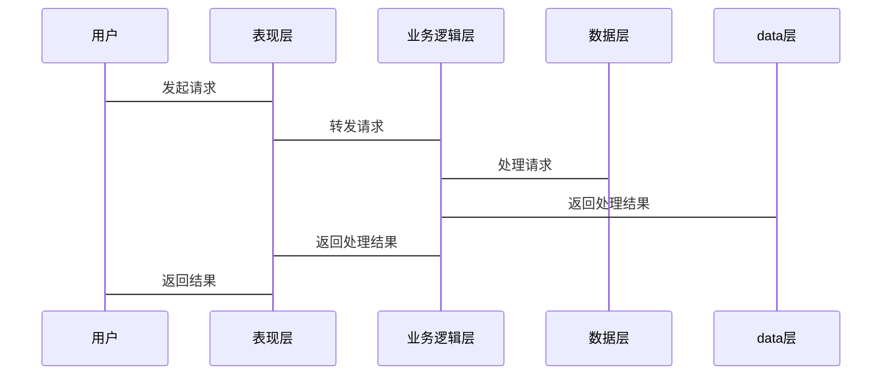

                 


# 利用多智能体系统评估公司的数字化转型进程

## 关键词：数字化转型，多智能体系统，一致性算法，系统架构，项目实战

## 摘要：本文详细探讨了如何利用多智能体系统来评估公司的数字化转型进程。通过分析数字化转型的核心概念、多智能体系统的原理及其在评估中的应用，本文为读者提供了一套基于多智能体系统的评估模型。文章包括背景介绍、核心概念、算法原理、系统架构设计、项目实战和最佳实践等内容，帮助读者深入了解如何通过多智能体系统实现数字化转型的评估与优化。

---

# 第一部分: 利用多智能体系统评估公司数字化转型的背景与基础

## 第1章: 数字化转型概述

### 1.1 数字化转型的定义与背景

#### 1.1.1 数字化转型的核心概念
数字化转型是指企业利用数字技术（如人工智能、大数据、云计算等）来改变其商业模式、业务流程、文化以及客户体验的过程。数字化转型不仅仅是技术的升级，更涉及组织结构、管理方式和业务模式的全面变革。

#### 1.1.2 数字化转型的背景与驱动因素
- **技术驱动**：云计算、大数据、人工智能等技术的快速发展为企业提供了新的转型机会。
- **市场需求**：客户对个性化、智能化服务的需求日益增加，推动企业加快数字化转型。
- **竞争压力**：数字化转型已成为企业竞争力的重要组成部分，不转型可能意味着被淘汰。

#### 1.1.3 数字化转型对企业的影响
- **效率提升**：通过自动化和智能化流程，企业可以大幅提高运营效率。
- **成本降低**：数字化转型可以通过数据驱动的决策减少浪费，降低成本。
- **客户体验优化**：通过数据洞察和智能系统，企业可以更好地满足客户需求。

### 1.2 多智能体系统的基本概念

#### 1.2.1 多智能体系统的定义
多智能体系统（Multi-Agent System, MAS）是由多个智能体（Agent）组成的分布式系统，这些智能体能够通过通信和协作完成复杂的任务。

#### 1.2.2 多智能体系统的特征
- **分布性**：智能体独立运行，彼此之间通过通信协作。
- **自主性**：每个智能体都有一定的自主决策能力。
- **社会性**：智能体之间需要通过协作完成任务。
- **反应性**：智能体能够感知环境并做出实时反应。

#### 1.2.3 多智能体系统与数字化转型的关系
多智能体系统可以模拟企业内部的各个部门或角色，通过协作完成数字化转型的评估和优化任务。例如，财务智能体可以负责成本分析，市场智能体可以负责客户行为预测。

### 1.3 本章小结
本章介绍了数字化转型的定义、背景及其对企业的影响，并详细讲解了多智能体系统的概念和特征，为后续章节奠定了基础。

---

## 第2章: 多智能体系统的原理与架构

### 2.1 多智能体系统的组成与功能

#### 2.1.1 智能体的定义与分类
- **智能体**：能够感知环境并采取行动以实现目标的实体。
- **分类**：
  - **反应式智能体**：基于当前感知做出反应。
  - **认知式智能体**：具有推理、规划能力。
  - **协作式智能体**：与其他智能体协作完成任务。

#### 2.1.2 多智能体系统的核心功能
- **通信**：智能体之间通过消息传递进行通信。
- **协作**：智能体通过协作完成复杂任务。
- **协调**：通过协调机制确保任务顺利进行。

#### 2.1.3 多智能体系统的层次结构
- **物理层**：智能体的物理载体。
- **逻辑层**：智能体的逻辑结构和功能。
- **通信层**：智能体之间的通信机制。

### 2.2 多智能体系统的通信与协作

#### 2.2.1 智能体之间的通信机制
- **消息传递**：通过消息传递进行通信。
- **协议**：遵循特定的通信协议。

#### 2.2.2 协作任务的分配与协调
- **任务分配**：根据智能体的能力分配任务。
- **协调机制**：通过协调算法确保任务顺利进行。

#### 2.2.3 冲突解决与一致性算法
- **一致性算法**：如Raft和Paxos，用于保证系统的一致性。
- **冲突解决**：通过协商解决智能体之间的冲突。

### 2.3 多智能体系统的性能评估

#### 2.3.1 系统性能的评估指标
- **响应时间**：系统对请求的响应时间。
- **吞吐量**：系统在单位时间内处理的请求数量。
- **可靠性**：系统的稳定性和可用性。

#### 2.3.2 性能优化方法
- **负载均衡**：通过负载均衡技术优化系统性能。
- **并行计算**：利用并行计算提高系统效率。

#### 2.3.3 系统扩展性与可维护性
- **扩展性**：系统能够方便地扩展。
- **可维护性**：系统易于维护和升级。

### 2.4 本章小结
本章详细讲解了多智能体系统的组成、通信与协作机制，以及性能评估和优化方法，为后续章节的应用奠定了基础。

---

## 第3章: 数字化转型评估的多智能体系统模型

### 3.1 数字化转型评估的核心要素

#### 3.1.1 评估维度与指标
- **技术维度**：技术实现的成熟度。
- **业务维度**：业务流程的优化程度。
- **管理维度**：组织管理的适应性。

#### 3.1.2 评估方法与工具
- **KPI分析**：通过关键绩效指标进行评估。
- **数据分析**：利用大数据技术进行分析。

#### 3.1.3 评估结果的可视化
- **仪表盘**：通过可视化工具展示评估结果。
- **报告生成**：生成详细的评估报告。

### 3.2 多智能体系统在评估中的角色

#### 3.2.1 智能体的分工与协作
- **数据采集智能体**：负责数据的采集和处理。
- **分析智能体**：负责数据分析和评估。
- **反馈智能体**：负责将评估结果反馈给相关方。

#### 3.2.2 系统的动态调整与优化
- **动态调整**：根据评估结果动态调整系统。
- **优化方法**：通过优化算法提高评估效率。

#### 3.2.3 系统的实时监控与反馈
- **实时监控**：通过监控工具实时跟踪系统状态。
- **反馈机制**：通过反馈机制优化系统性能。

### 3.3 多智能体系统与数字化转型的结合

#### 3.3.1 系统设计与实现
- **系统设计**：根据需求设计多智能体系统。
- **系统实现**：通过编程实现系统的各个部分。

#### 3.3.2 系统功能与应用场景
- **功能设计**：系统的主要功能模块。
- **应用场景**：系统在数字化转型中的具体应用。

#### 3.3.3 系统的优势与局限性
- **优势**：多智能体系统具有分布式、协作性强等优势。
- **局限性**：系统复杂性高，维护成本高。

### 3.4 本章小结
本章详细讲解了数字化转型评估的核心要素，多智能体系统在评估中的角色，以及系统设计与实现的相关内容。

---

## 第4章: 多智能体系统一致性算法

### 4.1 一致性算法的定义与作用

#### 4.1.1 一致性算法的定义
一致性算法用于保证分布式系统中数据的一致性。

#### 4.1.2 一致性算法的作用与意义
- **保证一致性**：通过一致性算法保证系统中数据的一致性。
- **提高可靠性**：通过一致性算法提高系统的可靠性。

#### 4.1.3 一致性算法的分类
- **强一致性**：所有副本在所有操作之后保持一致。
- **最终一致性**：副本在一定时间内最终保持一致。

### 4.2 常见一致性算法的实现原理

#### 4.2.1 Raft一致性算法

##### Raft算法的核心思想
Raft算法通过领导者选举、日志复制等机制保证一致性。

##### Raft算法的实现步骤
1. **领导者选举**：通过投票选举领导者。
2. **日志复制**：领导者将日志复制给其他副本。
3. **一致性保证**：通过日志一致保证数据一致性。

#### 4.2.2 Paxos一致性算法

##### Paxos算法的核心思想
Paxos算法通过提案者、接受者和决定者三角色保证一致性。

##### Paxos算法的实现步骤
1. **提案者提出提案**：提案者提出提案。
2. **接受者接受提案**：接受者接受提案。
3. **决定者决定提案**：决定者决定提案是否通过。

#### 4.2.3 Raft与Paxos的比较与选择
- **Raft**：实现简单，适用于大多数场景。
- **Paxos**：适用于需要高一致性的场景。

### 4.3 一致性算法的数学模型与公式

#### 4.3.1 Raft算法的数学模型
Raft算法通过选举机制确保一致性，其数学模型主要涉及选举过程的正确性证明。

#### 4.3.2 Paxos算法的数学模型
Paxos算法通过提案和接受过程保证一致性，其数学模型主要涉及提案的正确性证明。

#### 4.3.3 算法的收敛性分析
- **Raft**：收敛性良好，选举过程快速。
- **Paxos**：收敛性依赖于网络条件，可能出现阻塞。

### 4.4 本章小结
本章详细讲解了多智能体系统中一致性算法的定义、实现原理和数学模型，并比较了Raft和Paxos算法的优缺点。

---

## 第5章: 多智能体系统评估模型的系统架构与设计

### 5.1 系统架构设计

#### 5.1.1 系统功能需求分析
- **核心功能**：评估数字化转型的各个维度。
- **辅助功能**：提供数据可视化、报告生成等辅助功能。

#### 5.1.2 系统架构设计
- **分层架构**：将系统分为数据层、业务逻辑层和表现层。
- **微服务架构**：通过微服务实现系统的模块化和松耦合。

#### 5.1.3 系统接口设计
- **内部接口**：系统内部各模块之间的接口。
- **外部接口**：系统与外部系统的接口。

### 5.2 系统架构设计

#### 5.2.1 分层架构设计
- **数据层**：负责数据的存储和管理。
- **业务逻辑层**：负责业务逻辑的实现。
- **表现层**：负责用户界面的展示。

#### 5.2.2 微服务架构设计
- **服务划分**：将系统划分为多个微服务。
- **服务通信**：通过API Gateway实现服务之间的通信。

#### 5.2.3 智能体协同架构设计
- **智能体分工**：明确每个智能体的职责。
- **协作机制**：通过协作机制实现智能体之间的协作。

### 5.3 系统接口设计

#### 5.3.1 系统内部接口
- **数据接口**：智能体之间通过数据接口进行数据传递。
- **通信接口**：智能体之间通过通信接口进行通信。

#### 5.3.2 系统外部接口
- **API接口**：系统与其他系统的接口。
- **用户接口**：系统与用户的接口。

### 5.4 系统交互设计

#### 5.4.1 系统交互流程
- **用户请求**：用户通过表现层发起请求。
- **业务逻辑处理**：业务逻辑层处理请求。
- **数据存储**：数据层存储处理结果。

#### 5.4.2 系统交互的Mermaid序列图


### 5.5 本章小结
本章详细讲解了多智能体系统评估模型的系统架构与设计，包括分层架构、微服务架构、系统接口设计和系统交互设计。

---

## 第6章: 项目实战

### 6.1 环境安装与配置

#### 6.1.1 开发环境搭建
- **操作系统**：建议使用Linux或macOS。
- **编程语言**：Python、Java等。
- **框架与库**：如Spring Boot、Django等。

#### 6.1.2 一致性算法库的安装
- **Raft实现**：如raft4j。
- **Paxos实现**：如paxos4j。

### 6.2 系统核心实现

#### 6.2.1 智能体的实现
- **数据采集智能体**：负责数据的采集和处理。
- **分析智能体**：负责数据分析和评估。
- **反馈智能体**：负责将评估结果反馈给相关方。

#### 6.2.2 一致性算法的实现
- **Raft一致性算法**：实现Raft一致性算法。
- **Paxos一致性算法**：实现Paxos一致性算法。

#### 6.2.3 系统功能的实现
- **数据采集**：通过爬虫或其他数据采集工具实现。
- **数据分析**：通过机器学习算法进行分析。
- **评估结果展示**：通过可视化工具展示评估结果。

### 6.3 代码实现与解读

#### 6.3.1 数据采集智能体的代码实现
```python
class DataCollector:
    def __init__(self):
        self.data = []

    def collect_data(self, source):
        # 从数据源采集数据
        pass

    def get_data(self):
        return self.data
```

#### 6.3.2 分析智能体的代码实现
```python
class Analyzer:
    def __init__(self):
        self.data = None

    def analyze(self, data):
        # 数据分析逻辑
        pass

    def get_result(self):
        return self.result
```

#### 6.3.3 一致性算法的代码实现（以Raft为例）
```python
class RaftAlgorithm:
    def __init__(self, nodes):
        self.nodes = nodes
        self.leader = None

    def election(self):
        # 选举领导者
        pass

    def replicate(self, leader, follower):
        # 复制日志
        pass
```

### 6.4 案例分析与详细讲解

#### 6.4.1 案例背景
假设我们有一个公司需要评估其数字化转型的进程，我们可以通过多智能体系统实现评估。

#### 6.4.2 案例分析
- **数据采集**：采集公司的业务数据、客户数据等。
- **数据分析**：通过数据分析评估公司的数字化转型程度。
- **评估结果展示**：通过仪表盘展示评估结果。

#### 6.4.3 详细讲解
- **数据采集智能体**：负责采集公司的业务数据。
- **分析智能体**：负责分析数据并生成评估结果。
- **反馈智能体**：负责将评估结果反馈给公司管理层。

### 6.5 项目小结

#### 6.5.1 项目总结
通过多智能体系统实现数字化转型评估，能够提高评估的效率和准确性。

#### 6.5.2 经验与教训
- **经验**：多智能体系统的协作能力非常重要。
- **教训**：系统的复杂性可能会影响维护和优化。

---

## 第七部分: 最佳实践与总结

### 7.1 本章总结

#### 7.1.1 核心内容回顾
- **数字化转型**：数字化转型的定义、背景及其对企业的影响。
- **多智能体系统**：多智能体系统的定义、特征及其在数字化转型中的应用。
- **一致性算法**：Raft和Paxos一致性算法的实现原理和数学模型。
- **系统架构设计**：多智能体系统的系统架构与设计。
- **项目实战**：多智能体系统的项目实战，包括环境安装、代码实现和案例分析。

#### 7.1.2 本文的核心观点
通过多智能体系统实现数字化转型评估，能够提高评估的效率和准确性，为企业提供有力的支持。

### 7.2 最佳实践 tips

#### 7.2.1 小结
- **系统设计**：在系统设计时，需要充分考虑智能体的分工与协作。
- **一致性算法**：选择合适的一致性算法，确保系统的数据一致性。
- **项目管理**：在项目管理中，需要充分考虑系统的复杂性和维护成本。

#### 7.2.2 注意事项
- **系统复杂性**：系统的复杂性可能会影响维护和优化。
- **数据一致性**：需要确保系统的数据一致性，避免数据冲突。
- **智能体协作**：需要确保智能体之间的协作顺畅，避免协作失败。

#### 7.2.3 拓展阅读
- **一致性算法**：深入研究Raft和Paxos一致性算法的实现细节。
- **多智能体系统**：研究多智能体系统在其他领域的应用。

### 7.3 本章小结
本文详细讲解了多智能体系统在数字化转型评估中的应用，通过项目实战和案例分析，帮助读者深入了解多智能体系统的核心概念和实现方法。同时，本文还总结了系统设计和项目管理中的注意事项，为读者提供了宝贵的实践经验。

---

## 作者：AI天才研究院/AI Genius Institute & 禅与计算机程序设计艺术 /Zen And The Art of Computer Programming

---

通过以上内容，您已经获得了《利用多智能体系统评估公司的数字化转型进程》的技术博客文章的完整目录和详细内容。

