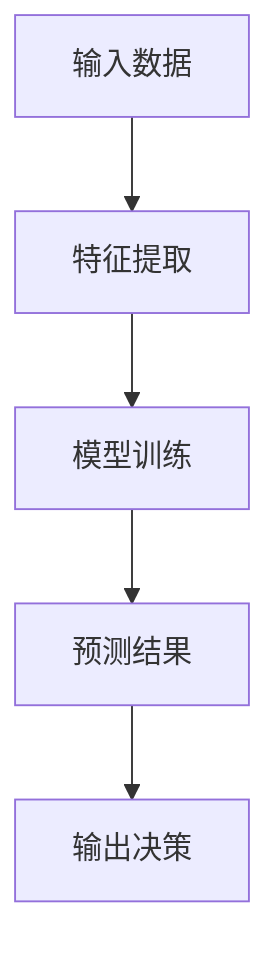

                 


# 利用多智能体系统识别潜在的破产重组机会

## 关键词：多智能体系统，破产重组，算法原理，系统架构，项目实战，数学模型

## 摘要：本文探讨了利用多智能体系统识别潜在的破产重组机会的方法。通过分析多智能体系统的核心概念、算法原理、系统架构以及项目实战，展示了如何利用多智能体系统的协同机制和信息处理能力，有效识别和评估企业破产重组的可能性，为相关决策提供支持。

---

# 正文

## 第一部分: 多智能体系统与破产重组概述

### 第1章: 多智能体系统概述

#### 1.1 多智能体系统的基本概念

多智能体系统（Multi-Agent System，简称MAS）是由多个智能体组成的分布式系统，这些智能体能够通过协作完成复杂的任务。每个智能体都具有一定的自主性、反应性和社会性，能够与其他智能体或环境进行交互。

- **自主性**：智能体能够自主决策，无需外部干预。
- **反应性**：智能体能够感知环境并做出实时反应。
- **社会性**：智能体之间可以通过通信和协作完成任务。

#### 1.2 破产重组的定义与特征

破产重组是指企业在无法偿还债务的情况下，通过法律程序重新组织资产和债务，以恢复经营能力的过程。破产重组的核心目标是通过调整企业结构和资产分配，实现企业的可持续发展。

- **特征**：
  - 财务危机：企业无法偿还债务。
  - 资产重组：调整资产结构以提高企业价值。
  - 法律程序：破产重组需要通过法律程序进行。

#### 1.3 多智能体系统在破产重组中的应用前景

多智能体系统在破产重组中的应用前景广阔，主要体现在以下几个方面：

- **信息处理能力**：多智能体系统能够高效处理大量信息，帮助识别潜在的破产重组机会。
- **协同决策**：通过智能体之间的协作，可以制定更合理的重组方案。
- **实时监控**：多智能体系统能够实时监控企业的财务状况，及时发现潜在风险。

---

### 第2章: 多智能体系统的核心概念与联系

#### 2.1 多智能体系统的组成要素

多智能体系统的组成要素包括：

1. **实体关系图（ER图）**：展示系统中的实体及其关系。
   ```mermaid
   graph TD
   A[企业] --> B[资产]
   A --> C[负债]
   A --> D[股东]
   B --> E[价值]
   C --> F[风险]
   ```

2. **系统架构图**：展示系统的整体架构。
   ```mermaid
   classDiagram
   class 系统架构 {
       输入模块
       处理模块
       输出模块
   }
   系统架构 --> 输入模块
   系统架构 --> 处理模块
   系统架构 --> 输出模块
   ```

#### 2.2 破产重组中的关键因素

破产重组中的关键因素包括：

1. **财务指标分析**：如资产负债率、流动比率等。
2. **市场环境分析**：如行业趋势、经济环境等。
3. **企业内部管理**：如管理效率、内部控制系统等。

#### 2.3 多智能体系统的协同机制

多智能体系统的协同机制包括：

1. **信息共享机制**：智能体之间共享信息，以便更好地协作。
2. **协作决策机制**：通过协商和协作，制定最优决策。
3. **系统优化机制**：通过不断优化系统结构，提高整体效率。

---

### 第3章: 多智能体系统识别破产重组机会的算法原理

#### 3.1 算法概述

多智能体系统识别破产重组机会的算法主要包括以下几个步骤：

1. **数据输入**：获取企业的财务数据和市场数据。
2. **特征提取**：提取关键的财务指标和市场指标。
3. **模型训练**：基于历史数据训练模型。
4. **预测结果**：预测企业破产重组的可能性。

算法流程图如下：


#### 3.2 算法实现

1. **特征提取**：从企业的财务报表中提取关键指标，如资产负债率、流动比率等。
2. **模型训练**：使用机器学习算法（如支持向量机、随机森林等）进行训练。
3. **结果分析**：分析模型的预测结果，判断企业是否可能进入破产重组。

#### 3.3 数学模型与公式

1. **财务健康指数**：
   $$ 财务健康指数 = \frac{资产}{负债} \times 100 $$

2. **风险评估模型**：
   $$ 风险指数 = \sum_{i=1}^{n} (权重_i \times 评估指标_i) $$

---

### 第4章: 系统架构与实现

#### 4.1 系统架构设计

1. **系统功能模块**：
   - 输入模块：接收企业的财务数据和市场数据。
   - 处理模块：进行特征提取和模型训练。
   - 输出模块：输出预测结果和决策建议。

2. **系统架构图**：
   ```mermaid
   classDiagram
   class 系统架构 {
       输入模块
       处理模块
       输出模块
   }
   系统架构 --> 输入模块
   系统架构 --> 处理模块
   系统架构 --> 输出模块
   ```

#### 4.2 系统接口设计

1. **数据接口**：与企业财务系统对接，获取实时数据。
2. **用户接口**：提供友好的用户界面，方便用户输入和查看结果。
3. **输出接口**：将预测结果输出给相关决策者。

#### 4.3 系统交互流程

1. **交互流程图**：
   ```mermaid
   sequenceDiagram
   participant 用户
   participant 系统
   用户 -> 系统: 提供财务数据
   系统 -> 用户: 返回预测结果
   ```

---

## 第二部分: 项目实战与应用

### 第5章: 项目实战

#### 5.1 环境安装

1. **安装Python**：需要安装Python 3.8及以上版本。
2. **安装相关库**：如pandas、scikit-learn、matplotlib等。

#### 5.2 系统核心实现源代码

```python
import pandas as pd
from sklearn import svm
from sklearn.metrics import accuracy_score

# 数据加载
data = pd.read_csv(' bankruptcy_data.csv')

# 特征提取
X = data[['资产', '负债', '股东权益']]
y = data['破产标记']

# 模型训练
model = svm.SVC()
model.fit(X, y)

# 预测结果
预测结果 = model.predict(X)
准确率 = accuracy_score(y, 预测结果)

print(f'准确率: {准确率}')
```

#### 5.3 实际案例分析

以某企业为例，分析其财务数据：

1. **数据输入**：企业的财务数据，包括资产、负债、股东权益等。
2. **特征提取**：提取关键指标，如资产负债率、流动比率等。
3. **模型预测**：使用训练好的模型预测企业是否可能进入破产重组。

---

## 第三部分: 总结与展望

### 第6章: 总结与展望

#### 6.1 总结

通过多智能体系统的协同机制和信息处理能力，可以有效识别潜在的破产重组机会。本文详细介绍了多智能体系统的核心概念、算法原理、系统架构以及项目实战，展示了其在破产重组中的应用价值。

#### 6.2 展望

未来，随着人工智能技术的不断发展，多智能体系统在破产重组中的应用将更加广泛。可以通过进一步优化算法、提升系统的实时性，进一步提高识别的准确率和效率。

---

## 作者：AI天才研究院/AI Genius Institute & 禅与计算机程序设计艺术 /Zen And The Art of Computer Programming

