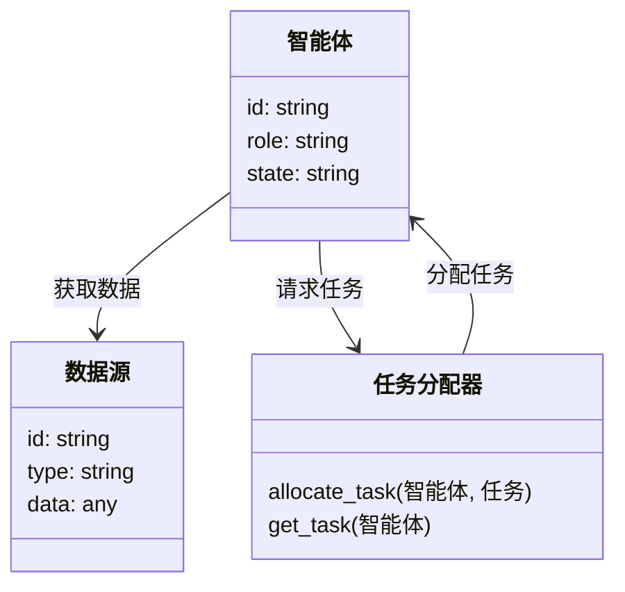
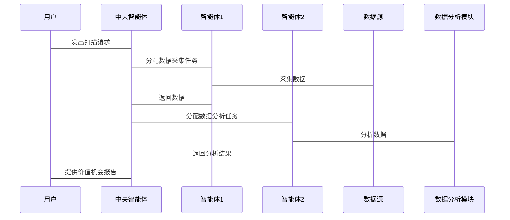

                 


# 利用多智能体系统进行全球市场价值机会扫描

## 关键词：多智能体系统, 市场扫描, 价值机会, 分布式协作, 人工智能, 市场分析

## 摘要：  
本文探讨了如何利用多智能体系统在全球市场中扫描和识别价值机会。通过分析多智能体系统的组成、协作机制以及其在市场扫描中的应用，结合具体算法实现和系统架构设计，本文提供了从理论到实践的详细指导。通过实际案例分析和项目实战，展示了如何通过多智能体系统提高市场扫描的效率和准确性，为企业在全球市场中捕捉价值机会提供有力支持。

---

# 第1章: 多智能体系统与全球市场价值机会扫描概述

## 1.1 多智能体系统的基本概念

### 1.1.1 多智能体系统的定义  
多智能体系统（Multi-Agent System, MAS）是由多个智能体（Agent）组成的分布式系统，这些智能体能够通过协作完成复杂的任务。每个智能体都是一个具备感知、决策和行动能力的实体，能够独立工作并与其他智能体通信。

### 1.1.2 多智能体系统的特征  
| 特征 | 描述 |
|------|------|
| 分布式 | 智能体独立运行，无中心化控制 |
| 协作性 | 智能体通过协作完成共同目标 |
| 反应性 | 智能体能够实时感知环境并做出反应 |
| 多样性 | 智能体可以有不同的目标、能力或角色 |

### 1.1.3 多智能体系统与传统单智能体系统的区别  
- **单智能体系统**：单个智能体完成任务，依赖中心化控制，决策集中。  
- **多智能体系统**：多个智能体协作完成任务，决策分布，通信复杂。

## 1.2 全球市场价值机会扫描的必要性

### 1.2.1 全球市场的复杂性与挑战  
全球市场具有高度不确定性、信息分散、竞争激烈等特点，传统的单一分析方法难以应对。

### 1.2.2 价值机会扫描的目标与意义  
- **目标**：识别市场中的潜在价值机会，如新兴趋势、未满足需求等。  
- **意义**：帮助企业制定战略决策，提高市场竞争力。

### 1.2.3 多智能体系统在市场扫描中的优势  
- **分布式感知**：多个智能体从不同数据源收集信息，提高信息全面性。  
- **协作分析**：智能体协同工作，快速分析复杂市场环境。  
- **动态响应**：智能体能够实时调整策略，适应市场变化。

## 1.3 本章小结  
本章介绍了多智能体系统的定义、特征及其在市场扫描中的应用优势，为后续内容奠定了基础。

---

# 第2章: 多智能体系统的组成与协作机制

## 2.1 多智能体系统的组成结构

### 2.1.1 智能体的定义与分类  
- **定义**：智能体是能够感知环境、做出决策并采取行动的实体。  
- **分类**：  
  - **简单反射型智能体**：基于当前感知直接行动。  
  - **基于模型的反应型智能体**：利用内部模型分析环境。  
  - **目标驱动型智能体**：根据目标采取行动。  
  - **效用驱动型智能体**：基于效用函数优化决策。  

### 2.1.2 智能体之间的关系与协作  
智能体之间的关系包括竞争、合作和中立。在市场扫描中，智能体通常需要合作，共同完成任务。

### 2.1.3 多智能体系统的层次结构  
- **底层**：数据采集与预处理。  
- **中间层**：智能体协作与数据分析。  
- **顶层**：结果汇总与决策支持。

## 2.2 多智能体系统的协作机制

### 2.2.1 通信机制  
智能体之间通过消息传递进行通信，消息格式包括动作、数据和状态。

### 2.2.2 协作协议  
- **协商协议**：智能体之间协商任务分配。  
- **协调协议**：确保智能体行动一致。  
- **仲裁协议**：解决冲突。

### 2.2.3 冲突解决机制  
- **协商解决**：通过协商达成一致。  
- **优先级排序**：根据任务优先级自动解决冲突。  
- **仲裁机制**：引入仲裁者进行决策。

## 2.3 本章小结  
本章详细介绍了多智能体系统的组成结构及其协作机制，为后续的市场扫描应用提供了理论基础。

---

# 第3章: 多智能体系统在市场扫描中的应用

## 3.1 市场数据采集与预处理

### 3.1.1 市场数据的来源与类型  
- **来源**：新闻、社交媒体、市场报告、交易数据等。  
- **类型**：文本数据、结构化数据、非结构化数据。

### 3.1.2 数据采集的挑战与解决方案  
- **挑战**：数据分散、噪声多、实时性要求高。  
- **解决方案**：分布式采集、数据清洗、实时处理。

### 3.1.3 数据预处理方法  
- **数据清洗**：去除冗余和错误数据。  
- **数据转换**：将数据转换为统一格式。  
- **数据增强**：通过数据扩展提高信息量。

## 3.2 数据预处理的实现

### 3.2.1 数据清洗流程  
1. 识别无效数据。  
2. 去除重复数据。  
3. 处理缺失数据。

### 3.2.2 数据转换方法  
1. 数据标准化。  
2. 数据归一化。

### 3.2.3 数据增强策略  
1. 添加噪声。  
2. 数据扩展。

## 3.3 本章小结  
本章介绍了市场数据采集与预处理的方法，为后续的市场分析奠定了基础。

---

# 第4章: 多智能体协作算法

## 4.1 基于多智能体的协作算法概述

### 4.1.1 分布式协作算法  
- **特点**：去中心化，智能体独立决策。  
- **流程**：信息共享、任务分配、协作执行。

### 4.1.2 集中式协作算法  
- **特点**：中心化控制，任务分配由中央智能体完成。  
- **流程**：信息收集、任务分配、协作执行。

## 4.2 具体算法实现

### 4.2.1 分布式协作算法的实现步骤  
1. 初始化智能体。  
2. 智能体感知环境。  
3. 智能体协商任务分配。  
4. 执行任务并反馈结果。

### 4.2.2 集中式协作算法的实现步骤  
1. 中央智能体收集信息。  
2. 中央智能体分配任务。  
3. 智能体执行任务。  
4. 反馈结果并汇总。

## 4.3 算法的优缺点分析

### 4.3.1 分布式协作算法的优势  
- **优点**：去中心化，容错性高。  
- **缺点**：通信开销大，协作效率低。

### 4.3.2 集中式协作算法的劣势  
- **优点**：控制集中，效率高。  
- **缺点**：单点故障，扩展性差。

## 4.4 本章小结  
本章详细介绍了分布式和集中式协作算法的实现及其优缺点，为后续的系统设计提供了参考。

---

# 第5章: 系统架构与设计

## 5.1 系统架构设计

### 5.1.1 问题场景介绍  
全球市场价值机会扫描系统需要实时分析市场数据，识别潜在价值机会。

### 5.1.2 项目介绍  
本项目旨在构建一个多智能体系统，用于全球市场价值机会扫描。

## 5.2 系统功能设计

### 5.2.1 领域模型设计  


### 5.2.2 系统架构设计  


### 5.2.3 系统接口设计  
- **数据采集接口**：智能体与数据源之间的接口。  
- **任务分配接口**：中央智能体与智能体之间的接口。  
- **结果反馈接口**：智能体与中央智能体之间的接口。

### 5.2.4 系统交互设计  


## 5.3 本章小结  
本章详细介绍了系统的架构设计，包括领域模型、架构图和交互序列图，为后续的系统实现提供了指导。

---

# 第6章: 项目实战

## 6.1 环境安装

### 6.1.1 安装Python  
- 使用Anaconda安装Python 3.8或更高版本。

### 6.1.2 安装依赖库  
- `pip install numpy`  
- `pip install pandas`  
- `pip install scikit-learn`  
- `pip install networkx`

## 6.2 系统核心实现源代码

### 6.2.1 智能体类实现  
```python
class Agent:
    def __init__(self, id, role):
        self.id = id
        self.role = role
        self.state = 'idle'
    
    def get_data(self, data_source):
        # 获取数据
        pass
    
    def analyze_data(self, data):
        # 分析数据
        pass
    
    def report_result(self, result):
        # 汇报结果
        pass
```

### 6.2.2 中央智能体类实现  
```python
class CentralAgent:
    def __init__(self):
        self.agents = []
        self.tasks = []
    
    def assign_task(self, agent, task):
        # 分配任务
        pass
    
    def collect_results(self):
        # 收集结果
        pass
```

### 6.2.3 数据分析模块实现  
```python
from sklearn import preprocessing
import numpy as np

def preprocess_data(data):
    # 数据预处理
    return preprocessing.StandardScaler().fit_transform(data)
```

## 6.3 代码应用解读与分析  
- **智能体类**：定义了智能体的基本功能，包括数据获取、分析和汇报。  
- **中央智能体类**：负责任务分配和结果收集。  
- **数据分析模块**：实现了数据预处理功能，使用scikit-learn库进行标准化处理。

## 6.4 实际案例分析  
假设我们要分析全球科技市场的价值机会，可以通过以下步骤进行：  
1. 初始化多个智能体，分别负责数据采集、分析和识别。  
2. 中央智能体分配任务，智能体从不同数据源采集数据。  
3. 数据预处理后，进行分析，识别潜在价值机会。  
4. 中央智能体汇总结果，提供报告。

## 6.5 本章小结  
本章通过实际案例分析，展示了如何利用多智能体系统进行全球市场价值机会扫描，提供了具体的代码实现和应用解读。

---

# 第7章: 最佳实践与总结

## 7.1 小结  
本文详细介绍了多智能体系统在全球市场价值机会扫描中的应用，从理论到实践，提供了系统的指导。

## 7.2 注意事项  
- 数据安全：确保数据采集和分析过程中的数据安全。  
- 系统性能：优化系统架构，提高协作效率。  
- 智能体设计：合理设计智能体角色和功能，确保协作效果。

## 7.3 拓展阅读  
- 《Multi-Agent Systems: Algorithmic, Complexity Theoretic, and Game Theoretic Foundations》  
- 《Distributed Computing: Principles, Algorithms, and Applications》  

---

# 作者：AI天才研究院 & 禅与计算机程序设计艺术

