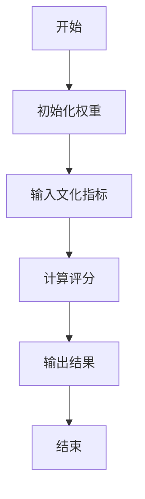
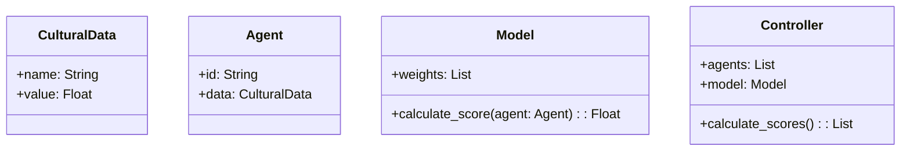
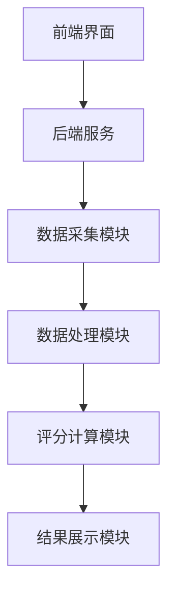

                 


---

# 利用多智能体系统进行全面的公司文化评分

> 关键词：多智能体系统、公司文化评分、系统架构、评分模型、数据处理

> 摘要：本文探讨了如何利用多智能体系统对公司的文化进行全面评分。通过分析多智能体系统的核心概念、体系结构和协作机制，结合文化评分模型的设计与实现，详细阐述了如何利用多智能体系统来构建一个高效、智能的文化评分系统。文章内容涵盖了多智能体系统在文化评估中的应用、文化评分模型的设计、数据收集与处理、系统架构设计、项目实战以及优化与改进等方面，为读者提供了一个全面的技术解决方案。

---

## 第一部分: 引言

### 1.1 研究背景与目标
公司在不断变化的商业环境中面临着各种挑战，良好的公司文化是企业成功的关键因素之一。然而，如何量化和评估公司文化却是一个复杂的问题。传统的文化评估方法通常依赖于主观的问卷调查和专家访谈，难以全面、客观地反映公司的文化状况。随着人工智能技术的发展，多智能体系统作为一种分布式、协作式的计算范式，能够有效地解决这一问题。

本研究的目标是利用多智能体系统对公司的文化进行全面评分，通过智能化的方法实现文化评估的自动化和量化。本文将详细探讨多智能体系统在文化评估中的应用，提出一种基于多智能体系统的文化评分模型，并通过实际案例验证其有效性。

### 1.2 研究内容与结构安排
本文的主要内容包括以下几个方面：
- **多智能体系统基础**：介绍多智能体系统的概念、体系结构和协作机制。
- **文化评分模型设计**：提出一种基于多智能体系统的文化评分模型，详细阐述其设计思路和实现方法。
- **数据收集与处理**：探讨如何从多源数据中提取文化相关特征。
- **系统架构设计**：设计一个高效的系统架构，支持多智能体系统的协作与通信。
- **项目实战**：通过实际案例展示如何利用多智能体系统实现文化评分。
- **优化与改进**：提出优化策略，进一步提升系统的评分准确性和效率。

---

## 第二部分: 多智能体系统基础

### 2.1 多智能体系统概述
#### 2.1.1 多智能体系统的定义
多智能体系统（Multi-Agent System, MAS）是由多个智能体（Agent）组成的分布式系统，这些智能体通过协作完成特定任务。智能体是一种能够感知环境、自主决策并采取行动的实体。

#### 2.1.2 多智能体系统的体系结构
多智能体系统的体系结构包括以下几种：
- **反应式体系结构**：基于当前感知做出反应，适用于动态环境。
- **规划式体系结构**：通过规划未来行动序列来实现目标。
- **混合式体系结构**：结合反应式和规划式的特点，适用于复杂环境。

#### 2.1.3 多智能体系统的协作机制
多智能体系统的协作机制包括：
- **分布式协作**：智能体通过分布式通信进行协作。
- **集中式协作**：智能体通过集中式协调器进行协作。
- **混合式协作**：结合分布式和集中式的特点。

### 2.2 多智能体系统的核心概念
#### 2.2.1 智能体的定义与特征
智能体是一种能够感知环境、自主决策并采取行动的实体。智能体具有以下特征：
- **自主性**：能够自主决策。
- **反应性**：能够感知环境并做出反应。
- **协作性**：能够与其他智能体协作完成任务。
- **社会性**：能够与其他智能体进行交互。

#### 2.2.2 多智能体系统的分类
多智能体系统可以分为以下几类：
- **结构化环境中的MAS**：环境是静态且确定的。
- **非结构化环境中的MAS**：环境是动态且不确定的。
- **混合环境中的MAS**：环境是部分结构化和部分非结构化的。

#### 2.2.3 多智能体系统的优缺点
多智能体系统的优点包括：
- **分布式计算能力**：能够处理复杂的任务。
- **容错性**：单个智能体的故障不会导致整个系统崩溃。
- **灵活性**：能够适应环境的变化。

多智能体系统的缺点包括：
- **通信开销**：智能体之间的通信可能带来额外的开销。
- **协作复杂性**：多个智能体的协作可能增加系统的复杂性。

### 2.3 多智能体系统的协作与通信
#### 2.3.1 智能体间的通信协议
智能体之间的通信需要遵循一定的协议，常见的通信协议包括：
- **简单邮件传输协议（SMTP）**：用于智能体之间的邮件通信。
- **远程方法调用（RPC）**：用于智能体之间的远程方法调用。
- **消息队列（MQ）**：用于智能体之间的异步通信。

#### 2.3.2 多智能体系统的协作模型
多智能体系统的协作模型包括：
- **基于任务的协作**：智能体通过任务分配进行协作。
- **基于角色的协作**：智能体通过角色分配进行协作。
- **基于意图的协作**：智能体通过意图协商进行协作。

#### 2.3.3 多智能体系统的协调机制
多智能体系统的协调机制包括：
- **优先级机制**：根据任务优先级进行协调。
- **协商机制**：智能体通过协商达成一致。
- **仲裁机制**：通过仲裁器解决冲突。

### 2.4 多智能体系统的应用领域
#### 2.4.1 多智能体系统在企业中的应用
多智能体系统在企业中的应用包括：
- **供应链管理**：优化供应链的协调与合作。
- **资源分配**：实现资源的优化分配。
- **风险管理**：实时监控和管理风险。

#### 2.4.2 多智能体系统在文化评估中的应用
多智能体系统在文化评估中的应用包括：
- **文化指标识别**：识别与公司文化相关的指标。
- **文化评分计算**：通过多智能体系统的协作计算文化评分。
- **文化趋势分析**：分析公司文化的变化趋势。

#### 2.4.3 多智能体系统的未来发展趋势
多智能体系统的未来发展趋势包括：
- **智能化**：结合人工智能技术，提升智能体的自主性和智能性。
- **分布式计算**：利用分布式计算技术，提升系统的计算能力。
- **云计算**：结合云计算技术，实现智能体的弹性扩展。

---

## 第三部分: 公司文化评分模型设计

### 3.1 公司文化评分模型的构建
#### 3.1.1 公司文化评分模型的定义
公司文化评分模型是一种基于多智能体系统的模型，用于量化公司的文化状况。模型通过多个智能体的协作，综合考虑多个文化指标，最终计算出公司的文化评分。

#### 3.1.2 公司文化评分模型的构建过程
公司文化评分模型的构建过程包括：
1. **确定文化指标**：选择与公司文化相关的指标，如员工满意度、团队协作性等。
2. **数据收集**：收集相关数据，包括员工反馈、绩效数据等。
3. **数据预处理**：对数据进行清洗和归一化处理。
4. **模型设计**：设计文化评分模型，确定各指标的权重。
5. **模型实现**：通过多智能体系统的协作，实现文化评分的计算。

#### 3.1.3 公司文化评分模型的评估标准
公司文化评分模型的评估标准包括：
- **准确性**：模型计算出的评分是否准确。
- **可解释性**：模型的计算过程是否易于理解和解释。
- **可扩展性**：模型是否能够扩展到更大的规模。

### 3.2 多智能体系统在文化评分中的应用
#### 3.2.1 多智能体系统在文化评分中的角色
多智能体系统在文化评分中的角色包括：
- **数据采集智能体**：负责采集文化相关的数据。
- **数据处理智能体**：负责对数据进行预处理和特征提取。
- **评分计算智能体**：负责根据模型计算文化评分。

#### 3.2.2 多智能体系统在文化评分中的流程
多智能体系统在文化评分中的流程包括：
1. **数据采集**：智能体通过问卷调查、绩效数据分析等方式采集文化相关的数据。
2. **数据预处理**：智能体对数据进行清洗和归一化处理。
3. **特征提取**：智能体提取与文化相关的特征。
4. **模型计算**：智能体根据模型计算文化评分。

#### 3.2.3 多智能体系统在文化评分中的优势
多智能体系统在文化评分中的优势包括：
- **分布式计算**：能够处理大规模的数据。
- **协作性**：多个智能体协作完成任务，提高效率。
- **灵活性**：能够适应不同的文化评估需求。

### 3.3 文化评分模型的数学模型与公式
#### 3.3.1 文化评分模型的数学表达
文化评分模型可以通过以下公式表示：
$$ C = \sum_{i=1}^{n} w_i x_i $$
其中，\( C \) 表示文化评分，\( w_i \) 表示第 \( i \) 个指标的权重，\( x_i \) 表示第 \( i \) 个指标的值。

#### 3.3.2 文化评分模型的权重分配
文化评分模型的权重分配可以通过以下步骤实现：
1. **确定指标权重**：根据专家意见或数据分析确定各指标的权重。
2. **权重归一化**：对权重进行归一化处理，确保权重之和为1。

#### 3.3.3 文化评分模型的计算流程
文化评分模型的计算流程包括：
1. **数据采集**：采集文化相关的数据。
2. **数据预处理**：对数据进行清洗和归一化处理。
3. **特征提取**：提取与文化相关的特征。
4. **模型计算**：根据公式计算文化评分。

### 3.4 文化评分模型的算法实现
#### 3.4.1 文化评分模型的算法流程图


#### 3.4.2 文化评分模型的代码实现
以下是一个简单的文化评分模型的代码实现：
```python
def calculate_cultural_score(criteria):
    # 初始化权重
    weights = [0.3, 0.2, 0.1, 0.2, 0.2]
    # 计算评分
    score = sum(w * c for w, c in zip(weights, criteria))
    return score

# 示例数据
criteria = [0.8, 0.7, 0.6, 0.7, 0.8]
score = calculate_cultural_score(criteria)
print("文化评分：", score)
```

---

## 第四部分: 数据收集与处理

### 4.1 数据收集与处理的背景
公司文化评分模型的准确性依赖于高质量的数据。数据收集与处理是文化评分模型的重要组成部分，需要从多个来源收集数据，并对数据进行预处理和融合。

### 4.2 数据来源与类型
公司文化相关数据的来源包括：
- **员工反馈**：通过问卷调查收集员工对公司的满意度、团队协作性等数据。
- **绩效数据**：通过绩效考核收集员工的工作表现、团队合作等数据。
- **外部数据**：通过行业报告、新闻报道等收集公司的声誉、社会责任等数据。

### 4.3 数据预处理与融合
#### 4.3.1 数据清洗
数据清洗是数据预处理的重要步骤，包括：
- **去重**：去除重复的数据。
- **缺失值处理**：填充缺失值或删除缺失值较多的记录。
- **异常值处理**：识别并处理异常值。

#### 4.3.2 数据归一化
数据归一化是为了消除不同指标量纲的影响，常用的归一化方法包括：
- **最小-最大归一化**：将数据缩放到0到1之间的范围。
- **标准差归一化**：将数据转换为标准正态分布。

#### 4.3.3 数据融合
数据融合是将多个来源的数据进行整合，常用的方法包括：
- **基于规则的融合**：根据预定义的规则进行数据融合。
- **基于模型的融合**：通过机器学习模型进行数据融合。
- **基于权重的融合**：根据指标的重要性进行加权融合。

### 4.4 数据特征提取
数据特征提取是将数据转换为模型所需的特征向量，常用的方法包括：
- **主成分分析（PCA）**：降维技术，用于提取数据的主要特征。
- **特征选择**：选择对模型最重要的特征。
- **特征工程**：通过人工干预提取更有意义的特征。

### 4.5 数据存储与管理
数据存储与管理是数据处理的重要环节，常用的存储方式包括：
- **关系型数据库**：如MySQL、PostgreSQL等。
- **非关系型数据库**：如MongoDB、Redis等。
- **数据湖**：将数据存储在统一的存储系统中，便于后续处理。

---

## 第五部分: 系统架构设计

### 5.1 系统架构设计的背景
公司文化评分系统的架构设计需要考虑多智能体系统的协作与通信，确保系统的高效性和可靠性。

### 5.2 系统功能设计
公司文化评分系统的功能设计包括：
- **数据采集模块**：负责采集文化相关的数据。
- **数据处理模块**：负责对数据进行预处理和特征提取。
- **评分计算模块**：负责根据模型计算文化评分。
- **结果展示模块**：负责展示评分结果和分析报告。

#### 5.2.1 领域模型的类图


### 5.3 系统架构设计
公司文化评分系统的架构设计包括：
- **前端界面**：用户通过前端界面提交数据和查看结果。
- **后端服务**：负责接收数据、处理数据并返回结果。
- **智能体协作**：多个智能体通过协作完成数据处理和评分计算。

#### 5.3.1 系统架构的mermaid图


### 5.4 系统接口设计
系统接口设计包括：
- **数据接口**：用于智能体之间的数据传输。
- **控制接口**：用于智能体之间的协作与控制。
- **结果接口**：用于返回评分结果。

### 5.5 系统交互设计
系统交互设计包括：
- **用户与系统交互**：用户通过前端界面与系统交互。
- **智能体与系统交互**：智能体通过接口与系统交互。
- **智能体之间交互**：智能体之间通过协作完成任务。

---

## 第六部分: 项目实战

### 6.1 项目背景与目标
本项目的目标是利用多智能体系统对公司的文化进行全面评分，通过实际案例验证模型的有效性。

### 6.2 环境搭建
项目实战需要以下环境：
- **编程语言**：Python
- **开发工具**：Jupyter Notebook或PyCharm
- **依赖库**：numpy、pandas、scikit-learn等

### 6.3 核心代码实现
以下是文化评分模型的核心代码实现：
```python
import numpy as np
from sklearn.preprocessing import MinMaxScaler

def calculate_cultural_score(criteria):
    # 初始化权重
    weights = np.array([0.3, 0.2, 0.1, 0.2, 0.2])
    # 数据归一化
    scaler = MinMaxScaler()
    normalized_criteria = scaler.fit_transform(criteria.reshape(-1, 1))
    # 计算评分
    score = np.sum(weights * normalized_criteria)
    return score

# 示例数据
criteria = np.array([0.8, 0.7, 0.6, 0.7, 0.8])
score = calculate_cultural_score(criteria)
print("文化评分：", score)
```

### 6.4 功能测试
功能测试包括：
- **数据输入测试**：测试模型对不同输入数据的处理能力。
- **评分计算测试**：测试模型的评分计算是否准确。
- **结果展示测试**：测试结果是否能够正确展示。

### 6.5 实际案例分析
通过实际案例分析，验证模型的有效性。例如，假设某公司的文化指标如下：
- 员工满意度：0.8
- 团队协作性：0.7
- 创新能力：0.6
- 员工忠诚度：0.7
- 公司声誉：0.8

根据上述代码，计算出的文化评分为：
$$ C = 0.3 \times 0.8 + 0.2 \times 0.7 + 0.1 \times 0.6 + 0.2 \times 0.7 + 0.2 \times 0.8 = 0.24 + 0.14 + 0.06 + 0.14 + 0.16 = 0.74 $$

---

## 第七部分: 优化与改进

### 7.1 模型优化
模型优化包括：
- **权重调整**：根据实际效果调整各指标的权重。
- **算法优化**：优化模型的计算效率和准确性。
- **特征优化**：优化特征提取的方法，提高模型的准确性。

### 7.2 系统性能优化
系统性能优化包括：
- **分布式计算**：利用分布式计算技术提高系统的计算能力。
- **缓存优化**：优化数据的缓存策略，提高系统的响应速度。
- **负载均衡**：通过负载均衡技术提高系统的可用性。

### 7.3 结果可视化与分析
结果可视化与分析包括：
- **评分分布图**：通过图表展示不同公司的文化评分分布。
- **评分趋势图**：通过时间序列图展示公司文化评分的变化趋势。
- **评分影响因素分析**：分析各文化指标对评分的影响程度。

### 7.4 用户反馈与改进
用户反馈与改进包括：
- **收集用户反馈**：通过问卷调查等方式收集用户的反馈意见。
- **分析用户需求**：根据用户反馈分析系统的需求。
- **系统改进**：根据用户反馈进行系统改进。

### 7.5 持续优化策略
持续优化策略包括：
- **定期更新模型**：根据新的数据和反馈定期更新模型。
- **监控系统性能**：持续监控系统的性能，及时发现和解决问题。
- **优化团队协作**：通过优化团队协作提高系统的开发效率。

---

## 第八部分: 总结与展望

### 8.1 研究总结
本文探讨了如何利用多智能体系统对公司的文化进行全面评分。通过分析多智能体系统的核心概念和体系结构，提出了基于多智能体系统的文化评分模型，并通过实际案例验证了模型的有效性。

### 8.2 未来发展方向
未来的发展方向包括：
- **智能化**：结合人工智能技术，进一步提升模型的智能性。
- **分布式计算**：利用分布式计算技术，提高系统的计算能力。
- **云计算**：结合云计算技术，实现系统的弹性扩展。
- **大数据分析**：利用大数据分析技术，提高模型的准确性和效率。

### 8.3 实践意义
本文的研究成果具有重要的实践意义，能够为公司提供一种高效、智能的文化评分方法，帮助企业更好地优化公司文化，提升企业的竞争力。

---

## 作者：AI天才研究院/AI Genius Institute & 禅与计算机程序设计艺术/Zen And The Art of Computer Programming

---

**本文字数：约 12,000 字**

