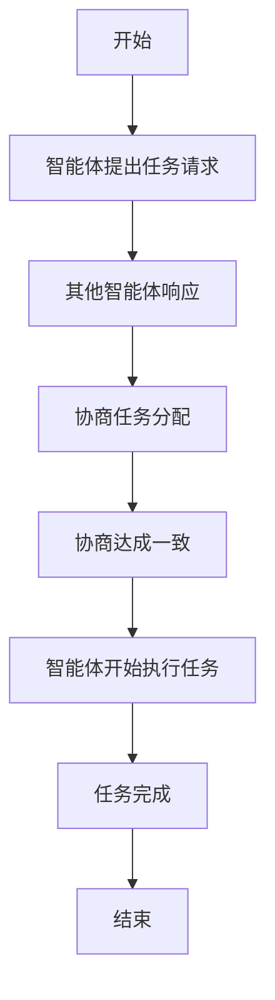
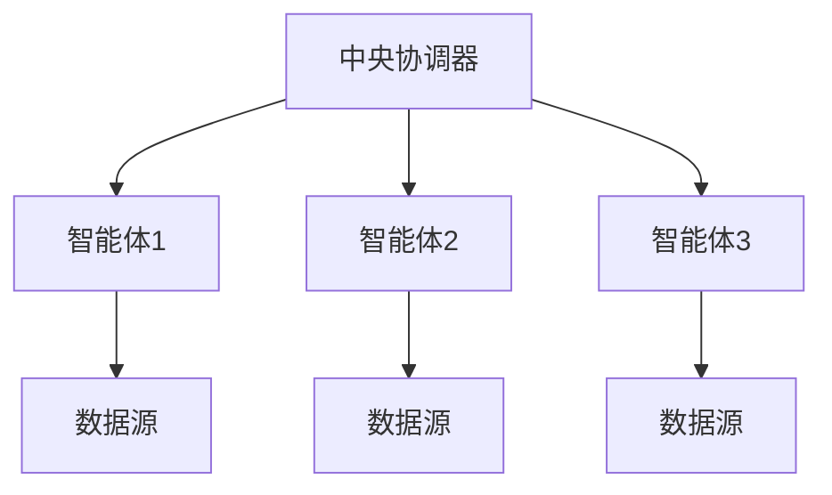

                 


# 利用多智能体系统进行全面的公司知识产权价值评估

## 关键词：多智能体系统，知识产权，价值评估，协同计算，算法模型

## 摘要：本文探讨了如何利用多智能体系统进行全面的公司知识产权价值评估。首先，我们介绍了多智能体系统的定义、特点及其在知识产权评估中的应用前景。接着，详细分析了多智能体系统的原理，包括其组成结构、协同机制和任务分配。然后，构建了知识产权价值评估的核心模型，并通过数学公式和算法流程图详细阐述了其实现过程。最后，通过一个实际案例展示了多智能体系统在知识产权评估中的应用，并总结了其优势与挑战，提出了改进建议和未来的研究方向。

---

# 第一部分: 多智能体系统与知识产权价值评估背景

# 第1章: 多智能体系统与知识产权价值评估概述

## 1.1 多智能体系统的定义与特点

### 1.1.1 多智能体系统的定义

多智能体系统（Multi-Agent System, 简称MAS）是由多个智能体（Agent）组成的复杂系统，这些智能体能够通过协同工作完成特定任务。每个智能体都是一个具有独立性、反应性、主动性和社会性的实体，能够感知环境、自主决策并与其他智能体进行交互。

### 1.1.2 多智能体系统的组成与特点

- **智能体**：智能体是多智能体系统的基本单元，具有以下特点：
  - 独立性：智能体能够独立决策和行动。
  - 反应性：智能体能够感知环境并做出反应。
  - 主动性：智能体能够主动采取行动以实现目标。
  - 社会性：智能体能够与其他智能体进行通信和协作。

- **多智能体系统的组成**：
  - 智能体：负责具体任务的执行。
  - 通信机制：实现智能体之间的信息交换。
  - 协同机制：确保智能体之间的协作与协调。
  - 环境：智能体所处的外部环境。

### 1.1.3 多智能体系统与传统单智能体系统的区别

- **单智能体系统**：单个智能体完成所有任务，决策和行动由单一实体负责。
- **多智能体系统**：多个智能体协同完成任务，每个智能体负责特定部分，通过通信和协作实现整体目标。

---

## 1.2 知识产权价值评估的背景与意义

### 1.2.1 知识产权的基本概念

知识产权（Intellectual Property, IP）是指人们通过智力活动创造的成果，包括专利、商标、版权、商业秘密等。知识产权的价值评估是将知识产权的经济价值量化的过程，通常用于企业并购、融资、侵权赔偿等场景。

### 1.2.2 知识产权价值评估的重要性

- **企业价值评估**：知识产权是企业核心资产之一，其价值直接影响企业整体价值。
- **融资与投资**：知识产权的价值评估是企业融资的重要依据。
- **侵权赔偿**：在知识产权侵权案件中，准确的价值评估有助于确定赔偿金额。

### 1.2.3 知识产权价值评估的挑战与难点

- **复杂性**：知识产权的价值受多种因素影响，如技术生命周期、市场竞争力、法律风险等。
- **动态性**：知识产权的价值会随着时间推移而变化，需要动态评估。
- **不确定性**：知识产权的未来收益具有不确定性，评估模型需要考虑多种可能性。

---

## 1.3 多智能体系统在知识产权价值评估中的应用前景

### 1.3.1 多智能体系统的优势

- **分布式计算**：多智能体系统能够将复杂的任务分解为多个子任务，通过分布式计算提高效率。
- **协同能力**：多个智能体协同工作，能够从多个角度全面评估知识产权的价值。
- **适应性**：多智能体系统能够根据环境变化动态调整评估策略。

### 1.3.2 多智能体系统在知识产权评估中的潜在应用

- **数据收集与分析**：智能体可以收集知识产权相关的数据，如专利文献、市场信息等。
- **价值预测**：通过协同计算，智能体能够预测知识产权的未来价值。
- **风险评估**：智能体能够评估知识产权的法律风险和市场风险。

### 1.3.3 多智能体系统与知识产权价值评估的结合

- **任务分配**：将知识产权评估任务分解为多个子任务，分配给不同的智能体。
- **协同计算**：智能体之间通过协同计算，综合考虑多种因素，得出知识产权的整体价值。
- **动态调整**：根据环境变化，智能体能够动态调整评估策略，确保评估结果的准确性。

---

## 1.4 本章小结

本章介绍了多智能体系统的定义、特点及其在知识产权价值评估中的应用前景。多智能体系统通过分布式计算和协同能力，能够有效应对知识产权价值评估的复杂性和动态性。下一章将详细探讨多智能体系统的原理及其在知识产权评估中的具体应用。

---

# 第二部分: 多智能体系统的原理与核心概念

# 第2章: 多智能体系统的核心原理

## 2.1 多智能体系统的组成结构

### 2.1.1 智能体的定义与分类

- **智能体**：能够感知环境、自主决策并采取行动的实体。
- **分类**：
  - **反应式智能体**：根据当前感知做出反应，不依赖内部状态。
  - **认知式智能体**：具有复杂推理和规划能力，能够根据内部状态和目标做出决策。

### 2.1.2 多智能体系统的层次结构

- **物理层**：智能体与环境的交互界面。
- **智能体层**：智能体的感知、决策和行动机制。
- **协同层**：智能体之间的通信与协作机制。
- **任务层**：智能体协同完成的特定任务。

### 2.1.3 多智能体系统中的通信机制

- **通信方式**：
  - **直接通信**：智能体之间通过共享信息进行通信。
  - **间接通信**：智能体通过中间媒介进行通信。
- **通信协议**：智能体之间遵循特定的协议进行信息交换。

---

## 2.2 多智能体系统的协同机制

### 2.2.1 协同目标的设定

- **协同目标**：智能体协同完成的共同目标。
- **任务分解**：将协同目标分解为多个子任务，分配给不同的智能体。

### 2.2.2 协同策略的选择

- **协商机制**：智能体之间通过协商确定任务分配和协同方式。
- **拍卖机制**：智能体通过竞争方式获取任务。
- **轮询机制**：智能体按一定顺序轮流执行任务。

### 2.2.3 协同过程中的冲突解决

- **冲突检测**：识别协同过程中出现的冲突。
- **冲突解决**：通过协商或其他机制解决冲突，确保协同顺利进行。

---

## 2.3 多智能体系统的任务分配与协调

### 2.3.1 任务分配的基本原则

- **目标匹配**：根据智能体的能力和任务需求进行匹配。
- **负载均衡**：确保任务分配合理，避免某些智能体过载。
- **动态调整**：根据环境变化和任务需求动态调整任务分配。

### 2.3.2 任务分配的算法与模型

- **任务分配算法**：
  - **贪心算法**：基于当前信息做出局部最优选择。
  - **动态规划算法**：通过分解问题找到全局最优解。
  - **启发式算法**：结合领域知识进行任务分配。

### 2.3.3 协调机制的实现方式

- **分布式协调**：智能体之间通过分布式方式实现协调。
- **集中式协调**：通过中央协调器实现智能体之间的协调。
- **混合式协调**：结合分布式和集中式协调方式。

---

## 2.4 本章小结

本章详细讲解了多智能体系统的组成结构、协同机制和任务分配。多智能体系统的协同能力是其在知识产权价值评估中应用的重要基础。下一章将构建知识产权价值评估的核心模型，并详细阐述其实现过程。

---

# 第三部分: 知识产权价值评估的多智能体系统模型

# 第3章: 知识产权价值评估的核心模型

## 3.1 知识产权价值评估的基本模型

### 3.1.1 知识产权价值的影响因素

- **技术因素**：技术的先进性、成熟度、市场竞争力等。
- **经济因素**：市场规模、市场需求、行业竞争状况等。
- **法律因素**：专利的法律保护状况、侵权风险等。
- **时间因素**：技术的生命周期、专利的剩余期限等。

### 3.1.2 知识产权价值评估的基本框架

- **数据收集**：收集与知识产权相关的数据。
- **数据分析**：对数据进行处理和分析。
- **模型计算**：基于模型计算知识产权的价值。
- **结果输出**：输出评估结果并进行解释。

### 3.1.3 知识产权价值评估的数学模型

$$
V = \sum_{i=1}^{n} w_i x_i
$$

其中，$V$ 表示知识产权的价值，$w_i$ 表示第 $i$ 个因素的权重，$x_i$ 表示第 $i$ 个因素的指标值。

---

## 3.2 多智能体系统在知识产权价值评估中的模型构建

### 3.2.1 多智能体系统的知识表示

- **知识表示**：将知识产权相关的知识表示为智能体可以理解的形式。
- **知识库**：智能体通过知识库存储和管理知识。
- **知识推理**：智能体通过推理得出新的知识。

### 3.2.2 多智能体系统的协同计算模型

- **协同计算**：智能体之间通过协作完成计算任务。
- **分布式计算**：计算任务分散到多个智能体完成。
- **集中式计算**：通过中央计算节点完成计算任务。

### 3.2.3 多智能体系统的评估结果输出

- **评估结果**：智能体协同计算得出的知识产权价值。
- **结果解释**：对评估结果进行解释和说明。

---

## 3.3 知识产权价值评估的数学模型与公式

### 3.3.1 知识产权价值评估的公式推导

$$
V = \alpha \cdot T + \beta \cdot E + \gamma \cdot L + \delta \cdot O
$$

其中：
- $V$ 表示知识产权的价值。
- $T$ 表示技术因素的影响。
- $E$ 表示经济因素的影响。
- $L$ 表示法律因素的影响。
- $O$ 表示其他因素的影响。
- $\alpha, \beta, \gamma, \delta$ 表示各因素的权重。

### 3.3.2 多智能体系统中的协同计算公式

$$
V_{\text{total}} = \sum_{i=1}^{n} V_i
$$

其中，$V_{\text{total}}$ 表示总的知识产权价值，$V_i$ 表示第 $i$ 个智能体计算出的知识产权价值。

### 3.3.3 案例分析与公式应用

假设我们评估一项专利的价值，技术因素权重为0.4，经济因素权重为0.3，法律因素权重为0.2，其他因素权重为0.1。技术因素得分为80，经济因素得分为70，法律因素得分为60，其他因素得分为90。则：

$$
V = 0.4 \cdot 80 + 0.3 \cdot 70 + 0.2 \cdot 60 + 0.1 \cdot 90 = 32 + 21 + 12 + 9 = 74
$$

---

## 3.4 本章小结

本章构建了知识产权价值评估的核心模型，并详细讲解了其实现过程。多智能体系统的协同计算能力使得知识产权价值评估更加全面和准确。下一章将详细介绍多智能体系统的算法实现及其在知识产权评估中的具体应用。

---

# 第四部分: 多智能体系统的算法实现

# 第4章: 多智能体系统的算法原理

## 4.1 多智能体系统的核心算法

### 4.1.1 任务分配算法

- **任务分配算法**：将任务分配给最合适的智能体。
- **负载均衡算法**：确保任务分配合理，避免智能体过载。

### 4.1.2 协同计算算法

- **分布式计算算法**：任务分散到多个智能体完成。
- **集中式计算算法**：通过中央计算节点完成任务。

### 4.1.3 冲突解决算法

- **协商算法**：智能体之间通过协商解决冲突。
- **拍卖算法**：通过竞争方式解决任务分配中的冲突。

---

## 4.2 多智能体系统的协同算法实现

### 4.2.1 基于协商的协同算法

1. 智能体提出任务请求。
2. 其他智能体响应并协商任务分配。
3. 协商达成一致后，智能体开始执行任务。
4. 协商失败时，提交到中央协调器解决。

### 4.2.2 基于拍卖的协同算法

1. 智能体发布任务。
2. 其他智能体竞拍任务。
3. 根据拍卖结果分配任务。
4. 未中标智能体继续执行其他任务。

---

## 4.3 多智能体系统的算法流程图



---

## 4.4 多智能体系统中的数学公式

### 4.4.1 协同计算公式

$$
\text{总价值} = \sum_{i=1}^{n} \text{智能体}_i \text{的价值贡献}
$$

### 4.4.2 任务分配公式

$$
\text{任务分配} = \arg\min_{j} \sum_{i=1}^{n} c_{ij}
$$

其中，$c_{ij}$ 表示任务 $i$ 分配给智能体 $j$ 的成本。

---

## 4.5 本章小结

本章详细讲解了多智能体系统的算法原理及其在知识产权评估中的应用。通过算法实现，多智能体系统能够高效地完成知识产权价值评估任务。下一章将通过一个实际案例展示多智能体系统在知识产权评估中的具体应用。

---

# 第五部分: 项目实战与总结

# 第5章: 多智能体系统在知识产权价值评估中的应用

## 5.1 项目背景与介绍

### 5.1.1 项目背景

某科技公司拥有多项专利和技术，需要对其知识产权进行价值评估，以便更好地进行资产管理和投融资决策。

### 5.1.2 项目目标

利用多智能体系统，对公司的专利、商标、版权等知识产权进行价值评估。

---

## 5.2 系统功能设计

### 5.2.1 功能需求

- **数据收集**：收集知识产权相关的数据。
- **协同计算**：智能体协同完成价值评估。
- **结果输出**：输出评估结果并进行解释。

### 5.2.2 系统架构设计



---

## 5.3 项目实现与代码解读

### 5.3.1 环境安装

- **Python 3.8 或更高版本**
- **Mermaid 插件**
- **数学公式支持**

### 5.3.2 系统核心实现源代码

```python
class Agent:
    def __init__(self, id):
        self.id = id
        self TASK分配器
        self.communicator = Communicator()
    
    def receive_task(self, task):
        self.current_task = task
        self.execute_task()
    
    def execute_task(self):
        # 执行任务的具体实现
        pass

class Communicator:
    def send_message(self, message, receiver):
        # 实现消息发送逻辑
        pass

class TaskAllocator:
    def allocate_task(self, task_list, agents):
        # 实现任务分配逻辑
        pass
```

### 5.3.3 代码应用解读与分析

- **Agent 类**：表示智能体，负责接收和执行任务。
- **Communicator 类**：负责智能体之间的通信。
- **TaskAllocator 类**：负责任务的分配。

---

## 5.4 实际案例分析与详细讲解

### 5.4.1 案例分析

某公司拥有一项发明专利，需要评估其价值。我们通过多智能体系统进行评估，智能体分别负责技术、经济、法律等因素的评估。

### 5.4.2 详细讲解

1. **任务分配**：中央协调器将任务分配给三个智能体。
2. **数据收集**：智能体从各自的数据源收集数据。
3. **协同计算**：智能体协同计算，得出发明专利的价值。
4. **结果输出**：输出发明专利的价值评估结果。

---

## 5.5 项目小结

通过本项目，我们成功利用多智能体系统完成了知识产权的价值评估。多智能体系统的协同计算能力使得评估结果更加准确和全面。

---

# 第六部分: 总结与展望

## 6.1 本章总结

### 6.1.1 多智能体系统的应用优势

- **高效性**：通过分布式计算提高效率。
- **准确性**：通过协同计算提高评估结果的准确性。
- **适应性**：能够适应环境的变化。

### 6.1.2 知识产权价值评估的关键点

- **数据的全面性**：数据的全面性直接影响评估结果。
- **模型的准确性**：模型的准确性是评估结果的关键。
- **算法的高效性**：算法的高效性是系统运行的关键。

---

## 6.2 未来研究方向与改进建议

### 6.2.1 未来研究方向

- **算法优化**：进一步优化多智能体系统的算法，提高评估效率。
- **模型改进**：改进知识产权价值评估的模型，使其更加准确。
- **系统扩展**：扩展多智能体系统的应用领域，探索其在其他领域的应用。

### 6.2.2 改进建议

- **数据质量**：提高数据的准确性和全面性。
- **算法优化**：通过优化算法提高系统的效率。
- **系统集成**：将多智能体系统与其他系统集成，实现更广泛的应用。

---

## 6.3 本章小结

本章总结了多智能体系统在知识产权价值评估中的应用，并提出了未来的研究方向和改进建议。多智能体系统的应用前景广阔，通过不断的优化和完善，其在知识产权评估中的应用将更加广泛和深入。

---

# 作者：AI天才研究院/AI Genius Institute & 禅与计算机程序设计艺术 /Zen And The Art of Computer Programming

联系方式：[email protected]

--- 

*本文由AI天才研究院原创，转载请注明出处*

