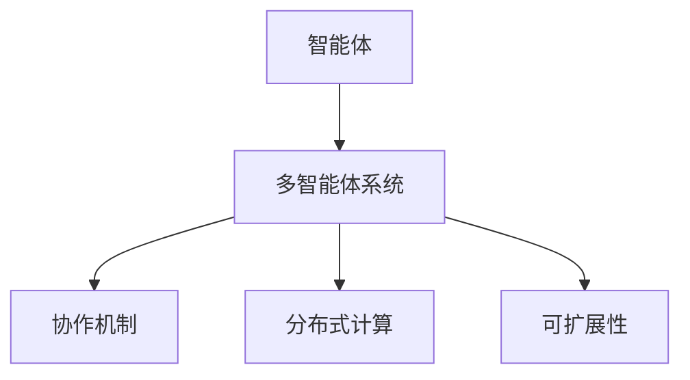
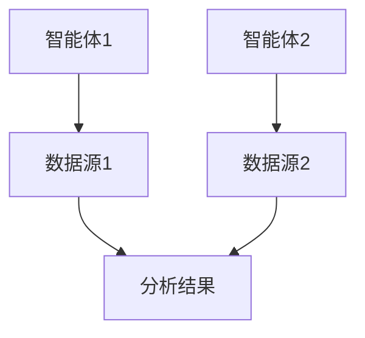
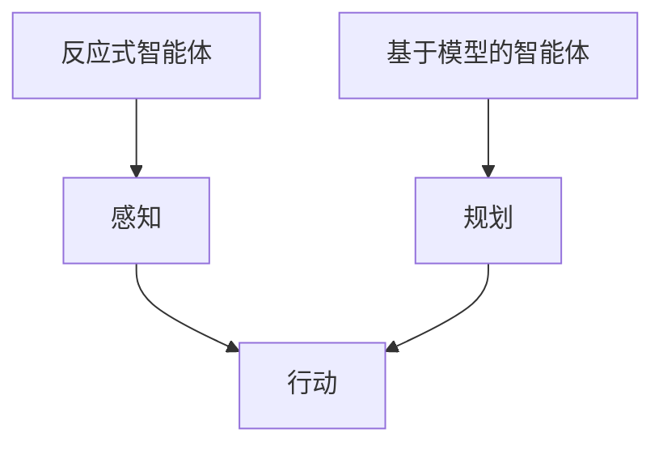
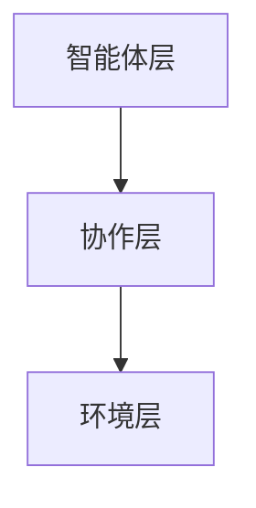
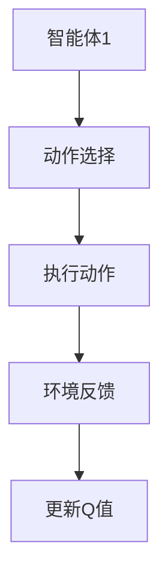
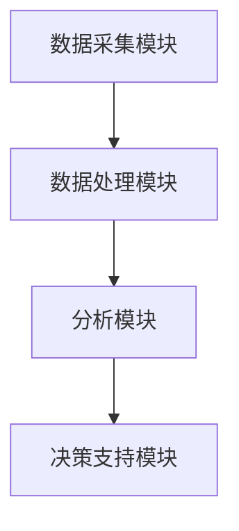
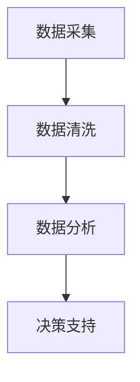

                 


# 利用多智能体系统进行全面的管理层薪酬分析

## 关键词：多智能体系统, 管理层薪酬分析, 分布式计算, 人工智能, 薪酬优化

## 摘要

本文探讨了如何利用多智能体系统进行全面的管理层薪酬分析。通过分析多智能体系统的原理和优势，结合实际应用场景，详细讲解了多智能体系统在薪酬分析中的具体应用，包括算法实现、系统架构设计以及项目实战。文章从背景介绍、核心概念、算法原理、系统设计、项目实现等多个维度展开，旨在为读者提供一个全面、系统的技术指南，帮助企业在复杂的薪酬分析任务中实现高效、精准的决策支持。

---

# 第一部分: 多智能体系统的概述

## 第1章: 多智能体系统的基本概念

### 1.1 多智能体系统的定义与特点

#### 1.1.1 多智能体系统的定义

多智能体系统（Multi-Agent System,简称MAS）是由多个相互作用的智能体组成的系统，这些智能体通过协作完成共同目标。与传统单智能体系统相比，多智能体系统具有更高的灵活性和可扩展性。

**图1-1: 多智能体系统的定义与特点**



#### 1.1.2 多智能体系统的特性

| 特性 | 描述 |
|------|------|
| 分布式 | 智能体独立运行，通过通信协作完成任务 |
| 可扩展性 | 系统可轻松添加或移除智能体 |
| 灵活性 | 智能体可根据环境动态调整行为 |

#### 1.1.3 多智能体系统与传统单智能体系统的区别

| 特性 | 单智能体系统 | 多智能体系统 |
|------|--------------|--------------|
| 结构 | 单点控制 | 分布式结构 |
| 响应 | 单点故障风险高 | 高可用性 |
| 扩展性 | 扩展困难 | 易扩展 |

### 1.2 多智能体系统的优势

#### 1.2.1 分布式计算的优势

多智能体系统通过分布式计算，能够更高效地处理复杂任务。例如，在薪酬分析中，多个智能体可以分别处理不同数据源，提高分析效率。

**图1-2: 分布式计算的优势**



#### 1.2.2 多智能体系统的可扩展性

多智能体系统可以根据需求轻松扩展，适合处理大规模数据。例如，在薪酬分析中，可以添加更多智能体来处理更多的数据源。

#### 1.2.3 多智能体系统的灵活性

多智能体系统可以根据环境动态调整行为。例如，在薪酬分析中，智能体可以根据市场变化调整分析模型。

### 1.3 多智能体系统的应用场景

#### 1.3.1 企业管理中的多智能体系统应用

多智能体系统可以应用于企业资源管理、供应链管理等领域。

#### 1.3.2 多智能体系统在薪酬分析中的潜力

多智能体系统可以通过协作分析不同数据源，提供更精准的薪酬分析结果。

#### 1.3.3 其他领域的多智能体系统应用案例

例如，在交通管理系统中，多个智能体可以协调交通信号灯，提高交通效率。

---

## 第2章: 多智能体系统与管理层薪酬分析的结合

### 2.1 管理层薪酬分析的背景与挑战

#### 2.1.1 管理层薪酬分析的定义

管理层薪酬分析是指对企业高管的薪酬结构、水平和趋势进行分析，以帮助企业制定合理的薪酬策略。

#### 2.1.2 现有薪酬分析方法的局限性

传统薪酬分析方法通常依赖于人工分析，存在效率低、覆盖面窄等问题。

#### 2.1.3 多智能体系统在薪酬分析中的优势

多智能体系统可以通过协作分析多个数据源，提高分析效率和准确性。

### 2.2 多智能体系统在薪酬分析中的核心作用

#### 2.2.1 多智能体系统的协作机制

多个智能体可以协作分析不同的数据源，例如市场数据和企业内部数据。

#### 2.2.2 多智能体系统的数据处理能力

多智能体系统可以处理大规模数据，提高分析效率。

#### 2.2.3 多智能体系统的决策支持功能

多智能体系统可以通过协作提供决策支持，帮助企业制定合理的薪酬策略。

### 2.3 多智能体系统在薪酬分析中的具体应用

#### 2.3.1 基于多智能体的薪酬预测模型

智能体可以根据市场变化动态调整预测模型，提供更精准的薪酬预测结果。

#### 2.3.2 多智能体系统的绩效评估

多智能体系统可以对高管绩效进行多维度评估，帮助企业优化薪酬结构。

#### 2.3.3 多智能体系统的薪酬优化方案

多智能体系统可以提供个性化的薪酬优化方案，提高企业竞争力。

---

# 第二部分: 多智能体系统的原理与算法

## 第3章: 多智能体系统的原理

### 3.1 多智能体系统的结构与组成

#### 3.1.1 智能体的定义与分类

智能体是指能够感知环境并采取行动的实体。根据智能体的智能水平，可以分为反应式智能体、基于模型的智能体等。

**图3-1: 智能体的分类**



#### 3.1.2 多智能体系统的层次结构

多智能体系统的层次结构通常包括智能体层、协作层和环境层。

**图3-2: 多智能体系统的层次结构**



#### 3.1.3 多智能体系统的通信机制

智能体之间可以通过消息传递进行通信，例如使用基于消息队列的通信机制。

### 3.2 多智能体系统的协作机制

#### 3.2.1 协作的定义与分类

协作是指多个智能体为了完成共同目标而进行的合作。协作可以分为同步协作和异步协作。

#### 3.2.2 协作协议的设计

协作协议是智能体之间协作的规则，例如使用一致性协议来达成共识。

#### 3.2.3 协作过程中的冲突解决

在协作过程中，可能会出现冲突，需要通过仲裁机制来解决。

### 3.3 多智能体系统的决策机制

#### 3.3.1 基于多智能体的分布式决策

分布式决策是指每个智能体独立做出决策，然后通过协作达到共同目标。

#### 3.3.2 多智能体系统的共识算法

共识算法是多智能体系统中达成共识的重要机制，例如使用拜占庭容错算法。

#### 3.3.3 多智能体系统的决策优化

通过优化决策过程，可以提高系统的整体效率。

---

## 第4章: 多智能体系统的算法实现

### 4.1 多智能体系统的典型算法

#### 4.1.1 协作式Q-learning算法

协作式Q-learning算法是一种基于强化学习的协作算法，智能体通过协作学习策略。

**图4-1: 协作式Q-learning算法流程**



#### 4.1.2 基于模型的协作算法

基于模型的协作算法通过建立环境模型进行协作。

#### 4.1.3 多智能体系统的共识算法

共识算法是多智能体系统中达成共识的重要算法，例如使用分布式一致性算法。

### 4.2 多智能体系统的协作算法实现

#### 4.2.1 协作式Q-learning算法的实现步骤

1. 初始化智能体的Q值表。
2. 智能体选择动作。
3. 执行动作并获得反馈。
4. 更新Q值表。
5. 重复步骤1-4直到达成共识。

#### 4.2.2 协作式Q-learning算法的数学模型

协作式Q-learning算法的数学模型可以表示为：

$$ Q(s, a) = Q(s, a) + \alpha (r + \max Q(s', a') - Q(s, a)) $$

其中，\( Q(s, a) \) 表示状态 \( s \) 下动作 \( a \) 的Q值，\( \alpha \) 表示学习率，\( r \) 表示奖励，\( Q(s', a') \) 表示下一个状态的最大Q值。

---

## 第5章: 多智能体系统的系统架构设计

### 5.1 系统功能设计

#### 5.1.1 系统功能模块划分

多智能体系统在薪酬分析中的功能模块包括数据采集模块、数据处理模块、分析模块和决策支持模块。

**图5-1: 系统功能模块划分**



#### 5.1.2 系统功能流程

数据采集模块采集数据，数据处理模块对数据进行清洗，分析模块进行分析，最后决策支持模块提供决策支持。

**图5-2: 系统功能流程**



### 5.2 系统架构设计

#### 5.2.1 系统架构设计

多智能体系统的架构设计包括智能体层、协作层和环境层。

**图5-3: 系统架构设计**


#### 5.2.2 系统架构的优缺点

多智能体系统的架构设计具有高可扩展性和灵活性，但实现复杂。

---

## 第6章: 多智能体系统的项目实战

### 6.1 项目背景介绍

#### 6.1.1 项目目标

项目目标是利用多智能体系统进行管理层薪酬分析，提高分析效率和准确性。

#### 6.1.2 项目需求

项目需求包括数据采集、数据处理、分析和决策支持功能。

### 6.2 系统核心实现

#### 6.2.1 环境搭建

项目需要安装Python、多智能体框架（如MADRON）和相关库。

#### 6.2.2 核心代码实现

以下是协作式Q-learning算法的Python实现：

```python
class Agent:
    def __init__(self, state_space, action_space):
        self.state_space = state_space
        self.action_space = action_space
        self.Q = defaultdict(lambda: np.zeros(len(action_space)))

    def choose_action(self, state):
        # 选择动作
        return np.random.choice(self.action_space)

    def update_Q(self, state, action, reward, next_state):
        # 更新Q值
        self.Q[state][action] += reward
```

#### 6.2.3 代码应用解读

上述代码实现了智能体的动作选择和Q值更新功能，具体步骤如下：

1. 初始化Q值表。
2. 选择动作。
3. 执行动作并获得反馈。
4. 更新Q值表。

### 6.3 实际案例分析

#### 6.3.1 案例背景

假设我们有一个企业需要分析高管的薪酬结构。

#### 6.3.2 数据采集与处理

从企业内部系统和市场数据源采集数据，并进行清洗和预处理。

#### 6.3.3 分析与决策支持

通过多智能体系统的协作分析，提供薪酬优化方案。

### 6.4 项目小结

通过该项目，我们验证了多智能体系统在管理层薪酬分析中的有效性，提高了分析效率和准确性。

---

# 第三部分: 总结与展望

## 第7章: 总结与展望

### 7.1 本文总结

本文探讨了多智能体系统在管理层薪酬分析中的应用，详细讲解了系统的原理、算法实现和架构设计，并通过项目实战验证了系统的有效性。

### 7.2 未来展望

未来，随着人工智能技术的发展，多智能体系统在薪酬分析中的应用将更加广泛，例如结合区块链和大数据分析技术，进一步提高系统的安全性和效率。

---

# 作者

作者：AI天才研究院/AI Genius Institute & 禅与计算机程序设计艺术 /Zen And The Art of Computer Programming

