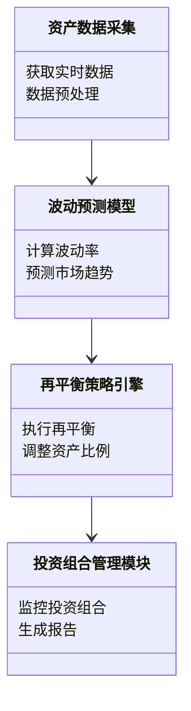
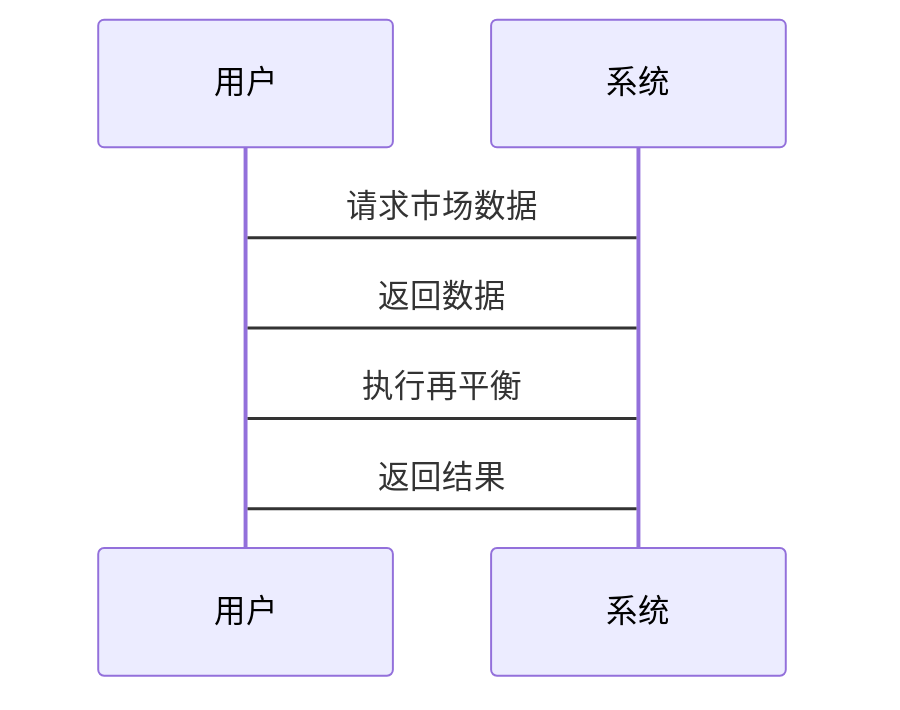

                 


```markdown
# 利用市场波动重新平衡资产配置的策略

> 关键词：资产配置、市场波动、风险管理、投资策略、量化分析、再平衡策略、系统设计

> 摘要：本文详细探讨了在市场波动的背景下，如何通过重新平衡资产配置来优化投资组合。文章从市场波动的定义与特征出发，分析了资产配置的基本原理和各类资产的风险收益特性。接着，深入探讨了市场波动的量化方法及其对资产配置的影响，提出了基于市场波动的再平衡策略模型。最后，通过系统设计与实现，结合实际案例，展示了如何利用技术手段实现自动化的资产再平衡系统。本文旨在为投资者提供一套科学的资产配置与风险管理方法。

---

## 第一部分：引言

### 第1章：市场波动与资产配置概述

#### 1.1 市场波动的定义与特征
##### 1.1.1 市场波动的定义
市场波动是指资产价格在短期内的剧烈波动，通常由市场参与者的心理预期、经济数据发布、政策变化等因素引起。

##### 1.1.2 市场波动的特征
市场波动具有周期性、不对称性和不可预测性。波动性较高的市场通常伴随着高风险和高回报。

##### 1.1.3 市场波动对投资的影响
市场波动对投资者的影响是双重的。一方面，波动提供了套利机会；另一方面，过度的波动可能导致投资组合的损失。

#### 1.2 资产配置的基本概念
##### 1.2.1 资产配置的定义
资产配置是指将资金分配到不同的资产类别（如股票、债券、商品等）中，以实现风险分散和收益最大化。

##### 1.2.2 资产配置的重要性
资产配置是投资组合管理的核心，它决定了投资组合的风险和收益特征。

##### 1.2.3 资产配置的类型
资产配置主要分为战略性资产配置和战术性资产配置。战略性配置是长期的，而战术性配置则是短期的、基于市场波动的调整。

#### 1.3 重新平衡资产配置的意义
##### 1.3.1 资产配置失衡的原因
市场波动可能导致某些资产的表现优于其他资产，从而导致初始资产配置偏离目标比例。

##### 1.3.2 重新平衡的必要性
定期重新平衡可以确保投资组合的风险和收益特征与初始目标一致。

##### 1.3.3 重新平衡的目标
通过再平衡，投资者可以在市场波动中捕捉收益机会，同时降低风险。

---

## 第二部分：资产配置策略的基础

### 第2章：资产类别与风险收益特征

#### 2.1 资产类别与风险收益特征
##### 2.1.1 股票、债券、商品等资产的特点
- **股票**：高风险、高收益。
- **债券**：低风险、稳定收益。
- **商品**：如黄金、原油，具有避险功能。

##### 2.1.2 不同资产类别的风险与收益对比
通过对比不同资产的风险收益比，投资者可以做出更明智的配置决策。

#### 2.2 现代投资组合理论（MPT）
##### 2.2.1 MPT的核心思想
MPT强调通过分散投资来降低风险，同时优化收益。

##### 2.2.2 有效前沿的概念
有效前沿是指在给定风险下，能够提供最高收益的投资组合。

##### 2.2.3 风险与收益的最优组合
通过计算各资产的协方差矩阵，构建最优投资组合。

#### 2.3 市场波动与资产配置的关系
##### 2.3.1 市场波动对资产配置的影响
市场波动会导致资产价格的剧烈波动，进而影响投资组合的风险和收益。

##### 2.3.2 资产配置如何应对市场波动
通过动态调整资产配置比例，投资者可以在市场波动中保持投资组合的稳定性。

---

## 第三部分：市场波动的量化与分析

### 第3章：市场波动的量化指标

#### 3.1 市场波动的量化指标
##### 3.1.1 波动率
波动率是衡量资产价格波动程度的重要指标，通常用标准差表示。

##### 3.1.2 需求与供给变化
市场需求和供给的变化会影响资产价格，进而影响市场波动。

##### 3.1.3 市场参与者的预期
市场参与者的预期变化是导致市场波动的重要因素。

#### 3.2 市场波动的量化方法
##### 3.2.1 量化波动的步骤
1. 数据收集：获取相关资产的历史价格数据。
2. 计算波动率：使用标准差或波动率指标。
3. 分析波动原因：结合市场数据和新闻事件。

#### 3.3 技术分析工具
##### 3.3.1 移动平均线
移动平均线可以帮助投资者识别市场的趋势。

##### 3.3.2 布林格带
布林格带用于判断市场的超买或超卖状态。

##### 3.3.3 相对强弱指数（RSI）
RSI用于衡量资产的超买或超卖状态。

---

## 第四部分：重新平衡资产配置的策略

### 第4章：再平衡策略模型

#### 4.1 动态再平衡策略
##### 4.1.1 动态再平衡的定义
动态再平衡是指根据市场波动实时调整资产配置比例。

##### 4.1.2 动态再平衡的实现方法
1. 定期审查投资组合。
2. 根据市场波动调整权重。

#### 4.2 基于模型的再平衡策略
##### 4.2.1 基于波动率的模型
根据波动率的变化调整资产配置比例。

##### 4.2.2 基于均值-方差优化的模型
使用均值-方差优化模型进行再平衡。

#### 4.3 基于规则的再平衡策略
##### 4.3.1 简单的再平衡规则
如定期将资产比例调整回目标配置。

##### 4.3.2 复杂的再平衡规则
如根据市场趋势调整再平衡频率。

---

## 第五部分：系统设计与实现

### 第5章：系统架构设计

#### 5.1 问题场景介绍
##### 5.1.1 系统目标
构建一个自动化的资产再平衡系统。

##### 5.1.2 系统功能
包括数据采集、波动预测、策略执行等。

#### 5.2 系统功能设计
##### 5.2.1 领域模型
使用Mermaid类图展示系统模块划分。



##### 5.2.2 系统架构
使用Mermaid架构图展示系统整体架构。


##### 5.2.3 系统交互设计
使用Mermaid序列图展示用户与系统之间的交互。



---

## 第六部分：项目实战

### 第6章：环境安装与系统实现

#### 6.1 环境安装
##### 6.1.1 安装Python
安装Python 3.8以上版本。

##### 6.1.2 安装相关库
安装pandas、numpy、scipy等库。

#### 6.2 核心实现
##### 6.2.1 波动率计算
使用pandas计算资产的波动率。

##### 6.2.2 再平衡策略实现
基于波动率调整资产配置比例。

#### 6.3 代码示例
##### 6.3.1 波动率计算
```python
import pandas as pd
import numpy as np

def calculate_volatility(prices):
    returns = prices.pct_change()
    volatility = returns.std() * np.sqrt(252)
    return volatility
```

##### 6.3.2 再平衡策略
```python
def rebalance_portfolio(weights, current_weights, target_volatility):
    # 计算当前波动率
    current_volatility = calculate_volatility(prices)
    # 调整权重
    if current_volatility > target_volatility:
        # 减少高波动资产
        weights = adjust_weights(weights, 'reduce')
    else:
        # 增加低波动资产
        weights = adjust_weights(weights, 'increase')
    return weights
```

#### 6.4 案例分析
##### 6.4.1 环境配置
详细说明如何配置开发环境。

##### 6.4.2 代码实现
展示完整的代码实现，并进行详细解读。

##### 6.4.3 测试与分析
测试系统的稳定性和准确性。

---

## 第七部分：总结与展望

### 第7章：最佳实践与总结

#### 7.1 最佳实践
##### 7.1.1 定期审查投资组合
建议投资者定期审查和调整资产配置。

##### 7.1.2 监控市场波动
使用技术工具实时监控市场波动。

#### 7.2 项目总结
##### 7.2.1 项目成果
成功构建了一个自动化的资产再平衡系统。

##### 7.2.2 经验与教训
总结项目中的经验和教训。

#### 7.3 未来展望
##### 7.3.1 拓展研究
进一步研究更复杂的波动预测模型。

##### 7.3.2 持续优化
持续优化再平衡策略，提高系统的稳定性和收益能力。

---

## 作者信息

作者：AI天才研究院/AI Genius Institute & 禅与计算机程序设计艺术 /Zen And The Art of Computer Programming

---

感谢您的阅读！希望本文对您在资产配置和风险管理方面有所帮助。如需进一步探讨或合作，请随时联系。
```

