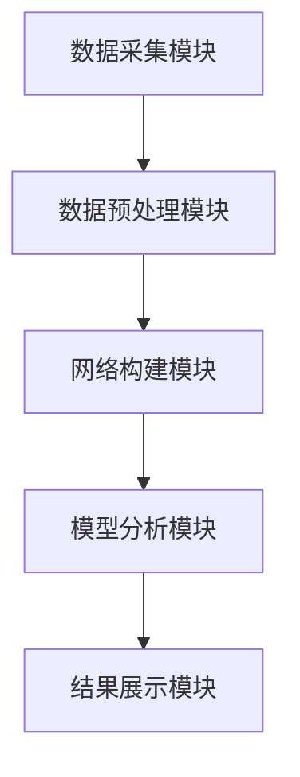

                 

# 利用智能体网络分析公司在产业链中的地位变化

## 关键词：智能体网络，产业链分析，企业地位变化，网络分析，商业智能

## 摘要：  
随着全球商业环境的日益复杂化，企业之间的竞争不仅仅体现在产品和服务上，更体现在整个产业链中的协同合作与价值分配。如何准确分析一家公司在产业链中的地位变化，对于企业制定战略决策至关重要。本文将介绍一种基于智能体网络的分析方法，通过构建智能体网络模型，利用网络分析技术，量化企业在产业链中的核心竞争力、协同效应和价值分配能力，从而帮助企业更好地理解自身在产业链中的位置，并制定相应的战略调整措施。

---

## 第1章: 智能体网络与产业链分析概述

### 1.1 智能体网络的基本概念  
智能体网络是一种将企业、供应商、客户等产业生态中的实体作为网络节点，通过实体间的互动关系（如供应链关系、协同合作关系）构建的网络结构。每个节点代表一个“智能体”，能够根据外部环境的变化调整自身的行为和策略。

#### 1.1.1 智能体的定义与特点  
智能体是指具有感知环境、做出决策、执行动作能力的主体。在商业场景中，智能体可以是企业、供应商、客户、合作伙伴等。智能体具有以下特点：  
- **主动性**：能够主动感知环境并采取行动。  
- **反应性**：能够根据环境变化调整自身行为。  
- **社会性**：能够与其他智能体进行交互和协作。  

#### 1.1.2 网络分析的基本原理  
网络分析是一种通过图论方法研究网络结构和节点关系的技术。在智能体网络中，节点代表智能体，边代表智能体之间的关系（如供应链关系、协同合作关系）。通过分析网络的结构特征（如节点度、中心性、聚类性），可以量化每个智能体在网络中的重要性。

#### 1.1.3 智能体网络在企业分析中的应用价值  
智能体网络可以帮助企业分析其在产业链中的地位，包括：  
- **核心竞争力分析**：通过节点度和中心性指标，量化企业在产业链中的影响力。  
- **协同效应分析**：通过网络的聚类性和模块化分析，识别企业与其他企业的协同关系。  
- **风险评估**：通过网络结构分析，识别企业在产业链中的关键节点位置，评估潜在风险。  

### 1.2 产业链分析的背景与意义  
#### 1.2.1 产业链的基本构成  
产业链是指从原材料供应到产品最终交付的完整价值链。一个典型的产业链包括：  
- **上游**：原材料供应商、设备供应商等。  
- **中游**：制造企业、服务提供商等。  
- **下游**：分销商、零售商、终端客户等。  

#### 1.2.2 企业地位变化的分析需求  
随着市场环境的变化（如技术进步、政策调整、市场需求变化），企业在全球产业链中的地位可能发生变化。通过分析企业地位的变化，可以帮助企业制定战略调整措施，优化资源配置，提升竞争力。

#### 1.2.3 智能体网络在产业链分析中的优势  
智能体网络通过构建产业链中的实体关系网络，量化企业在产业链中的位置和价值。与传统的产业链分析方法相比，智能体网络具有以下优势：  
- **可视化**：通过网络图直观展示企业与其他企业的关系。  
- **量化分析**：通过网络分析指标（如度、中心性）量化企业的影响力和协同能力。  
- **动态分析**：通过动态更新网络结构，分析企业在不同时间点的网络位置变化。  

### 1.3 本章小结  
本章介绍了智能体网络的基本概念和网络分析的基本原理，并重点阐述了智能体网络在企业产业链分析中的应用价值和优势。通过构建智能体网络，企业可以更好地理解自身在全球产业链中的位置，并制定相应的战略调整措施。

---

## 第2章: 智能体网络的核心概念与联系  

### 2.1 智能体网络的实体关系分析  
智能体网络的实体关系分析是构建智能体网络模型的基础。通过分析实体之间的关系，可以构建网络的边和权重。

#### 2.1.1 实体关系图（ER图）的构建  
实体关系图是一种用于描述实体及其关系的工具。在智能体网络中，实体关系图可以帮助我们理解不同实体之间的关系类型。

##### 实体关系对比表格  
以下是几种常见的实体关系类型及其特点对比：

| 关系类型 | 描述 | 特点 |  
|----------|------|------|  
| 供应链关系 | 实体之间的直接供应关系 | 单向、有向 |  
| 协同合作关系 | 实体之间的协同合作关系 | 双向、无向 |  
| 竞争关系 | 实体之间的竞争关系 | 双向、有向 |  

#### 2.1.2 实体间的关系类型  
智能体网络中的关系类型可以分为以下几类：  
- **供应链关系**：A向B提供原材料或服务。  
- **协同合作关系**：A和B在某项任务上进行合作。  
- **竞争关系**：A和B在同一个市场中竞争。  

#### 2.1.3 智能体网络的实体属性分析  
实体属性分析是指对网络中的每个实体进行属性描述，例如企业的行业属性、企业规模、地理位置等。通过实体属性分析，可以进一步细化网络分析的维度。

### 2.2 智能体网络的网络结构分析  
智能体网络的网络结构分析是通过图论方法研究网络的结构特征，例如节点度、中心性、聚类性等。

#### 2.2.1 网络的度、中心性与聚类分析  
- **节点度**：节点的度表示节点与其他节点的连接数量。  
- **中心性**：中心性表示节点在网络中的重要性。  
- **聚类性**：聚类性表示网络中节点的聚集程度。  

#### 2.2.2 网络的层次结构与模块化分析  
通过层次结构分析和模块化分析，可以识别网络中的核心模块和边缘模块。核心模块表示网络中的关键部分，边缘模块表示网络的外围部分。

### 2.3 智能体网络的核心要素对比分析  
通过核心要素对比分析，可以更好地理解智能体网络中的实体关系和网络结构。

#### 2.3.1 实体属性对比表格  
以下是几种常见的实体属性及其特点对比：

| 实体属性 | 描述 | 特点 |  
|----------|------|------|  
| 行业属性 | 企业的行业类型 | 分类属性 |  
| 企业规模 | 企业的员工数量或年收入 | 数量属性 |  
| 地理位置 | 企业的地理位置 | 地理属性 |  

#### 2.3.2 实体关系与网络结构的综合分析  
通过综合分析实体关系和网络结构，可以更好地理解智能体网络的复杂性。

### 2.4 本章小结  
本章详细介绍了智能体网络的核心概念和网络结构分析方法，并通过实体属性对比表格和网络结构分析，帮助读者更好地理解智能体网络的复杂性。

---

## 第3章: 智能体网络的算法原理  

### 3.1 社会网络分析算法  
社会网络分析算法是智能体网络分析的重要组成部分。

#### 3.1.1 PageRank算法原理  
PageRank算法是一种基于节点度的排序算法。通过计算节点的PageRank值，可以量化节点的重要性。

##### PageRank公式  
$$ PR(i) = \sum_{j} \frac{PR(j)}{OutDegree(j)} $$  

#### 3.1.2 同类节点相似度计算  
同类节点相似度计算是指通过节点的属性相似度计算节点之间的关系。

##### 层次分析法  
层次分析法是一种用于计算节点相似度的方法。

### 3.2 链路分析与路径优化算法  
链路分析与路径优化算法是智能体网络分析的重要工具。

#### 3.2.1 链路分析的基本原理  
链路分析是指通过分析网络的边权重，量化节点之间的关系强度。

#### 3.2.2 最短路径算法  
最短路径算法是指通过计算网络中的最短路径，确定节点之间的最优路径。

### 3.3 实体关系挖掘算法  
实体关系挖掘算法是指通过数据挖掘技术，识别实体之间的关系。

#### 3.3.1 实体关系抽取算法  
实体关系抽取算法是指通过自然语言处理技术，识别文本中的实体关系。

#### 3.3.2 关系网络构建算法  
关系网络构建算法是指通过数据挖掘技术，构建实体之间的关系网络。

### 3.4 本章小结  
本章详细介绍了智能体网络的算法原理，包括社会网络分析算法、链路分析与路径优化算法、实体关系挖掘算法等。

---

## 第4章: 智能体网络的系统分析与架构设计  

### 4.1 系统功能设计  
智能体网络分析系统的功能设计包括数据采集、数据预处理、网络构建、模型分析和结果展示。

#### 4.1.1 数据采集模块  
数据采集模块是指通过爬虫技术或API接口，采集产业链中的实体数据。

#### 4.1.2 数据预处理模块  
数据预处理模块是指对采集到的数据进行清洗和转换，确保数据的准确性和一致性。

#### 4.1.3 网络构建模块  
网络构建模块是指通过实体关系数据，构建智能体网络。

#### 4.1.4 模型分析模块  
模型分析模块是指通过网络分析算法，量化企业的网络位置和价值。

#### 4.1.5 结果展示模块  
结果展示模块是指通过可视化工具，展示企业的网络位置和价值。

### 4.2 系统架构设计  
系统架构设计是指通过模块化设计，构建智能体网络分析系统的整体架构。

#### 4.2.1 系统架构图  
以下是智能体网络分析系统的架构图：

### 4.3 本章小结  
本章详细介绍了智能体网络分析系统的功能设计和系统架构设计，为后续的系统实现提供了理论基础。

---

## 第5章: 智能体网络的项目实战  

### 5.1 项目背景与目标  
项目背景是指企业希望通过智能体网络分析，了解自身在全球产业链中的位置和价值。

### 5.2 项目实施步骤  
项目实施步骤包括数据采集、数据预处理、网络构建、模型分析和结果展示。

#### 5.2.1 数据采集与预处理  
通过爬虫技术采集产业链中的实体数据，并进行清洗和转换。

#### 5.2.2 智能体网络构建  
通过实体关系数据，构建智能体网络。

#### 5.2.3 网络分析与模型计算  
通过网络分析算法，量化企业在网络中的位置和价值。

#### 5.2.4 结果展示与解读  
通过可视化工具，展示企业在网络中的位置和价值，并进行解读。

### 5.3 项目小结  
本章通过一个具体的项目案例，详细介绍了智能体网络分析的实施步骤和方法。

---

## 第6章: 智能体网络的最佳实践  

### 6.1 最佳实践总结  
通过智能体网络分析，企业可以更好地理解自身在全球产业链中的位置和价值。

### 6.2 注意事项  
在实施智能体网络分析时，需要注意数据质量和网络模型的准确性。

### 6.3 拓展阅读  
推荐一些相关的书籍和论文，供读者进一步学习。

### 6.4 本章小结  
本章总结了智能体网络分析的最佳实践，并提出了相关建议。

---

## 作者：AI天才研究院/AI Genius Institute & 禅与计算机程序设计艺术 /Zen And The Art of Computer Programming

---

以上是《利用智能体网络分析公司在产业链中的地位变化》的详细大纲和内容，希望对您有所帮助！

