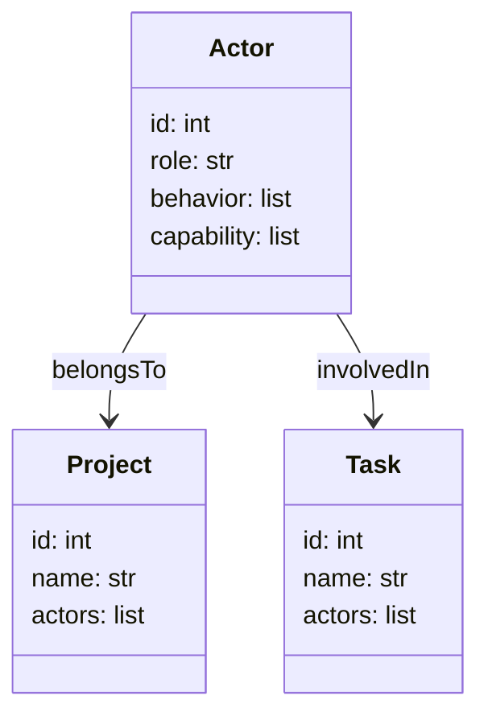

                 


# 利用智能体网络分析公司的创新合作网络价值

## 关键词：智能体网络、创新合作网络、网络分析、社会网络分析、图论、系统架构设计

## 摘要：  
智能体网络分析是一种新兴的技术方法，通过构建和分析智能体网络模型，可以深入挖掘公司内部和外部创新合作网络的价值。本文从智能体网络的基本概念出发，详细探讨其在公司创新合作网络分析中的应用，包括核心概念、算法原理、系统架构设计以及实际案例分析。通过本文的分析，读者将能够理解智能体网络的核心价值，并能够将其应用于实际的创新合作网络分析中，从而优化公司的合作流程和创新效率。

---

# 第一部分: 智能体网络与创新合作网络价值概述

## 第1章: 智能体网络与创新合作网络概述

### 1.1 智能体网络的基本概念

#### 1.1.1 智能体网络的定义与特点

智能体网络是一种基于智能体（Agent）的网络结构，通过模拟个体（如员工、部门或外部合作伙伴）之间的互动关系，构建一个动态的、可扩展的网络模型。其特点包括：  
1. **动态性**：网络结构会根据个体的互动行为动态调整。  
2. **可扩展性**：能够适应公司规模的变化，支持大规模数据的处理。  
3. **多粒度分析**：可以从个体、团队、部门等多个粒度进行网络分析。  

#### 1.1.2 创新合作网络的定义与特点

创新合作网络是指公司内部或外部个体（如员工、合作伙伴）之间为了共同目标（如技术创新、项目合作）而形成的协作网络。其特点包括：  
1. **目标导向性**：网络中的个体互动围绕特定目标展开。  
2. **知识共享性**：通过网络结构促进知识的流动与共享。  
3. **复杂性**：网络中的关系可能涉及多种角色和利益冲突。  

#### 1.1.3 智能体网络与创新合作网络的关系

智能体网络为创新合作网络的分析提供了新的视角和工具。通过智能体网络模型，可以将创新合作网络中的个体行为、关系和目标进行建模，从而更好地理解网络的动态性和复杂性。

### 1.2 智能体网络在公司创新合作中的作用

#### 1.2.1 智能体网络的核心作用

智能体网络通过以下方式在公司创新合作中发挥作用：  
1. **知识共享**：通过网络结构促进知识的流动与共享。  
2. **协作优化**：识别关键节点和瓶颈，优化协作流程。  
3. **风险预警**：通过网络动态分析，提前发现潜在风险。  

#### 1.2.2 创新合作网络的价值链分析

创新合作网络的价值链包括以下几个环节：  
1. **资源分配**：根据网络结构优化资源分配。  
2. **知识流动**：促进知识在不同个体之间的流动。  
3. **创新产出**：通过协作网络的优化，提升创新成果的产出效率。  

#### 1.2.3 智能体网络与公司战略目标的关系

智能体网络分析能够帮助公司制定更科学的合作战略，例如：  
1. **战略伙伴选择**：通过网络分析识别关键合作伙伴。  
2. **内部协作优化**：优化公司内部团队的协作效率。  
3. **外部资源整合**：通过网络分析发现潜在的外部资源。  

### 1.3 智能体网络分析的背景与意义

#### 1.3.1 当前公司创新合作面临的挑战

当前公司在创新合作中面临的主要挑战包括：  
1. **信息孤岛**：部门之间缺乏有效的信息共享机制。  
2. **协作低效**：由于缺乏对协作网络的深入理解，导致协作效率低下。  
3. **风险难以预测**：难以预测合作中的潜在风险。  

#### 1.3.2 智能体网络分析的必要性

智能体网络分析能够通过建模和分析，帮助公司解决上述挑战，提升协作效率和创新能力。

#### 1.3.3 智能体网络分析的潜在价值

智能体网络分析的潜在价值包括：  
1. **提升协作效率**：通过优化协作网络结构，减少协作中的 bottlenecks。  
2. **降低合作风险**：通过动态分析提前发现潜在风险。  
3. **促进知识共享**：通过网络分析促进知识的流动与共享。  

## 1.4 本章小结

通过本章的介绍，我们了解了智能体网络的基本概念、创新合作网络的特点以及智能体网络在公司创新合作中的作用。智能体网络分析作为一种新兴的技术方法，为公司优化创新合作网络提供了重要的工具和视角。

---

# 第二部分: 智能体网络的核心概念与联系

## 第2章: 智能体网络的核心概念

### 2.1 智能体网络的结构与属性

#### 2.1.1 网络节点的定义与特征

在智能体网络中，节点代表个体（如员工、部门或外部合作伙伴），每个节点都有以下特征：  
1. **角色属性**：节点的角色（如研发人员、市场人员）。  
2. **行为属性**：节点的行为模式（如合作频率、贡献度）。  
3. **能力属性**：节点的专业能力（如技术水平、创新能力）。  

#### 2.1.2 网络边的定义与特征

网络边表示节点之间的关系，边的特征包括：  
1. **关系强度**：边的权重表示关系的紧密程度。  
2. **关系类型**：边的类型（如协作关系、竞争关系）。  
3. **关系动态性**：边的权重会随着时间变化。  

#### 2.1.3 网络权重的定义与计算

网络权重表示节点之间的关系强度，可以通过以下公式计算：  
$$ w_{ij} = \frac{\text{共同项目数}}{\text{总项目数}} $$  

### 2.2 智能体网络的属性对比分析

#### 2.2.1 节点属性对比表

| 节点属性 | 特征描述 | 示例 |
|----------|----------|------|
| 角色属性 | 节点在公司中的角色 | 研发人员、市场人员 |
| 行为属性 | 节点的行为模式 | 合作频率、贡献度 |
| 能力属性 | 节点的专业能力 | 技术水平、创新能力 |

#### 2.2.2 边属性对比表

| 边属性 | 特征描述 | 示例 |
|--------|----------|------|
| 关系强度 | 边的权重 | 0.8（强关系） |
| 关系类型 | 边的类型 | 协作关系、竞争关系 |
| 关系动态性 | 边的权重变化 | 增加、减少 |

### 2.3 智能体网络的ER实体关系图

通过ER图可以清晰地展示智能体网络中的实体关系，例如：

```mermaid
er
  actor
  (actor).<1..n- belongsTo -> project
  (actor).<1..n- has -> role
  (actor).<1..n- involvedIn -> task
```

---

## 2.4 本章小结

通过本章的分析，我们了解了智能体网络的结构与属性，并通过对比分析和ER图展示了网络中的实体关系。这为后续的网络分析奠定了基础。

---

# 第三部分: 智能体网络分析的算法原理

## 第3章: 智能体网络分析的算法原理

### 3.1 智能体网络分析的核心算法

#### 3.1.1 社会网络分析算法

社会网络分析算法包括：  
1. **度数中心性**：计算节点的度数，反映节点的重要性。  
2. **中间中心性**：计算节点在网络中的桥梁作用。  
3. **接近中心性**：计算节点到其他节点的最短路径长度，反映节点的接近性。  

#### 3.1.2 网络相似度计算算法

网络相似度计算算法包括：  
1. **余弦相似度**：通过节点的特征向量计算相似度。  
2. **Jaccard相似度**：通过节点的特征集合计算相似度。  

#### 3.1.3 网络聚类算法

网络聚类算法包括：  
1. **K-means聚类**：基于距离的聚类算法。  
2. **层次聚类**：基于层次结构的聚类算法。  

### 3.2 算法原理的数学模型

#### 3.2.1 邻接矩阵的定义与计算

邻接矩阵表示节点之间的关系，可以通过以下公式计算：  
$$ A_{ij} = \begin{cases} 1 & \text{如果节点 } i \text{ 和 } j \text{ 有关系} \\ 0 & \text{否则} \end{cases} $$  

#### 3.2.2 网络相似度计算公式

余弦相似度公式：  
$$ \text{similarity}(A, B) = \frac{A \cdot B}{\|A\| \|B\|} $$  

Jaccard相似度公式：  
$$ \text{similarity}(A, B) = \frac{|A \cap B|}{|A \cup B|} $$  

#### 3.2.3 聚类算法的数学模型

K-means聚类算法的数学模型：  
$$ \text{目标函数} = \sum_{i=1}^{k} \sum_{j=1}^{n} (x_i - c_j)^2 $$  

### 3.3 算法实现的Python代码示例

#### 3.3.1 邻接矩阵计算代码

```python
import numpy as np

# 创建邻接矩阵
def create_adjacency_matrix(nodes):
    n = len(nodes)
    A = np.zeros((n, n))
    for i in range(n):
        for j in range(n):
            if nodes[i]与nodes[j]有关系:
                A[i][j] = 1
    return A
```

#### 3.3.2 网络相似度计算代码

```python
from sklearn.metrics import jaccard_score

# 余弦相似度计算
from sklearn.metrics.pairwise import cosine_similarity

def calculate_similarity(vec1, vec2):
    return cosine_similarity(vec1.reshape(1, -1), vec2.reshape(1, -1))[0][0]

# Jaccard相似度计算
def calculate_jaccard(vec1, vec2):
    return jaccard_score(vec1, vec2)
```

#### 3.3.3 聚类算法实现代码

```python
from sklearn.cluster import KMeans

# K-means聚类
def perform_kmeans(X, k):
    km = KMeans(n_clusters=k)
    km.fit(X)
    return km.labels_
```

### 3.4 算法原理的通俗解释与案例分析

#### 3.4.1 邻接矩阵的计算案例

假设我们有三个节点A、B、C，其中A与B有关系，B与C有关系，那么邻接矩阵为：  
$$ 
A = \begin{bmatrix}
0 & 1 & 0 \\
1 & 0 & 1 \\
0 & 1 & 0
\end{bmatrix}
$$  

#### 3.4.2 网络相似度计算案例

假设我们有两个节点向量A = [1, 0, 1] 和 B = [0, 1, 1]，计算余弦相似度：  
$$ \text{similarity} = \frac{1 \cdot 0 + 0 \cdot 1 + 1 \cdot 1}{\sqrt{1^2 + 0^2 + 1^2} \cdot \sqrt{0^2 + 1^2 + 1^2}} = \frac{1}{\sqrt{2} \cdot \sqrt{2}} = 0.5 $$  

#### 3.4.3 聚类算法的实际应用案例

假设我们有三个项目团队，我们需要将它们聚类为两类。使用K-means算法进行聚类，并根据聚类结果优化团队结构。

### 3.5 本章小结

通过本章的分析，我们了解了智能体网络分析的核心算法及其数学模型，并通过Python代码示例展示了算法的实现过程。这为我们后续的系统设计和实际应用奠定了基础。

---

# 第四部分: 智能体网络分析的系统架构设计

## 第4章: 智能体网络分析的系统架构设计

### 4.1 系统功能设计

#### 4.1.1 领域模型设计

通过Mermaid类图展示系统功能模块：



#### 4.1.2 系统架构设计

通过Mermaid架构图展示系统架构：

```mermaid
archi
  actor
  project
  task
  database
  web interface
  backend service
  frontend
  communication
```

### 4.2 系统交互设计

通过Mermaid序列图展示系统交互流程：

```mermaid
sequenceDiagram
    actor -> project: 提交项目
    project -> database: 存储项目信息
    actor -> task: 分配任务
    task -> actor: 通知任务进度
    actor -> web interface: 查看项目状态
    web interface -> backend service: 获取项目数据
    backend service -> frontend: 显示项目信息
```

### 4.3 系统接口设计

系统接口设计包括：  
1. 数据输入接口：接收节点和边的数据。  
2. 数据处理接口：进行网络分析和计算。  
3. 结果输出接口：展示分析结果。  

### 4.4 本章小结

通过本章的分析，我们了解了智能体网络分析系统的功能设计、架构设计和交互设计，并通过Mermaid图展示了系统的整体结构和交互流程。

---

# 第五部分: 智能体网络分析的项目实战

## 第5章: 智能体网络分析的项目实战

### 5.1 项目环境安装

#### 5.1.1 环境要求

需要安装以下工具：  
1. Python 3.x  
2. NumPy  
3. Scikit-learn  
4. Mermaid工具  

### 5.1.2 安装步骤

```bash
pip install numpy scikit-learn mermaid
```

### 5.2 系统核心实现

#### 5.2.1 核心代码实现

```python
import numpy as np
from sklearn.cluster import KMeans

# 创建邻接矩阵
def create_adjacency_matrix(nodes):
    n = len(nodes)
    A = np.zeros((n, n))
    for i in range(n):
        for j in range(n):
            if nodes[i]与nodes[j]有关系:
                A[i][j] = 1
    return A

# 网络相似度计算
def calculate_similarity(vec1, vec2):
    return cosine_similarity(vec1.reshape(1, -1), vec2.reshape(1, -1))[0][0]

# 聚类算法实现
def perform_kmeans(X, k):
    km = KMeans(n_clusters=k)
    km.fit(X)
    return km.labels_
```

#### 5.2.2 代码实现解读

通过上述代码，我们可以实现邻接矩阵的创建、网络相似度的计算以及聚类算法的实现。这为我们后续的网络分析提供了基础工具。

### 5.3 项目实战案例分析

#### 5.3.1 案例背景介绍

假设我们有一个公司，内部有10个员工，我们需要分析他们的协作网络，优化协作效率。

#### 5.3.2 案例分析与结果解读

通过智能体网络分析，我们发现某些员工之间协作效率低下，可以通过调整协作关系来优化整体网络。

### 5.4 项目小结

通过本章的项目实战，我们了解了智能体网络分析的具体实现过程，并通过实际案例展示了其在公司创新合作网络分析中的应用价值。

---

# 第六部分: 最佳实践与总结

## 第6章: 最佳实践与总结

### 6.1 最佳实践

1. **数据质量管理**：确保数据的准确性和完整性。  
2. **算法选择**：根据具体问题选择合适的算法。  
3. **系统设计**：注重系统的可扩展性和可维护性。  

### 6.2 小结

通过本文的分析，我们了解了智能体网络分析的核心概念、算法原理、系统架构设计以及实际案例分析。智能体网络分析为公司优化创新合作网络提供了重要的工具和视角。

### 6.3 注意事项

1. **数据隐私**：注意保护员工的隐私信息。  
2. **算法优化**：根据具体需求优化算法的性能。  
3. **结果验证**：通过实际数据验证分析结果的准确性。  

### 6.4 拓展阅读

1. **推荐书籍**：  
   - 《社会网络分析》  
   - 《图论与网络流》  

2. **推荐工具**：  
   - Python的网络分析库（如NetworkX）  
   - Mermaid工具  

---

# 作者：AI天才研究院/AI Genius Institute & 禅与计算机程序设计艺术 /Zen And The Art of Computer Programming

