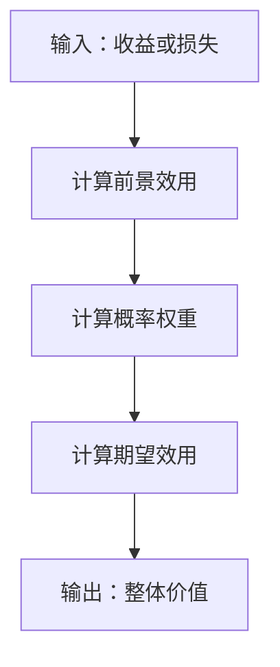
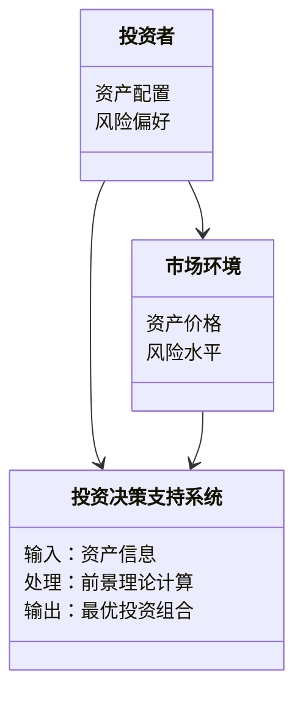

                 


# 前景理论：损失厌恶如何影响投资决策

> 关键词：前景理论、损失厌恶、投资决策、决策模型、概率加权函数

> 摘要：前景理论（Prospect Theory）是由Kahneman和Tversky提出的一种描述性决策理论，它揭示了人类在面对风险时的决策行为，特别是损失厌恶对投资决策的影响。本文将从背景介绍、核心概念、算法原理、系统分析、项目实战到最佳实践，全面解析前景理论及其在投资决策中的应用。通过详细的数学推导和实际案例分析，帮助读者理解如何将前景理论应用于实际投资决策中，避免常见的决策错误。

---

## 第一部分: 前景理论的背景与核心概念

### 第1章: 前景理论的起源与发展

#### 1.1 前景理论的提出背景

在传统经济学中，理性决策模型假设人类是理性的，且在决策时会最大化自己的效用。然而，这一假设在实际情况中经常被打破。1979年，Kahneman和Tversky提出了前景理论，作为一种描述性决策理论，试图解释人类在面对风险时的真实决策行为。

#### 1.2 前景理论的核心思想

前景理论的核心思想是，人类在决策时并不是完全理性的，而是受到心理因素的影响，尤其是对损失的厌恶。这种损失厌恶导致人们在面对收益和损失时的风险偏好不同：人们更倾向于避免损失，而不是追求收益。

#### 1.3 前景理论与传统理性决策模型的对比

| 对比维度       | 理性决策模型                          | 前景理论                          |
|----------------|--------------------------------------|-----------------------------------|
| 参照点         | 无参照点，假设效用函数是线性的          | 有明确的参照点（通常是现状）       |
| 风险偏好       | 风险中性或偏好确定性                   | 损失厌恶，即对损失的敏感性高于收益 |
| 概率加权函数   | 假设概率权重为1                        | 概率权重非线性，损失概率的权重更大 |

---

### 第2章: 损失厌恶的核心概念

#### 2.1 损失厌恶的定义

损失厌恶是指人们在面对损失时，表现出比同等收益更高的敏感性。换句话说，人们更害怕损失，而不是追求收益。

#### 2.2 损失厌恶的表现形式

1. **风险偏好**：在同等概率下，人们更倾向于避免损失，而不是追求收益。
2. **决策权重**：人们在面对损失时，会给予更高的权重，即更关注损失的可能性。

#### 2.3 损失厌恶对投资决策的影响

损失厌恶导致投资者在投资决策中表现出以下行为：
- 过度保守：避免高风险投资，即使潜在收益较高。
- 过度反应：在面对潜在损失时，倾向于立即采取行动，而不是理性分析。

---

## 第二部分: 前景理论的数学模型与算法原理

### 第3章: 前景理论的数学模型

#### 3.1 前景函数的定义

前景函数是用来描述人类对收益和损失的效用函数。其数学表达式为：

$$ U(x) = 
  \begin{cases}
    \text{损失} & \text{如果 } x < 0 \\
    \text{收益} & \text{如果 } x \geq 0
  \end{cases}
$$

其中，$x$ 是相对于参照点的收益或损失。

#### 3.2 概率加权函数

概率加权函数用于描述人们对概率的感知。其数学表达式为：

$$ w(p) = 
  \begin{cases}
    \text{递增函数} & \text{如果 } p \leq 0.5 \\
    \text{递减函数} & \text{如果 } p > 0.5
  \end{cases}
$$

其中，$p$ 是概率。

#### 3.3 综合模型

前景理论的综合模型可以表示为：

$$ V = \sum_{i=1}^{n} w(p_i) \cdot U(x_i) $$

其中，$V$ 是整体价值，$w(p_i)$ 是概率加权函数，$U(x_i)$ 是前景函数。

---

### 第4章: 前景理论的算法实现

#### 4.1 前景理论的Python实现

```python
import numpy as np

def prospect_utility(x, alpha=0.88, beta=0.99):
    if x >= 0:
        return (x ** alpha)
    else:
        return -( (-x) ** beta )

def probability_weighting(p, gamma=0.63):
    return p ** gamma

# 示例：计算期望效用
x = np.array([10, 20, -5])
p = np.array([0.3, 0.5, 0.2])

u = prospect_utility(x)
w = probability_weighting(p)

expected_utility = np.sum(w * u)
print("Expected Utility:", expected_utility)
```

#### 4.2 算法流程图



---

## 第三部分: 投资决策中的前景理论应用

### 第5章: 投资决策中的前景理论模型

#### 5.1 投资组合优化模型

前景理论可以用于优化投资组合。假设投资者的目标是最大化期望效用，那么投资组合的优化问题可以表示为：

$$ \max_{w} \sum_{i=1}^{n} w_i \cdot U(r_i) $$
$$ \text{约束条件：} \sum_{i=1}^{n} w_i = 1 $$

其中，$w_i$ 是资产$i$的权重，$r_i$ 是资产$i$的预期收益。

#### 5.2 系统架构设计



---

### 第6章: 项目实战

#### 6.1 环境安装与数据准备

```bash
pip install numpy matplotlib pandas
```

#### 6.2 核心代码实现

```python
import numpy as np
import matplotlib.pyplot as plt

# 示例数据
returns = np.array([0.1, 0.2, -0.1, 0.05])

# 前景理论计算
def prospect_utility(x):
    if x >= 0:
        return (x ** 0.88)
    else:
        return -( (-x) ** 0.99 )

u = prospect_utility(returns)
print("前景效用:", u)

# 概率加权函数
p = np.array([0.3, 0.5, 0.1, 0.1])
w = p ** 0.63
print("概率权重:", w)

# 期望效用
expected_utility = np.sum(w * u)
print("期望效用:", expected_utility)
```

---

## 第四部分: 最佳实践与小结

### 第7章: 最佳实践与注意事项

#### 7.1 应用前景理论的注意事项

1. **参照点的选择**：参照点的设置会影响前景效用的计算，需谨慎选择。
2. **概率权重的调整**：不同投资者的概率权重可能不同，需根据实际情况调整。
3. **模型的局限性**：前景理论是一种描述性模型，不一定适用于所有情况。

#### 7.2 小结

前景理论通过揭示损失厌恶对投资决策的影响，帮助投资者更好地理解自身的决策行为。在实际应用中，可以通过前景理论优化投资组合，避免过度风险厌恶或冒险行为。

---

## 作者

作者：AI天才研究院/AI Genius Institute & 禅与计算机程序设计艺术 /Zen And The Art of Computer Programming

