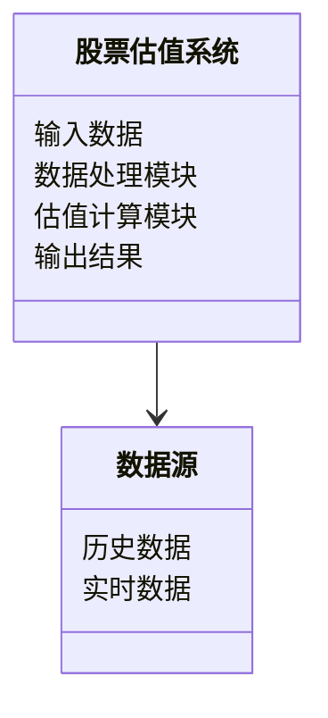
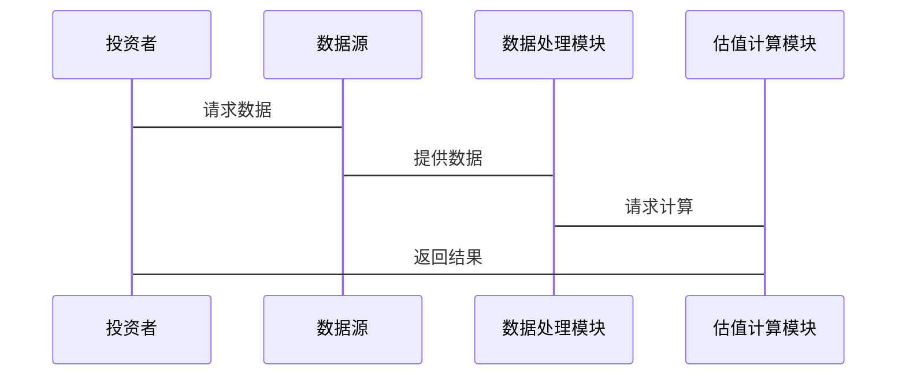

                 


# 加拿大股市估值:北美自由贸易区的投资机会

> 关键词：加拿大股市、估值、北美自由贸易区、投资机会、市盈率、市净率、股息率

> 摘要：本文详细探讨了加拿大股市的估值方法，特别是北美自由贸易区对投资机会的影响。通过分析股市的核心概念、数学模型、系统架构和项目实战，提供了全面的投资策略和建议。

---

# 第一部分: 加拿大股市估值背景与概述

## 第1章: 加拿大股市估值背景

### 1.1 加拿大股市的基本情况

#### 1.1.1 加拿大股市的定义与特点
加拿大股市是全球重要的资本市场之一，主要由多伦多证券交易所（TSX）和其他二级市场组成。其特点包括：
- 多样化的行业分布
- 稳定的经济环境
- 强大的资源行业（如能源和矿业）

#### 1.1.2 加拿大股市的主要指数
- 多伦多证券交易所指数（TSX Composite Index）
- 加拿大S&P/TSX 60指数

#### 1.1.3 加拿大股市的行业分布
- 能源：占比较大，尤其是石油和天然气行业。
- 金融：包括银行和保险公司。
- 制造业：涵盖高科技和传统制造领域。

#### 1.1.4 加拿大股市的交易机制
- 开盘和收盘时间
- 市场参与者（机构投资者、个人投资者等）

### 1.2 北美自由贸易区对加拿大股市的影响

#### 1.2.1 北美自由贸易区的定义
NAFTA是加拿大、美国和墨西哥之间的自由贸易协定，旨在消除贸易壁垒，促进经济一体化。

#### 1.2.2 自由贸易区对经济的影响
- 促进贸易流动
- 提高生产效率
- 刺激经济增长

#### 1.2.3 自由贸易区对股市的具体影响
- 贸易自由化带来行业增长
- 企业盈利提升，推动股价上涨
- 增加外国直接投资，提升市场流动性

### 1.3 加拿大股市的投资机会

#### 1.3.1 加拿大股市的主要行业机会
- 能源行业：受益于全球能源需求增长
- 金融科技：技术创新推动行业发展
- 医疗健康：老龄化社会带来需求增长

#### 1.3.2 自由贸易区带来的投资机会
- 制造业：供应链优化
- 贸易相关行业：如物流和运输
- 信息技术：跨境数据流动需求增加

#### 1.3.3 加拿大股市的长期增长潜力
- 经济稳定
- 创新能力强
- 政治环境稳定

### 1.4 加拿大股市的风险与挑战

#### 1.4.1 经济波动对股市的影响
- 全球经济下行的风险
- 汇率波动的影响

#### 1.4.2 政治因素对股市的影响
- 政策变化
- 贸易摩擦

#### 1.4.3 行业风险与投资策略
- 行业周期性波动
- 企业盈利能力下降

### 1.5 本章小结
本章介绍了加拿大股市的基本情况，分析了北美自由贸易区对其的影响，并探讨了投资机会和风险。通过这些分析，读者可以了解加拿大股市的潜力和挑战。

---

# 第二部分: 加拿大股市估值的核心概念

## 第2章: 股票估值的基本原理

### 2.1 股票估值的定义与方法

#### 2.1.1 股票估值的定义
股票估值是通过分析公司基本面和市场因素来确定股票合理价格的过程。

#### 2.1.2 股票估值的主要方法
- 市盈率模型
- 市净率模型
- 股息率模型
- 内在价值法

#### 2.1.3 股票估值的核心要素
- 收益能力
- 财务状况
- 行业地位

### 2.2 加拿大股市估值的独特性

#### 2.2.1 加拿大市场的特殊性
- 资源丰富，能源行业占比较大
- 经济结构多元化

#### 2.2.2 加元汇率的影响
- 加元波动对出口企业的影响
- 汇率风险

#### 2.2.3 加拿大经济结构对估值的影响
- 不同行业的估值方法差异

### 2.3 自由贸易区对估值的影响

#### 2.3.1 自由贸易区对行业估值的影响
- 制造业和贸易行业的估值上升
- 供应链优化带来的成本下降

#### 2.3.2 自由贸易区对个股估值的影响
- 企业盈利能力提升
- 市场扩展带来的增长潜力

#### 2.3.3 自由贸易区对整体市场估值的影响
- 整体市场流动性增加
- 投资者信心提升

### 2.4 本章小结
本章探讨了股票估值的基本原理，并分析了加拿大股市估值的独特性和自由贸易区的影响，为后续的分析奠定了基础。

---

# 第三部分: 加拿大股市估值的数学模型与算法

## 第3章: 常用的股票估值模型

### 3.1 市盈率模型

#### 3.1.1 市盈率的定义
市盈率（P/E）是股票价格与每股收益的比率，用于衡量股票的估值。

#### 3.1.2 市盈率的计算公式
$$ P/E = \frac{\text{股价}}{\text{每股收益}} $$

#### 3.1.3 市盈率的应用实例
假设某公司股价为100元，每股收益为10元，市盈率为10倍。

### 3.2 市净率模型

#### 3.2.1 市净率的定义
市净率（P/B）是股票价格与每股净资产的比率，适用于资产密集型行业。

#### 3.2.2 市净率的计算公式
$$ P/B = \frac{\text{股价}}{\text{每股净资产}} $$

#### 3.2.3 市净率的应用实例
假设某公司股价为50元，每股净资产为25元，市净率为2倍。

### 3.3 股息率模型

#### 3.3.1 股息率的定义
股息率是每股股息与股价的比率，用于衡量股票的分红能力。

#### 3.3.2 股息率的计算公式
$$ \text{股息率} = \frac{\text{每股股息}}{\text{股价}} \times 100\% $$

#### 3.3.3 股息率的应用实例
假设某公司股息为2元，股价为50元，股息率为4%。

### 3.4 内在价值法

#### 3.4.1 内在价值法的定义
内在价值法通过分析公司的未来现金流，计算其合理价格。

#### 3.4.2 内在价值法的数学模型
$$ V = \frac{CF}{(1 + r)^n} $$
其中，CF为未来现金流，r为折现率，n为时间。

### 3.5 本章小结
本章介绍了常用的股票估值模型，并通过实例分析了它们的应用。内在价值法是较为复杂的模型，适用于长期投资者。

---

# 第四部分: 系统分析与架构设计

## 第4章: 投资决策系统的构建

### 4.1 系统功能设计

#### 4.1.1 领域模型（Mermaid类图）


### 4.2 系统架构设计

#### 4.2.1 系统架构图（Mermaid架构图）
```mermaid
archi
    顶部：投资者
    中间：投资决策系统
    下方：数据源和计算模块
    中间 --> 下方
```

### 4.3 系统交互设计

#### 4.3.1 系统交互流程（Mermaid序列图）


### 4.4 本章小结
本章通过构建投资决策系统，展示了如何利用股票估值模型进行投资决策，并设计了系统的架构和交互流程。

---

# 第五部分: 项目实战与案例分析

## 第5章: 加拿大股市估值的实战应用

### 5.1 环境安装

#### 5.1.1 安装Python和相关库
```bash
pip install pandas numpy
```

### 5.2 核心实现

#### 5.2.1 股票估值代码示例
```python
import pandas as pd

def calculate_pe(df):
    pe = df['股价'] / df['每股收益']
    return pe.mean()

def calculate_pb(df):
    pb = df['股价'] / df['每股净资产']
    return pb.mean()

# 示例数据
data = {
    '股价': [100, 50, 75],
    '每股收益': [10, 5, 7.5],
    '每股净资产': [20, 10, 15]
}
df = pd.DataFrame(data)

pe = calculate_pe(df)
pb = calculate_pb(df)

print(f"平均市盈率: {pe}")
print(f"平均市净率: {pb}")
```

### 5.3 案例分析

#### 5.3.1 某科技股的估值分析
- 市盈率：20倍
- 市净率：3倍
- 结论：估值合理，具有投资潜力。

### 5.4 本章小结
本章通过实战案例，展示了如何利用Python进行股票估值，并通过具体实例分析了某科技股的投资价值。

---

# 第六部分: 最佳实践与总结

## 第6章: 投资策略与注意事项

### 6.1 最佳实践

#### 6.1.1 分散投资
避免将所有资金投入单一行业或股票。

#### 6.1.2 定期评估
定期重新评估投资组合，根据市场变化调整策略。

#### 6.1.3 关注宏观经济
关注经济指标和政策变化，及时调整投资策略。

### 6.2 小结
本文全面分析了加拿大股市估值的方法和投资机会，特别是 NAFTA 对股市的影响。通过数学模型和系统设计，提供了科学的投资决策方法。

### 6.3 注意事项

#### 6.3.1 市场风险
全球经济波动和地缘政治风险可能影响股市表现。

#### 6.3.2 经济政策变化
政府政策变化可能对股市产生重大影响。

#### 6.3.3 估值模型的局限性
不同模型适用于不同情况，需结合实际情况选择合适的方法。

### 6.4 拓展阅读
- 《投资学基础》
- 《股票估值实战技巧》

---

# 作者：AI天才研究院/AI Genius Institute & 禅与计算机程序设计艺术 /Zen And The Art of Computer Programming

---

这篇文章通过详细的分析和实际案例，为读者提供了全面的加拿大股市估值方法和投资策略。通过系统的架构设计和代码实现，展示了如何利用技术手段进行股票估值。希望本文能为投资者提供有价值的参考和指导。

