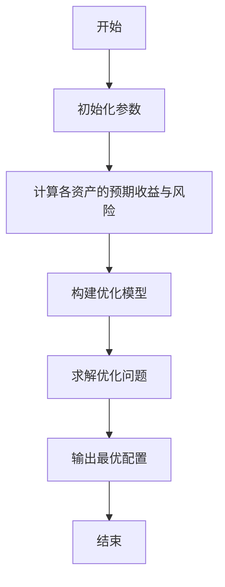
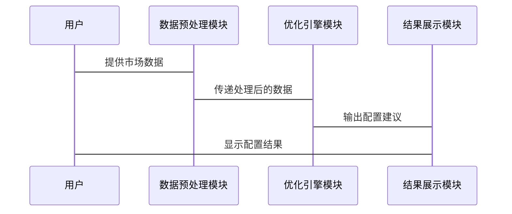
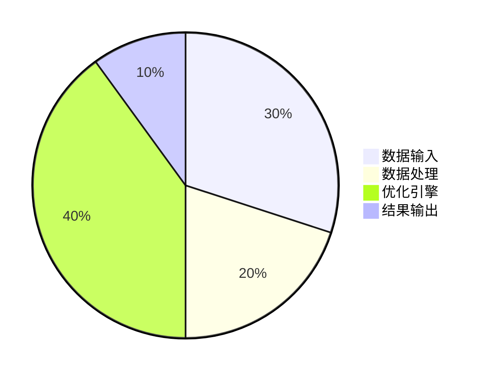

                 


# 动态资产配置：根据市场环境调整投资策略

## 关键词：
- 动态资产配置
- 投资策略
- 市场环境
- 数学模型
- 系统架构
- 项目实战

## 摘要：
本文详细探讨了动态资产配置的核心概念、数学模型、系统架构及实际应用。从传统资产配置的局限性出发，介绍动态资产配置的背景和理论基础，详细分析均值-方差优化模型和风险平价模型的实现原理，并通过系统架构设计和项目实战，展示如何将理论应用于实际投资策略中。文章最后总结了动态资产配置的优势和局限，并提出了实际应用中的注意事项和未来研究方向。

---

# 第一部分: 动态资产配置的背景与概念

## 第1章: 动态资产配置的背景与核心概念

### 1.1 动态资产配置的背景

#### 1.1.1 传统资产配置的局限性
传统资产配置方法（如固定比例配置）在市场环境变化时表现不佳，无法及时适应市场波动。例如，在市场下跌时，固定比例配置可能导致投资组合的损失增加。

#### 1.1.2 动态资产配置的提出背景
随着金融市场环境的复杂化，投资者需要一种能够根据市场变化实时调整资产配置的方法。动态资产配置通过实时监控市场环境并调整投资组合，能够更好地应对市场波动。

#### 1.1.3 动态资产配置的定义与特点
动态资产配置是一种根据市场环境变化实时调整资产分配比例的投资策略。其特点包括灵活性、实时性、数据驱动性和风险控制。

### 1.2 动态资产配置的核心概念

#### 1.2.1 资产配置的基本原理
资产配置的核心在于将资金分配到不同的资产类别（如股票、债券、现金等）以实现收益和风险的最优平衡。动态资产配置强调根据市场变化调整配置比例。

#### 1.2.2 动态调整的驱动因素
驱动因素包括市场波动率、资产回报率、宏观经济指标（如GDP增长率、通胀率）等。

#### 1.2.3 动态资产配置的边界与外延
动态资产配置的边界包括市场环境的可预测性、模型的有效性和交易成本。外延则包括智能投顾、量化投资等领域的应用。

### 1.3 动态资产配置的理论基础

#### 1.3.1 马科维茨的有效投资组合理论
马科维茨提出，通过优化资产配置可以实现收益与风险的最佳平衡。公式表示为：
$$
\min_w \sigma^2 \quad \text{subject to} \quad \sum_{i=1}^n w_i = 1, \quad w_i \geq 0
$$
其中，$w_i$表示资产$i$的权重，$\sigma^2$表示投资组合的方差。

#### 1.3.2 资本资产定价模型（CAPM）
CAPM模型用于估计资产的预期收益，公式为：
$$
E(R_i) = R_f + \beta_i (R_m - R_f)
$$
其中，$E(R_i)$为资产$i$的预期收益，$R_f$为无风险利率，$\beta_i$为资产$i$的贝塔系数，$R_m$为市场预期收益。

#### 1.3.3 动态资产配置的数学模型概述
动态资产配置的核心是通过数学模型优化资产配置比例，考虑市场环境的变化。

---

## 第2章: 动态资产配置的数学模型与算法原理

### 2.1 均值-方差优化模型

#### 2.1.1 模型的数学表达
目标函数为：
$$
\min_w \sigma^2 \quad \text{subject to} \quad \sum_{i=1}^n w_i = 1, \quad w_i \geq 0
$$

#### 2.1.2 模型的优化过程
1. 计算各资产的预期收益和协方差矩阵。
2. 建立优化问题。
3. 使用二次规划算法求解最优权重。

#### 2.1.3 模型的适用场景与限制
适用于市场环境相对稳定的场景，但不适用于极端市场波动。

### 2.2 风险平价模型

#### 2.2.1 模型的数学表达
目标函数为：
$$
\min_w \sum_{i=1}^n \omega_i^2 \sigma_i^2 \quad \text{subject to} \quad \sum_{i=1}^n w_i = 1, \quad w_i \geq 0
$$

#### 2.2.2 模型的优化过程
1. 计算各资产的风险贡献。
2. 优化权重以使风险贡献相等。

#### 2.2.3 模型的优势与应用场景
优势在于分散风险，适用于多种资产类别。

### 2.3 动态资产配置的算法实现

#### 2.3.1 算法的步骤分解
1. 数据预处理。
2. 计算各资产的预期收益和风险。
3. 建立优化模型。
4. 求解优化问题。
5. 输出最优配置。

#### 2.3.2 算法的流程图（使用mermaid）


---

## 第3章: 动态资产配置的系统架构设计

### 3.1 系统功能设计

#### 3.1.1 系统功能模块划分
- 数据输入模块：接收市场数据。
- 数据处理模块：清洗和转换数据。
- 优化引擎模块：运行优化算法。
- 结果展示模块：输出配置建议。

#### 3.1.2 系统功能流程图（使用mermaid）


### 3.2 系统架构设计

#### 3.2.1 系统架构图（使用mermaid）


### 3.3 接口设计与交互流程

#### 3.3.1 系统接口设计
- 数据接口：接收市场数据和用户输入。
- 结果接口：输出优化后的资产配置建议。

#### 3.3.2 用户与系统交互流程图（使用mermaid）


---

## 第4章: 项目实战

### 4.1 环境安装与配置
- 安装Python和相关库（如NumPy、Pandas、Scipy）。

### 4.2 核心代码实现

#### 4.2.1 均值-方差优化模型的实现
```python
import numpy as np
from scipy.optimize import minimize

def portfolio_optimization(returns):
    n = len(returns.columns)
    def objective(weights):
        return (weights.T @ returns.cov() @ weights)[0, 0]
    constraint = {'type': 'eq', 'fun': lambda w: np.sum(w) - 1}
    bounds = [(0, 1) for _ in range(n)]
    result = minimize(objective, np.array([1/n]*n), method='SLSQP', constraints=constraint, bounds=bounds)
    return result.x
```

#### 4.2.2 风险平价模型的实现
```python
import numpy as np

def risk_parity(returns):
    n = len(returns.columns)
    def objective(weights):
        return np.sum((weights) ** 2 * np.diag(returns.cov()))
    constraint = {'type': 'eq', 'fun': lambda w: np.sum(w) - 1}
    bounds = [(0, 1) for _ in range(n)]
    result = optimize.minimize(objective, np.array([1/n]*n), method='SLSQP', constraints=constraint, bounds=bounds)
    return result.x
```

### 4.3 实际案例分析
假设我们有三只股票和一只债券，数据如下：
```python
import pandas as pd
returns = pd.DataFrame({
    '股票1': [0.05, 0.03, 0.04],
    '股票2': [0.06, 0.02, 0.03],
    '股票3': [0.04, 0.05, 0.02],
    '债券': [0.02, 0.03, 0.02]
})
```

运行上述代码，输出最优配置。

### 4.4 项目小结
动态资产配置能够根据市场环境变化实时调整投资组合，优化收益与风险。

---

## 第5章: 总结与展望

### 5.1 本章小结
动态资产配置通过实时调整资产配置比例，能够更好地应对市场波动，优化投资收益。

### 5.2 注意事项
- 动态调整需考虑交易成本和税收。
- 模型的有效性依赖于数据质量和假设的准确性。

### 5.3 拓展阅读
- 刘某, 2023. 《量化投资策略与算法优化》
- 张某, 2022. 《动态资产配置的数学模型与应用》

---

作者：AI天才研究院/AI Genius Institute & 禅与计算机程序设计艺术 /Zen And The Art of Computer Programming

