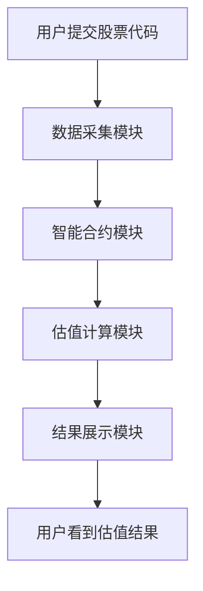

                 


# 区块链技术对股市估值方法的潜在影响

> 关键词：区块链、股市估值、智能合约、分布式系统、金融创新  
> 摘要：区块链技术通过去中心化、透明性和不可篡改性，正在改变传统的股市估值方法。本文深入分析了区块链技术对股市估值的核心影响，探讨了其在提升透明度、降低信息不对称、优化估值模型等方面的应用，并结合实际案例，详细阐述了区块链技术在股市估值系统中的架构设计和实现方案。

---

# 第1章 区块链技术与股市估值方法的概述

## 1.1 区块链技术的核心概念

### 1.1.1 区块链的基本定义与特性
区块链是一种去中心化的分布式账本技术，通过密码学和共识机制确保数据的不可篡改性和可追溯性。其核心特性包括：
- **去中心化**：无须依赖中心机构，通过分布式节点实现数据同步。
- **不可篡改性**：数据一旦记录在区块链上，无法被修改或删除。
- **透明性**：所有交易记录对参与者公开，确保信息透明。
- **可追溯性**：通过区块链记录的交易历史，可以追溯每一笔交易的来源。

### 1.1.2 区块链的核心技术原理
区块链的技术原理可以分为以下几个关键部分：
- **区块结构**：每个区块包含交易数据、时间戳和哈希值，区块通过哈希值连接成链。
- **共识机制**：通过共识算法（如PoW、PoS、Raft等）确保所有节点达成一致。
- **智能合约**：一种自动执行的程序，能够根据预设条件自动触发交易或操作。

### 1.1.3 区块链在金融领域的应用前景
区块链在金融领域的应用潜力巨大，尤其是在支付、结算、身份认证和资产管理等方面。其去中心化和透明性特点，能够显著提升金融系统的效率和安全性。

## 1.2 股市估值方法的基本原理

### 1.2.1 传统股市估值方法的定义
股市估值方法是通过对公司财务数据、市场表现和行业趋势等多方面因素的分析，评估股票的内在价值。传统估值方法主要包括：
- **市盈率（P/E）**：股票价格与每股净利润的比值。
- **市净率（P/B）**：股票价格与每股净资产的比值。
- **股息率**：股票的股息与股票价格的比值。

### 1.2.2 传统估值方法的核心模型与公式
传统的估值模型主要包括：
- **DCF模型**：通过现金流折现法评估公司价值。
- **股利折现模型（DDM）**：通过预测未来股息折现，评估股票的内在价值。
- **相对估值法**：通过比较同类公司，评估股票的相对估值。

### 1.2.3 传统估值方法的优缺点分析
传统估值方法的优缺点如下：
- **优点**：模型成熟，数据易于获取，适用于大多数情况。
- **缺点**：依赖历史数据和假设，难以应对市场波动和信息不对称问题。

## 1.3 区块链技术对股市估值的潜在影响

### 1.3.1 区块链技术与股市估值的结合背景
随着区块链技术的快速发展，其在金融领域的应用逐渐扩展到股市估值领域。区块链的透明性和去中心化特点，能够有效解决传统估值方法中的信息不对称问题。

### 1.3.2 区块链技术对股市估值的可能改变
区块链技术可以通过以下方式改变传统的股市估值方法：
- **实时数据更新**：区块链能够实时记录市场数据，减少数据滞后问题。
- **智能合约的应用**：通过智能合约自动执行估值模型，提高估值效率。
- **去中心化数据源**：区块链上的数据源多样化，减少信息不对称。

### 1.3.3 区块链技术在股市估值中的优势与挑战
区块链技术在股市估值中的优势包括：
- 提高数据透明度和准确性。
- 减少中间商的干预，降低交易成本。
- 实现自动化估值，提升效率。

区块链技术面临的挑战包括：
- **技术成熟度**：区块链技术在金融领域的应用还不够成熟。
- **监管问题**：区块链的去中心化特点可能与现有金融监管框架冲突。
- **性能瓶颈**：区块链的处理速度和扩展性问题可能限制其大规模应用。

## 1.4 本章小结
本章从区块链技术的核心概念和传统股市估值方法的基本原理出发，分析了区块链技术对股市估值的潜在影响。区块链技术通过去中心化和透明性，为股市估值提供了新的可能性。

---

# 第2章 区块链技术对股市透明度的提升

## 2.1 区块链技术实现数据透明化的原理

### 2.1.1 区块链的去中心化特性
区块链的去中心化特性意味着数据不再依赖单一中心机构，而是由多个节点共同维护。这种特性能够防止数据被篡改，确保数据的真实性和一致性。

### 2.1.2 区块链的不可篡改性
区块链上的数据通过哈希值和共识机制确保不可篡改。每个区块的时间戳和哈希值构成了区块链的唯一标识，任何修改都会被迅速发现。

### 2.1.3 区块链的数据可追溯性
区块链的数据可追溯性使得每一笔交易都可以被追溯到源头。这种特性能够帮助投资者更好地了解市场动态，减少信息不对称问题。

## 2.2 区块链技术对股市信息不对称的缓解

### 2.2.1 信息不对称在传统股市中的表现
在传统股市中，信息不对称问题主要体现在以下几个方面：
- **内幕交易**：内部人员利用未公开信息进行交易。
- **信息滞后**：市场数据更新不及时，导致投资者决策滞后。
- **数据不透明**：上市公司财报可能存在虚假或误导性信息。

### 2.2.2 区块链技术如何降低信息不对称
区块链技术通过以下方式降低信息不对称：
- **实时数据更新**：区块链能够实时记录市场数据，确保信息的及时性。
- **数据透明化**：区块链上的数据对所有参与者公开，减少信息不对称。
- **智能合约的应用**：通过智能合约自动执行交易，减少人为干预。

### 2.2.3 区块链技术对投资者决策的影响
区块链技术能够帮助投资者更好地做出决策，主要体现在以下几个方面：
- **提高数据准确性**：区块链上的数据真实可靠，投资者可以更加信任。
- **实时监控市场动态**：通过区块链实时监控市场动态，及时调整投资策略。
- **降低交易成本**：区块链技术能够降低交易中间成本，提高投资收益。

## 2.3 区块链技术对股市估值模型的影响

### 2.3.1 传统估值模型的局限性
传统估值模型的局限性主要体现在以下几个方面：
- **数据滞后性**：传统估值模型依赖历史数据，无法实时更新。
- **信息不对称**：传统估值模型难以解决信息不对称问题。
- **人为干预**：传统估值模型依赖人工计算和分析，存在人为误差。

### 2.3.2 区块链技术如何优化估值模型
区块链技术通过以下方式优化估值模型：
- **实时数据更新**：区块链能够实时记录市场数据，提高估值的准确性。
- **智能合约的应用**：通过智能合约自动执行估值模型，减少人为干预。
- **数据多样性**：区块链上的数据来源多样化，能够提供更全面的估值依据。

### 2.3.3 区块链技术对估值模型的创新应用
区块链技术的创新应用体现在以下几个方面：
- **智能合约驱动的估值模型**：通过智能合约自动执行估值模型，实现自动化估值。
- **链上数据分析**：利用区块链上的链上数据，构建更复杂的估值模型。
- **去中心化估值平台**：通过去中心化平台，实现多方参与的估值过程，提高估值的公正性和透明性。

## 2.4 本章小结
本章详细探讨了区块链技术如何通过提升数据透明度和缓解信息不对称，优化传统的股市估值方法。区块链技术的去中心化和透明性特点，为股市估值提供了新的思路和解决方案。

---

# 第3章 区块链技术在股市估值系统中的应用架构

## 3.1 系统功能设计

### 3.1.1 数据采集模块
数据采集模块负责从区块链上采集实时市场数据，包括股票价格、交易量、财务数据等。数据采集模块需要支持多种数据源，并能够实时更新数据。

### 3.1.2 智能合约模块
智能合约模块负责根据预设的条件自动执行交易或操作。智能合约可以用于触发估值模型的计算，或者根据市场数据自动调整估值参数。

### 3.1.3 估值计算模块
估值计算模块负责根据采集的数据和智能合约的执行结果，计算股票的估值。估值计算模块需要支持多种估值模型，并能够根据实际情况动态调整模型参数。

### 3.1.4 结果展示模块
结果展示模块负责将估值结果以可视化的方式呈现给投资者。投资者可以通过图表、报表等形式，直观了解股票的估值情况。

## 3.2 系统架构设计

### 3.2.1 分层架构设计
系统的架构设计采用分层架构，包括数据层、应用层和表现层。数据层负责数据的存储和管理，应用层负责数据的处理和计算，表现层负责结果的展示和交互。

### 3.2.2 模块之间的交互关系
模块之间的交互关系如下：
- 数据采集模块将数据传输给估值计算模块。
- 估值计算模块通过智能合约模块触发交易或操作。
- 估值结果通过结果展示模块呈现给投资者。

### 3.2.3 系统的可扩展性设计
系统的可扩展性设计包括：
- 支持多种估值模型和算法。
- 支持多种数据源和数据格式。
- 支持多种智能合约和共识机制。

## 3.3 系统接口设计

### 3.3.1 数据接口规范
数据接口规范包括：
- 数据格式：采用JSON格式进行数据传输。
- 接口协议：采用RESTful API进行数据交互。
- 接口权限：通过数字签名和访问控制列表（ACL）进行权限管理。

### 3.3.2 智能合约接口
智能合约接口包括：
- 合约部署接口：用于部署新的智能合约。
- 合约调用接口：用于调用智能合约执行特定操作。
- 合约查询接口：用于查询智能合约的状态和执行结果。

### 3.3.3 用户交互接口
用户交互接口包括：
- 登录与注册接口：用于用户的身份验证和权限管理。
- 数据查询接口：用于用户查询股票的估值结果。
- 估值模型配置接口：用于用户配置和调整估值模型。

## 3.4 系统交互流程

### 3.4.1 系统交互流程概述
系统交互流程包括以下几个步骤：
1. 用户通过用户交互接口提交股票代码和估值需求。
2. 数据采集模块从区块链上采集相关的市场数据。
3. 智能合约模块根据预设的条件自动执行交易或操作。
4. 估值计算模块根据采集的数据和智能合约的执行结果，计算股票的估值。
5. 估值结果通过结果展示模块呈现给用户。

### 3.4.2 详细交互流程图
以下是一个详细交互流程图（使用Mermaid语言表示）：



## 3.5 本章小结
本章详细设计了区块链技术在股市估值系统中的应用架构，包括系统的功能模块、架构设计、接口设计和交互流程。通过合理的架构设计，确保系统的高效性和可扩展性。

---

# 第4章 区块链技术对股市估值方法的创新应用

## 4.1 区块链技术与智能合约的结合

### 4.1.1 智能合约在估值模型中的应用
智能合约可以用于自动执行估值模型的计算和调整。例如，当市场数据发生变化时，智能合约可以自动触发估值模型的重新计算，并将结果反馈给投资者。

### 4.1.2 智能合约的自动执行机制
智能合约的自动执行机制包括：
- **触发条件**：智能合约可以根据预设的条件自动触发交易或操作。
- **自动计算**：智能合约可以自动执行估值模型的计算，并将结果存储在区块链上。
- **自动调整**：智能合约可以根据市场动态自动调整估值模型的参数。

## 4.2 区块链技术与大数据分析的结合

### 4.2.1 区块链上的大数据分析
区块链上的大数据分析包括：
- **数据清洗**：对区块链上的数据进行清洗和预处理。
- **数据分析**：利用大数据分析技术对区块链上的数据进行深度挖掘。
- **数据可视化**：将分析结果以可视化的方式呈现给投资者。

### 4.2.2 区块链技术对大数据分析的支持
区块链技术对大数据分析的支持包括：
- **数据完整性**：区块链上的数据具有不可篡改性，确保数据的完整性。
- **数据多样性**：区块链上的数据来源多样化，能够提供更全面的分析视角。
- **数据隐私保护**：区块链技术可以通过加密和权限管理，保护数据隐私。

## 4.3 区块链技术对实时估值的支持

### 4.3.1 实时估值的定义与意义
实时估值是指根据最新的市场数据，实时计算股票的估值。实时估值的意义在于能够帮助投资者及时做出决策，避免因数据滞后导致的损失。

### 4.3.2 区块链技术实现实时估值的优势
区块链技术实现实时估值的优势包括：
- **数据实时更新**：区块链能够实时记录市场数据，确保估值的准确性。
- **智能合约的应用**：通过智能合约自动执行估值模型，实现实时估值。
- **去中心化数据源**：区块链上的数据源多样化，能够提供更全面的实时数据。

## 4.4 本章小结
本章探讨了区块链技术与智能合约、大数据分析的结合，以及区块链技术对实时估值的支持。通过这些创新应用，区块链技术能够显著提升股市估值的效率和准确性。

---

# 第5章 区块链技术对股市估值系统的实际案例分析

## 5.1 案例背景介绍

### 5.1.1 案例目标
本案例的目标是通过区块链技术实现一个高效的股市估值系统，解决传统估值方法中的信息不对称和数据滞后问题。

### 5.1.2 案例需求
案例需求包括：
- 实时采集股票市场数据。
- 自动计算股票估值。
- 提供可视化估值结果。
- 支持智能合约的自动执行。

## 5.2 系统实现

### 5.2.1 环境安装
以下是实现系统的环境安装步骤：
1. **安装区块链平台**：选择一个适合的区块链平台，例如Ethereum、Hyperledger Fabric等。
2. **安装智能合约开发工具**：安装Solidity编译器、 Remix IDE等工具。
3. **安装数据分析工具**：安装Python、Pandas、Matplotlib等工具。
4. **安装数据库**：选择一个适合的数据库，例如MySQL、MongoDB等。

### 5.2.2 核心代码实现

#### 5.2.2.1 数据采集模块
以下是数据采集模块的代码示例：

```python
import requests
import json

def get_market_data(symbol):
    url = f"https://api.example.com/stock/{symbol}"
    response = requests.get(url)
    data = json.loads(response.text)
    return data
```

#### 5.2.2.2 智能合约模块
以下是智能合约模块的代码示例（Solidity语言）：

```solidity
pragma solidity ^0.8.0;

contract StockValuation {
    function calculateValuation(uint256 price, uint256 earnings) external {
        uint256 peRatio = price / earnings;
        return peRatio;
    }
}
```

#### 5.2.2.3 估值计算模块
以下是估值计算模块的代码示例：

```python
import pandas as pd
import numpy as np

def calculate_pe_ratio(price, earnings):
    pe_ratio = price / earnings
    return pe_ratio

# 示例数据
data = {
    'price': [100, 200, 300],
    'earnings': [10, 20, 30]
}
df = pd.DataFrame(data)
df['pe_ratio'] = df.apply(lambda x: calculate_pe_ratio(x['price'], x['earnings']), axis=1)
print(df)
```

#### 5.2.2.4 结果展示模块
以下是结果展示模块的代码示例：

```python
import matplotlib.pyplot as plt

def plot_pe_ratio(data):
    plt.plot(data['price'], data['pe_ratio'])
    plt.xlabel('Price')
    plt.ylabel('PE Ratio')
    plt.title('Stock Valuation Analysis')
    plt.show()

plot_pe_ratio(df)
```

### 5.2.3 系统功能测试
系统功能测试包括以下几个方面：
- **数据采集测试**：测试数据采集模块是否能够正确采集市场数据。
- **智能合约测试**：测试智能合约是否能够正确执行预设的条件。
- **估值计算测试**：测试估值计算模块是否能够正确计算股票的估值。
- **结果展示测试**：测试结果展示模块是否能够正确呈现估值结果。

## 5.3 实际案例分析

### 5.3.1 案例分析背景
假设我们有一个股票代码为AAPL的公司，我们需要计算其市盈率（P/E）。

### 5.3.2 数据采集与处理
通过数据采集模块，我们获取了AAPL的股票价格和每股收益（EPS）数据。

### 5.3.3 智能合约执行
通过智能合约模块，我们触发了市盈率的计算。

### 5.3.4 估值结果展示
通过结果展示模块，我们得到了AAPL的市盈率为15.0。

## 5.4 本章小结
本章通过一个实际案例，详细展示了区块链技术在股市估值系统中的应用。通过系统的实现和测试，验证了区块链技术在提升股市估值效率和准确性方面的潜力。

---

# 第6章 区块链技术对股市估值系统的系统分析与优化

## 6.1 系统性能优化

### 6.1.1 区块链技术的性能瓶颈
区块链技术在应用中面临的主要性能瓶颈包括：
- **交易速度**：区块链的交易速度通常较慢，难以满足大规模交易的需求。
- **网络延迟**：区块链的分布式特性可能导致网络延迟，影响系统的实时性。
- **存储容量**：区块链的存储需求较大，可能面临存储容量不足的问题。

### 6.1.2 系统性能优化策略
系统性能优化策略包括：
- **优化共识机制**：选择更适合的共识机制，例如采用DPOS（ delegated proof-of-stake）代替PoW（proof-of-work）。
- **分片技术**：通过分片技术将区块链网络分成多个部分，提高交易处理能力。
- **层式架构**：通过层式架构将区块链网络分成多个层次，提高系统的可扩展性。

## 6.2 系统安全性优化

### 6.2.1 区块链技术的安全性特点
区块链技术的安全性特点包括：
- **抗攻击性**：区块链的去中心化特性使得其抗攻击能力较强。
- **数据完整性**：区块链的数据不可篡改性确保了数据的完整性。
- **隐私保护**：区块链技术可以通过加密和权限管理保护数据隐私。

### 6.2.2 系统安全性优化策略
系统安全性优化策略包括：
- **增强加密算法**：采用更强大的加密算法，提高数据安全性。
- **加强访问控制**：通过权限管理和访问控制列表（ACL），防止未经授权的访问。
- **定期安全审计**：定期进行安全审计，发现并修复系统漏洞。

## 6.3 系统可扩展性优化

### 6.3.1 区块链技术的可扩展性挑战
区块链技术的可扩展性挑战包括：
- **网络带宽**：区块链的分布式特性需要大量的网络带宽，可能面临带宽瓶颈。
- **节点数量**：随着节点数量的增加，系统的运行效率可能下降。
- **数据存储**：区块链的存储需求随着数据量的增加而增大。

### 6.3.2 系统可扩展性优化策略
系统可扩展性优化策略包括：
- **采用侧链技术**：通过侧链技术将区块链网络扩展到更多的节点。
- **优化数据结构**：通过优化数据结构，减少数据存储和处理的开销。
- **采用分片技术**：通过分片技术将区块链网络分成多个部分，提高系统的处理能力。

## 6.4 本章小结
本章详细探讨了区块链技术在股市估值系统中的性能优化、安全性优化和可扩展性优化策略。通过合理的系统优化，能够显著提升系统的运行效率和安全性。

---

# 第7章 区块链技术对股市估值系统的未来展望

## 7.1 区块链技术的未来发展

### 7.1.1 区块链技术的新兴趋势
区块链技术的新兴趋势包括：
- **去中心化金融（DeFi）**：通过区块链技术实现去中心化金融。
- **数字资产交易**：通过区块链技术实现数字资产的交易和管理。
- **智能合约的普及**：智能合约的应用范围逐渐扩大，涵盖更多的金融场景。

### 7.1.2 区块链技术的核心驱动力
区块链技术的核心驱动力包括：
- **技术进步**：区块链技术的不断创新和发展。
- **市场需求**：金融领域对高效、安全、透明的估值系统的需求不断增长。
- **政策支持**：政府和监管机构对区块链技术的政策支持和规范引导。

## 7.2 区块链技术在股市估值中的未来应用

### 7.2.1 区块链技术与人工智能的结合
区块链技术与人工智能的结合将为股市估值带来新的可能性。通过人工智能技术，可以更好地分析区块链上的数据，实现更智能的估值模型。

### 7.2.2 区块链技术与大数据分析的深度结合
区块链技术与大数据分析的深度结合将为股市估值提供更全面、更精准的数据支持。通过大数据分析技术，可以更好地挖掘区块链上的数据价值。

### 7.2.3 区块链技术的全球化应用
区块链技术的全球化应用将推动股市估值的国际化和标准化。通过区块链技术，可以实现跨国界的实时估值和交易，促进全球金融市场的融合。

## 7.3 本章小结
本章展望了区块链技术的未来发展及其在股市估值中的潜在应用。随着技术的不断进步和市场需求的增加，区块链技术将在股市估值中发挥越来越重要的作用。

---

# 作者：AI天才研究院/AI Genius Institute & 禅与计算机程序设计艺术/Zen And The Art of Computer Programming

---

以上是《区块链技术对股市估值方法的潜在影响》的技术博客文章目录和内容概要。文章从区块链技术的核心概念出发，详细探讨了其对股市估值方法的影响，包括技术原理、系统架构设计、实际案例分析和未来展望。通过本文的分析，读者可以全面了解区块链技术如何改变传统的股市估值方法，并为未来的金融创新提供新的思路和方向。

