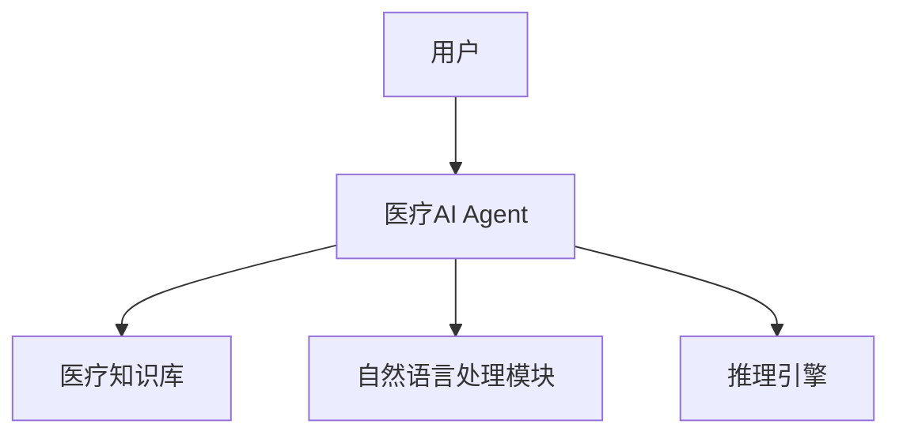
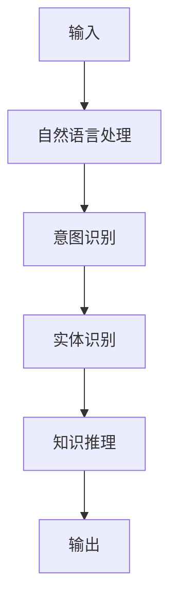
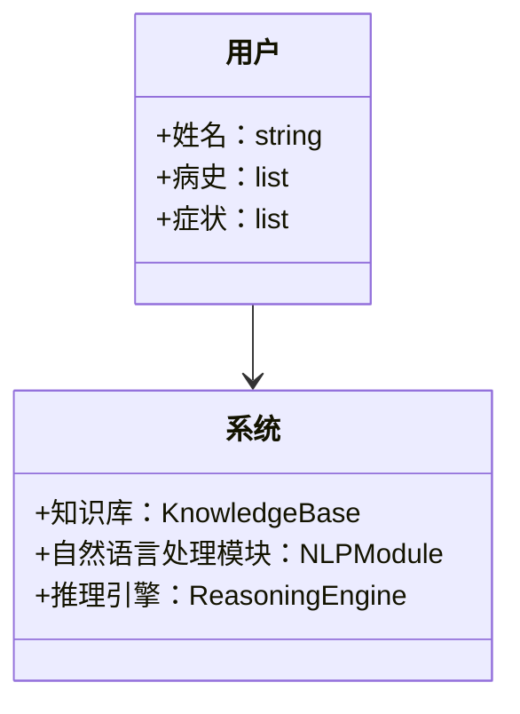
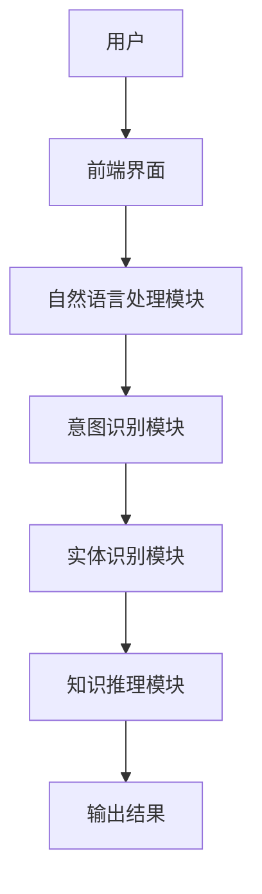
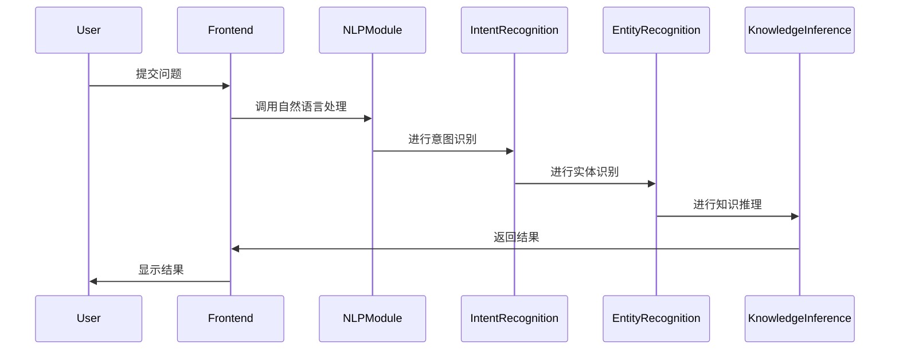

                 


# 医疗健康AI Agent：开发难点与突破

> 关键词：医疗AI Agent，人工智能，自然语言处理，知识图谱，系统架构，算法原理

> 摘要：医疗健康AI Agent是一种结合了人工智能技术的智能助手，能够通过自然语言处理和知识图谱推理，为医疗领域提供智能化服务。本文详细分析了医疗AI Agent的核心概念、算法原理、系统架构，以及开发过程中面临的挑战与解决方案，为医疗AI Agent的开发提供了理论支持和实践指导。

---

# 第一部分：医疗健康AI Agent的背景与挑战

## 第1章：医疗AI Agent的背景与概念

### 1.1 医疗AI Agent的发展背景

#### 1.1.1 医疗智能化的现状与趋势
随着人工智能技术的飞速发展，医疗领域逐渐成为AI技术的重要应用场景。医疗智能化的现状包括智能问诊、辅助诊断、药物研发等，而趋势则是向更精准、更个性化的医疗方向发展。

#### 1.1.2 AI在医疗领域的应用现状
目前，AI在医疗领域的应用主要集中在医学影像分析、疾病预测、药物研发等方面。AI技术的引入大大提高了医疗效率和准确性。

#### 1.1.3 医疗AI Agent的核心价值
医疗AI Agent作为医疗智能化的核心技术之一，能够通过自然语言处理和知识图谱推理，为医生和患者提供智能化的医疗支持。

### 1.2 医疗AI Agent的定义与特征

#### 1.2.1 医疗AI Agent的定义
医疗AI Agent是一种基于人工智能技术的智能助手，能够通过自然语言处理和知识图谱推理，为医疗领域提供智能化服务。

#### 1.2.2 医疗AI Agent的核心特征
- **数据驱动**：支持多模态数据输入（如文本、图像、语音）。
- **智能算法**：能够通过机器学习算法进行意图识别和决策优化。
- **人机交互**：提供自然语言交互界面，实现与用户的高效沟通。

#### 1.2.3 医疗AI Agent与传统医疗AI的区别
医疗AI Agent不仅能够处理结构化的数据，还能通过自然语言处理技术理解非结构化的医疗信息，具有更强的交互性和适应性。

### 1.3 医疗AI Agent的边界与外延

#### 1.3.1 医疗AI Agent的应用场景
- 智能问诊：帮助患者进行初步症状评估。
- 辅助诊断：为医生提供诊断建议和决策支持。
- 药物咨询：提供药物信息查询和用药建议。

#### 1.3.2 医疗AI Agent的局限性
- 数据隐私问题：医疗数据的敏感性导致隐私保护的挑战。
- 模型可解释性：复杂的算法模型难以解释其决策过程。
- 误诊风险：AI Agent的决策依赖于训练数据的质量和算法的准确性。

#### 1.3.3 医疗AI Agent的未来趋势
随着技术的不断进步，医疗AI Agent将更加智能化、个性化，能够更好地辅助医生和患者。

### 1.4 医疗AI Agent的核心要素

#### 1.4.1 数据驱动
医疗AI Agent需要处理大量的医疗数据，包括电子病历、医学影像、基因数据等。

#### 1.4.2 智能算法
通过机器学习和深度学习算法，医疗AI Agent能够进行意图识别、实体识别和知识推理。

#### 1.4.3 人机交互
医疗AI Agent需要提供自然语言交互界面，确保用户能够方便地使用AI服务。

## 第2章：医疗AI Agent的核心概念与联系

### 2.1 核心概念原理

#### 2.1.1 AI Agent的基本原理
AI Agent通过感知环境、理解用户需求、执行任务和反馈结果，实现与用户的高效交互。

#### 2.1.2 医疗AI Agent的核心算法
医疗AI Agent的核心算法包括自然语言处理、知识图谱推理和强化学习。

#### 2.1.3 医疗AI Agent的系统架构
医疗AI Agent的系统架构包括输入处理、意图识别、实体识别、知识推理和输出生成五个模块。

### 2.2 核心概念属性特征对比

| 概念         | 特征               | 描述                                                                 |
|--------------|--------------------|----------------------------------------------------------------------|
| 数据驱动     | 多模态性           | 支持文本、图像、语音等多种数据类型                                       |
| 智能算法     | 自适应性           | 能够根据反馈不断优化模型                                                 |
| 人机交互     | 用户友好性         | 提供自然语言交互界面，确保用户能够方便地使用AI服务                       |

### 2.3 ER实体关系图



---

## 第3章：医疗AI Agent的算法原理

### 3.1 算法原理概述

#### 3.1.1 基于Rasa框架的对话理解
Rasa框架是一种开源的对话理解框架，能够帮助开发者快速构建自然语言处理模型。

#### 3.1.2 基于强化学习的决策优化
强化学习是一种机器学习技术，通过不断试错和反馈，优化AI Agent的决策过程。

#### 3.1.3 基于知识图谱的推理
知识图谱是一种结构化的知识表示方法，能够帮助AI Agent进行推理和决策。

### 3.2 算法流程图



### 3.3 核心算法实现

#### 3.3.1 意图识别算法

```python
def intent_classifier(input_text):
    # 简化版意图识别算法
    return "问诊"
```

#### 3.3.2 实体识别算法

```python
def entityRecognizer(sentence):
    # 简化版实体识别算法
    return "症状"
```

#### 3.3.3 知识推理算法

```python
def knowledge_inference(query):
    # 简化版知识推理算法
    return "建议进一步检查"
```

### 3.4 算法的数学模型与公式

#### 3.4.1 意图识别的数学模型

$$ P(y|x) = \frac{P(x|y)P(y)}{P(x)} $$

其中，\( x \) 是输入文本，\( y \) 是意图类别。

#### 3.4.2 实体识别的数学模型

$$ f(x) = w_1 x_1 + w_2 x_2 + \dots + w_n x_n $$

其中，\( w_i \) 是特征权重，\( x_i \) 是特征向量。

---

## 第4章：医疗AI Agent的系统分析与架构设计

### 4.1 系统分析

#### 4.1.1 问题场景介绍
医疗AI Agent需要处理复杂的医疗信息，包括患者的症状描述、病史、用药情况等。

#### 4.1.2 系统功能设计
医疗AI Agent的功能包括智能问诊、辅助诊断、用药建议和健康咨询。

#### 4.1.3 领域模型设计



### 4.2 系统架构设计

#### 4.2.1 系统架构图



#### 4.2.2 系统交互设计



### 4.3 系统设计中的关键问题

#### 4.3.1 数据隐私
医疗数据的隐私保护是系统设计中的重要问题，需要通过加密和访问控制来实现。

#### 4.3.2 模型可解释性
医疗AI Agent的决策需要可解释，以便医生和患者能够理解AI的决策过程。

#### 4.3.3 系统可扩展性
医疗AI Agent需要能够适应不同的医疗场景和数据类型，确保系统的可扩展性。

---

## 第5章：医疗AI Agent的项目实战

### 5.1 环境安装

```bash
pip install rasa
pip install spacy
pip install networkx
```

### 5.2 核心实现

#### 5.2.1 自然语言处理模块

```python
import spacy

nlp = spacy.load("en_core_web_sm")
def process_text(text):
    doc = nlp(text)
    return [token.text for token in doc]
```

#### 5.2.2 意图识别模块

```python
from rasa.nlu import pipeline

config = pipeline.PipelineConfig(
    language="en",
    model="bert"
)
```

#### 5.2.3 知识推理模块

```python
import networkx as nx

G = nx.DiGraph()
G.add_edge("症状", "疾病")
G.add_edge("疾病", "治疗方案")
```

### 5.3 项目小结

通过本章的项目实战，读者可以了解医疗AI Agent的实现过程，包括环境搭建、模块开发和系统集成。

---

## 第6章：医疗AI Agent的最佳实践

### 6.1 小结
医疗AI Agent的开发需要综合考虑数据隐私、模型可解释性和系统扩展性。

### 6.2 注意事项
- 数据隐私保护是开发中的重要问题。
- 模型的可解释性需要特别关注。
- 系统的可扩展性设计需要充分考虑未来需求。

### 6.3 拓展阅读
- 《Deep Learning for Natural Language Processing》
- 《Knowledge Graph Construction and Application》

---

# 作者：AI天才研究院 & 禅与计算机程序设计艺术

