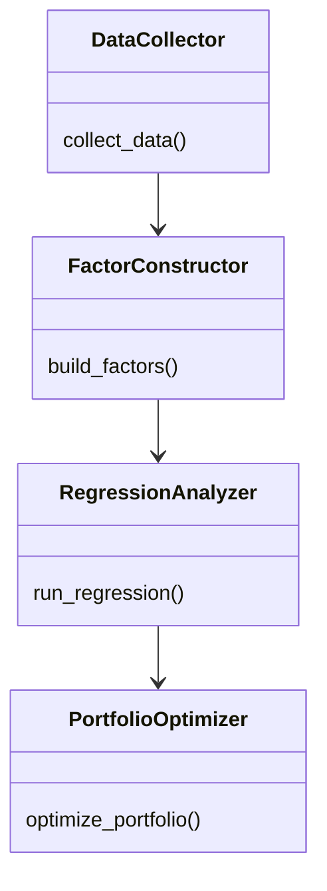

                 


# 另类beta策略：捕捉非传统风险溢价

> 关键词：另类beta策略，风险溢价，投资组合优化，数学模型，金融市场

> 摘要：本文详细探讨了另类beta策略的概念、原理及其在捕捉非传统风险溢价中的应用。通过分析传统beta策略的局限性，引出另类beta策略的核心思想，并结合数学模型和算法实现，展示了如何通过捕捉非传统风险溢价来优化投资组合。文章还提供了实际案例和系统设计，帮助读者更好地理解和应用另类beta策略。

---

## 第一部分：另类beta策略的背景与核心概念

### 第1章：另类beta策略的起源与背景

#### 1.1 传统beta策略的局限性

传统beta策略是投资学中的重要概念，用于衡量资产或投资组合相对于市场的波动性。然而，传统beta策略在实践中存在一些局限性：

- **局限性一：假设市场风险是唯一风险来源**  
  传统beta策略假设市场风险是唯一的风险来源，但实际情况中，市场中还存在其他类型的风险，例如流动性风险、信用风险等。

- **局限性二：无法捕捉非传统风险溢价**  
  传统beta策略主要关注市场波动性，但忽略了非传统风险溢价的捕捉。例如，某些资产可能因为特定事件或市场结构而产生额外的风险溢价，而传统beta策略无法有效捕捉这些溢价。

- **局限性三：忽视市场异象**  
  传统beta策略基于有效市场的假设，但现实中存在许多市场异象（如动量效应、反转效应等），这些异象可能导致非传统风险溢价的存在。

#### 1.2 另类beta策略的核心概念

另类beta策略是一种新兴的投资策略，旨在捕捉传统beta策略无法捕捉的非传统风险溢价。其核心概念包括：

- **非传统风险溢价**  
  非传统风险溢价是指由市场异象、结构化产品或其他复杂因素产生的额外收益。例如，某些资产由于市场参与者的行为偏差，可能产生套利机会。

- **另类beta组合**  
  另类beta组合是一种投资组合，其beta系数（相对于传统市场指数）较低，但通过捕捉非传统风险溢价，能够获得超额收益。

- **多因子模型扩展**  
  另类beta策略通常基于多因子模型，但引入了非传统的因子，例如动量因子、质量因子等，以捕捉更多维度的风险溢价。

#### 1.3 另类beta策略的理论基础

另类beta策略的理论基础主要来源于以下几个方面：

- **现代投资组合理论（MPT）**  
  MPT强调通过分散投资来降低风险，但传统MPT假设市场是有效的，忽略了非传统风险溢价的存在。

- **行为金融学**  
  行为金融学研究表明，投资者的行为偏差可能导致市场异象，从而产生非传统风险溢价。

- **因子投资理论**  
  因子投资理论认为，资产的收益可以通过多个因子来解释。另类beta策略扩展了传统因子模型，引入了非传统的因子。

---

### 第2章：另类beta策略的核心原理

#### 2.1 另类beta策略的原理

另类beta策略的核心原理是通过捕捉非传统风险溢价来优化投资组合。具体步骤如下：

1. **识别非传统风险溢价来源**  
   通过分析市场异象、结构化产品或其他复杂因素，识别可能存在的非传统风险溢价。

2. **构建另类beta组合**  
   根据识别的非传统风险溢价，构建一个beta系数较低但能够捕捉这些溢价的投资组合。

3. **优化投资组合**  
   使用数学优化方法，调整投资组合的权重，以最大化非传统风险溢价的捕捉，同时保持较低的整体风险。

#### 2.2 另类beta策略与alpha策略的对比

| 对比维度 | 另类beta策略 | Alpha策略 |
|----------|--------------|------------|
| 目标     | 捕捉非传统风险溢价 | 捕捉alpha收益（超额收益） |
| 风险敞口 | beta敞口较低，但通过非传统因子捕捉额外溢价 | beta敞口较低，主要通过alpha因子捕捉超额收益 |
| 实施难度 | 较高，需要复杂的数据分析和建模 | 较高，需要复杂的因子模型和优化方法 |

#### 2.3 另类beta策略的数学模型

传统的beta系数定义为资产收益与市场收益的相关性：

$$ beta = \frac{cov(r_i, r_m)}{var(r_m)} $$

而在另类beta策略中，我们引入了非传统因子，例如动量因子（MOM）和质量因子（QUAL），构建多因子模型：

$$ r_i = \alpha + \beta_1 r_{m} + \beta_{alt} r_{alt} + \epsilon $$

其中，$r_{alt}$代表非传统因子的收益，$\beta_{alt}$为对应的beta系数。

---

## 第二部分：另类beta策略的算法实现

### 第3章：另类beta策略的算法实现

#### 3.1 另类beta策略的算法流程

以下是另类beta策略的算法流程：

1. **数据收集**  
   收集相关资产的历史价格数据和因子数据（如动量、质量等）。

2. **因子构建**  
   根据因子模型，构建非传统因子（如动量因子、质量因子）。

3. **回归分析**  
   对每个资产进行回归分析，计算其对传统因子和非传统因子的beta系数。

4. **组合优化**  
   根据beta系数，优化投资组合的权重，以最大化非传统风险溢价的捕捉。

5. **风险控制**  
   调整组合的总体风险敞口，确保其在可接受范围内。

#### 3.2 另类beta策略的数学模型

以下是一个简单的另类beta策略的数学模型：

$$ max \quad w^T r_p - \lambda w^T Q w $$

其中，$w$为投资组合的权重，$r_p$为目标收益向量，$Q$为风险矩阵，$\lambda$为惩罚因子。

通过拉格朗日乘数法，可以求解最优权重：

$$ w = \arg min \quad \lambda w^T Q w - w^T r_p $$

#### 3.3 另类beta策略的代码实现

以下是另类beta策略的Python代码示例：

```python
import pandas as pd
import numpy as np
from sklearn.linear_model import LinearRegression

# 数据预处理
data = pd.read_csv('data.csv')
X = data[[' MOM ', ' QUAL ']]
y = data[' Return ']

# 构建回归模型
model = LinearRegression()
model.fit(X, y)

# 计算beta系数
beta = model.coef_

# 优化投资组合
def optimize_portfolio(beta, risk_parity=0.5):
    n = len(beta)
    Q = np.eye(n) * risk_parity
    w = np.linalg.solve(Q, beta)
    return w

weights = optimize_portfolio(beta)
print(weights)
```

---

## 第三部分：系统分析与架构设计

### 第4章：系统分析与架构设计

#### 4.1 系统功能设计

以下是系统功能设计的Mermaid类图：



#### 4.2 系统架构设计

以下是系统架构设计的Mermaid架构图：

```mermaid
archi
title System Architecture Diagram

actor Investor
actor Data Source
actor Portfolio Optimizer
actor Risk Controller

portfolioOptimizer --> Investor: Provides optimized portfolio
portfolioOptimizer --> DataSource: Fetches historical data
portfolioOptimizer --> FactorConstructor: Builds non-traditional factors
portfolioOptimizer --> RiskController: Adjusts overall risk
```

---

## 第四部分：项目实战

### 第5章：项目实战

#### 5.1 环境安装

以下是项目实战所需的环境安装步骤：

1. 安装Python和相关库：
   ```bash
   pip install numpy pandas scikit-learn
   ```

2. 安装Jupyter Notebook：
   ```bash
   pip install jupyter
   ```

#### 5.2 系统核心实现

以下是系统核心实现的代码：

```python
import numpy as np
import pandas as pd
from sklearn.linear_model import LinearRegression

class DataCollector:
    def collect_data(self):
        # 模拟数据收集
        np.random.seed(42)
        data = pd.DataFrame({
            ' MOM ': np.random.randn(100, 1),
            ' QUAL ': np.random.randn(100, 1),
            ' Return ': np.random.randn(100, 1)
        })
        return data

class FactorConstructor:
    def build_factors(self, data):
        # 模拟构建因子
        data[' MOM '] = data[' MOM '].rank()
        data[' QUAL '] = data[' QUAL '].rank()
        return data

class RegressionAnalyzer:
    def run_regression(self, data):
        X = data[[' MOM ', ' QUAL ']]
        y = data[' Return ']
        model = LinearRegression()
        model.fit(X, y)
        return model.coef_

class PortfolioOptimizer:
    def optimize_portfolio(self, beta):
        n = len(beta)
        Q = np.eye(n) * 0.5
        w = np.linalg.solve(Q, beta)
        return w

# 主程序
data_collector = DataCollector()
factor_constructor = FactorConstructor()
regression_analyzer = RegressionAnalyzer()
portfolio_optimizer = PortfolioOptimizer()

data = data_collector.collect_data()
data = factor_constructor.build_factors(data)
beta = regression_analyzer.run_regression(data)
weights = portfolio_optimizer.optimize_portfolio(beta)
print("Optimized Weights:", weights)
```

#### 5.3 代码应用解读

上述代码实现了另类beta策略的核心流程，包括数据收集、因子构建、回归分析和组合优化。通过模拟数据和简单模型，展示了如何捕捉非传统风险溢价。

#### 5.4 实际案例分析

假设我们有一个包含10只股票的投资组合，目标是通过另类beta策略捕捉动量因子带来的非传统风险溢价。我们首先收集每只股票的动量因子和质量因子数据，然后构建回归模型，计算每只股票的beta系数，最后优化投资组合的权重，以最大化非传统风险溢价的捕捉。

---

## 第五部分：最佳实践

### 第6章：最佳实践

#### 6.1 小结

另类beta策略通过捕捉非传统风险溢价，为投资者提供了一种新的投资方式。与传统beta策略相比，另类beta策略能够更好地适应市场异象和复杂因素，捕捉更多的超额收益。

#### 6.2 注意事项

- **数据质量**  
  数据的准确性和完整性对另类beta策略的成功至关重要。建议使用高质量的历史数据和实时数据。

- **模型选择**  
  在选择回归模型和优化方法时，需要根据实际情况进行调整，避免过度拟合。

- **风险控制**  
  尽管另类beta策略能够捕捉非传统风险溢价，但仍需注意整体风险的控制，确保投资组合的稳定性。

#### 6.3 拓展阅读

- "The New Finance: The Case for SABMiller" by James Scurlock
- "Alternative Risk Premia" by Andrew Ang

---

作者：AI天才研究院/AI Genius Institute & 禅与计算机程序设计艺术 /Zen And The Art of Computer Programming

---

以上是《另类beta策略：捕捉非传统风险溢价》的完整目录大纲和文章内容。希望这篇文章能为您提供有价值的信息和启发。

