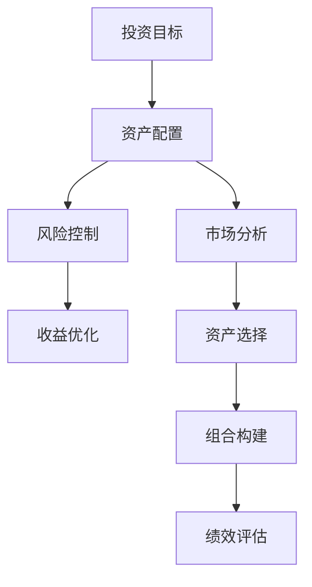

                 

# 另类投资在投资组合中的作用

> 关键词：另类投资，投资组合，风险管理，资产配置，夏普比率

> 摘要：本文探讨了另类投资在现代投资组合中的重要性，分析了其在分散风险、提高收益和对冲通胀方面的作用，提供了配置策略和风险管理的最佳实践。

---

## 第一章: 另类投资的背景与概念

### 1.1 另类投资的背景介绍

#### 1.1.1 传统投资的局限性

传统投资组合主要由股票和债券构成，但在市场波动加剧的情况下，其表现可能不尽如人意。例如，2008年金融危机期间，传统资产遭受重创，促使投资者寻求更多元化的投资方式。

#### 1.1.2 另类投资的兴起与发展趋势

随着金融市场的复杂化，另类投资因其多样性逐渐受到重视。近年来，房地产、私募股权和对冲基金等另类资产的规模持续增长，成为投资组合中不可或缺的一部分。

#### 1.1.3 另类投资的定义与核心要素

另类投资指传统股票和债券之外的资产，具有高风险、高回报的特性。其核心要素包括资产类别、风险特征和流动性。

### 1.2 另类投资的分类与特点

#### 1.2.1 另类投资的主要分类

- **房地产投资**：通过购买房地产或房地产投资信托（REITs）进行投资。
- **私募股权**：投资于未上市公司，通过长期持有获得收益。
- **对冲基金**：采用多种策略，如套利、做空等，追求绝对收益。
- **基础设施投资**：投资于交通、能源等基础设施项目。

#### 1.2.2 各类另类投资的特点对比

| 资产类别 | 风险 | 收益 | 流动性 |
|----------|------|------|--------|
| 房地产   | 中高 | 中高 | 较低    |
| 私募股权 | 高   | 高   | 极低    |
| 对冲基金 | 中高 | 中高 | 较高    |
| 基础设施| 中   | 中   | 较低    |

#### 1.2.3 另类投资与传统投资的联系与区别

传统投资和另类投资在风险、收益和流动性方面有显著差异。例如，股票和债券的流动性较高，但收益和风险相对有限，而另类资产则可能提供更高的收益，但流动性较差。

---

## 第二章: 另类投资的核心概念与理论基础

### 2.1 另类投资的理论基础

#### 2.1.1 资产配置理论

资产配置理论强调通过合理分配不同资产类别来优化风险和收益。在现代投资组合理论（MPT）的基础上，引入另类资产可以有效分散风险。

#### 2.1.2 风险收益平衡理论

在投资决策中，需在风险和收益之间找到平衡点。另类资产由于其高波动性，可能在高风险情况下提供更高收益。

#### 2.1.3 现代投资组合理论（MPT）的扩展

MPT扩展至多资产类别，包括另类资产，以实现更优的风险调整后收益。例如，通过配置私募股权，投资者可以在市场低迷时获得稳定收益。

### 2.2 另类投资的数学模型与公式

#### 2.2.1 投资组合的夏普比率计算公式

$$ \text{夏普比率} = \frac{E[r_p - r_f]}{\sigma_p} $$

其中，$r_p$ 是投资组合的预期收益，$r_f$ 是无风险利率，$\sigma_p$ 是投资组合的收益标准差。

#### 2.2.2 风险调整后的收益模型

通过夏普比率，投资者可以量化投资组合在承担额外风险时所获得的超额收益。

#### 2.2.3 多因子资产定价模型

利用多因子模型，分析影响另类资产收益的关键因素，如市场风险、流动性风险等。

### 2.3 另类投资的系统分析与架构设计

#### 2.3.1 投资组合的系统架构图（Mermaid）

---

## 第三章: 另类投资在投资组合中的作用

### 3.1 分散风险的作用机制

通过配置不同类型的另类资产，降低投资组合的整体风险。例如，在股市低迷时，房地产投资可能表现较好。

### 3.2 提高收益的潜在可能性

另类资产可能在高通胀或市场波动时提供更高收益，从而提高投资组合的整体回报。

### 3.3 对冲通货膨胀的有效性

另类资产如房地产和基础设施投资，通常能较好地对冲通货膨胀风险。

---

## 第四章: 另类投资的策略与方法

### 4.1 另类投资的配置策略

#### 4.1.1 恒定权重配置

按照固定比例分配资金到不同资产类别，定期再平衡。

#### 4.1.2 风险平价配置

根据各资产的风险贡献进行分配，以实现风险的均衡。

### 4.2 另类资产的选择与评估

需考虑流动性、风险和收益，选择与整体投资目标匹配的资产。

### 4.3 动态调整策略

根据市场变化，定期评估并调整投资组合，以保持最优配置。

---

## 第五章: 另类投资的风险管理

### 5.1 另类投资的风险类型

- **流动性风险**：难以快速变现。
- **信用风险**：债务违约风险。
- **市场风险**：价格波动风险。

### 5.2 风险控制机制

- 定期评估资产的风险敞口。
- 设立止损点，控制潜在损失。
- 分散投资，降低集中风险。

---

## 第六章: 另类投资的案例分析

### 6.1 案例一：房地产投资

通过配置房地产信托基金（REITs），投资者可以在房地产市场波动时获得稳定收益。

### 6.2 案例二：私募股权

投资于高增长的初创企业，可能在企业上市或被收购时获得高额回报。

---

## 第七章: 另类投资的未来发展趋势

### 7.1 科技发展的影响

科技的进步将推动另类投资的数字化转型，如区块链技术的应用。

### 7.2 ESG投资的兴起

环境、社会和公司治理（ESG）因素逐渐成为投资决策的重要考量。

### 7.3 数字化转型

通过大数据和人工智能技术，提高投资决策的效率和准确性。

---

## 第八章: 结论与展望

### 8.1 结论

另类投资在优化投资组合方面具有重要作用，通过合理配置，投资者可以在风险可控的前提下获得更高收益。

### 8.2 展望

未来，随着科技的发展和市场环境的变化，另类投资将继续发展，为投资者提供更多的机会。

---

## 附录

### 附录A: 相关法规与政策

### 附录B: 进一步阅读推荐

### 附录C: 数据与图表

---

作者：AI天才研究院/AI Genius Institute & 禅与计算机程序设计艺术 /Zen And The Art of Computer Programming

