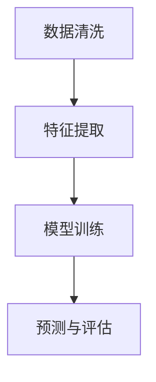
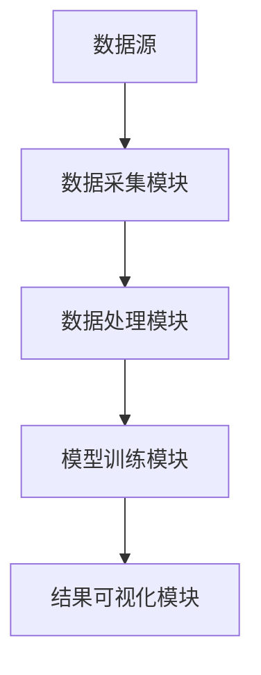
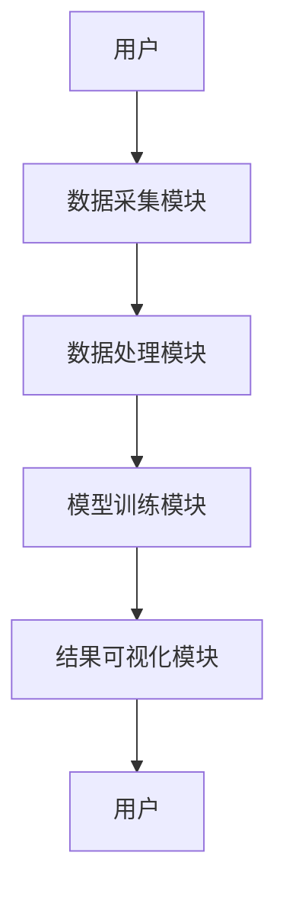

                 


```markdown
# 另类数据在投资分析中的价值

> 关键词：另类数据，投资分析，机器学习，数据科学，金融技术

> 摘要：随着金融市场的发展，传统金融数据的局限性日益显现，另类数据的应用逐渐成为投资分析的重要趋势。本文系统地探讨了另类数据的定义、分类、算法原理及其在投资分析中的实际应用。通过分析不同类型的另类数据及其特点，本文深入阐述了如何利用机器学习算法对另类数据进行处理与分析，并结合实际案例展示了另类数据在投资组合优化、风险管理及市场情绪分析中的价值。此外，本文还探讨了投资分析系统的架构设计及实现过程，为读者提供了全面的视角和实用的指导。

---

# 第1章: 另类数据的定义与背景

## 1.1 传统金融数据的局限性
### 1.1.1 传统金融数据的定义与特点
传统金融数据主要包括股票价格、成交量、市盈率等财务指标，这些数据通常具有以下特点：
- **结构化**：数据通常以表格形式存在，易于处理。
- **有限性**：仅包含市场交易数据，无法反映市场以外的因素。
- **滞后性**：许多数据（如财务报表）通常滞后于市场变化。

### 1.1.2 传统金融数据的局限性
尽管传统金融数据在投资分析中占据重要地位，但其局限性日益明显：
- **信息有限**：无法反映市场的实时动态和非量化因素。
- **难以预测**：仅依赖历史数据可能导致模型对未来的预测能力不足。
- **同质化**：大量投资者依赖相同的数据，导致信息优势难以获取。

### 1.1.3 另类数据的兴起背景
随着科技的发展，数据来源的多样化为投资分析提供了新的可能性。以下因素推动了另类数据的兴起：
- **技术进步**：大数据、人工智能等技术的发展使得处理非结构化数据成为可能。
- **市场竞争**：投资者为获得信息优势，纷纷转向另类数据。
- **数据丰富性**：社交媒体、卫星图像等新型数据源的出现，为投资分析提供了更多维度的信息。

## 1.2 另类数据的核心概念
### 1.2.1 另类数据的定义
另类数据是指传统金融数据之外的其他数据，包括文本、图像、声音、传感器数据等。这些数据通常非结构化，且来源多样。

### 1.2.2 另类数据的主要类型
另类数据可以分为以下几类：
- **文本数据**：如新闻、社交媒体帖子、公司财报。
- **图像数据**：如卫星图像、公司 logos。
- **声音数据**：如电话会议录音、市场播报。
- **传感器数据**：如天气数据、交通流量数据。

### 1.2.3 另类数据在投资分析中的优势
相比传统金融数据，另类数据具有以下优势：
- **实时性**：许多另类数据能够提供市场的实时动态。
- **信息丰富性**：另类数据能够捕捉到传统数据无法反映的市场情绪和趋势。
- **差异化**：利用另类数据可以构建差异化的投资策略，获得信息优势。

## 1.3 另类数据的应用场景
### 1.3.1 投资组合优化
通过分析另类数据，投资者可以更好地识别市场趋势和潜在风险，从而优化投资组合。

### 1.3.2 风险管理
另类数据可以帮助投资者实时监控市场风险，例如通过社交媒体情绪分析预测市场波动。

### 1.3.3 市场情绪分析
通过分析社交媒体、新闻等文本数据，投资者可以实时了解市场情绪，从而做出更明智的投资决策。

## 1.4 本章小结
本章介绍了传统金融数据的局限性，提出了另类数据的概念，并详细分析了另类数据的类型及其在投资分析中的优势和应用场景。

---

# 第2章: 另类数据的分类与特征

## 2.1 另类数据的分类
### 2.1.1 文本数据
文本数据是另类数据的重要组成部分，主要包括新闻、社交媒体帖子、公司财报等。

### 2.1.2 图像数据
图像数据包括卫星图像、公司 logos 等，可以通过图像识别技术进行分析。

### 2.1.3 声音数据
声音数据包括电话会议录音、市场播报等，可以通过语音识别技术进行分析。

### 2.1.4 传感器数据
传感器数据包括天气数据、交通流量数据等，可以通过物联网技术进行采集和分析。

## 2.2 另类数据的特征分析
### 2.2.1 数据的实时性
许多另类数据具有较强的实时性，例如社交媒体帖子和新闻报道可以实时反映市场动态。

### 2.2.2 数据的非结构化特性
另类数据通常是非结构化的，例如文本、图像等，需要通过特定的技术进行处理和分析。

### 2.2.3 数据的稀疏性与噪声
另类数据通常具有较高的噪声，例如社交媒体上的情绪化言论可能不具有实际投资价值。

## 2.3 另类数据的处理挑战
### 2.3.1 数据清洗与预处理
由于另类数据通常非结构化且噪声较多，需要进行清洗和预处理，例如去停用词、分词等。

### 2.3.2 数据标注与质量
另类数据的标注可能需要专业知识，例如对新闻进行情感分类需要准确的标注。

### 2.3.3 数据隐私与合规性
处理另类数据时需要遵守相关法律法规，例如GDPR等数据隐私规定。

## 2.4 本章小结
本章详细分析了另类数据的分类及其特征，并探讨了在处理过程中可能面临的挑战。

---

# 第3章: 另类数据在投资分析中的算法原理

## 3.1 数据清洗与特征提取
### 3.1.1 文本数据的分词与情感分析
对于文本数据，首先需要进行分词，例如将中文文本分词成词语。然后，可以通过情感分析模型（如BERT）对文本进行情感分类。

### 3.1.2 图像数据的特征提取
对于图像数据，可以使用卷积神经网络（CNN）提取图像特征。

### 3.1.3 数据标准化与归一化
在进行模型训练之前，通常需要对数据进行标准化或归一化处理，例如将数据归一化到[0,1]范围。

## 3.2 机器学习算法的应用
### 3.2.1 监督学习
- **回归**：用于预测股票价格。
- **分类**：用于分类市场情绪（ bullish, bearish, neutral）。

### 3.2.2 非监督学习
- **聚类**：用于将相似的公司或行业进行分组。

### 3.2.3 深度学习
- **LSTM**：用于时间序列预测。
- **BERT**：用于文本理解和情感分析。

## 3.3 算法流程图


## 3.4 数学模型与公式
### 3.4.1 线性回归模型
$$ y = \beta_0 + \beta_1x + \epsilon $$

### 3.4.2 随机森林模型
$$ y = \sum_{i=1}^{n} (\text{特征重要性}) $$

## 3.5 本章小结
本章介绍了在投资分析中常用的机器学习算法及其应用，并通过流程图和公式展示了算法的实现过程。

---

# 第4章: 投资分析系统的架构设计

## 4.1 系统功能模块
### 4.1.1 数据采集模块
负责从各种数据源（如社交媒体、新闻网站）采集数据。

### 4.1.2 数据处理模块
对采集到的数据进行清洗、特征提取和标注。

### 4.1.3 模型训练模块
使用机器学习算法对数据进行建模和训练。

### 4.1.4 结果可视化模块
将模型的预测结果进行可视化展示。

## 4.2 系统架构图


## 4.3 系统接口设计
### 4.3.1 数据接口
定义数据的输入格式和接口协议。

### 4.3.2 模型接口
定义模型的输入和输出接口。

### 4.3.3 用户接口
定义用户与系统的交互界面。

## 4.4 系统交互流程图


## 4.5 本章小结
本章详细设计了投资分析系统的架构，包括功能模块、接口设计和系统交互流程。

---

# 第5章: 项目实战与案例分析

## 5.1 项目环境安装
需要安装以下工具和库：
- Python
- Pandas
- Scikit-learn
- TensorFlow
- NLTK
- Matplotlib

## 5.2 核心代码实现
### 5.2.1 数据采集
```python
import requests
from bs4 import BeautifulSoup

def get_news(url):
    response = requests.get(url)
    soup = BeautifulSoup(response.text, 'html.parser')
    articles = soup.find_all('article')
    return articles
```

### 5.2.2 数据处理
```python
from sklearn.feature_extraction.text import TfidfVectorizer

def preprocess(text):
    # 分词和预处理
    pass

vectorizer = TfidfVectorizer()
features = vectorizer.fit_transform(texts)
```

### 5.2.3 模型训练
```python
from sklearn.ensemble import RandomForestClassifier

model = RandomForestClassifier()
model.fit(features, labels)
```

### 5.2.4 结果可视化
```python
import matplotlib.pyplot as plt

plt.plot(history.history['accuracy'])
plt.title('Model Accuracy')
plt.xlabel('epoch')
plt.ylabel('accuracy')
plt.show()
```

## 5.3 案例分析
### 5.3.1 情绪分析
通过分析社交媒体上的情绪，预测股票价格的变化。

### 5.3.2 风险管理
通过分析传感器数据，预测市场波动并进行风险管理。

## 5.4 本章小结
本章通过实际案例展示了如何利用另类数据进行投资分析，并提供了详细的代码实现和案例解读。

---

# 第6章: 小结与展望

## 6.1 本章小结
本文系统地探讨了另类数据在投资分析中的价值，详细分析了另类数据的分类、算法原理和系统架构设计，并通过实际案例展示了如何利用另类数据进行投资分析。

## 6.2 未来展望
随着技术的进步，另类数据在投资分析中的应用将更加广泛和深入。未来的研究方向包括：
- 更高效的另类数据处理技术。
- 更精准的机器学习算法。
- 更智能化的投资分析系统。

## 6.3 注意事项
在实际应用中，需要注意数据隐私、模型过拟合等问题，确保投资分析的科学性和合规性。

## 6.4 拓展阅读
推荐阅读以下书籍和文章：
- 《机器学习实战》
- 《数据驱动的投资》
- 《金融数据科学》

---

# 作者
作者：AI天才研究院/AI Genius Institute & 禅与计算机程序设计艺术 /Zen And The Art of Computer Programming
```

