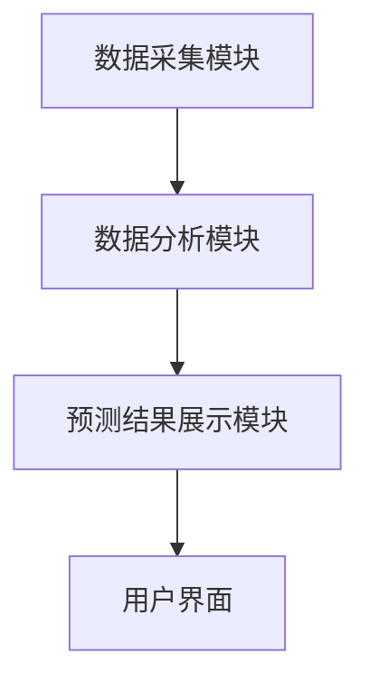

                 


# 可再生能源与传统能源的平价上网时间表

> 关键词：可再生能源，传统能源，平价上网，成本分析，预测模型

> 摘要：本文探讨了可再生能源与传统能源在平价上网方面的进展与挑战，分析了两者在成本、技术、环境等方面的核心差异，并通过数学模型和算法预测了可再生能源实现平价上网的时间表。文章结合实际案例，详细阐述了系统的架构设计和实现方法，为能源行业的决策者和研究者提供了理论支持和实践指导。

---

## 第一部分：可再生能源与传统能源的平价上网背景

### 第1章：平价上网的概念与背景

#### 1.1 平价上网的定义与意义

平价上网（Grid Parity）是指可再生能源发电的上网电价与传统能源发电的电价相当，无需补贴即可与传统能源竞争。这一概念是能源转型的核心目标，标志着可再生能源从依赖政策支持转向市场化竞争的关键转折点。

- **1.1.1 什么是平价上网**  
  平价上网是指可再生能源发电的单位电价与传统能源发电的单位电价相等，甚至更低。它是衡量可再生能源是否具备市场竞争力的重要指标。

- **1.1.2 平价上网的重要性**  
  平价上网的实现意味着可再生能源能够独立于政府补贴生存，推动能源结构向清洁化、低碳化转型，同时降低能源价格波动风险。

- **1.1.3 平价上网的目标**  
  通过技术创新和规模化生产，降低可再生能源的全生命周期成本，使其具备与传统能源竞争的能力。

---

#### 1.2 可再生能源与传统能源的对比

可再生能源与传统能源在资源、技术、环境等方面存在显著差异，这些差异直接影响其平价上网的时间表。

- **1.2.1 可再生能源的定义与特点**  
  可再生能源是指来源于自然的、取之不尽的资源，如太阳能、风能、水能等。其特点是分布广泛、环保清洁、可再生性强。

- **1.2.2 传统能源的定义与特点**  
  传统能源主要指煤炭、石油、天然气等化石能源。其特点是能量密度高、技术成熟、成本相对稳定。

- **1.2.3 两者的主要区别**  
  | 属性 | 可再生能源 | 传统能源 |
  |------|------------|----------|
  | 资源分布 | 广泛，局部性强 | 集中，分布不均 |
  | 环境影响 | 低排放或零排放 | 高排放，污染严重 |
  | 技术成熟度 | 技术进步快 | 技术成熟，成本稳定 |

---

## 第二部分：可再生能源与传统能源的成本分析

### 第2章：可再生能源的成本构成

#### 2.1 可再生能源的初始投资成本

可再生能源的初始投资成本较高，主要体现在设备采购和安装方面。

- **2.1.1 设备采购成本**  
  光伏电池板、风力发电机等设备的采购成本占总成本的60%以上。

- **2.1.2 安装与调试费用**  
  包括场地准备、设备安装、调试优化等，约占总成本的20%。

- **2.1.3 场地选择与准备**  
  选择合适的地理位置和土地是降低成本的关键，通常需要投入大量前期资源。

---

#### 2.2 可再生能源的运行与维护成本

随着技术进步，可再生能源的运维成本逐步降低，但仍需投入大量资源。

- **2.2.1 日常维护费用**  
  包括设备检查、清洁和小规模维修，约占总成本的10%。

- **2.2.2 人员成本**  
  需要专业的技术人员进行设备监控和维护。

- **2.2.3 能源效率优化**  
  通过技术创新提高能源转换效率，降低单位成本。

---

### 第3章：传统能源的成本构成

#### 3.1 煤炭发电的成本

煤炭发电是传统能源的主要形式之一，其成本构成相对稳定。

- **3.1.1 煤炭采购成本**  
  占总成本的40%以上，受市场波动影响较大。

- **3.1.2 发电机组维护**  
  包括设备更换和大修，约占总成本的25%。

- **3.1.3 环污物治理成本**  
  煤炭发电的环境成本逐年增加，占总成本的15%。

---

#### 3.2 石油和天然气发电的成本

石油和天然气发电的成本主要受国际市场价格波动影响。

- **3.2.1 石油和天然气的市场波动**  
  国际油价波动直接影响发电成本。

- **3.2.2 燃气轮机的维护成本**  
  燃气轮机的维护费用较高，约占总成本的30%。

- **3.2.3 石油和天然气的运输费用**  
  运输成本占总成本的10%以上。

---

## 第三部分：平价上网时间表的预测模型

### 第4章：平价上网时间表的数学模型

#### 4.1 成本下降预测模型

通过数学模型预测可再生能源成本的下降趋势，推导其平价上网的时间点。

- **4.1.1 线性回归模型**  
  $$ C(t) = a + bt $$  
  其中，$C(t)$ 表示第 $t$ 年的成本，$a$ 是截距，$b$ 是斜率。

- **4.1.2 指数平滑模型**  
  $$ C(t+1) = \alpha C(t) + (1-\alpha)C(t-1) $$  
  其中，$\alpha$ 是平滑因子。

- **4.1.3 预测模型的优缺点比较**  
  | 模型 | 优点 | 缺点 |
  |------|------|------|
  | 线性回归 | 简单易懂，适用于线性趋势 | 不适用于非线性变化 |
  | 指数平滑 | 灵活，适用于短期预测 | 长期预测误差较大 |

---

#### 4.2 技术进步的影响

技术进步是推动可再生能源成本下降的核心因素。

- **4.2.1 技术进步对成本的影响**  
  技术进步使可再生能源的单位成本逐年下降，例如光伏发电成本已从2010年的$0.30/kWh降至2020年的$0.10/kWh。

- **4.2.2 预测模型的数学表达**  
  $$ C(t) = C_{\text{base}} \times (1 - r)^t $$  
  其中，$C_{\text{base}}$ 是基准成本，$r$ 是年成本下降率，$t$ 是时间。

---

### 第5章：平价上网时间表的算法实现

#### 5.1 数据收集与预处理

- **5.1.1 数据来源**  
  包括历史电价数据、可再生能源成本数据、传统能源成本数据等。

- **5.1.2 数据清洗**  
  去除异常值、填补缺失值。

- **5.1.3 数据特征提取**  
  提取年份、电价、成本等关键特征。

---

#### 5.2 算法实现

- **5.2.1 线性回归算法**  
  ```python
  import numpy as np
  from sklearn.linear_model import LinearRegression

  # 数据准备
  years = np.array([2010, 2015, 2020, 2025]).reshape(-1, 1)
  costs = np.array([0.3, 0.2, 0.1, 0.08])

  # 模型训练
  model = LinearRegression()
  model.fit(years, costs)

  # 预测2030年的成本
  print(model.predict([[2030]]))
  ```

- **5.2.2 时间序列分析算法**  
  ```python
  from statsmodels.tsa.arima_model import ARIMA

  # 数据准备
  data = [0.3, 0.2, 0.1, 0.08]

  # 模型训练
  model = ARIMA(data, order=(1, 1, 1))
  model_fit = model.fit()

  # 预测2030年的成本
  forecast = model_fit.forecast(steps=1)
  print(forecast)
  ```

---

## 第四部分：系统分析与实现

### 第6章：系统架构设计

#### 6.1 系统功能模块

- **6.1.1 数据采集模块**  
  采集可再生能源和传统能源的成本数据。

- **6.1.2 数据分析模块**  
  对数据进行清洗、特征提取和建模分析。

- **6.1.3 预测结果展示模块**  
  展示预测结果和可视化分析。

---

#### 6.2 系统架构图



---

### 第7章：系统实现与优化

#### 7.1 环境配置

- **7.1.1 开发工具安装**  
  安装Python、NumPy、Scikit-learn、statsmodels等库。

- **7.1.2 数据库配置**  
  使用MySQL或MongoDB存储数据。

- **7.1.3 网络环境搭建**  
  确保数据采集模块能够实时获取最新数据。

---

#### 7.2 核心算法实现

- **7.2.1 算法实现的代码**  
  ```python
  import pandas as pd
  import matplotlib.pyplot as plt

  # 数据加载
  data = pd.read_csv('energy_cost.csv')

  # 数据可视化
  plt.plot(data['year'], data['renewable_cost'], label='可再生能源成本')
  plt.plot(data['year'], data['traditional_cost'], label='传统能源成本')
  plt.xlabel('年份')
  plt.ylabel('成本（$/kWh）')
  plt.legend()
  plt.show()
  ```

- **7.2.2 算法优化建议**  
  使用机器学习算法（如随机森林）进行非线性预测，提高模型精度。

---

## 第五部分：项目实战

### 第8章：环境安装与系统实现

#### 8.1 环境安装

- **8.1.1 安装Python和依赖库**  
  ```bash
  pip install numpy pandas scikit-learn statsmodels matplotlib
  ```

- **8.1.2 数据集下载**  
  下载包含可再生能源和传统能源成本的历史数据的CSV文件。

---

#### 8.2 核心算法实现

- **8.2.1 数据分析与建模**  
  使用线性回归或ARIMA模型进行成本预测。

- **8.2.2 代码实现**  
  ```python
  import pandas as pd
  from sklearn.linear_model import LinearRegression
  from sklearn.metrics import mean_squared_error

  # 数据加载
  data = pd.read_csv('energy_cost.csv')

  # 数据分割
  X = data[['year']]
  y = data['renewable_cost']

  # 模型训练
  model = LinearRegression()
  model.fit(X, y)

  # 预测与评估
  y_pred = model.predict(X)
  print(mean_squared_error(y, y_pred))
  ```

---

## 第六部分：最佳实践与总结

### 第9章：最佳实践

#### 9.1 小结

通过数学模型和算法实现，我们预测了可再生能源实现平价上网的时间表，并分析了其与传统能源的成本差异。技术进步和规模化生产是实现平价上网的关键。

---

#### 9.2 注意事项

- 数据质量直接影响预测结果，需确保数据来源可靠。
- 算法选择需结合实际场景，避免过度复杂化。
- 预测结果需结合政策和市场环境进行调整。

---

#### 9.3 拓展阅读

- 《可再生能源技术与经济分析》
- 《能源市场预测与投资决策》
- 《平价上网的政策与实践》

---

## 作者

作者：AI天才研究院/AI Genius Institute  
& 禅与计算机程序设计艺术 /Zen And The Art of Computer Programming

