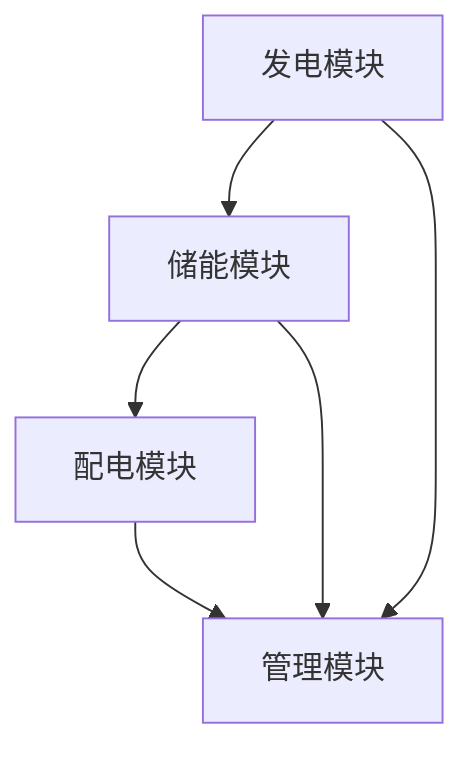

                 


# 可再生能源社区项目的投资模式研究

> 关键词：可再生能源，社区项目，投资模式，能源转型，可持续发展

> 摘要：本文深入研究了可再生能源社区项目的投资模式，分析了不同投资模式的特点、优缺点及适用场景。通过系统分析和案例研究，探讨了如何优化投资模式以促进可再生能源在社区层面的广泛应用。文章结合理论与实践，提出了可行的投资策略和建议，为投资者和政策制定者提供了参考。

---

## 第1章: 可再生能源社区项目的背景介绍

### 1.1 可再生能源的定义与特点

#### 1.1.1 可再生能源的定义
可再生能源是指来源于自然、能够持续再生的能源资源，主要包括太阳能、风能、水能、生物质能、地热能等。这些能源具有可再生性、清洁性和分布广泛的特点。

#### 1.1.2 可再生能源的主要类型
- **太阳能**：通过光伏效应或太阳能热利用技术转化为电能或热能。
- **风能**：利用风力发电，主要通过风力涡轮机。
- **水能**：利用水流的能量发电，包括水电和潮汐能。
- **生物质能**：利用有机物的燃烧或其他化学过程产生能量。
- **地热能**：利用地球内部的热能发电。

#### 1.1.3 可再生能源的优势与挑战
- **优势**：
  - 环境友好，减少碳排放。
  - 可持续性，资源丰富且可再生。
  - 分布广泛，适合分布式能源系统。
- **挑战**：
  - 技术成熟度不一，成本较高。
  - 储能技术有限，影响稳定性。
  - 政策支持和基础设施不足。

### 1.2 社区项目的定义与特点

#### 1.2.1 社区项目的定义
社区项目是指在特定区域内，由社区居民、地方政府或企业共同参与的项目，旨在满足社区需求或提升社区福祉。

#### 1.2.2 社区项目的分类
- **基础设施项目**：如道路、桥梁、供水系统等。
- **公共服务项目**：如教育、医疗、文化设施等。
- **能源项目**：如分布式太阳能发电、生物质能发电等。

#### 1.2.3 社区项目在能源领域的重要性
社区能源项目能够提高能源利用效率，降低能源消耗，减少对传统能源的依赖，同时促进社区自治和居民参与。

### 1.3 可再生能源社区项目的背景与意义

#### 1.3.1 全球能源结构转型的背景
全球气候变化和能源危机促使各国加速向可再生能源转型，社区层面的能源项目成为实现这一目标的重要途径。

#### 1.3.2 可再生能源在社区层面的应用前景
随着技术进步和成本下降，社区可再生能源项目逐渐具备经济可行性，分布式能源系统成为未来趋势。

#### 1.3.3 可再生能源社区项目对社会和环境的影响
- **社会影响**：促进社区就业，增强社区凝聚力。
- **环境影响**：减少碳排放，缓解气候变化。

### 1.4 国内外研究现状

#### 1.4.1 国内可再生能源社区项目的实践案例
- 北京市海淀区某社区太阳能供暖项目。
- 上海市某社区屋顶光伏发电项目。

#### 1.4.2 国外可再生能源社区项目的实践经验
- 欧洲国家如德国、丹麦的分布式能源系统。
- 北美国家的社区风电项目。

#### 1.4.3 当前研究的不足与未来研究方向
- **不足**：现有研究多集中于技术层面，投资模式和政策支持的研究较少。
- **未来方向**：优化投资模式，加强政策支持，推动社区项目规模化发展。

### 1.5 本章小结
本章介绍了可再生能源和社区项目的定义、特点及其重要性，分析了国内外研究现状，为后续章节的投资模式研究奠定了基础。

---

## 第2章: 可再生能源社区项目的概念与核心要素

### 2.1 可再生能源社区项目的定义

#### 2.1.1 可再生能源社区项目的定义
可再生能源社区项目是指在社区范围内，利用可再生能源技术，由社区居民、企业和政府共同参与的能源项目。

#### 2.1.2 可再生能源社区项目的分类
- **分布式能源项目**：如屋顶光伏发电、社区风力发电。
- **储能项目**：如社区级储能系统。
- **智能电网项目**：如社区智能配电系统。

#### 2.1.3 可再生能源社区项目的实施目标
- 提高能源利用效率。
- 降低能源成本。
- 减少碳排放。

### 2.2 可再生能源社区项目的核心要素

#### 2.2.1 项目目标
- 提供清洁能源。
- 降低能源消耗。
- 提升社区能源自给能力。

#### 2.2.2 项目参与者
- **居民**：作为投资者或使用者。
- **企业**：提供技术和设备。
- **政府**：提供政策支持和资金。

#### 2.2.3 项目资金来源
- **政府补贴**：通过财政拨款或税收优惠支持项目。
- **社会资本**：企业或居民投资。
- **众筹模式**：通过众筹平台募集资金。

#### 2.2.4 项目实施步骤
1. 项目规划与设计。
2. 资金筹集与合作伙伴选择。
3. 项目实施与监管。
4. 项目评估与优化。

### 2.3 可再生能源社区项目与其他能源项目的区别

#### 2.3.1 技术特点对比
- **可再生能源社区项目**：分布式、智能化、灵活性强。
- **传统能源项目**：集中式、依赖化石能源、建设周期长。

#### 2.3.2 经济模式对比
- **可再生能源社区项目**：多主体参与，投资模式多样。
- **传统能源项目**：主要由政府或大型企业主导。

#### 2.3.3 社会影响对比
- **可再生能源社区项目**：增强社区参与感，促进社会公平。
- **传统能源项目**：可能对环境和社会造成较大负面影响。

### 2.4 本章小结
本章详细阐述了可再生能源社区项目的定义、分类和核心要素，分析了其与其他能源项目的区别，为后续投资模式研究提供了理论基础。

---

## 第3章: 可再生能源社区项目投资模式的分类与分析

### 3.1 投资模式的定义与分类

#### 3.1.1 投资模式的定义
投资模式是指投资者在项目中采取的资金筹集和分配方式。

#### 3.1.2 投资模式的分类标准
- 资金来源：政府、企业、居民。
- 投资回报：收益型、公益型。

#### 3.1.3 主要投资模式类型
- **政府主导型**：政府投资或补贴，居民参与。
- **企业主导型**：企业投资，居民或政府提供支持。
- **居民主导型**：居民众筹或自筹资金。

### 3.2 可再生能源社区项目投资模式的特点

#### 3.2.1 投资主体多元化
政府、企业和居民均可参与，形成多方合作机制。

#### 3.2.2 投资回报多样化
- 经济回报：电价折扣、投资收益。
- 社会回报：提升社区能源自给能力。

#### 3.2.3 投资风险分担机制
通过多方合作，分担技术和市场风险。

### 3.3 不同投资模式的优缺点分析

#### 3.3.1 政府主导型投资模式
- **优点**：资金有保障，政策支持力度大。
- **缺点**：依赖政府财政，市场化程度低。

#### 3.3.2 企业主导型投资模式
- **优点**：技术先进，管理经验丰富。
- **缺点**：可能忽视社区利益，回报周期长。

#### 3.3.3 居民主导型投资模式
- **优点**：居民参与度高，社区凝聚力强。
- **缺点**：资金有限，风险分担不足。

### 3.4 投资模式的选择与优化

#### 3.4.1 投资模式选择的影响因素
- 项目规模。
- 社区资源。
- 政策环境。

#### 3.4.2 如何优化投资模式
- 结合多方利益，设计合理的收益分配机制。
- 利用金融工具，降低投资风险。

### 3.5 本章小结
本章分析了可再生能源社区项目的三种主要投资模式，探讨了其优缺点及适用场景，为投资决策提供了参考。

---

## 第4章: 可再生能源社区项目投资模式的影响因素

### 4.1 政策因素

#### 4.1.1 国家政策支持
- 财政补贴。
- 税收优惠。

#### 4.1.2 地方政策引导
- 规划支持。
- 试点项目。

#### 4.1.3 政策不确定性
- 政策变化对投资的影响。

### 4.2 技术因素

#### 4.2.1 技术成熟度
- 新能源技术的成熟度影响投资成本和回报。

#### 4.2.2 技术更新速度
- 快速的技术迭代要求投资者具备灵活性。

### 4.3 经济因素

#### 4.3.1 投资成本
- 初期投资高，但后期运营成本低。

#### 4.3.2 收益预测
- 电价波动影响收益稳定性。

#### 4.3.3 资金可得性
- 金融支持和融资渠道影响投资能力。

### 4.4 社会因素

#### 4.4.1 社区参与度
- 居民参与度高有助于项目成功。

#### 4.4.2 社会接受度
- 社会舆论对项目的影响。

### 4.5 综合分析

#### 4.5.1 各因素的相互作用
- 政策、技术、经济和社会因素相互影响。

#### 4.5.2 投资者如何应对
- 加强政策研究，选择技术可靠的合作方，优化资金结构，提升社区参与度。

### 4.6 本章小结
本章分析了影响可再生能源社区项目投资模式的主要因素，强调了政策、技术、经济和社会因素的重要性。

---

## 第5章: 可再生能源社区项目投资模式的系统分析与架构设计

### 5.1 系统分析

#### 5.1.1 项目目标
- 实现社区可再生能源的高效利用。
- 提高居民能源使用效率。

#### 5.1.2 项目范围
- 确定项目的地理范围和参与主体。

#### 5.1.3 项目需求
- 技术需求：设备选型、系统集成。
- 经济需求：资金筹措、成本控制。
- 社会需求：居民参与、社区收益。

### 5.2 系统架构设计

#### 5.2.1 系统功能模块
- **发电模块**：太阳能电池板、风力涡轮机。
- **储能模块**：电池储能系统。
- **配电模块**：智能配电箱。
- **管理模块**：数据采集与监控系统。

#### 5.2.2 系统架构图（使用 Mermaid）



### 5.3 系统接口设计

#### 5.3.1 接口定义
- **发电模块与储能模块接口**：电力传输接口。
- **储能模块与配电模块接口**：电力分配接口。
- **管理模块与用户接口**：数据采集和控制接口。

#### 5.3.2 接口协议
- Modbus协议：用于设备通信。
- HTTP协议：用于数据传输。

### 5.4 项目实战

#### 5.4.1 环境安装
- 操作系统：Linux。
- 开发工具：Eclipse或IntelliJ IDEA。
- 数据库：MySQL。

#### 5.4.2 核心代码实现
```python
# 示例代码：数据采集模块
import serial

ser = serial.Serial('COM1', 9600)
data = ser.readline().decode()
print(data)
```

#### 5.4.3 案例分析
- 某社区光伏发电项目：年发电量10万千瓦时，节省电费支出20%，减少碳排放800吨。

### 5.5 本章小结
本章通过系统分析和架构设计，提出了可再生能源社区项目的实施框架，并通过案例分析验证了其可行性。

---

## 第6章: 可再生能源社区项目投资模式的优化与建议

### 6.1 投资模式优化

#### 6.1.1 组合投资模式
- 结合政府、企业和居民三方力量，形成互补优势。

#### 6.1.2 金融创新模式
- 发行绿色债券。
- 引入保险机制。

### 6.2 投资策略建议

#### 6.2.1 确定项目目标
- 明确是追求经济回报还是社会影响。

#### 6.2.2 选择合适的投资模式
- 根据项目规模和资源条件选择模式。

#### 6.2.3 加强风险管理
- 建立风险预警机制，制定应对措施。

### 6.3 政策建议

#### 6.3.1 加强政策支持
- 提高财政补贴力度。
- 简化审批流程。

#### 6.3.2 完善法律法规
- 制定分布式能源相关法规。
- 明确权责划分。

### 6.4 社区参与建议

#### 6.4.1 提高居民意识
- 通过宣传和教育提升居民参与度。

#### 6.4.2 建立利益共享机制
- 设计合理的收益分配机制，激发居民参与热情。

### 6.5 本章小结
本章提出了优化投资模式的具体策略，并从政策和社区参与两个方面提出了建议，为投资决策提供了指导。

---

## 第7章: 结论与展望

### 7.1 研究结论
- 可再生能源社区项目具有重要的社会和环境意义。
- 投资模式的选择需综合考虑政策、技术、经济和社会因素。
- 组合投资模式和金融创新模式是未来发展的方向。

### 7.2 未来展望
- 技术创新：发展更高效、更智能的能源系统。
- 模式创新：探索更多元化的投资模式。
- 政策支持：加强政策引导和法规完善。

### 7.3 本章小结
本文总结了可再生能源社区项目投资模式的研究成果，并展望了未来的发展方向。

---

## 作者：AI天才研究院/AI Genius Institute & 禅与计算机程序设计艺术/Zen And The Art of Computer Programming

---

**附录**：部分图表和代码示例

---

以上是《可再生能源社区项目的投资模式研究》的技术博客文章的详细目录和内容概述。每一章都详细展开了核心内容，结合理论分析和实际案例，为读者提供了全面的视角。

