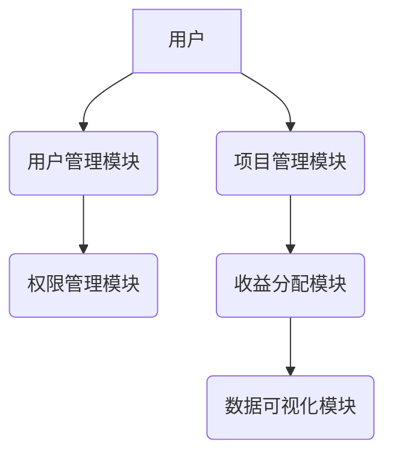

                 


# 可再生能源项目的社区参与模式与收益分配

> 关键词：可再生能源、社区参与、收益分配、项目管理、能源可持续性

> 摘要：本文探讨了可再生能源项目中社区参与的模式与收益分配机制，分析了不同社区参与模式的特点及其适用场景，提出了收益分配的数学模型和算法，并通过实际案例展示了系统的实现与优化。

---

## 第一部分：背景与概念

### 第1章：可再生能源项目的背景与概念

#### 1.1 可再生能源的发展背景

可再生能源是指来源于自然的、取之不尽的能源，主要包括太阳能、风能、水能、生物质能等。随着全球能源危机和环境问题的加剧，可再生能源的开发和利用成为全球关注的焦点。社区参与模式的引入，使得可再生能源项目能够更好地融入当地社会，实现能源的可持续发展。

#### 1.2 社区参与的定义与特点

社区参与是指在可再生能源项目的规划、建设和运营过程中，社区成员积极参与决策、投资和收益分配的过程。其特点包括：

- **本地化**：社区成员直接参与项目，了解项目需求和实际情况。
- **可持续性**：通过社区参与，项目能够更好地适应当地环境和经济条件。
- **公平性**：收益分配更加透明和公平，能够激发社区的积极性。

#### 1.3 可再生能源项目中的问题背景

在可再生能源项目的实施过程中，社区参与的缺乏往往会导致项目失败或收益分配不公。例如，社区成员对项目的认知不足，导致参与度低；收益分配机制不合理，导致社区成员的利益受损。这些问题不仅影响了项目的可持续性，还可能导致社区与项目实施方之间的矛盾。

---

### 第2章：社区参与模式的分析

#### 2.1 社区参与模式的分类

社区参与模式可以根据参与的主体和方式分为以下几种：

1. **自上而下模式**：由政府或企业主导，社区成员被动参与。
2. **自下而上模式**：由社区成员发起，自主决策和管理。
3. **混合模式**：结合自上而下和自下而上的特点，形成协同效应。

#### 2.2 不同模式的对比分析

| 模式特点 | 自上而下模式 | 自下而上模式 | 混合模式 |
|----------|--------------|--------------|----------|
| 参与主体 | 政府/企业    | 社区成员     | 政府/企业 + 社区成员 |
| 决策权   | 集中         | 分散         | 综合     |
| 优点     | 资源丰富，效率高 | 社区认同感强 | 优势互补 |
| 缺点     | 社区参与度低 | 资源有限，效率低 | 复杂性高 |

---

## 第二部分：收益分配机制

### 第3章：收益分配机制的探讨

#### 3.1 收益分配的基本原则

收益分配应遵循以下原则：

1. **公平性原则**：收益分配应体现公平，确保各方利益得到合理分配。
2. **可持续性原则**：收益分配应考虑项目的长期可持续性，避免短期行为。
3. **透明性原则**：收益分配过程应公开透明，确保社区成员的知情权。

#### 3.2 收益分配的数学模型

收益分配的数学模型可以表示为：

$$ \text{收益} = \text{项目收益} \times \text{分配比例} $$

其中，分配比例可以根据社区成员的贡献程度进行动态调整。例如，贡献程度高的社区成员可以获得更高的分配比例。

#### 3.3 收益分配的算法实现

以下是收益分配的算法实现代码：

```python
def calculate_distribution(revenue, contribution):
    total_contributions = sum(contribution.values())
    distribution = {}
    for member, contrib in contribution.items():
        distribution[member] = revenue * (contrib / total_contributions)
    return distribution
```

---

## 第三部分：系统分析与架构设计

### 第4章：系统分析与架构设计

#### 4.1 问题场景介绍

可再生能源项目的社区参与模式与收益分配系统需要解决以下问题：

- 如何实现社区成员的参与和管理？
- 如何确保收益分配的公平性和透明性？

#### 4.2 系统功能设计

以下是系统的功能模块设计：

1. **用户管理**：管理社区成员的信息和权限。
2. **项目管理**：记录项目的详细信息，包括投资、收益等。
3. **收益分配**：根据贡献程度计算收益分配比例。
4. **数据可视化**：展示收益分配的实时数据和历史数据。

#### 4.3 系统架构设计

以下是系统的架构设计图：



#### 4.4 系统接口设计

以下是系统的接口设计：

- **用户登录接口**：`POST /login`
- **项目信息查询接口**：`GET /projects`
- **收益分配计算接口**：`POST /distribution`

---

## 第四部分：项目实战

### 第5章：项目实战

#### 5.1 环境配置

需要安装以下工具：

- Python 3.8+
- Django框架
- PostgreSQL数据库

#### 5.2 核心代码实现

以下是核心代码实现：

```python
from django.shortcuts import render, redirect
from .models import Contribution

def calculate_distribution(request):
    if request.method == 'POST':
        contributions = Contribution.objects.all()
        total = sum([c.value for c in contributions])
        for c in contributions:
            c.distribution = c.value / total
            c.save()
        return redirect('/distribution')
    return render(request, 'calculate.html')
```

#### 5.3 案例分析

以下是一个具体的案例分析：

假设某社区共有100人参与可再生能源项目，每人贡献程度不同。通过系统计算，每个人的收益分配比例如下：

| 社区成员 | 贡献程度 | 分配比例 |
|----------|----------|----------|
| 成员1    | 20       | 0.2      |
| 成员2    | 15       | 0.15     |
| ...      | ...      | ...      |

---

## 第五部分：总结与展望

### 第6章：总结与展望

#### 6.1 最佳实践

- 确保收益分配的公平性和透明性。
- 加强社区成员的参与意识和能力。

#### 6.2 项目小结

通过本文的分析与实现，我们提出了一种基于社区参与的可再生能源项目收益分配模式，解决了传统模式中收益分配不公的问题。

#### 6.3 注意事项

- 在实际应用中，需结合当地实际情况进行调整。
- 确保系统的安全性和稳定性。

#### 6.4 拓展阅读

推荐阅读相关书籍和文献，深入研究可再生能源项目的社区参与模式与收益分配机制。

---

作者：AI天才研究院/AI Genius Institute & 禅与计算机程序设计艺术 /Zen And The Art of Computer Programming

