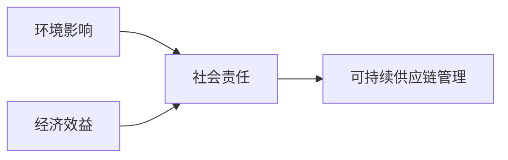
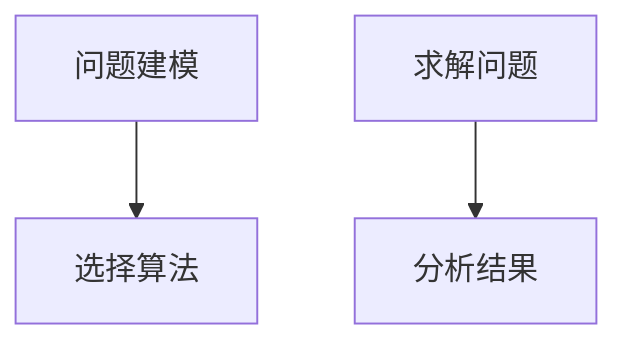
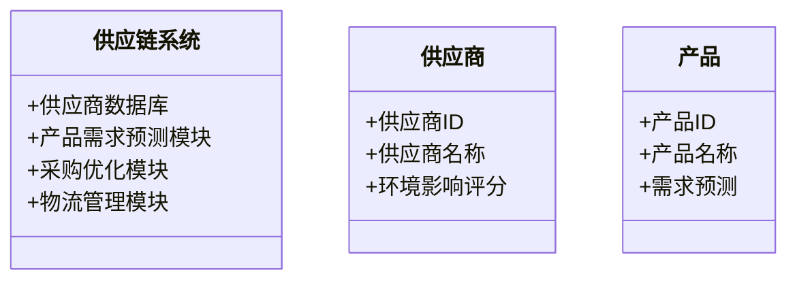

                 


# 《可持续供应链管理的经济效益与投资机会》

## 关键词：可持续供应链、经济效益、投资机会、优化模型、环境影响、风险管理

## 摘要：  
本文探讨了可持续供应链管理的经济效益与投资机会，通过分析其核心概念、算法原理、系统架构及实际案例，揭示了在当前经济环境下，如何通过技术手段优化供应链管理，实现经济效益与可持续发展的双重目标。文章从背景介绍到项目实战，层层深入，为读者提供了全面的理论与实践指导。

---

# 第一部分：可持续供应链管理的背景与核心概念

## 第1章：可持续供应链管理的定义与背景

### 1.1 可持续供应链管理的定义
- **1.1.1 供应链管理的基本概念**  
  供应链管理（Supply Chain Management，SCM）是指对原材料采购、生产、分销、物流等环节进行规划和协调，以实现企业目标的过程。  
- **1.1.2 可持续供应链管理的核心特征**  
  可持续供应链管理不仅关注效率和成本，还强调环境影响、社会责任和长期经济利益。  
- **1.1.3 可持续供应链管理的演进历程**  
  随着全球可持续发展目标的推进，供应链管理逐渐从单纯的效率优化转向绿色、社会责任和经济效益的综合考量。

### 1.2 可持续供应链管理的背景与问题背景
- **1.2.1 当前供应链管理面临的挑战**  
  包括资源浪费、环境污染、供应链中断等问题。  
- **1.2.2 可持续发展的迫切需求**  
  全球气候变化、资源枯竭等问题促使企业采取更可持续的供应链策略。  
- **1.2.3 可持续供应链管理的必要性**  
  通过优化供应链，企业可以降低成本、减少环境影响，同时提升品牌形象和竞争力。

### 1.3 可持续供应链管理的核心要素
- **1.3.1 环境影响评估**  
  通过量化供应链各环节的碳排放、能源消耗等，评估其对环境的影响。  
- **1.3.2 社会责任履行**  
  包括供应商的劳动条件、公平贸易、社区支持等。  
- **1.3.3 经济效益优化**  
  在满足可持续性要求的前提下，降低成本、提高效率。

### 1.4 可持续供应链管理的外延与边界
- **1.4.1 供应链的范围界定**  
  包括供应商、制造商、分销商、零售商和消费者。  
- **1.4.2 可持续供应链管理的边界**  
  从原材料采购到产品交付的全生命周期。  
- **1.4.3 相关概念的对比与联系**  
  对比分析可持续供应链管理与传统供应链管理、绿色供应链管理等概念。

## 第2章：可持续供应链管理的核心概念与联系

### 2.1 核心概念原理
- **2.1.1 环境影响评估方法**  
  使用生命周期评估（LCA）等方法，量化供应链各环节的环境影响。  
- **2.1.2 成本效益分析模型**  
  通过数学模型优化成本与收益的平衡，确保可持续性。  
- **2.1.3 供应链风险管理**  
  包括自然灾害、供应链中断等风险的识别与应对。

### 2.2 核心概念属性对比
- **2.2.1 概念属性对比表格**  
  | 概念       | 定性分析 | 定量分析 | 静态模型 | 动态模型 |
  |------------|----------|----------|----------|----------|
  | 环境影响    | X        |          |          |          |
  | 经济效益    |          | X        |          |          |
  | 社会责任    | X        |          |          |          |

### 2.3 概念关系的Mermaid流程图


---

# 第二部分：可持续供应链管理的算法与数学模型

## 第3章：可持续供应链管理的算法原理

### 3.1 算法原理概述
- **3.1.1 优化模型的选择**  
  常用的模型包括线性规划、整数规划和动态规划。  
- **3.1.2 算法步骤**  
  包括问题建模、求解、结果分析等。

### 3.2 算法的Mermaid流程图


### 3.3 算法的Python代码实现
```python
import numpy as np
from scipy.optimize import linprog

# 定义目标函数
c = np.array([1, 2, 3], dtype=float)

# 定义约束条件
A = np.array([[1, 1, 0], [0, 1, 1]])
b = np.array([20, 15])

# 定义变量范围
bounds = (0, None)

# 求解
result = linprog(c, A, b, bounds=bounds, method='highs')

# 输出结果
print("最优解为：", result.x)
```

## 第4章：可持续供应链管理的数学模型

### 4.1 线性规划模型
- **4.1.1 决策变量**  
  $x_i$ 表示第 $i$ 个供应商的采购量。  
- **4.1.2 目标函数**  
  $$\text{最大化利润} = \sum_{i=1}^{n} (p_i - c_i)x_i$$  
- **4.1.3 约束条件**  
  $$\sum_{i=1}^{n} x_i = D$$  
  $$x_i \geq 0, \quad i = 1, 2, \dots, n$$  

### 4.2 整数规划模型
- **4.2.1 决策变量**  
  $y_i$ 表示是否选择第 $i$ 个供应商（0或1）。  
- **4.2.2 目标函数**  
  $$\text{最小化成本} = \sum_{i=1}^{n} c_i y_i$$  
- **4.2.3 约束条件**  
  $$\sum_{i=1}^{n} y_i = k$$  
  $$y_i \in \{0, 1\}$$  

---

# 第三部分：可持续供应链管理的系统分析与架构设计

## 第5章：可持续供应链管理的系统分析

### 5.1 系统分析方法
- **5.1.1 问题场景介绍**  
  以某制造企业的供应链优化为例。  
- **5.1.2 系统功能设计**  
  包括需求预测、供应商选择、库存优化、物流管理等。

### 5.2 系统架构设计


### 5.3 系统接口设计
- **5.3.1 接口描述**  
  供应商信息接口、采购订单接口、物流跟踪接口。  
- **5.3.2 交互流程图**
```mermaid
sequenceDiagram
参与者 用户
系统 供应链系统
参与者 供应商

用户 -> 系统: 提交采购需求
系统 -> 供应商: 发送采购订单
供应商 -> 系统: 确认订单
系统 -> 用户: 提供物流跟踪信息
```

---

# 第四部分：可持续供应链管理的项目实战

## 第6章：可持续供应链管理的项目实战

### 6.1 项目环境安装
```bash
pip install numpy scipy matplotlib
```

### 6.2 系统核心实现源代码
```python
from scipy.optimize import linprog

# 定义目标函数
c = [1, 2]

# 定义约束条件
A = [[1, 1]]
b = [3]

# 定义变量范围
bounds = (0, None)

# 求解
result = linprog(c, A, b, bounds=bounds, method='highs')

# 输出结果
print("最优解为：", result.x)
```

### 6.3 代码解读与应用
- 目标函数：$c = [1, 2]$ 表示每个产品的利润分别为1和2。  
- 约束条件：$A = [[1, 1]]$，$b = [3]$ 表示总资源限制为3。  
- 结果：最优解为 $x_1 = 3$, $x_2 = 0$，即只生产第一个产品以获得最大利润。

---

# 第五部分：可持续供应链管理的最佳实践与投资机会

## 第7章：可持续供应链管理的最佳实践

### 7.1 小结
- 通过优化供应链管理，企业可以实现经济效益与可持续发展的双重目标。  
- 关键技术包括环境影响评估、成本优化模型和供应链风险管理。

### 7.2 投资机会
- **绿色技术投资**：如绿色物流、可再生能源的使用。  
- **数据驱动的决策**：利用大数据和人工智能优化供应链管理。  
- **政策与标准的合规**：积极参与可持续供应链相关标准和政策。

### 7.3 注意事项
- 数据的准确性和完整性是优化模型的关键。  
- 模型需要动态调整以适应市场变化。  
- 技术与管理的结合是成功实施可持续供应链管理的核心。

---

# 作者：AI天才研究院/AI Genius Institute & 禅与计算机程序设计艺术/Zen And The Art of Computer Programming

---

以上是《可持续供应链管理的经济效益与投资机会》的详细目录大纲，涵盖了从理论到实践的各个方面，为读者提供了全面的指导。

