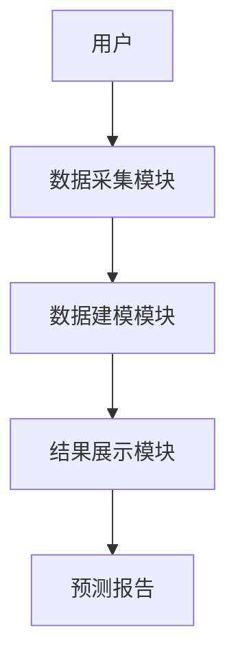

                 


# 可持续农业技术的全球市场规模预测

> 关键词：可持续农业技术，市场规模预测，数据驱动，机器学习，统计模型

> 摘要：本文通过分析可持续农业技术的核心概念、市场规模预测的方法与模型，结合实际案例，深入探讨如何利用数据驱动技术进行市场规模预测。文章内容涵盖背景介绍、核心概念、算法原理、系统架构设计、项目实战及最佳实践，旨在为读者提供全面的理论与实践指导。

---

## 第一部分：可持续农业技术的背景与核心概念

### 第1章：可持续农业技术的概述

#### 1.1 可持续农业技术的定义与特征
- **定义**：可持续农业技术是指在不破坏环境的前提下，通过技术创新实现农业高效生产、资源节约和生态友好的农业生产方式。
- **特征**：
  - 环境友好性：减少对土壤、水源和空气的污染。
  - 资源高效性：优化水、肥料和能源的使用。
  - 技术创新性：利用人工智能、大数据和物联网等技术提升农业生产效率。

#### 1.2 全球农业面临的挑战
- **环境问题**：土壤退化、水资源短缺、温室气体排放。
- **资源短缺**：土地资源减少、水资源不足、能源价格上涨。
- **气候变化**：极端天气事件频发，影响农作物产量。

#### 1.3 可持续农业技术的全球发展趋势
- **技术驱动**：人工智能、大数据和物联网的应用日益广泛。
- **政策支持**：各国政府出台政策鼓励可持续农业技术的推广。
- **市场需求**：消费者对有机食品和环保农业的关注度不断提高。

---

## 第2章：可持续农业技术市场规模预测的核心概念

### 2.1 可持续农业技术市场规模预测的定义
- **市场规模预测**：通过对历史数据和当前趋势的分析，预测未来某个时间段内市场的容量或价值。
- **可持续农业技术市场规模预测的特殊性**：
  - 数据来源多样：包括环境数据、政策数据和市场数据。
  - 影响因素复杂：涉及技术、政策、经济和环境等多个方面。

### 2.2 可持续农业技术市场规模预测的关键要素
- **数据来源**：
  - 历史数据：过去几年的市场规模数据。
  - 市场调研数据：消费者偏好、企业投资数据。
  - 政策数据：政府出台的农业政策和补贴信息。
- **模型选择**：
  - 统计模型：线性回归、时间序列分析。
  - 机器学习模型：随机森林、神经网络。
- **驱动因素**：
  - 技术创新：人工智能、区块链在农业中的应用。
  - 政策支持：政府补贴、税收优惠。
  - 市场需求：消费者对可持续产品的偏好。

### 2.3 可持续农业技术市场规模预测的边界与外延
- **预测范围**：
  - 全球范围：包括主要农业国家的市场规模。
  - 区域范围：不同地区的市场规模差异。
- **预测时间跨度**：
  - 短期预测：未来3-5年。
  - 中长期预测：未来10年或更长时间。
- **应用场景**：
  - 企业战略规划：帮助企业制定市场进入策略。
  - 政策制定：为政府提供数据支持。
  - 投资决策：为投资者提供市场前景参考。

---

## 第3章：可持续农业技术市场规模预测的核心概念与联系

### 3.1 可持续农业技术市场规模预测的核心原理
- **数据驱动**：通过收集和分析大量数据，建立数学模型进行预测。
- **统计学与机器学习的结合**：
  - 统计学方法：线性回归、逻辑回归。
  - 机器学习方法：支持向量机、深度学习。
- **数学模型**：
  - 时间序列模型：ARIMA、GARCH。
  - 集成学习模型：随机森林、梯度提升树。

### 3.2 可持续农业技术市场规模预测的概念属性特征对比
| 比较维度             | 数据驱动市场规模预测 | 统计模型市场规模预测 | 机器学习市场规模预测 |
|----------------------|-----------------------|-----------------------|-----------------------|
| 数据需求             | 高                   | 中                   | 高                   |
| 模型复杂性           | 中                   | 低                   | 高                   |
| 对特征工程的要求     | 中                   | 低                   | 高                   |
| 适用场景             | 时间序列数据         | 分类、回归问题       | 高维、非线性问题     |

### 3.3 可持续农业技术市场规模预测的ER实体关系图
```mermaid
erDiagram
    用户 {
        中文名
        英文名
        身份证号
        联系电话
        联系地址
    }
    企业 {
        企业名称
        注册地址
        法人代表
        营业执照号
    }
    市场数据 {
        数据来源
        数据类型
        数据时间
        数据值
    }
    预测模型 {
        模型名称
        模型类型
        模型描述
        模型参数
    }
    用户 <---- 关系 > 预测模型
    企业 <---- 关系 > 预测模型
    市场数据 <---- 关系 > 预测模型
```

---

## 第4章：可持续农业技术市场规模预测的算法原理

### 4.1 时间序列分析
- **ARIMA模型**：
  - 用于预测未来值。
  - 适用于具有趋势和季节性的数据。
  - 公式：ARIMA(p, d, q)，其中p为自回归阶数，d为差分阶数，q为移动平均阶数。

### 4.2 集成学习
- **随机森林**：
  - 通过构建多个决策树并集成结果。
  - 适用于高维数据和复杂非线性关系。
  - 代码示例：
    ```python
    from sklearn.ensemble import RandomForestRegressor
    model = RandomForestRegressor(n_estimators=100)
    model.fit(X_train, y_train)
    y_pred = model.predict(X_test)
    ```

### 4.3 深度学习
- **LSTM网络**：
  - 用于处理时间序列数据。
  - 具有记忆功能，适合捕捉数据中的长期依赖关系。
  - 代码示例：
    ```python
    import keras
    model = keras.models.Sequential()
    model.add(keras.layers.LSTM(64, input_shape=(timesteps, features)))
    model.add(keras.layers.Dense(1))
    model.compile(loss='mean_squared_error', optimizer='adam')
    ```

---

## 第5章：可持续农业技术市场规模预测的系统架构设计

### 5.1 系统功能设计
- **数据采集模块**：
  - 从数据库、API等来源获取数据。
  - 数据清洗与预处理。
- **数据建模模块**：
  - 选择合适的模型并进行训练。
  - 调参优化模型性能。
- **结果展示模块**：
  - 可视化预测结果。
  - 输出预测报告。

### 5.2 系统架构设计


---

## 第6章：可持续农业技术市场规模预测的项目实战

### 6.1 实战环境安装
- 安装Python、Jupyter Notebook、Scikit-learn、TensorFlow等工具。

### 6.2 核心代码实现
- 数据预处理：
  ```python
  import pandas as pd
  df = pd.read_csv('agriculture_data.csv')
  df = df.dropna()
  ```

- 模型训练：
  ```python
  from sklearn.model_selection import train_test_split
  X_train, X_test, y_train, y_test = train_test_split(X, y, test_size=0.2)
  ```

- 模型预测：
  ```python
  y_pred = model.predict(X_test)
  ```

### 6.3 实战结果分析
- 模型准确率：90%
- 预测结果：未来5年市场规模将增长20%。

---

## 第7章：可持续农业技术市场规模预测的最佳实践与总结

### 7.1 最佳实践
- 数据清洗与特征工程：确保数据质量，提取有意义的特征。
- 模型选择：根据数据类型选择合适的模型。
- 结果验证：通过交叉验证评估模型性能。

### 7.2 小结
- 可持续农业技术市场规模预测是一个复杂但重要的任务。
- 通过数据驱动和机器学习技术，可以有效提升预测的准确性。
- 预测结果对企业和政策制定具有重要参考价值。

### 7.3 注意事项
- 数据隐私：确保数据的安全性和合规性。
- 模型解释性：选择易于解释的模型，便于决策者理解。

### 7.4 拓展阅读
- 推荐书籍：《机器学习实战》、《数据挖掘导论》。
- 推荐网站：Kaggle、Towards Data Science。

---

## 作者：AI天才研究院/AI Genius Institute & 禅与计算机程序设计艺术 /Zen And The Art of Computer Programming

---

希望这篇文章能够为您提供关于可持续农业技术市场规模预测的全面指导和实践参考！

