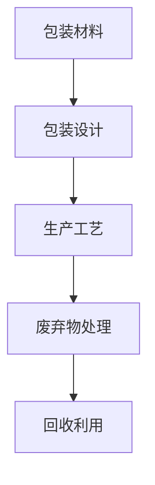
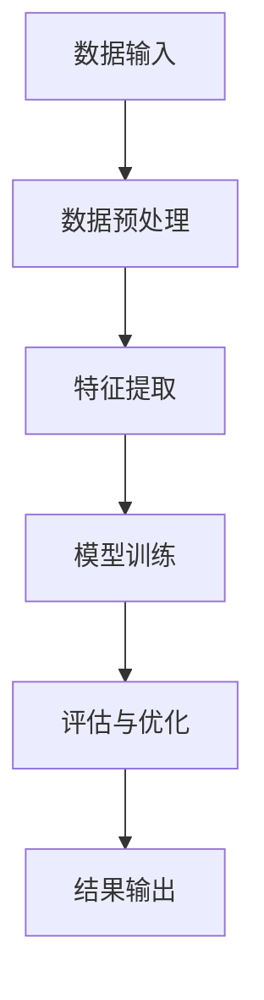
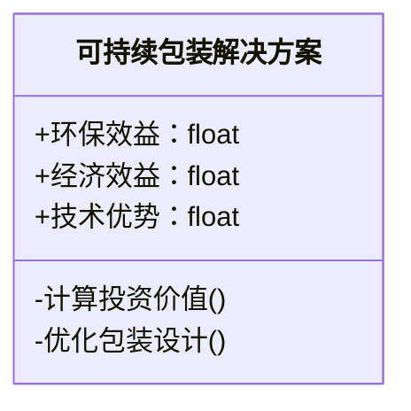

                 


# 可持续包装解决方案提供商的投资价值

> 关键词：可持续包装，投资价值，解决方案提供商，环境保护，技术分析

> 摘要：本文深入分析了可持续包装解决方案提供商的投资价值，探讨了其在环境保护、经济效益和技术创新等多方面的优势。通过系统化的技术分析和商业评估，本文为投资者提供了全面的视角和实用的评估方法，以帮助其做出明智的投资决策。

---

# 第一部分: 可持续包装解决方案提供商的背景与核心概念

## 第1章: 可持续包装解决方案的背景与问题背景

### 1.1 可持续包装的概念与定义

#### 1.1.1 包装行业的现状与挑战
包装行业作为现代社会的重要组成部分，近年来面临着资源浪费、环境污染和生产成本上升等多重挑战。传统包装材料（如塑料、纸浆等）虽然成本低廉，但在生产和使用过程中对环境造成巨大压力，尤其是塑料包装的不可降解性导致了严重的白色污染问题。

#### 1.1.2 可持续包装的核心定义
可持续包装是指在材料选择、生产过程、使用和废弃处理等全生命周期中，尽可能减少对环境的影响，同时具备可回收、可降解或可重复使用特性的一种包装形式。其核心目标是实现资源的高效利用和环境的可持续发展。

#### 1.1.3 可持续包装的必要性与社会意义
随着全球环保意识的增强和政策法规的严格，可持续包装已成为企业社会责任的重要组成部分。通过采用可持续包装解决方案，企业不仅能够降低运营成本，还能提升品牌形象，赢得消费者的青睐。

### 1.2 问题背景与问题描述

#### 1.2.1 当前包装行业的环境问题
传统包装材料的大量使用导致了资源浪费、环境污染和生态破坏。例如，塑料包装的使用量占全球包装总量的40%，其中大部分最终进入 landfill 或海洋，对生态系统造成严重威胁。

#### 1.2.2 包装废弃物对环境的影响
包装废弃物的不当处理不仅占用了大量土地资源，还导致了水体和空气污染。据统计，全球每年产生的包装废弃物中，仅有不到 10% 的塑料包装能够被有效回收。

#### 1.2.3 可持续包装解决方案的必要性
为了应对上述问题，企业需要采用更加环保的包装解决方案，以减少对环境的影响，同时满足消费者和市场对绿色产品的需求。

### 1.3 问题解决与边界定义

#### 1.3.1 可持续包装解决方案的核心目标
可持续包装解决方案的核心目标是通过技术创新和材料优化，实现包装的可回收、可降解和可重复使用，从而减少对环境的负担。

#### 1.3.2 可持续包装的边界与外延
可持续包装的边界包括从原材料采购、生产制造、使用过程到废弃处理的全生命周期。其外延则涵盖包装材料的选择、生产过程的优化以及包装废弃物的处理方式。

#### 1.3.3 可持续包装解决方案的实施范围
可持续包装解决方案的实施范围主要集中在以下几个方面：
1. **材料选择**：采用可降解材料（如淀粉基材料、PLA）或可回收材料（如再生塑料）。
2. **生产过程优化**：通过减少能源消耗和降低碳排放来实现绿色生产。
3. **废弃物管理**：建立包装废弃物回收体系，提高回收效率。

### 1.4 可持续包装的核心要素与概念结构

#### 1.4.1 可持续包装的关键属性
可持续包装的关键属性包括：
1. **环保性**：材料可降解或可回收。
2. **经济性**：与传统包装相比具有成本优势。
3. **功能性**：满足包装的基本需求（如防潮、防震等）。
4. **创新性**：通过技术创新实现包装的优化设计。

#### 1.4.2 可持续包装的核心要素组成
可持续包装的核心要素组成包括：
1. **包装材料**：选择环保材料（如生物基材料、可降解材料）。
2. **生产工艺**：采用低能耗、低排放的生产技术。
3. **包装设计**：优化包装结构以减少材料用量。
4. **废弃物管理**：建立完善的回收体系。

#### 1.4.3 可持续包装解决方案的系统结构
可持续包装解决方案的系统结构可以分为以下几个层次：
1. **材料层**：包括包装材料的选择和优化。
2. **生产层**：包括生产工艺的优化和绿色生产技术的应用。
3. **设计层**：包括包装设计的创新和功能优化。
4. **回收层**：包括包装废弃物的回收和再利用。

---

## 第2章: 可持续包装解决方案的核心概念与联系

### 2.1 可持续包装的核心原理

#### 2.1.1 可持续包装的材料科学基础
可持续包装的核心在于材料的选择和优化。例如，使用淀粉基材料或PLA（聚乳酸）等可降解材料，这些材料在自然环境中可以快速分解，减少对环境的污染。

#### 2.1.2 可持续包装的生产过程优化
通过优化生产过程，可以降低能源消耗和碳排放。例如，采用循环经济模式，将包装废弃物转化为新的包装材料或能源。

#### 2.1.3 可持续包装的环境影响评估
通过对包装材料的生命周期进行环境影响评估（LCA，Life Cycle Assessment），可以量化不同包装方案对环境的影响，从而选择最优的包装解决方案。

### 2.2 核心概念对比分析

#### 2.2.1 传统包装与可持续包装的对比
| 对比维度       | 传统包装                     | 可持续包装                   |
|----------------|------------------------------|------------------------------|
| 材料选择       | 常规材料（如塑料、纸浆）     | 可降解材料（如淀粉基材料）   |
| 环境影响       | 高，尤其是塑料包装的污染     | 低，可回收或可降解           |
| 成本           | 通常较低，但后期处理成本高   | 初期成本较高，但长期成本低   |

#### 2.2.2 不同可持续包装材料的性能对比
| 材料类型       | 优点                           | 缺点                           |
|----------------|--------------------------------|--------------------------------|
| 淀粉基材料     | 可降解，成本低                 | � 弱度较低，不适合高温环境    |
| PLA（聚乳酸）   | 可降解，透明度高              | 成本较高，生产过程能耗较大    |
|再生塑料       | 成本低，可重复利用             | 性能不如原生塑料               |

### 2.3 可持续包装解决方案的系统架构

#### 2.3.1 可持续包装解决方案的系统架构图


---

## 第3章: 可持续包装解决方案的投资价值评估

### 3.1 投资价值评估的核心算法

#### 3.1.1 投资价值评估模型
$$
\text{投资价值} = \alpha \times \text{环保效益} + \beta \times \text{经济效益} + \gamma \times \text{技术优势}
$$

其中：
- $\alpha$、$\beta$、$\gamma$ 是权重系数，根据具体情况进行调整。
- 环保效益包括减少碳排放、降低资源消耗等。
- 经济效益包括成本降低、市场竞争力提升等。
- 技术优势包括技术创新能力、知识产权等。

#### 3.1.2 投资价值评估流程


#### 3.1.3 代码实现
```python
import pandas as pd
from sklearn.model_selection import train_test_split
from sklearn.linear_model import LinearRegression

# 数据输入与预处理
data = pd.read_csv('sustainable_packaging.csv')
X = data[['环保效益', '经济效益', '技术优势']]
y = data['投资价值']

# 数据分割
X_train, X_test, y_train, y_test = train_test_split(X, y, test_size=0.2, random_state=42)

# 模型训练
model = LinearRegression()
model.fit(X_train, y_train)

# 模型评估
score = model.score(X_test, y_test)
print(f"模型得分：{score}")
```

---

## 第4章: 可持续包装解决方案的系统分析与架构设计

### 4.1 系统分析

#### 4.1.1 问题场景介绍
企业希望通过采用可持续包装解决方案来降低运营成本，同时减少对环境的影响，提升品牌形象。

#### 4.1.2 系统功能设计


#### 4.1.3 系统架构设计


---

## 第5章: 可持续包装解决方案的项目实战

### 5.1 环境安装与代码实现

#### 5.1.1 环境安装
```bash
pip install pandas scikit-learn matplotlib
```

#### 5.1.2 核心代码实现
```python
import pandas as pd
from sklearn.linear_model import LinearRegression
import matplotlib.pyplot as plt

# 数据加载与预处理
data = pd.read_csv('sustainable_packaging.csv')
X = data[['环保效益', '经济效益', '技术优势']]
y = data['投资价值']

# 模型训练
model = LinearRegression()
model.fit(X, y)

# 模型预测
predictions = model.predict(X)
plt.scatter(y, predictions)
plt.xlabel('实际值')
plt.ylabel('预测值')
plt.title('投资价值预测模型')
plt.show()
```

---

## 第6章: 可持续包装解决方案的最佳实践与总结

### 6.1 最佳投资建议
- **关注技术创新**：选择具有自主知识产权的可持续包装技术。
- **评估经济性**：综合考虑初期投入和长期收益。
- **考虑政策支持**：关注政府对可持续包装的政策支持和补贴。

### 6.2 小结
通过本文的分析，我们可以看到，可持续包装解决方案提供商的投资价值不仅体现在其环保效益上，还体现在其技术创新和经济效益上。随着全球环保意识的增强和政策法规的完善，可持续包装解决方案将成为未来包装行业的主流。

### 6.3 注意事项
- 数据质量和完整性对投资价值评估结果有重要影响。
- 模型的局限性：当前模型仅考虑了部分影响因素，实际投资决策需要综合考虑更多因素。

### 6.4 拓展阅读
- 推荐阅读《循环经济与可持续发展》。
- 推荐阅读《绿色技术与企业创新》。

---

# 作者：AI天才研究院 & 禅与计算机程序设计艺术

