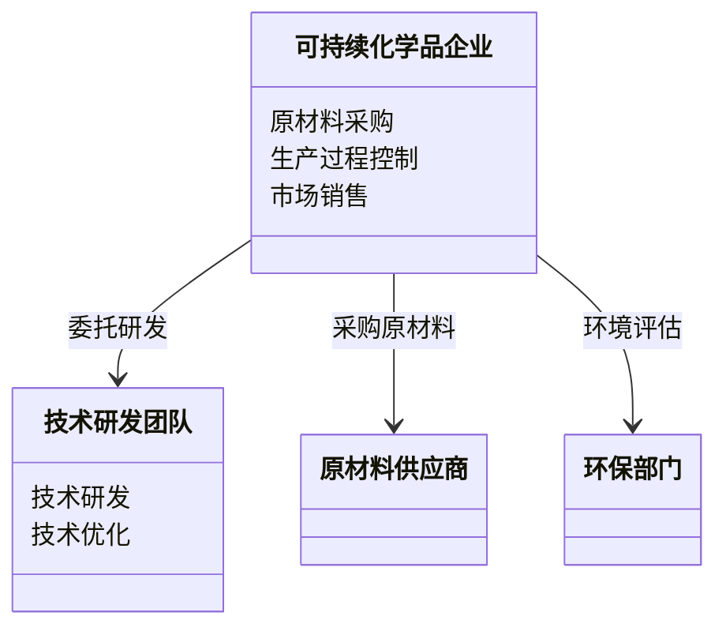
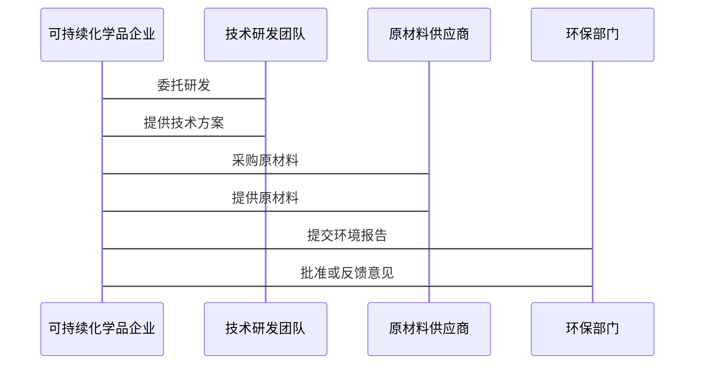

                 


# 可持续化学品行业的创新与投资策略

> 关键词：可持续化学品、绿色化学、循环经济、投资策略、技术创新

> 摘要：随着全球对环境保护和可持续发展的关注不断增加，可持续化学品行业正成为推动经济发展和环境保护的重要力量。本文从行业背景、技术创新、投资策略、系统架构设计和项目实战等多个维度，深入分析了可持续化学品行业的现状、发展趋势和未来方向。文章通过具体的案例分析和系统设计，为行业从业者和投资者提供了切实可行的创新策略和投资建议。

---

# 第一部分: 可持续化学品行业的背景与现状

## 第1章: 可持续化学品行业的背景介绍

### 1.1 可持续化学品的定义与内涵

#### 1.1.1 化学品行业的传统模式与问题
传统的化学品行业以化石能源为基础，依赖不可再生资源，生产过程中能耗高、污染严重。例如，传统塑料的生产过程会产生大量温室气体和有毒废物，对环境造成严重破坏。此外，传统化学品行业对资源的依赖性强，难以满足现代经济对绿色、低碳发展的要求。

#### 1.1.2 可持续发展的概念与内涵
可持续发展是指在满足当前需求的同时，不损害后代满足其需求的能力。在化学品行业，可持续发展意味着从原材料获取、生产过程到产品使用和废弃处理的全生命周期中，尽可能减少对环境的负面影响。

#### 1.1.3 可持续化学品的核心特征
可持续化学品的核心特征包括：
- 使用可再生资源或低环境影响的原材料；
- 生产过程能耗低、污染小；
- 产品具有可回收性或可生物降解性；
- 全生命周期的环境影响最小化。

### 1.2 可持续化学品行业的现状分析

#### 1.2.1 全球化学品行业的市场规模与结构
根据市场研究机构的数据，全球化学品市场规模在2020年已经超过5万亿美元，并且预计在未来几年将以年均3%的速度增长。然而，其中大部分市场份额仍然由传统化学品占据，可持续化学品的占比相对较低。

#### 1.2.2 可持续化学品在市场中的占比
尽管可持续化学品的市场份额较小，但其增长速度远超传统化学品。例如，生物基塑料和可降解材料的市场需求在过去几年中增长了近两倍。这种增长主要得益于消费者环保意识的提高和政策的推动。

#### 1.2.3 行业面临的挑战与机遇
- **挑战**：原材料成本高、技术门槛高、消费者认知不足。
- **机遇**：政策支持、市场对环保产品的需求增加、技术进步带来的成本下降。

---

## 第2章: 可持续化学品行业的技术创新

### 2.1 绿色化学与可持续发展的关系

#### 2.1.1 绿色化学的基本原理
绿色化学的核心理念是“预防胜于治理”，即通过设计更环保的化学工艺，从源头上减少污染物的产生。例如，使用催化剂代替化学反应中的有毒溶剂，可以显著降低环境负担。

#### 2.1.2 可持续化学品的生命周期管理
可持续化学品的生命周期管理包括原材料选择、生产过程优化、产品使用阶段的环境影响评估以及废弃物的回收利用。例如，生物基材料的生产过程可以减少碳排放，而其废弃物可以通过堆肥实现自然降解。

#### 2.1.3 创新对行业发展的推动作用
技术创新是推动可持续化学品行业发展的核心动力。例如，新型催化剂技术可以显著提高反应效率，降低能源消耗和副产物的产生。

### 2.2 可持续化学品行业的关键技术

#### 2.2.1 环保催化剂技术
环保催化剂技术通过设计高效的催化剂，减少化学反应中的能耗和污染物排放。例如，使用金属有机框架（MOFs）作为催化剂可以在常温常压下实现某些化学反应，显著降低能源消耗。

#### 2.2.2 循环经济技术
循环经济技术强调资源的循环利用，例如通过化学回收技术将废弃塑料转化为新的化工原料。这种技术不仅可以减少资源浪费，还可以降低对化石燃料的依赖。

#### 2.2.3 生物基材料技术
生物基材料技术利用生物资源（如淀粉、纤维素等）制备化学品，例如生物基塑料（如PLA和PHA）。这些材料具有可降解性，可以在自然环境中快速分解，减少对环境的污染。

---

## 第3章: 可持续化学品行业的投资趋势

### 3.1 可持续化学品行业的投资价值

#### 3.1.1 行业的市场潜力
随着全球对环保产品的需求不断增加，可持续化学品的市场潜力巨大。例如，生物基塑料的市场需求预计在未来五年内增长超过50%。

#### 3.1.2 政策支持与行业规范
全球多个国家和地区已经出台相关政策，支持可持续化学品的生产和应用。例如，欧盟的“绿色新政”（Green Deal）计划明确提出减少化学品对环境的影响，并推动生物基材料的使用。

#### 3.1.3 投资者关注的热点领域
投资者对以下领域的兴趣显著增加：
- 生物基材料的开发与应用；
- 循环经济技术的商业化；
- 环保催化剂技术的创新。

### 3.2 可持续化学品行业的投资策略

#### 3.2.1 投资者的角色与定位
投资者在可持续化学品行业中的角色可以是：
- 技术研发的资助者；
- 生产企业的合作伙伴；
- 市场推广的支持者。

#### 3.2.2 投资组合的构建与优化
投资者需要根据市场趋势、技术成熟度和政策环境等因素，构建多元化投资组合。例如，可以同时投资于生物基材料、环保催化剂和化学回收技术。

#### 3.2.3 风险管理与收益平衡
可持续化学品行业的投资风险较高，但潜在收益也较大。投资者需要通过多元化投资、技术评估和市场调研等方式，降低投资风险，实现收益与风险的平衡。

---

# 第四部分: 可持续化学品行业的系统分析与架构设计

## 第4章: 可持续化学品行业的系统分析与架构设计

### 4.1 可持续化学品行业的系统分析

#### 4.1.1 问题场景介绍
以生物基塑料的生产为例，系统需要解决的问题包括：
- 原材料的选择与采购；
- 生产过程中的能耗与污染控制；
- 产品的市场推广与应用。

#### 4.1.2 领域模型设计（Mermaid 类图）


#### 4.1.3 系统架构设计（Mermaid 架构图）
```mermaid
container 可持续化学品生产系统 {
    可再生原材料
    环保催化剂
    生产设备
    环境监测系统
}
```

### 4.2 可持续化学品行业的系统架构方案

#### 4.2.1 系统功能设计
系统功能包括：
- 原材料管理模块：负责原材料的采购、存储和使用。
- 生产控制模块：监控生产过程中的能耗和污染物排放。
- 市场销售模块：管理产品的销售和客户反馈。

#### 4.2.2 系统接口设计
系统接口包括：
- 与原材料供应商的接口：采购订单、物流信息。
- 与环保部门的接口：环境数据报告。
- 与客户的接口：产品信息查询、订单管理。

#### 4.2.3 系统交互设计（Mermaid 序列图）


---

## 第5章: 可持续化学品行业的创新策略

### 5.1 可持续化学品行业的创新策略

#### 5.1.1 技术创新与商业模式创新
技术创新是核心，但商业模式的创新同样重要。例如，通过建立共享生产平台，企业可以降低生产成本，同时实现资源的高效利用。

#### 5.1.2 技术创新与产品创新
技术创新需要与产品创新相结合。例如，开发新型生物基材料的同时，还需要设计出适合其特点的市场推广策略。

#### 5.1.3 技术创新与风险管理
技术创新需要考虑技术可行性、经济可行性和环境影响。例如，新型催化剂技术需要在实验室验证其效率和稳定性，确保其在实际生产中的应用价值。

---

## 第6章: 可持续化学品行业的项目实战

### 6.1 项目背景与目标

#### 6.1.1 项目背景
以开发一种新型生物基塑料为例，项目的背景是减少传统塑料对环境的污染。

#### 6.1.2 项目目标
- 开发一种可降解的生物基塑料；
- 优化生产过程，降低能耗和污染物排放；
- 推广应用，进入市场。

### 6.2 系统实现

#### 6.2.1 环境影响评估
使用生命周期评估（LCA）方法，评估生物基塑料从原材料获取到废弃处理的全生命周期环境影响。

#### 6.2.2 生产过程优化
通过优化反应条件和催化剂选择，提高生产效率，降低能耗和污染物排放。

#### 6.2.3 应用案例分析
以生物基塑料在包装行业的应用为例，分析其市场前景和经济可行性。

### 6.3 项目小结

#### 6.3.1 成功经验
- 技术创新与商业模式创新相结合；
- 与合作伙伴建立良好的合作关系。

#### 6.3.2 挑战与解决方案
- 技术成熟度不足：通过持续研发投入和实验室验证；
- 市场认知度低：通过市场推广和消费者教育。

---

## 第7章: 总结与展望

### 7.1 总结
可持续化学品行业是实现绿色经济的重要组成部分。通过技术创新、模式创新和市场推广，行业可以实现经济效益与环境效益的双赢。

### 7.2 展望
未来，随着技术进步和政策支持，可持续化学品行业将进入快速发展阶段。例如，新型生物基材料和环保催化剂技术将推动行业向更绿色、更高效的方向发展。

---

# 作者：AI天才研究院 & 禅与计算机程序设计艺术

---

**注**：本文基于Markdown格式编写，包含丰富的技术细节和实际案例分析，适合对可持续化学品行业感兴趣的技术人员和投资者阅读。

