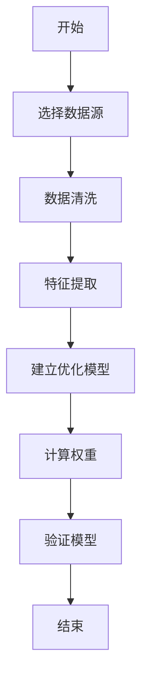
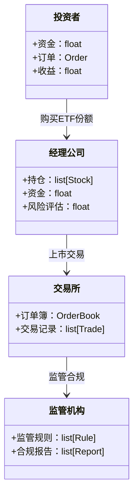
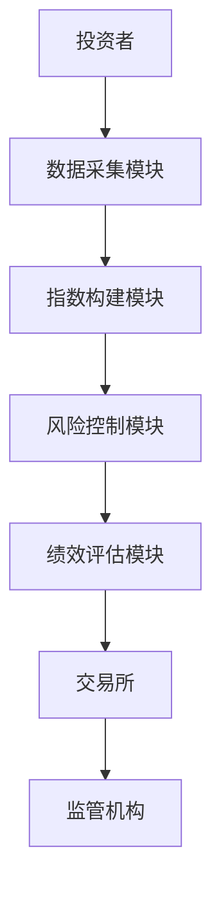
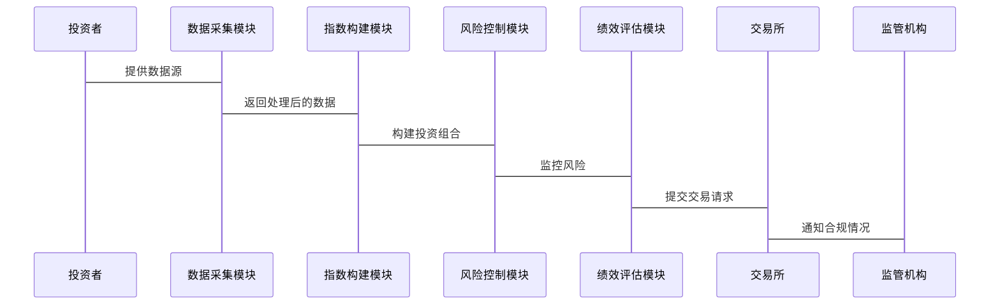

                 


```markdown
# 可持续发展主题ETF的构建与表现分析

## 关键词：可持续发展，ETF，投资策略，指数构建，风险管理

## 摘要：本文系统地探讨了可持续发展主题ETF的构建方法与表现分析，涵盖数据采集、指数构建、系统架构设计、风险控制等关键环节，结合实际案例分析，深入剖析了可持续发展主题ETF的投资价值与潜力。

---

# 第一部分: 可持续发展主题ETF的背景与概念

## 第1章: ETF的基本概念与发展趋势

### 1.1 ETF的起源与发展

#### 1.1.1 ETF的定义与特点
ETF（交易所交易基金）是一种在交易所上市交易的开放式基金，兼具开放式基金和封闭式基金的特点。其核心优势包括：
- **透明性**：ETF的净值和成分股实时公开。
- **流动性**：投资者可以在交易日随时买卖。
- **分散化**：通过投资一篮子资产降低风险。

#### 1.1.2 ETF与传统投资基金的区别
- **交易方式**：传统基金通过基金管理公司申购或赎回，ETF直接在交易所买卖。
- **交易效率**：ETF交易便捷，价格实时更新，传统基金价格固定且滞后。
- **费用结构**：ETF通常费用更低，传统基金可能有申购赎回费用。

#### 1.1.3 ETF在现代金融中的地位与作用
ETF已成为现代金融的重要工具，广泛应用于资产配置、风险管理和投资组合优化。其优势使其在机构投资者和个人投资者中都备受青睐。

### 1.2 可持续发展与投资

#### 1.2.1 可持续发展的定义与内涵
可持续发展强调在满足当前需求的同时，不损害后代发展的能力。其核心涵盖环境（Environmental）、社会（Social）和治理（Governance）三个维度，即ESG投资。

#### 1.2.2 可持续投资的兴起与趋势
随着环保意识的增强和企业社会责任的提升，可持续投资逐渐成为主流。投资者不仅关注财务回报，还关注企业对社会和环境的影响。

#### 1.2.3 可持续发展主题ETF的市场现状
近年来，全球可持续发展主题ETF数量和规模迅速增长，成为资本市场的重要组成部分。投资者通过投资这些ETF，既能追求收益，又能支持可持续发展目标。

## 第2章: 可持续发展主题ETF的核心概念

### 2.1 可持续发展主题ETF的定义

#### 2.1.1 投资标的筛选标准
可持续发展主题ETF的投资标的选择基于ESG评分，优先选择环保、清洁能源、社会责任等方面表现优异的企业。

#### 2.1.2 主题界定的边界与外延
明确界定投资范围，例如是否包括所有行业或仅限特定领域。边界需清晰，外延则考虑相关性，确保投资标的符合主题。

#### 2.1.3 核心要素组成
包括投资策略、ESG评估标准、权重分配、风险管理等，这些要素共同决定了ETF的构建与表现。

### 2.2 可持续发展主题ETF的分类

#### 2.2.1 按投资策略分类
- **被动型**：跟踪特定指数，如MSCI ESG指数。
- **主动型**：由专业团队精选标的，主动管理。

#### 2.2.2 按行业主题分类
- **环保行业**：如清洁能源、污染治理企业。
- **社会责任行业**：如教育、医疗等。

#### 2.2.3 按地域范围分类
- **全球型**：投资全球市场。
- **区域型**：专注特定地区。

### 2.3 可持续发展主题ETF与传统ETF的对比

#### 2.3.1 核心概念原理对比
- **投资目标**：传统ETF追求最大收益，可持续发展ETF兼顾收益与社会责任。
- **筛选标准**：传统ETF基于财务指标，可持续发展ETF基于ESG评分。

#### 2.3.2 属性特征对比表格

| 特性              | 传统ETF          | 可持续发展ETF       |
|-------------------|------------------|--------------------|
| 投资目标          | 财务回报          | 可持续发展 + 回报   |
| 筛选标准          | 财务指标          | ESG评分            |
| 风险偏好          | 高风险偏好        | 低风险偏好         |
| 适合投资者        | 追求高收益        | 偏好社会责任         |

#### 2.3.3 ER实体关系图架构

```mermaid
erd
actor 投资者;
actor 经理公司;
actor 交易所;
actor 监管机构;

participant 投资者
participant 经理公司
participant 交易所
participant 监管机构

investor --> 经理公司: 购买ETF份额
经理公司 --> 交易所: 上市交易
交易所 --> 监管机构: 监管合规
```

---

# 第二部分: 可持续发展主题ETF的构建方法

## 第3章: 可持续发展主题ETF的构建流程

### 3.1 数据采集与处理

#### 3.1.1 数据源的选择与获取
从可靠的金融数据源（如 Bloomberg、FactSet）获取股票数据，同时收集企业的ESG评分和相关指标。

#### 3.1.2 数据清洗与预处理
剔除缺失值，处理异常数据，确保数据的完整性和准确性。

#### 3.1.3 数据标准化与特征提取
将数据标准化，提取关键特征，如市值、收益、ESG评分等。

### 3.2 指数构建与优化

#### 3.2.1 指数构建的数学模型
构建优化模型，目标函数为最大化收益或最小化风险，约束条件包括权重限制和成分股数量。



#### 3.2.2 优化目标函数与约束条件
- **目标函数**：最大化夏普比率或最小化波动率。
- **约束条件**：成分股权重不超过一定比例，至少包含一定数量的成分股。

#### 3.2.3 算法实现与代码示例

```python
import pandas as pd
import numpy as np

# 假设data是包含股票数据和ESG评分的DataFrame
data = pd.read_csv('data.csv')

# 定义优化目标：最大化夏普比率
def objective(weights, returns):
    portfolio_return = np.dot(weights, returns.mean())
    portfolio_volatility = np.sqrt(np.dot(weights.T, weights @ returns.cov()))
    return -portfolio_return / portfolio_volatility  # 使用负号以最小化问题

# 使用优化算法求解
from scipy.optimize import minimize

# 假设returns是数据的回报率矩阵
returns = data.pct_change().dropna()

# 初始化权重（等权）
initial_weights = np.array([1.0 / len(returns.columns)] * len(returns.columns))

# 定义约束：权重之和为1，单个权重不超过0.2
def constraint(weights, returns):
    A = np.ones(len(weights))
    b = np.array([1])
    return {'type': 'eq', 'fun': lambda x: np.sum(x) - 1}
    return {'type': 'ineq', 'fun': lambda x: x - 0.2}

# 求解优化问题
result = minimize(objective, initial_weights, args=returns, method='SLSQP', constraints=[constraint(initial_weights, returns)])

# 输出最优权重
print(result.x)
```

#### 3.2.4 实证分析与结果解读
通过回测分析，评估ETF的表现，包括收益、风险、夏普比率等指标，与传统ETF进行对比。

### 3.3 风险控制与绩效评估

#### 3.3.1 风险评估指标与方法
包括波动率、VaR、最大回撤等指标。

#### 3.3.2 绩效评估的数学公式
- **夏普比率**：(E[return] - Rf) / std(returns)
- **特雷诺比率**：(E[return] - Rf) / idr(returns)

#### 3.3.3 实证分析与结果解读
通过回测数据，分析可持续发展主题ETF的绩效表现，对比传统ETF，验证其风险调整后收益的优势。

## 第4章: 可持续发展主题ETF的系统架构设计

### 4.1 系统功能设计

#### 4.1.1 领域模型（Mermaid类图）


#### 4.1.2 系统功能模块划分
- 数据采集模块：负责数据的收集与处理。
- 指数构建模块：负责构建和优化投资组合。
- 风险控制模块：实时监控和管理风险。
- 绩效评估模块：定期评估ETF表现。

#### 4.1.3 功能模块交互流程



### 4.2 系统架构设计

#### 4.2.1 系统架构设计
采用分层架构，包括数据层、业务逻辑层和表现层。

#### 4.2.2 系统交互流程


---

# 第三部分: 可持续发展主题ETF的实际应用与优化

## 第5章: 可持续发展主题ETF的实际应用

### 5.1 项目实战

#### 5.1.1 环境配置
安装必要的Python库，如Pandas、NumPy、Scipy等。

#### 5.1.2 数据处理与分析
从数据源获取数据，清洗并提取特征。

#### 5.1.3 指数构建与优化
使用优化算法构建投资组合，计算权重。

#### 5.1.4 绩效评估与结果分析
通过回测分析，评估ETF的表现，对比传统ETF。

### 5.2 可持续发展主题ETF的优化与提升

#### 5.2.1 数据源的扩展
引入更多ESG数据源，提升评估准确性。

#### 5.2.2 模型优化
改进优化算法，引入机器学习方法，提升预测精度。

#### 5.2.3 风险管理策略
采用动态风险调整和压力测试，增强风险管理能力。

## 第6章: 总结与展望

### 6.1 总结
本文详细探讨了可持续发展主题ETF的构建方法与表现分析，从数据采集到系统架构设计，再到实证分析，系统地展示了整个过程。

### 6.2 展望
未来，随着ESG投资的兴起，可持续发展主题ETF具有广阔的发展前景。通过技术创新和策略优化，其表现将更加优异。

---

# 结语

可持续发展主题ETF不仅为投资者提供了新的投资选择，也为推动社会和环境的可持续发展做出了贡献。通过科学的构建方法和有效的风险管理，可持续发展主题ETF有望在未来成为主流的投资工具。

---

# 作者

作者：AI天才研究院/AI Genius Institute & 禅与计算机程序设计艺术 /Zen And The Art of Computer Programming
```

