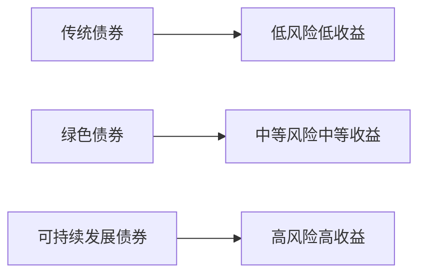

                 


# 可持续发展债券的风险收益特征研究

> 关键词：可持续发展债券, 风险收益特征, 蒙特卡洛模拟, 系统架构设计, ESG投资

> 摘要：  
本文深入探讨了可持续发展债券的风险收益特征，分析了其与传统债券的区别，构建了基于Python的蒙特卡洛模拟的风险评估模型，并通过实际案例展示了系统设计与实现。文章从背景介绍、核心概念、算法原理、系统架构到项目实战，全面解析了可持续发展债券的风险收益研究，为投资者和研究人员提供了理论与实践的双重参考。

---

## 第1章 可持续发展债券的背景与概念

### 1.1 可持续发展债券的定义与起源

#### 1.1.1 可持续发展债券的定义  
可持续发展债券（Sustainability Bonds）是指募集资金用于支持环保、气候变化、社会公益等可持续发展目标的债券。与传统债券相比，其核心在于将资金投向具有明确社会或环境效益的项目。

#### 1.1.2 可持续发展债券的起源与发展  
可持续发展债券起源于20世纪90年代，早期以绿色债券为主，逐渐扩展到社会债券、转型债券等类型。近年来，随着全球对可持续发展的关注，其市场规模迅速增长。

#### 1.1.3 可持续发展债券的核心目标与意义  
其核心目标是通过金融工具推动可持续发展目标的实现，同时为投资者提供一种兼顾经济效益与社会责任的投资选择。

---

### 1.2 可持续发展债券的分类与特点

#### 1.2.1 绿色债券、社会债券与可持续发展债券的分类  
- **绿色债券**：募集资金用于支持环保项目。  
- **社会债券**：支持社会公益项目。  
- **可持续发展债券**：综合绿色和社債的特点，支持更广泛的可持续发展目标。

#### 1.2.2 可持续发展债券的主要特点  
- **双重目标**：兼顾财务回报和社会/环境效益。  
- **透明度高**：发行人需定期披露资金使用情况。  
- **风险多样性**：涉及的项目类型多样，风险分布较广。

#### 1.2.3 可持续发展债券与传统债券的对比  
通过表格对比两类债券在发行目的、风险类型和收益预期上的差异：

| 特性                | 可持续发展债券          | 传统债券            |
|---------------------|------------------------|--------------------|
| 发行目的            | 支持可持续发展目标      | 追求财务回报        |
| 风险类型            | 信用风险、ESG风险      | 信用风险、利率风险  |
| 收益预期            | 可能更高（ESG溢价）    | 稳定但无额外溢价    |

---

## 第2章 可持续发展债券的风险收益特征分析

### 2.1 可持续发展债券的风险来源

#### 2.1.1 信用风险  
债券发行人因财务状况恶化可能无法按时偿付本金和利息。

#### 2.1.2 利率风险  
市场利率波动可能导致债券价格波动，影响投资者收益。

#### 2.1.3 流动性风险  
部分可持续发展债券流动性较差，可能导致变现困难。

#### 2.1.4 ESG风险  
项目的社会或环境效益未达成可能影响债券信用评级。

---

### 2.2 可持续发展债券的收益驱动因素

#### 2.2.1 利息收益  
债券发行人按约定支付的利息。

#### 2.2.2 资本增值收益  
债券价格因市场波动或发行人信用提升而上涨带来的收益。

#### 2.2.3 ESG表现对债券收益的影响  
优秀的ESG表现可能带来评级提升和投资者需求增加，从而提升债券价格。

---

### 2.3 可持续发展债券的风险收益特征对比

通过Mermaid图展示不同债券类型的风险收益关系：



---

## 第3章 可持续发展债券的风险评估模型

### 3.1 风险评估模型的构建

#### 3.1.1 数据收集与处理  
收集债券的发行信息、市场数据和ESG评级数据。

#### 3.1.2 模型假设与基本框架  
假设债券收益与ESG表现呈正相关关系，构建多元回归模型。

#### 3.1.3 模型的输入变量与输出变量  
- 输入变量：信用评级、利率、ESG评分。  
- 输出变量：债券违约概率。

---

### 3.2 风险评估模型的实现

#### 3.2.1 基于Python的风险评估模型实现  
使用Python代码实现蒙特卡洛模拟：

```python
import numpy as np

# 模拟1000次实验
np.random.seed(42)
simulations = 1000
returns = np.random.normal(0.05, 0.2, simulations)

# 计算债券价格
prices = [100 * np.exp(r) for r in returns]

# 统计结果
mean_price = np.mean(prices)
std_price = np.std(prices)
print(f"平均价格：{mean_price:.2f}，标准差：{std_price:.2f}")
```

#### 3.2.2 使用蒙特卡洛模拟的风险评估  
通过模拟不同市场条件下债券的表现，评估其风险。

#### 3.2.3 模型的验证与优化  
使用历史数据验证模型准确性，并通过调整参数优化模型。

---

## 第4章 可持续发展债券的风险收益特征的系统分析

### 4.1 系统分析框架

#### 4.1.1 系统目标与范围  
构建一个实时监测和分析可持续发展债券风险收益的系统。

#### 4.1.2 系统功能需求  
- 数据采集模块：实时采集债券数据。  
- 风险评估模块：计算债券的风险指标。  
- 可视化分析模块：生成风险收益报告。

#### 4.1.3 系统架构设计  
采用微服务架构，各模块独立运行并相互协作。

---

### 4.2 系统功能设计

#### 4.2.1 数据采集模块  
负责从数据源获取债券相关信息。

#### 4.2.2 风险评估模块  
基于模型计算债券的风险等级。

#### 4.2.3 可视化分析模块  
以图表形式展示债券的风险收益特征。

---

### 4.3 系统架构设计

#### 4.3.1 系统架构图  


#### 4.3.2 模块之间的交互关系  
用户请求数据，数据采集模块获取数据，风险评估模块计算风险，可视化模块生成报告。

---

## 第5章 可持续发展债券的风险收益特征研究的项目实战

### 5.1 项目环境与工具安装

#### 5.1.1 Python环境的安装与配置  
安装Python 3.8及以上版本，安装Anaconda或Miniconda。

#### 5.1.2 数据分析工具的安装  
安装Pandas、NumPy、Matplotlib等库。

---

### 5.2 核心代码实现

#### 5.2.1 数据采集模块  
使用API获取债券数据：

```python
import requests

url = "https://api.example.com/bonds"
response = requests.get(url)
data = response.json()
print(data)
```

#### 5.2.2 风险评估模块  
基于ESG评分计算违约概率：

```python
import pandas as pd

# 假设data包含债券信息和ESG评分
data['违约概率'] = 1 - (data['ESG评分'] / max(data['ESG评分']))
print(data.head())
```

#### 5.2.3 可视化分析模块  
生成债券风险分布图：

```python
import matplotlib.pyplot as plt

plt.hist(data['违约概率'], bins=10)
plt.xlabel('违约概率')
plt.ylabel('数量')
plt.title('可持续发展债券违约概率分布')
plt.show()
```

---

### 5.3 项目小结

通过实际案例分析，展示了如何利用Python和数据分析工具进行可持续发展债券的风险收益研究。模型和系统的实现为投资者提供了科学的决策支持。

---

## 第6章 最佳实践与总结

### 6.1 小结  
可持续发展债券的风险收益研究需要结合理论与实践，通过模型和系统实现提高研究效率。

### 6.2 注意事项  
- 数据来源的可靠性。  
- 模型的适用性。  
- 投资者的风险偏好。

### 6.3 拓展阅读  
推荐阅读《可持续金融：理论与实践》和《ESG投资指南》。

---

## 作者

作者：AI天才研究院/AI Genius Institute & 禅与计算机程序设计艺术 /Zen And The Art of Computer Programming

---

希望这篇文章能为读者提供关于可持续发展债券风险收益特征的深入理解，并为实际投资和研究提供有价值的参考。

