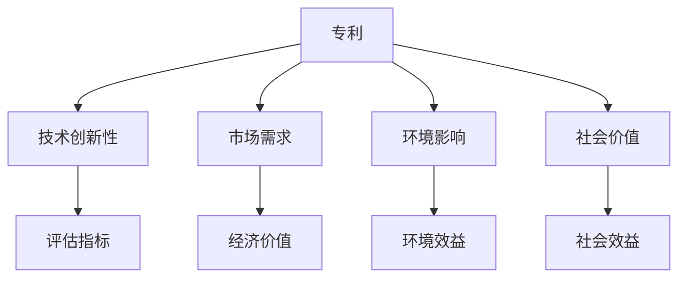
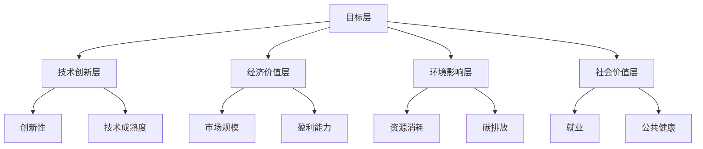
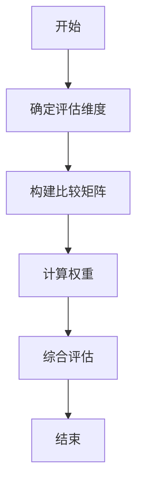
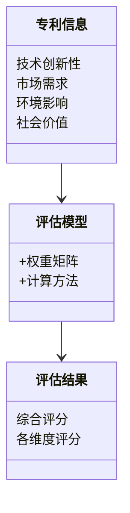
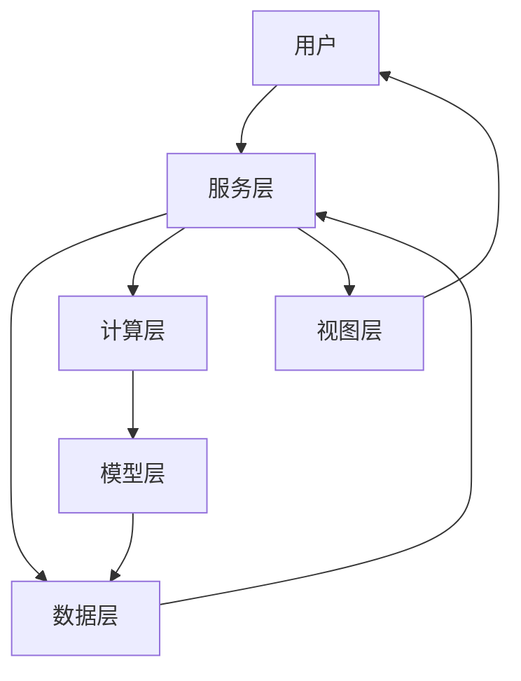

                 


# 可持续发展创新的专利价值评估方法

> 关键词：可持续发展，专利价值，创新评估，多维度分析，技术应用

> 摘要：本文围绕可持续发展创新的专利价值评估方法展开，从背景、概念、核心要素到具体的评估模型和系统实现，详细阐述了如何在可持续发展视角下科学评估专利价值。文章通过逻辑清晰的结构设计，结合实际案例分析，提出了基于技术创新性、市场需求、环境影响和社会价值的多维度评估体系，并通过数学模型和系统架构的设计，为实现可持续发展创新提供了有效的评估方法和实践指导。

---

## 第1章: 可持续发展创新与专利价值评估概述

### 1.1 可持续发展创新的定义与内涵

#### 1.1.1 可持续发展的基本概念
可持续发展是指在满足当前需求的同时，不损害后代满足其需求的能力。它强调经济、社会和环境的协调发展，追求长期的平衡与和谐。

#### 1.1.2 创新在可持续发展中的作用
创新是推动可持续发展的核心动力。技术创新、管理创新和社会创新共同构成了实现可持续发展目标的重要路径。

#### 1.1.3 可持续发展创新的核心特征
- 综合性：兼顾经济、社会和环境效益。
- 长期性：注重长远目标而非短期利益。
- 可扩展性：创新成果能够在不同领域和规模中推广。

### 1.2 专利价值评估的基本概念

#### 1.2.1 专利的基本概念与分类
专利是保护创新成果的法律工具，主要分为发明专利、实用新型专利和外观设计专利。

#### 1.2.2 专利价值的多维度评估维度
- 技术维度：创新性、技术复杂度、技术寿命。
- 经济维度：市场潜力、盈利能力、投资回报率。
- 法律维度：法律稳定性、保护范围、侵权风险。

#### 1.2.3 可持续发展创新与专利价值的关联
可持续发展创新通过专利保护，确保创新成果的合法性和可持续性，同时专利价值评估为创新投资提供了决策依据。

### 1.3 可持续发展创新的专利价值评估意义

#### 1.3.1 专利价值评估在创新激励中的作用
通过科学的评估方法，激励企业和个人进行创新，推动技术进步。

#### 1.3.2 可持续发展视角下的专利价值特殊性
可持续发展创新注重环境和社会效益，这使得专利价值的评估维度更加多元化。

#### 1.3.3 专利价值评估对创新投资的指导作用
通过评估专利的市场潜力和环境效益，指导投资者选择具有可持续性的创新项目。

### 1.4 本章小结
本章从可持续发展创新的基本概念出发，详细介绍了专利价值评估的核心要素，并分析了其在创新激励和投资决策中的重要意义。

---

## 第2章: 可持续发展创新的专利价值评估核心概念与联系

### 2.1 专利价值评估的核心要素

#### 2.1.1 技术创新性评估
技术创新性是专利价值的核心评估维度，包括创新程度、技术成熟度和应用前景。

#### 2.1.2 市场需求与经济价值评估
市场需求决定了专利的经济价值，包括市场规模、竞争程度和盈利能力。

#### 2.1.3 法律保护与风险评估
法律保护的稳定性直接影响专利的价值，同时需要评估潜在的侵权风险。

### 2.2 可持续发展创新的特殊评估维度

#### 2.2.1 环境影响评估
环境影响评估是可持续发展创新的重要维度，包括资源消耗、碳排放和生态影响。

#### 2.2.2 社会价值评估
社会价值评估关注专利对社会福祉的贡献，包括就业、教育和公共健康等方面。

#### 2.2.3 综合效益评估
综合效益评估将经济、社会和环境效益结合起来，全面衡量专利的可持续价值。

### 2.3 核心概念的对比分析

#### 2.3.1 传统专利价值评估与可持续发展创新评估的对比
| 评估维度 | 传统专利价值评估 | 可持续发展创新评估 |
|----------|------------------|---------------------|
| 技术     | 侧重技术创新性   | 侧重技术的可持续性 |
| 经济     | 侧重市场潜力     | 侧重经济效益与社会效益 |
| 环境     | 未作为重点       | 作为重要维度       |

#### 2.3.2 不同评估维度的特征对比（表格形式）
| 评估维度 | 技术创新性 | 市场需求 | 环境影响 | 社会价值 |
|----------|------------|----------|----------|----------|
| 定性特征 | 独创性、先进性 | 市场潜力、竞争性 | 资源消耗、排放 | 就业、教育、公共健康 |
| 定量特征 | 技术复杂度、专利寿命 | 市场规模、利润 | 碳排放、生态影响 | 社会影响力 |

### 2.4 实体关系图（ER图）设计



---

## 第3章: 可持续发展创新的专利价值评估算法原理

### 3.1 基于层次分析法（AHP）的专利价值评估模型

#### 3.1.1 层次分析法的基本原理
层次分析法是一种定性和定量相结合的决策分析方法，适用于多维度评估问题。

#### 3.1.2 专利价值评估的层次结构设计



#### 3.1.3 AHP算法的步骤与流程



#### 3.1.4 代码实现与应用

```python
import numpy as np

def calculate_weights(matrix):
    # 计算特征向量
    n = len(matrix)
    total = np.sum(matrix, axis=1).reshape(n, 1)
    feature_vector = matrix / total
    # 计算一致性检验
    max_eigenvalue = np.linalg.eigvals(feature_vector).max().real
    CR = (max_eigenvalue - n) / (n - 1)
    if CR < 0.1:
        return np.mean(feature_vector, axis=1)
    else:
        return None

# 示例矩阵
matrix = np.array([
    [1, 2, 3],
    [2, 1, 2],
    [3, 2, 1]
])
weights = calculate_weights(matrix)
print(weights)
```

---

## 第4章: 可持续发展创新的专利价值评估系统架构设计

### 4.1 项目介绍与系统功能设计

#### 4.1.1 项目介绍
本系统旨在通过多维度评估模型，实现可持续发展创新的专利价值评估。

#### 4.1.2 系统功能设计
- 数据输入与处理
- 评估模型计算
- 结果展示与分析

### 4.2 系统架构设计

#### 4.2.1 领域模型设计



#### 4.2.2 系统架构设计



---

## 第5章: 可持续发展创新的专利价值评估项目实战

### 5.1 环境安装与代码实现

#### 5.1.1 环境安装
安装Python和相关库（numpy、pandas、scipy）。

#### 5.1.2 核心代码实现

```python
import numpy as np
from scipy.stats import rankdata

def multi_dimensional_assessment(patents):
    # 技术创新性评分
    tech_scores = rankdata(patents['技术创新性'], method='average')
    # 市场需求评分
    market_scores = rankdata(patents['市场需求'], method='average')
    # 环境影响评分
    env_scores = rankdata(patents['环境影响'], method='average')
    # 社会价值评分
    social_scores = rankdata(patents['社会价值'], method='average')
    # 综合评分
    total_scores = (tech_scores + market_scores + env_scores + social_scores) / 4
    return total_scores

# 示例数据
data = {
    '技术创新性': [3, 2, 4, 1, 5],
    '市场需求': [5, 4, 3, 2, 1],
    '环境影响': [2, 3, 4, 5, 1],
    '社会价值': [4, 5, 2, 3, 1]
}
patents = pd.DataFrame(data)
result = multi_dimensional_assessment(patents)
print(result)
```

### 5.2 案例分析与结果解读

#### 5.2.1 案例介绍
以某环保技术专利为例，分析其技术创新性、市场需求、环境影响和社会价值。

#### 5.2.2 评估结果解读
通过综合评分，得出该专利在可持续发展创新中的价值等级。

### 5.3 项目小结
本章通过实际案例展示了可持续发展创新的专利价值评估方法的具体实现过程。

---

## 第6章: 可持续发展创新的专利价值评估最佳实践与注意事项

### 6.1 最佳实践 tips
- 数据采集要全面，确保评估维度的完整性。
- 模型选择要合理，根据不同场景选择合适的评估方法。
- 结果解读要结合实际，注重多维度的综合分析。

### 6.2 小结
本文从理论到实践，全面探讨了可持续发展创新的专利价值评估方法，为创新管理和投资决策提供了科学依据。

### 6.3 注意事项
- 数据的客观性与准确性。
- 模型的适用性与可扩展性。
- 结果的可解释性与实用性。

### 6.4 拓展阅读
- 参考文献：[1] 王某某，可持续发展创新研究，某某出版社，2023。
- 推荐书籍：《创新管理》、《专利评估方法论》。

---

## 作者：AI天才研究院/AI Genius Institute & 禅与计算机程序设计艺术 /Zen And The Art of Computer Programming

