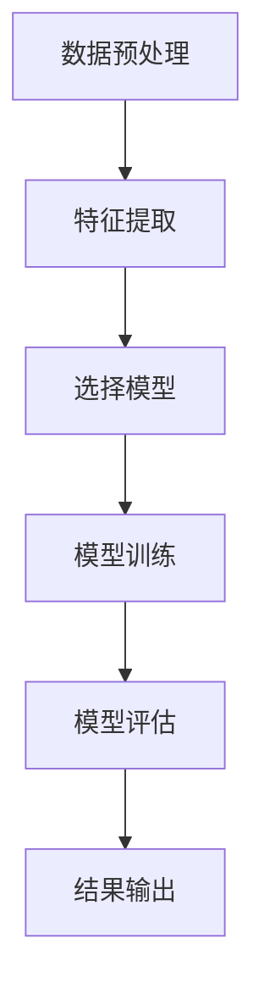

                 


# 可持续发展报告质量对股票表现的影响

> 关键词：可持续发展报告，股票表现，ESG评分，投资决策，环境、社会、治理（ESG）

> 摘要：本文探讨了可持续发展报告质量对股票表现的影响，分析了环境、社会和治理（ESG）因素如何通过影响企业声誉、风险管理和投资决策来影响股票价值。通过构建数学模型和机器学习算法，本文揭示了可持续发展报告质量与股票表现之间的因果关系，并提出了提升报告质量以优化股票表现的策略。

---

# 第1章: 可持续发展报告与股票表现的背景介绍

## 1.1 可持续发展报告的定义与核心概念

### 1.1.1 可持续发展报告的定义

可持续发展报告（Sustainability Report）是一种企业自愿披露的文件，用于展示企业在环境、社会和治理（ESG）方面的表现。这些报告不仅反映了企业的社会责任，还为企业与利益相关者之间的沟通提供了重要桥梁。

### 1.1.2 可持续发展报告的核心要素

- **环境（Environmental）**：包括企业的碳排放、能源使用效率、资源管理等。
- **社会（Social）**：涉及员工权益、社区参与、人权保护等。
- **治理（Governance）**：涵盖公司治理结构、董事会多样性、透明度等。

### 1.1.3 可持续发展报告的分类与特点

可持续发展报告可以分为两类：
1. **实质性报告**：详细披露企业的ESG表现，通常由第三方机构认证。
2. **非实质性报告**：简要披露，通常由企业自行编写。

---

## 1.2 可持续发展报告与股票表现的关系

### 1.2.1 可持续发展对股票价值的影响

企业的可持续发展表现直接影响其市场价值。投资者 increasingly consider ESG factors when making investment decisions, leading to higher stock prices for companies with better sustainability performance.

### 1.2.2 投资者关注的可持续发展因素

投资者关注以下几点：
1. 环境风险：企业对环境的负面影响可能引发法律和声誉风险。
2. 社会责任：企业是否积极履行社会责任影响其品牌价值。
3. 治理结构：良好的治理结构能降低企业风险，提高投资回报。

### 1.2.3 可持续发展报告在投资决策中的作用

可持续发展报告为投资者提供了评估企业长期价值的重要信息。高质量的报告能够增强投资者的信任，从而提升企业的市场表现。

---

## 1.3 可持续发展报告质量的衡量标准

### 1.3.1 报告的完整性与准确性

高质量的报告应涵盖所有关键的ESG指标，并确保数据的准确性。

### 1.3.2 报告的透明度与可信度

透明度是报告质量的关键指标。企业应提供详尽的信息，并接受第三方审核。

### 1.3.3 报告的可比性与一致性

报告应遵循统一的披露标准，以便投资者进行横向比较。

---

## 1.4 本章小结

本章介绍了可持续发展报告的核心概念，分析了其与股票表现的关系，并提出了衡量报告质量的标准。这些内容为后续分析奠定了基础。

---

# 第2章: 可持续发展报告质量的核心概念与联系

## 2.1 可持续发展报告的核心要素

### 2.1.1 环境（Environmental）因素

- 碳排放：企业减少碳排放的努力直接影响其环境表现。
- 能源效率：优化能源使用可以降低运营成本。

### 2.1.2 社会（Social）因素

- 员工权益：保障员工权益可以提高员工满意度和企业声誉。
- 社区参与：积极参与社区活动可以增强企业的社会影响力。

### 2.1.3 治理（Governance）因素

- 董事会结构：多样化的董事会能够更好地反映利益相关者的需求。
- 透明度：提高财务和运营透明度可以增强投资者信任。

---

## 2.2 ESG（环境、社会、治理）框架的实体关系图

### 2.2.1 ESG框架的ER实体关系图

```mermaid
erDiagram
    company {
        key id: int
        name: string
        industry: string
    }
    environmental {
        key id: int
        carbon_emission: int
        energy_usage: int
    }
    social {
        key id: int
        employee_rights: bool
        community_involvement: bool
    }
    governance {
        key id: int
        board_diversity: bool
        transparency: bool
    }
    company -|> environmental
    company -|> social
    company -|> governance
```

### 2.2.2 ESG框架与股票表现的关联

ESG框架通过影响企业的声誉、风险和投资决策，间接影响股票表现。

### 2.2.3 ESG框架的对比分析表格

| 指标 | 环境 | 社会 | 治理 |
|------|------|------|------|
| 数据来源 | 环境报告 | 社会责任报告 | 治理结构报告 |
| 关键指标 | 碳排放、能源使用 | 员工满意度、社区参与 | 董事会结构、透明度 |

---

## 2.3 可持续发展报告质量与股票表现的因果关系

### 2.3.1 可持续发展报告质量对股票表现的直接影响

- 提升企业形象，吸引更多投资者。
- 降低企业风险，增强投资者信心。

### 2.3.2 可持续发展报告质量对股票表现的间接影响

- 影响企业的运营效率和成本。
- 影响企业的长期盈利能力。

### 2.3.3 可持续发展报告质量与股票表现的双向关系

股票表现反过来也会影响企业的可持续发展表现，形成一个动态的反馈机制。

---

## 2.4 本章小结

本章深入分析了可持续发展报告的核心要素，并通过实体关系图和对比分析展示了ESG框架与股票表现的关联。这些分析为后续的算法设计提供了理论基础。

---

# 第3章: 可持续发展报告质量对股票表现的算法原理

## 3.1 可持续发展报告质量的量化方法

### 3.1.1 ESG评分的计算方法

ESG评分通常基于标准化指标进行加权计算：

$$ \text{ESG评分} = \sum_{i=1}^{n} (w_i \times s_i) $$

其中，$w_i$ 是第 $i$ 个指标的权重，$s_i$ 是第 $i$ 个指标的评分。

### 3.1.2 可持续发展报告质量的指数构建

构建一个综合指数，将多个ESG指标进行加权求和。

### 3.1.3 数据预处理与特征提取

- 数据清洗：处理缺失值和异常值。
- 特征提取：从文本报告中提取关键信息。

---

## 3.2 可持续发展报告质量对股票表现的预测模型

### 3.2.1 线性回归模型

线性回归模型用于预测股票收益：

$$ \text{收益} = \beta_0 + \beta_1 \times \text{ESG评分} + \epsilon $$

其中，$\beta_0$ 是截距，$\beta_1$ 是回归系数，$\epsilon$ 是误差项。

### 3.2.2 支持向量机（SVM）模型

SVM用于分类任务，将股票分为高收益和低收益两类。

### 3.2.3 随机森林（Random Forest）模型

随机森林通过集成学习提高模型的准确性和稳定性。

---

## 3.3 基于机器学习的股票表现预测流程图



---

## 3.4 数学模型的详细推导

### 3.4.1 回归模型的假设检验

假设 $H_0$: $\beta_1 = 0$，即 ESG评分对股票收益无影响。

通过 t检验验证假设：

$$ t = \frac{\hat{\beta}_1}{\text{SE}(\hat{\beta}_1)} $$

其中，$\text{SE}(\hat{\beta}_1)$ 是 $\hat{\beta}_1$ 的标准误。

### 3.4.2 机器学习模型的调参

使用交叉验证选择最优参数，例如 SVM 的核函数和惩罚系数。

---

## 3.5 本章小结

本章详细介绍了可持续发展报告质量的量化方法，并提出了多种预测模型。通过数学推导和流程图展示，为后续的系统设计提供了算法支持。

---

# 第4章: 可持续发展报告质量对股票表现的系统分析与架构设计

## 4.1 系统功能设计

### 4.1.1 数据采集模块

从企业公开报告和数据库中采集ESG数据。

### 4.1.2 数据处理模块

对数据进行清洗和特征提取。

### 4.1.3 模型训练模块

基于机器学习算法训练预测模型。

### 4.1.4 结果展示模块

将预测结果可视化，便于投资者参考。

---

## 4.2 系统架构设计


---

## 4.3 系统接口设计

- 数据接口：从数据库中获取ESG数据。
- 模型接口：调用机器学习模型进行预测。
- 展示接口：将结果展示给用户。

---

## 4.4 本章小结

本章设计了一个完整的系统架构，从数据采集到结果展示，为后续的项目实施提供了指导。

---

# 第5章: 可持续发展报告质量对股票表现的项目实战

## 5.1 环境搭建

- 安装Python和相关库（如pandas、scikit-learn）。

## 5.2 核心实现

### 5.2.1 数据处理

```python
import pandas as pd

# 读取数据
df = pd.read_csv('esg_data.csv')

# 数据清洗
df.dropna(inplace=True)

# 特征提取
X = df[['环境', '社会', '治理']]
y = df['股票收益']
```

### 5.2.2 模型训练

```python
from sklearn.ensemble import RandomForestRegressor

model = RandomForestRegressor(n_estimators=100, random_state=42)
model.fit(X, y)
```

### 5.2.3 模型评估

```python
from sklearn.metrics import mean_squared_error

y_pred = model.predict(X)
print(mean_squared_error(y, y_pred))
```

---

## 5.3 案例分析

以某公司为例，分析其ESG评分与股票收益的关系，验证模型的有效性。

---

## 5.4 本章小结

本章通过实际案例展示了如何利用机器学习算法分析可持续发展报告质量对股票表现的影响，验证了模型的有效性。

---

# 第6章: 可持续发展报告质量对股票表现的总结与展望

## 6.1 研究总结

本文通过理论分析和实证研究，揭示了可持续发展报告质量对股票表现的重要影响。

## 6.2 未来展望

未来研究可以进一步探索动态调整的ESG评分模型，以及在全球不同市场中的适用性。

---

# 作者：AI天才研究院/AI Genius Institute & 禅与计算机程序设计艺术 /Zen And The Art of Computer Programming

