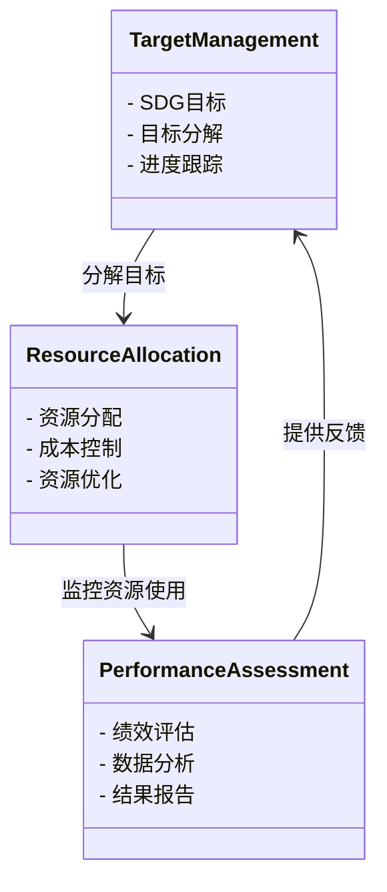

                 


# 可持续发展目标对公司估值的长期影响

## 关键词：
- 可持续发展目标（SDGs）
- 公司估值
- 长期影响
- 环境、社会与治理（ESG）
- 企业社会责任
- 财务表现

## 摘要：
本文探讨了联合国可持续发展目标（SDGs）对公司长期估值的影响。通过分析SDGs的核心概念、对财务表现的具体影响以及长期的战略意义，本文揭示了企业在实现SDGs过程中如何提升品牌价值、降低风险，并在可持续发展领域获得竞争优势。文章结合实际案例和系统架构设计，展示了如何将SDGs整合到企业战略中，以实现长期的财务和非财务价值最大化。

---

# 第一部分：可持续发展目标的背景与概念

## 第1章：可持续发展目标的核心概念

### 1.1 可持续发展目标的起源与意义

#### 1.1.1 可持续发展目标的定义与背景
可持续发展目标（Sustainable Development Goals，SDGs）是联合国在2015年通过的17个全球性目标，旨在指导全球在2030年前实现消除贫困、保护地球、促进繁荣等关键领域的发展。这些目标强调经济、社会和环境的协调发展，为全球企业和组织提供了明确的行动指南。

#### 1.1.2 联合国SDGs的17个目标概述
联合国SDGs的17个目标包括消除贫困、消除饥饿、良好健康与福祉、优质教育、性别平等、清洁水与卫生、清洁能源、体面工作与经济增长、工业创新与基础设施、减少不平等、可持续城市和社区、负责任消费和生产、气候行动、保护陆地生态系统、保护海洋生态系统、和平正义与强大机构、促进目标实现的伙伴关系。

#### 1.1.3 可持续发展目标对企业的影响
企业是实现SDGs的重要力量。通过参与SDGs，企业可以在品牌建设、社会责任履行、资源效率提升等方面获得竞争优势，同时为全球可持续发展做出贡献。

### 1.2 可持续发展目标的核心要素

#### 1.2.1 环境（Environmental）目标
环境目标包括减少碳排放、保护生物多样性、推动清洁能源的使用等。企业在实现环境目标的过程中，可以通过技术创新、节能减排等方式降低运营成本，同时提升品牌形象。

#### 1.2.2 社会（Social）目标
社会目标包括消除贫困、促进性别平等、提供体面工作等。企业通过履行社会责任，可以提升员工满意度、增强社会声誉，同时在社会问题的解决中发现新的商业机会。

#### 1.2.3 治理（Governance）目标
治理目标包括加强透明度、提升公司治理效率、减少腐败等。良好的治理实践可以帮助企业降低管理风险，提升投资者信心。

### 1.3 可持续发展目标与公司估值的关系

#### 1.3.1 可持续发展目标对企业价值的影响
可持续发展目标的实现可以提升企业的品牌价值、降低运营风险、开拓新市场，从而提高企业的整体价值。

#### 1.3.2 可持续发展目标对投资决策的作用
投资者越来越关注企业的环境、社会和治理（ESG）表现。企业通过实现SDGs，可以吸引更多的可持续投资者，从而提升公司的估值。

#### 1.3.3 可持续发展目标与企业社会责任的结合
企业通过参与SDGs，可以更好地履行社会责任，提升社会形象，从而在长期获得更多的支持和认可。

---

# 第二部分：可持续发展目标对财务表现的影响

## 第2章：可持续发展目标对财务表现的分析

### 2.1 可持续发展目标对收入的影响

#### 2.1.1 可持续产品与服务的市场需求
随着消费者对可持续产品的需求增加，企业通过开发环保产品、绿色服务等，可以开拓新的市场，增加收入来源。

#### 2.1.2 可持续发展目标对企业品牌价值的提升
通过积极参与SDGs，企业可以提升品牌形象，增强客户忠诚度，从而在长期获得更多的客户支持。

#### 2.1.3 可持续发展目标对客户忠诚度的影响
客户越来越倾向于选择具有社会责任感的企业。通过实现SDGs，企业可以提升客户忠诚度，从而在长期获得更多的客户支持。

### 2.2 可持续发展目标对成本的影响

#### 2.2.1 环境保护措施的成本节约
通过减少能源消耗、优化供应链等措施，企业可以降低运营成本，实现成本节约。

#### 2.2.2 社会责任履行的成本优化
通过履行社会责任，企业可以提升员工满意度、降低员工流动率，从而优化人力资源成本。

#### 2.2.3 可持续发展目标对供应链效率的提升
通过推动供应链的可持续发展，企业可以降低供应链风险，提升供应链效率，从而降低成本。

### 2.3 可持续发展目标对风险的降低

#### 2.3.1 环境风险的降低
通过实现环境目标，企业可以减少环境违规风险，降低环境诉讼的可能性。

#### 2.3.2 社会风险的降低
通过实现社会目标，企业可以减少社会矛盾，降低社会舆论风险。

#### 2.3.3 治理风险的降低
通过实现治理目标，企业可以提升公司治理水平，降低管理风险。

---

# 第三部分：可持续发展目标的长期影响分析

## 第3章：可持续发展目标的长期影响

### 3.1 可持续发展目标对投资价值的影响

#### 3.1.1 可持续发展目标对股票价格的影响
随着投资者对ESG表现的关注增加，实现SDGs的企业可能会获得更高的股票估值。

#### 3.1.2 可持续发展目标对债券评级的影响
通过实现SDGs，企业可以提升信用评级，从而降低债券融资成本。

#### 3.1.3 可持续发展目标对企业融资成本的影响
企业通过实现SDGs，可以吸引更多的可持续投资者，从而降低融资成本。

### 3.2 可持续发展目标对竞争优势的影响

#### 3.2.1 可持续发展目标对企业创新的推动
通过实现SDGs，企业可以推动技术创新，提升产品和服务的竞争力。

#### 3.2.2 可持续发展目标对企业市场地位的提升
通过实现SDGs，企业可以提升市场地位，获得更多的市场份额。

#### 3.2.3 可持续发展目标对企业品牌溢价的增强
通过实现SDGs，企业可以提升品牌溢价，从而在价格竞争中占据优势。

### 3.3 可持续发展目标对风险管理的影响

#### 3.3.1 可持续发展目标对企业声誉风险的控制
通过实现SDGs，企业可以降低声誉风险，增强社会信任。

#### 3.3.2 可持续发展目标对企业法律风险的降低
通过实现SDGs，企业可以减少法律诉讼的可能性，降低法律风险。

#### 3.3.3 可持续发展目标对企业运营风险的降低
通过实现SDGs，企业可以降低运营风险，提升整体风险管理能力。

---

## 第四部分：系统架构与实现方案

## 第4章：系统架构设计

### 4.1 问题场景介绍
企业需要通过系统化的手段实现SDGs，提升公司估值。系统需要整合企业内部的资源、数据和流程，以支持可持续发展目标的实现。

### 4.2 系统功能设计

#### 4.2.1 领域模型设计
使用Mermaid类图描述企业SDGs实现的领域模型，包括目标管理、资源分配、绩效评估等核心模块。



### 4.3 系统架构设计

#### 4.3.1 系统架构图
使用Mermaid架构图描述系统架构，包括前端、后端、数据层和外部接口。

```mermaid
architectural
    title 可持续发展目标管理系统架构图
    Data Layer
    Service Layer
    Application Layer
    Presentation Layer
    Integration Layer
```

---

## 第五部分：项目实战与案例分析

## 第5章：项目实战

### 5.1 项目背景介绍
以某企业为例，描述其通过实现SDGs提升公司估值的实践过程。

### 5.2 核心实现代码

#### 5.2.1 数据收集与处理
```python
import pandas as pd
import numpy as np

# 读取数据
df = pd.read_csv('sdg_data.csv')

# 数据清洗
df.dropna(inplace=True)
df['Revenue'] = df['Revenue'].apply(lambda x: x * 1.1 if x > 1000000 else x)

# 可视化
import matplotlib.pyplot as plt
plt.plot(df['Year'], df['Revenue'])
plt.xlabel('Year')
plt.ylabel('Revenue')
plt.title('Revenue Growth with SDG Implementation')
plt.show()
```

#### 5.2.2 可视化展示
```python
import plotly.express as px

fig = px.line(df, x="Year", y="Revenue", title='Revenue Growth with SDG Implementation')
fig.show()
```

---

## 第六部分：最佳实践与总结

## 第6章：最佳实践与总结

### 6.1 最佳实践

#### 6.1.1 确保高层支持
企业实现SDGs需要高层的全面支持，确保资源的充足性和战略的可持续性。

#### 6.1.2 建立明确的目标和指标
企业需要制定明确的SDG目标，并建立可量化的指标，以便于监控和评估实现进展。

#### 6.1.3 推动跨部门协作
实现SDGs需要企业内部多个部门的协作，建立跨部门的协作机制，确保目标的顺利实现。

### 6.2 小结
通过实现SDGs，企业可以在提升品牌价值、降低风险、开拓市场等方面获得长期的财务和非财务利益。SDGs不仅是企业的社会责任，更是企业实现可持续发展的关键策略。

### 6.3 注意事项

#### 6.3.1 避免短期利益的诱惑
企业需要避免为追求短期利益而忽视SDGs的长期影响，确保战略的持续性和一致性。

#### 6.3.2 注重数据的真实性和可比性
企业在收集和分析数据时，需要确保数据的真实性和可比性，以便于准确评估SDGs的实现进展。

#### 6.3.3 加强与利益相关者的沟通
企业需要加强与利益相关者的沟通，确保各方对SDGs的理解和支持，从而获得更多的资源和帮助。

### 6.4 拓展阅读
- 联合国SDGs官方网站：https://sdgs.un.org
- 环境、社会与治理（ESG）相关书籍和报告
- 国内外关于SDGs的企业实践案例

---

## 作者信息

作者：AI天才研究院/AI Genius Institute & 禅与计算机程序设计艺术 /Zen And The Art of Computer Programming

---

以上是《可持续发展目标对公司估值的长期影响》的目录大纲和内容概要，涵盖了从背景介绍、概念分析、影响机制到系统设计和项目实战的各个方面。希望这篇文章能够为读者提供关于SDGs对公司估值影响的全面理解和实践指导。

