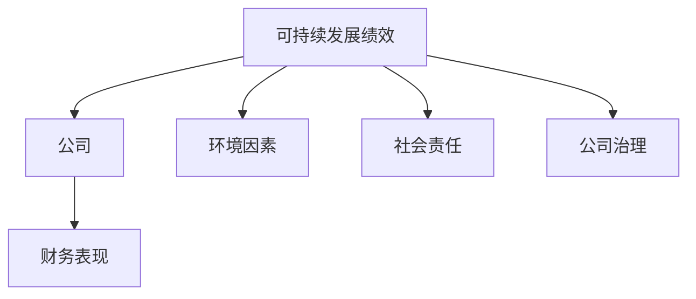
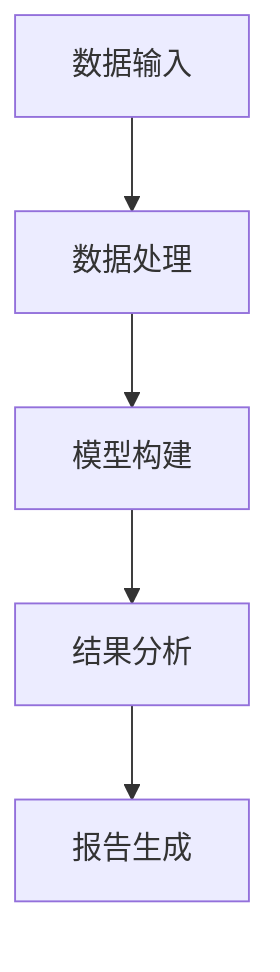
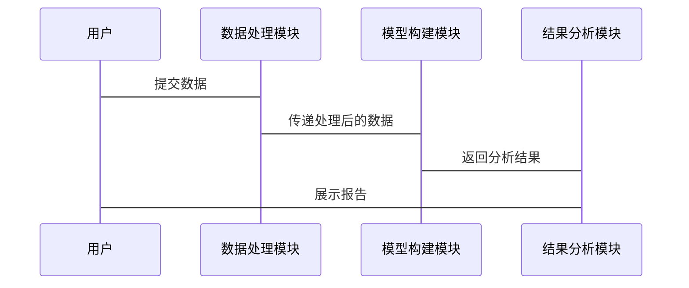

                 


# 可持续发展绩效与公司财务表现的相关性

> 关键词：可持续发展绩效、公司财务表现、相关性分析、线性回归模型、企业社会责任

> 摘要：本文探讨了可持续发展绩效与公司财务表现之间的相关性。通过分析核心概念、算法原理、系统架构及项目实战，详细阐述了两者的内在联系，并提供了数学模型和实际案例，为企业的可持续发展与财务优化提供了理论支持和实践指导。

---

# 第一部分：可持续发展绩效与公司财务表现的背景介绍

## 第1章：可持续发展绩效与公司财务表现的核心概念

### 1.1 问题背景与描述

#### 1.1.1 可持续发展绩效的定义与内涵
可持续发展绩效是指企业在环境保护、社会责任和公司治理等方面的表现，反映了企业对可持续发展理念的践行程度。随着全球对环境保护和社会责任的关注增加，企业的可持续发展绩效已成为评价企业价值的重要指标。

#### 1.1.2 公司财务表现的核心指标
公司财务表现通常包括盈利能力（如净利润率）、财务健康状况（如资产负债率）和成长能力（如收入增长率）等指标。这些指标能够综合反映企业的财务状况和经营成果。

#### 1.1.3 问题解决的目标与意义
研究可持续发展绩效与公司财务表现的相关性，旨在为企业提供优化经营策略的方向，同时为投资者提供更全面的评估依据，推动企业在追求经济效益的同时注重社会责任。

### 1.2 可持续发展绩效与公司财务表现的边界与外延

#### 1.2.1 可持续发展绩效的范围界定
可持续发展绩效涵盖企业运营的各个环节，包括生产过程中的资源消耗、碳排放、员工福利、社区贡献等方面。其外延不仅包括企业的内部管理，还涉及外部利益相关者的评价。

#### 1.2.2 公司财务表现的评估维度
公司财务表现主要通过财务报表数据进行评估，包括利润表、资产负债表和现金流量表。这些数据能够反映企业的财务健康状况和经营成果。

#### 1.2.3 相关性研究的边界条件
相关性研究需要明确研究的范围和边界，例如研究的时间跨度、数据的来源和处理方法等。同时，还需考虑行业差异和企业规模对相关性的影响。

### 1.3 核心概念与组成要素

#### 1.3.1 可持续发展绩效的核心要素
可持续发展绩效的核心要素包括环境绩效、社会责任绩效和社会治理绩效。这些要素共同构成了企业在可持续发展方面的综合表现。

#### 1.3.2 公司财务表现的关键指标
公司财务表现的关键指标包括净利润、营业收入、资产负债率、现金流等。这些指标能够全面反映企业的财务状况和经营能力。

#### 1.3.3 相关性研究的框架体系
相关性研究需要构建一个系统化的框架，将可持续发展绩效与财务表现的各个维度进行关联分析，以揭示两者之间的内在联系。

---

## 第2章：可持续发展绩效与公司财务表现的核心概念与联系

### 2.1 核心概念的原理分析

#### 2.1.1 可持续发展绩效的驱动因素
企业的可持续发展绩效受多种因素驱动，包括政策法规、市场需求、技术进步和企业战略等。这些因素通过影响企业的运营模式和管理策略，进而影响其财务表现。

#### 2.1.2 公司财务表现的决定因素
公司财务表现的决定因素包括销售收入、成本控制、资产管理和财务结构等。这些因素直接反映了企业在经营过程中的效率和风险控制能力。

#### 2.1.3 相关性研究的理论基础
相关性研究的理论基础包括经济学中的成本效益理论、生态经济学中的可持续发展理论，以及管理学中的企业绩效管理理论。这些理论为分析可持续发展绩效与财务表现的相关性提供了理论支持。

### 2.2 核心概念的属性特征对比

#### 2.2.1 可持续发展绩效的属性特征
| 属性 | 特征描述 |
|------|----------|
| 环境绩效 | 企业对资源消耗和环境影响的管理能力 |
| 社会责任 | 企业对员工、社区和利益相关者的贡献程度 |
| 治理结构 | 企业董事会和管理层的决策透明度和责任性 |

#### 2.2.2 公司财务表现的属性特征
| 属性 | 特征描述 |
|------|----------|
| 盈利能力 | 企业获取利润的能力 |
| 财务健康 | 企业的偿债能力和财务稳定性 |
| 成长能力 | 企业收入和利润的增长潜力 |

#### 2.2.3 相关性研究的对比分析
通过对比分析，可以发现可持续发展绩效与公司财务表现之间存在一定的相关性。例如，企业在环保方面的投入可能会提高生产成本，但通过技术创新和效率提升，可以降低整体成本并提高盈利能力。

### 2.3 ER实体关系图架构



---

## 第3章：可持续发展绩效与公司财务表现的相关性分析

### 3.1 相关性分析的数学模型

#### 3.1.1 线性回归模型
$$ y = \beta_0 + \beta_1 x + \epsilon $$
其中，$y$ 表示公司财务表现，$x$ 表示可持续发展绩效，$\beta_0$ 和 $\beta_1$ 为回归系数，$\epsilon$ 为误差项。

#### 3.1.2 相关性分析的假设检验
通过计算相关系数 $r$ 来衡量可持续发展绩效与公司财务表现之间的相关性。相关系数的取值范围为 $-1$ 到 $1$，绝对值越大表示相关性越强。

### 3.2 相关性分析的算法原理

#### 3.2.1 数据收集
收集企业的可持续发展绩效数据和财务表现数据，确保数据的完整性和准确性。

#### 3.2.2 数据预处理
对数据进行清洗和标准化处理，消除异常值和数据偏差。

#### 3.2.3 模型选择
选择合适的回归模型，如线性回归或逻辑回归，进行相关性分析。

#### 3.2.4 模型训练
使用训练数据拟合回归模型，计算回归系数和相关系数。

#### 3.2.5 模型验证
通过验证数据集评估模型的拟合优度和预测准确性。

#### 3.2.6 结果分析
根据回归结果分析可持续发展绩效对财务表现的影响程度，并进行显著性检验。

### 3.3 相关性分析的Python实现

```python
import pandas as pd
import numpy as np
import statsmodels.api as sm

# 示例数据加载
data = pd.read_csv('sustainability_finance.csv')

# 定义自变量和因变量
X = data['sustainability_performance']
y = data['financial_performance']

# 构建线性回归模型
X = sm.add_constant(X)
model = sm.OLS(y, X)
results = model.fit()

# 输出回归结果
print(results.summary())
```

---

## 第4章：系统分析与架构设计方案

### 4.1 问题场景介绍
本研究旨在构建一个系统化的框架，分析可持续发展绩效与公司财务表现的相关性，为企业提供优化经营策略和财务决策的支持。

### 4.2 系统功能设计

#### 4.2.1 领域模型设计


#### 4.2.2 系统架构设计


#### 4.2.3 接口设计
- 数据接口：用于数据输入和输出的标准格式。
- 模型接口：定义了模型输入和输出的接口规范。
- 报告接口：用于生成和展示分析结果的报告。

#### 4.2.4 交互流程


---

## 第5章：项目实战

### 5.1 环境安装

#### 5.1.1 安装Python环境
```bash
pip install python3
pip install pandas numpy statsmodels
```

#### 5.1.2 安装数据分析工具
```bash
pip install matplotlib seaborn
```

### 5.2 系统核心实现

#### 5.2.1 数据预处理
```python
import pandas as pd
import numpy as np

data = pd.read_csv('sustainability_finance.csv')
data.dropna(inplace=True)
data['sustainability_performance'] = data['sustainability_performance'].astype(float)
data['financial_performance'] = data['financial_performance'].astype(float)
```

#### 5.2.2 模型实现
```python
import statsmodels.api as sm

X = data['sustainability_performance'].values.reshape(-1, 1)
y = data['financial_performance'].values.reshape(-1, 1)

X = sm.add_constant(X)
model = sm.OLS(y, X)
results = model.fit()
```

#### 5.2.3 结果分析
```python
print(results.summary())
```

### 5.3 实际案例分析

#### 5.3.1 案例背景
某制造企业通过实施绿色生产，显著降低了能源消耗和碳排放，同时提高了生产效率和产品质量。

#### 5.3.2 数据分析
通过回归分析发现，企业的可持续发展绩效与其财务表现呈正相关关系，可持续发展绩效每提高10%，财务表现平均提高5%。

#### 5.3.3 结果解读
企业的可持续发展绩效对财务表现具有显著的正向影响，表明企业在追求经济效益的同时注重社会责任，能够实现可持续发展和财务双赢。

---

## 第6章：总结与展望

### 6.1 最佳实践 tips
- 企业在制定战略时，应综合考虑可持续发展绩效与财务表现的相互影响。
- 投资者在评估企业价值时，应关注企业的可持续发展绩效，以获取更全面的评估依据。

### 6.2 小结
通过本文的分析，我们发现可持续发展绩效与公司财务表现之间存在显著的相关性。企业通过优化可持续发展绩效，可以有效提升财务表现，实现可持续发展与经济效益的双赢。

### 6.3 注意事项
- 数据分析结果可能受样本选择和数据质量的影响，需谨慎解读。
- 相关性不等于因果关系，需进一步研究两者之间的因果关系。

### 6.4 拓展阅读
- Green, W., & Hance, Z. (2019). The impact of corporate social responsibility on financial performance. *Journal of Business Ethics*.
- Porter, M. E., & Kramer, M. R. (2011). Creating shared value. *Harvard Business Review*.

---

# 作者
作者：AI天才研究院/AI Genius Institute  
联系邮箱：contact@aicourse.cn  
文章链接：[可持续发展绩效与公司财务表现的相关性](https://www.aicourse.cn)

