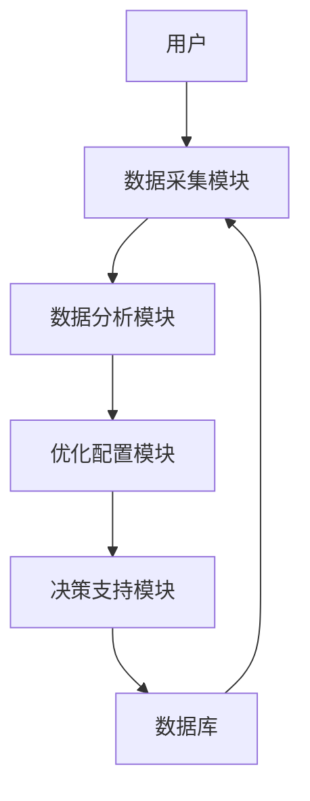
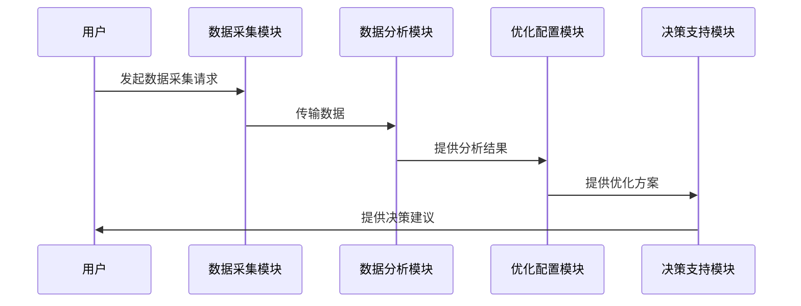

                 


# 可持续水资源管理技术的市场需求分析

> 关键词：可持续水资源管理，市场需求，智能监测，数据分析，优化配置

> 摘要：随着全球水资源短缺和污染问题的加剧，可持续水资源管理技术的需求日益迫切。本文从背景与概念、市场需求分析、技术解决方案、系统架构设计等方面进行详细分析，探讨如何通过技术创新和系统优化来实现水资源的可持续管理。

---

## 第一部分: 可持续水资源管理技术的背景与概念

### 第1章: 可持续水资源管理的定义与意义

#### 1.1 可持续水资源管理的定义

- **1.1.1 水资源管理的基本概念**
  - 水资源管理是指对水资源的开发、利用、保护和修复的过程。
  - 它涵盖了地表水、地下水和雨水等多种水源的管理。

- **1.1.2 可持续发展的内涵**
  - 可持续发展是指在满足当前需求的同时，不损害后代满足其需求的能力。
  - 在水资源管理中，可持续性意味着合理利用水资源，避免过度开发和污染。

- **1.1.3 可持续水资源管理的核心目标**
  - 保障水资源的长期供应。
  - 保护水生态环境。
  - 促进水资源的公平分配。

#### 1.2 可持续水资源管理的意义

- **1.2.1 水资源对社会经济的重要性**
  - 水资源是人类生存和发展的基础。
  - 它支撑着农业、工业和生活等多个领域。

- **1.2.2 可持续管理对环境保护的作用**
  - 防止水资源枯竭和污染。
  - 保护水生态系统，维护生物多样性。

- **1.2.3 可持续水资源管理的社会效益**
  - 提高水资源利用效率。
  - 促进社会公平，确保弱势群体的用水需求。

#### 1.3 可持续水资源管理的挑战

- **1.3.1 水资源短缺问题**
  - 全球范围内，许多地区面临水资源短缺的问题。
  - 例如，中东和北非地区的水资源极度匮乏。

- **1.3.2 水资源污染问题**
  - 工业废水、农业面源污染和生活污水的排放导致水体污染。
  - 污染的水资源难以直接利用，增加了处理成本。

- **1.3.3 水资源分配不均问题**
  - 地区间水资源分布不均，导致部分地区的水资源过度开发。
  - 例如，非洲撒哈拉以南地区水资源短缺，而加拿大和巴西水资源丰富。

---

## 第2章: 可持续水资源管理的核心概念

### 2.1 水资源管理的系统性

#### 2.1.1 水资源系统的构成

- 水资源系统包括地表水、地下水、大气水和生物水。
- 这些部分相互关联，构成了一个复杂的系统。

#### 2.1.2 水资源管理的复杂性

- 水资源管理涉及多个利益相关者，包括政府、企业、社区和个人。
- 管理过程中需要协调各方利益，解决冲突。

#### 2.1.3 系统性思维在水资源管理中的应用

- 系统性思维强调整体性，避免局部优化导致全局问题。
- 例如，通过综合考虑上下游用水需求，制定合理的水资源分配方案。

### 2.2 可持续水资源管理的多目标优化

#### 2.2.1 经济目标

- 通过优化资源配置，降低成本，提高经济效益。
- 例如，推广高效节水技术，减少农业用水浪费。

#### 2.2.2 社会目标

- 保障基本用水需求，提高生活质量。
- 例如，建立应急供水系统，确保干旱时期的用水供应。

#### 2.2.3 环境目标

- 保护水生态系统，减少污染。
- 例如，实施生态补水项目，恢复河流生态。

### 2.3 可持续水资源管理的边界与外延

#### 2.3.1 管理边界

- 管理边界包括水资源的开发、利用、保护和修复。
- 例如，制定水资源保护法规，限制过度开发。

#### 2.3.2 外延与关联领域

- 水资源管理与能源、农业、工业等多个领域相关。
- 例如，农业用水管理直接影响粮食产量。

#### 2.3.3 系统内外的相互作用

- 系统内部因素，如水量和水质，与外部因素，如气候变化和政策法规，相互影响。
- 例如，气候变化导致降水模式变化，影响水资源分布。

---

## 第3章: 可持续水资源管理的核心要素

### 3.1 水资源的物理属性

#### 3.1.1 水资源的循环特性

- 水资源通过蒸发、降水、渗透等过程形成循环。
- 例如，雨水通过地表径流和地下水渗透补充水资源。

#### 3.1.2 水资源的可再生性

- 水资源是可再生资源，但其再生能力有限。
- 例如，过度抽取地下水可能导致地下水位下降，影响水资源的可再生性。

#### 3.1.3 水资源的时空分布特征

- 水资源在时间和空间上分布不均。
- 例如，热带地区降水丰富，而沙漠地区水资源稀缺。

### 3.2 水资源的经济属性

#### 3.2.1 水资源的经济价值

- 水资源是重要的经济资源，支撑着农业、工业和生活用水。
- 例如，农业用水占全球水资源使用量的大部分。

#### 3.2.2 水资源的市场机制

- 建立水资源市场，通过价格机制调节用水需求。
- 例如，实施水权交易，促进水资源合理分配。

#### 3.2.3 水资源的定价问题

- 合理的水价可以引导节约用水，但过高的水价可能影响经济发展。
- 例如，阶梯水价制度可以有效调节用水量。

### 3.3 水资源的社会属性

#### 3.3.1 水资源的公共性

- 水资源是公共品，具有非排他性和非竞争性。
- 例如，河流和湖泊的水资源属于公共财产，供公众使用。

#### 3.3.2 水资源的公平分配

- 公平分配水资源是实现可持续管理的重要原则。
- 例如，制定公平的用水政策，确保弱势群体的基本用水需求。

#### 3.3.3 水资源的公共政策

- 政府通过政策法规规范水资源管理。
- 例如，制定水资源保护法，禁止非法抽取地下水。

---

## 第4章: 可持续水资源管理技术的市场需求分析

### 4.1 全球水资源现状分析

#### 4.1.1 全球水资源分布

- 地球上的水资源大部分是海水，淡水仅占约2.5%。
- 例如，淡水主要分布在极地冰川和深层地下水。

#### 4.1.2 水资源短缺问题

- 全球约有1/4的人口面临水资源短缺问题。
- 例如，中东和北非地区水资源极度匮乏。

#### 4.1.3 水资源污染问题

- 工业废水和农业面源污染导致水体污染严重。
- 例如，中国的长江和黄河因污染问题面临水质下降。

### 4.2 可持续水资源管理技术的需求驱动

#### 4.2.1 经济发展的驱动

- 经济发展需要大量水资源支持。
- 例如，工业生产和农业灌溉是主要的用水领域。

#### 4.2.2 环境保护的驱动

- 环境保护要求减少水资源污染。
- 例如，推广绿色农业技术，减少化肥和农药对水体的污染。

#### 4.2.3 社会需求的驱动

- 社会需求推动水资源管理技术的创新。
- 例如，公众对健康饮水的关注推动了水质监测技术的发展。

### 4.3 可持续水资源管理技术的市场需求分析

#### 4.3.1 用户需求分析

- **政府**：需要宏观调控和政策支持。
  - 例如，制定水资源管理法规，建立监测网络。
- **企业**：需要高效用水技术和设备。
  - 例如，推广循环用水技术，减少废水排放。
- **公众**：需要安全的饮用水和节水设备。
  - 例如，安装节水马桶，使用过滤净水器。
- **非政府组织**：需要技术支持和资金支持。
  - 例如，开展水资源保护宣传和教育活动。

#### 4.3.2 市场现状和趋势

- **市场现状**：
  - 智能水表和在线监测设备市场需求增长迅速。
  - 水处理技术逐渐成熟，市场占有率提高。
- **市场趋势**：
  - 数字化和智能化技术将成为未来发展的主要方向。
  - 例如，基于物联网的水资源监测系统将广泛应用。

---

## 第5章: 可持续水资源管理技术的解决方案

### 5.1 智能监测技术

#### 5.1.1 智能监测系统的功能

- 实时监测水质、水量和水位。
- 例如，使用传感器监测河水的pH值和流量。

#### 5.1.2 数据采集与传输

- 通过物联网技术实现数据的自动采集和传输。
- 例如，使用无线传感器网络传输数据到云端。

#### 5.1.3 数据分析与预警

- 利用大数据分析技术，预测水质变化和水资源短缺风险。
- 例如，分析历史数据，预测未来水资源需求。

### 5.2 数据分析与优化配置

#### 5.2.1 数据分析方法

- 使用机器学习算法分析用水模式和需求预测。
- 例如，利用回归分析预测农业用水需求。

#### 5.2.2 优化配置模型

- 建立线性规划模型，优化水资源分配方案。
- 例如，通过模型计算最优的农业和工业用水分配比例。

#### 5.2.3 可视化与决策支持

- 利用地理信息系统（GIS）进行可视化分析。
- 例如，绘制水资源分布图，辅助决策者制定管理策略。

### 5.3 数学模型与算法

#### 5.3.1 线性规划模型

- **目标函数**：最大化水资源利用效率。
- **约束条件**：满足各用户的用水需求，不超过水资源供给能力。
- **数学表达**：
  $$ \text{最大化 } Z = \sum_{i=1}^{n} c_i x_i $$
  $$ \text{约束 } \sum_{i=1}^{n} a_i x_i \leq b $$
  $$ x_i \geq 0 $$

#### 5.3.2 遗传算法

- 用于解决复杂的非线性优化问题。
- 例如，优化水资源分配方案，最小化用水成本。

---

## 第6章: 可持续水资源管理系统架构设计

### 6.1 系统功能设计

#### 6.1.1 数据采集模块

- 采集水质、水量和水位数据。
- 例如，使用传感器采集河流的pH值和流量数据。

#### 6.1.2 数据分析模块

- 对采集的数据进行处理和分析。
- 例如，使用机器学习算法预测水质变化趋势。

#### 6.1.3 优化配置模块

- 基于数据分析结果，制定优化的水资源分配方案。
- 例如，根据预测的用水需求调整农业和工业用水量。

#### 6.1.4 决策支持模块

- 提供决策支持，辅助管理者制定水资源管理策略。
- 例如，生成水资源分配方案报告，提供政策建议。

### 6.2 系统架构设计

#### 6.2.1 系统架构图



#### 6.2.2 系统交互序列图



---

## 第7章: 项目实战与案例分析

### 7.1 项目介绍

#### 7.1.1 项目背景

- 某地区面临水资源短缺和污染问题。
- 例如，中国北方地区水资源短缺，农业用水占比较大。

#### 7.1.2 项目目标

- 建立智能监测和优化配置系统，提高水资源利用效率。
- 例如，通过智能监测系统实时监控农业用水情况，优化灌溉方案。

### 7.2 系统核心实现

#### 7.2.1 环境安装

- 安装Python、Flask、MongoDB等开发环境。
- 例如，使用Docker容器化部署系统。

#### 7.2.2 核心代码实现

- 数据采集模块：使用传感器采集数据，并通过MQTT协议传输。
- 数据分析模块：使用机器学习算法预测用水需求。
- 优化配置模块：基于线性规划模型优化水资源分配方案。

#### 7.2.3 代码应用解读与分析

- 数据采集模块代码：
  ```python
  import paho.mqtt.client as mqtt

  def on_connect(client, userdata, flags, rc):
      print("Connected with result code " + str(rc))

  client = mqtt.Client()
  client.on_connect = on_connect
  client.connect("mqtt broker", 1883, 60)
  client.loop_start()
  ```

- 数据分析模块代码：
  ```python
  import pandas as pd
  from sklearn.linear_model import LinearRegression

  data = pd.read_csv('water_usage.csv')
  model = LinearRegression()
  model.fit(data[['temperature', 'humidity']], data['water_usage'])
  ```

### 7.3 案例分析与详细解读

#### 7.3.1 案例介绍

- 某农业灌溉项目中，通过智能监测和优化配置系统，减少了30%的用水量。
- 例如，通过预测天气变化，调整灌溉计划，避免水资源浪费。

#### 7.3.2 案例分析

- 数据采集模块：实时监测土壤湿度和天气情况，指导灌溉决策。
- 数据分析模块：基于历史数据，预测未来用水需求，优化灌溉方案。

### 7.4 项目小结

- 通过技术创新和系统优化，实现了水资源的高效利用。
- 例如，智能监测和优化配置技术显著提高了水资源利用效率。

---

## 第8章: 结论与展望

### 8.1 结论

- 可持续水资源管理技术是解决水资源短缺和污染问题的关键。
- 通过技术创新和系统优化，可以实现水资源的高效利用和保护。

### 8.2 展望

- 未来，随着人工智能和大数据技术的发展，水资源管理将更加智能化和精准化。
- 例如，利用区块链技术确保水资源交易的透明性和公平性。

---

## 作者

作者：AI天才研究院/AI Genius Institute & 禅与计算机程序设计艺术/Zen And The Art of Computer Programming

