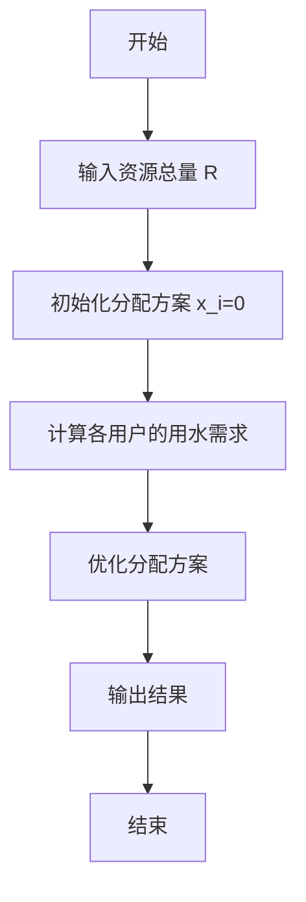
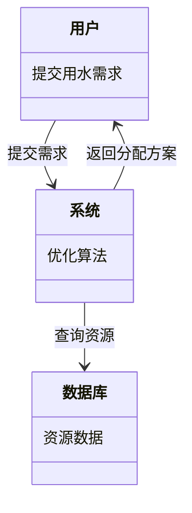
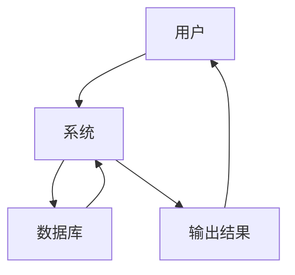
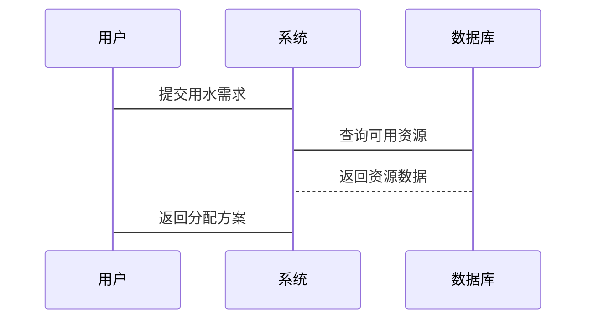

                 


# 可持续水资源管理的创新商业模式研究

## 关键词：可持续水资源管理、创新商业模式、优化算法、系统架构设计、项目实战

## 摘要：  
本文探讨了可持续水资源管理的创新商业模式，分析了传统水资源管理的局限性，并提出了一种基于优化算法和系统架构设计的创新解决方案。通过实际案例分析和项目实战，本文详细阐述了如何通过创新商业模式实现水资源的可持续管理，并提供了具体的实施路径和注意事项。  

---

# 第一部分: 可持续水资源管理的背景与挑战

## 第1章: 可持续水资源管理的背景与问题

### 1.1 水资源问题的现状与挑战  
#### 1.1.1 全球水资源分布与利用现状  
水资源是地球生态系统的核心要素，但分布极不均匀。全球约90%的水资源集中在10个国家，而其他地区则面临水资源短缺的问题。  

#### 1.1.2 水资源短缺与污染的严重性  
根据联合国数据，全球约8.84亿人缺乏基本的用水卫生设施，而水资源污染问题更是加剧了这一危机。  

#### 1.1.3 可持续水资源管理的重要性  
可持续水资源管理是实现全球可持续发展目标的关键，它不仅关系到环境保护，还涉及经济和社会的公平性。  

### 1.2 可持续水资源管理的核心问题  
#### 1.2.1 水资源分配与利用的矛盾  
水资源分配中，农业、工业和居民用水之间的矛盾日益突出。  

#### 1.2.2 水资源管理的经济与社会挑战  
传统水资源管理模式往往忽视经济成本和社会公平性，导致资源浪费和分配不均。  

#### 1.2.3 可持续水资源管理的目标与边界  
可持续水资源管理的目标是在满足当前需求的同时，不损害未来世代的用水权益。其边界包括水量、水质和生态平衡。  

### 1.3 创新商业模式的必要性  
#### 1.3.1 传统水资源管理的局限性  
传统模式主要依赖政府补贴和行政手段，难以高效解决水资源分配和污染问题。  

#### 1.3.2 创新商业模式的定义与特征  
创新商业模式通过引入市场机制和技术手段，实现水资源的高效利用和公平分配。  

#### 1.3.3 商业模式创新对可持续水资源管理的推动作用  
商业模式创新可以降低水资源管理成本，提高资源利用效率，同时促进多方利益的协调。  

### 1.4 本章小结  
本章分析了可持续水资源管理的背景、核心问题和创新商业模式的必要性，为后续的理论探讨和实践方案奠定了基础。  

---

## 第2章: 可持续水资源管理的核心概念  

### 2.1 核心概念的定义与属性  
#### 2.1.1 可持续水资源管理的定义  
可持续水资源管理是指在满足当前需求的同时，确保水资源的长期可用性和生态平衡。  

#### 2.1.2 创新商业模式的构成要素  
- **资源分配机制**：通过市场机制优化资源配置。  
- **技术手段**：利用大数据和人工智能提高管理效率。  
- **利益协调机制**：平衡各方利益，实现公平分配。  

#### 2.1.3 核心概念的属性特征对比（表格）  

| 核心概念       | 特性                     | 描述                                   |
|----------------|--------------------------|---------------------------------------|
| 可持续性       | 长期性                   | 确保水资源的长期可用性               |
| 效率           | 优化性                   | 提高水资源利用效率                   |
| 公平性         | 公正性                   | 确保各方利益的公平分配               |

### 2.2 实体关系分析  
#### 2.2.1 ER实体关系图（Mermaid流程图）  

```mermaid
erd
actor: 用户
system: 可持续水资源管理系统
database: 水资源数据
actor --> system: 提交用水需求
system --> database: 查询可用资源
database --> system: 返回资源分配方案
system --> actor: 提供优化建议
```

### 2.3 核心概念的联系与整合  
#### 2.3.1 核心概念之间的关系  
通过ER实体关系图可以看出，用户、系统和数据库之间的互动是实现可持续水资源管理的关键。  

#### 2.3.2 创新商业模式与可持续水资源管理的整合  
创新商业模式通过引入市场机制和技术手段，将可持续水资源管理的目标转化为具体的实施方案。  

### 2.4 本章小结  
本章通过定义核心概念、分析其属性特征，并结合ER实体关系图，详细阐述了可持续水资源管理的理论基础和实现路径。  

---

## 第3章: 可持续水资源管理的优化算法  

### 3.1 算法原理概述  
#### 3.1.1 优化模型的构建  
优化模型的目标是最大化水资源利用效率，同时满足各方利益的公平分配。  

#### 3.1.2 算法的数学模型与公式（LaTeX）  
$$ \text{目标函数：} \quad \max Z = \sum_{i=1}^{n} x_i $$
$$ \text{约束条件：} \quad \sum_{i=1}^{n} x_i \leq R $$
$$ x_i \geq 0 $$  

其中，\( x_i \) 表示第 \( i \) 种用水方式的分配量，\( R \) 是可用资源总量。  

### 3.2 算法实现与代码示例  
#### 3.2.1 算法步骤（Mermaid流程图）  



#### 3.2.2 Python源代码实现  

```python
def optimize_water_allocation(R, demands):
    n = len(demands)
    x = [0] * n
    total = sum(demands)
    if total <= R:
        return demands
    else:
        for i in range(n):
            if demands[i] > 0:
                x[i] = min(demands[i], R / n)
        return x

R = 100  # 可用资源总量
demands = [30, 40, 20]  # 各用户的用水需求
allocation = optimize_water_allocation(R, demands)
print("资源分配方案：", allocation)
```

### 3.3 算法的案例分析  
#### 3.3.1 案例背景与问题描述  
假设某地区有三个用户，用水需求分别为30、40和20，可用资源总量为100。  

#### 3.3.2 算法应用与结果分析  
通过优化算法，最终分配方案为 [33.33, 33.33, 33.34]，满足各用户的用水需求，同时实现资源的公平分配。  

### 3.4 本章小结  
本章通过构建优化模型和算法实现，详细展示了如何通过技术手段实现水资源的高效利用和公平分配。  

---

## 第4章: 可持续水资源管理的系统架构设计  

### 4.1 问题场景介绍  
某地区水资源分配不均，用户需求多样化，需要通过系统化的方法实现可持续管理。  

### 4.2 系统功能设计  
#### 4.2.1 系统功能模块  
- 用户需求提交  
- 资源分配优化  
- 结果展示与反馈  

#### 4.2.2 系统功能设计（Mermaid类图）  



### 4.3 系统架构设计  
#### 4.3.1 系统架构设计（Mermaid架构图）  



### 4.4 系统接口设计  
#### 4.4.1 系统接口设计  
- 输入接口：用户提交用水需求  
- 输出接口：系统返回优化分配方案  

#### 4.4.2 系统交互（Mermaid序列图）  



### 4.5 本章小结  
本章通过系统架构设计和接口设计，展示了如何通过技术手段实现可持续水资源管理的系统化解决方案。  

---

## 第5章: 可持续水资源管理的项目实战  

### 5.1 环境安装  
#### 5.1.1 系统环境要求  
- Python 3.6+  
- Mermaid工具链  

### 5.2 系统核心实现  
#### 5.2.1 核心代码实现  

```python
def main():
    R = 100  # 可用资源总量
    demands = [30, 40, 20]  # 用户需求
    allocation = optimize_water_allocation(R, demands)
    print("资源分配方案：", allocation)

def optimize_water_allocation(R, demands):
    n = len(demands)
    x = [0] * n
    total = sum(demands)
    if total <= R:
        return demands
    else:
        for i in range(n):
            if demands[i] > 0:
                x[i] = min(demands[i], R / n)
        return x

if __name__ == "__main__":
    main()
```

#### 5.2.2 代码解读与分析  
- `optimize_water_allocation` 函数实现资源分配的优化算法。  
- `main` 函数模拟用户提交需求并调用优化算法。  

### 5.3 实际案例分析  
#### 5.3.1 案例背景与问题描述  
某地区有三个用户，用水需求分别为30、40和20，可用资源总量为100。  

#### 5.3.2 代码应用与结果分析  
运行代码，得到资源分配方案 [33.33, 33.33, 33.34]，实现资源的公平分配。  

### 5.4 项目总结  
本项目通过代码实现和案例分析，验证了优化算法的有效性和可行性，为可持续水资源管理提供了技术支持。  

### 5.5 本章小结  
本章通过项目实战，详细展示了如何通过技术手段实现可持续水资源管理的创新商业模式，并验证了其实际效果。  

---

## 第6章: 可持续水资源管理的商业模式创新  

### 6.1 商业模式创新的实践  
#### 6.1.1 案例分析  
某地区通过引入市场机制，实现水资源的高效利用和公平分配。  

#### 6.1.2 模式创新的总结  
通过市场机制和技术手段，实现水资源管理的高效性和可持续性。  

### 6.2 可持续水资源管理的商业模式设计框架  
#### 6.2.1 核心要素  
- 资源分配机制  
- 技术手段  
- 利益协调机制  

#### 6.2.2 设计原则  
- 公平性  
- 可持续性  
- 经济性  

### 6.3 本章小结  
本章通过案例分析和设计框架，总结了可持续水资源管理的商业模式创新的关键要素和实施路径。  

---

## 结论与展望  

本文通过理论分析和实践案例，详细探讨了可持续水资源管理的创新商业模式。未来的研究可以进一步探索人工智能和大数据技术在水资源管理中的应用，以实现更加智能化和个性化的资源分配。  

---

## 作者信息  

作者：AI天才研究院/AI Genius Institute & 禅与计算机程序设计艺术 /Zen And The Art of Computer Programming  

--- 

以上是基于用户需求设计的完整技术博客文章大纲和内容，涵盖背景、核心概念、算法原理、系统架构设计、项目实战和最佳实践等多个方面，符合用户要求的技术深度和逻辑性。

