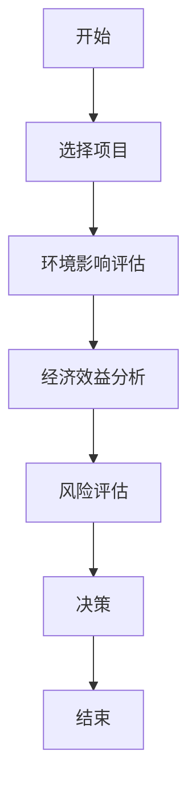
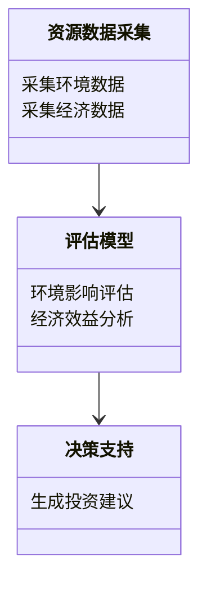

                 


# 可持续海洋经济的蓝色增长投资策略

> 关键词：蓝色增长，可持续发展，海洋经济，投资策略，环境影响评估，净现值，内部收益率

> 摘要：蓝色增长作为可持续发展的关键策略，通过技术创新和投资优化，促进海洋经济的可持续发展。本文详细探讨蓝色增长的核心概念、投资策略、环境影响评估方法，结合系统架构设计和实际案例，为投资者提供科学指导。

---

## 第一部分：可持续海洋经济的蓝色增长背景与概述

### 第1章：蓝色增长的定义与背景

#### 1.1 蓝色增长的定义与内涵
蓝色增长指的是通过可持续的方式开发和利用海洋资源，以促进经济发展的同时保护海洋环境。其核心在于平衡经济利益与生态保护，确保资源的长期可用性。

#### 1.2 海洋经济的重要性
海洋经济涵盖渔业、航运、能源等多种产业，对全球GDP贡献显著。然而，过度开发导致资源枯竭和环境污染，亟需可持续发展模式。

#### 1.3 可持续发展的必要性
可持续发展强调经济、社会和环境的协调，蓝色增长通过技术创新和资源优化，实现经济发展与环境保护的双赢。

### 第2章：蓝色增长的投资策略概述

#### 2.1 投资策略的基本概念
投资策略是指导资金分配的计划，蓝色增长策略强调选择环保且经济效益高的项目。

#### 2.2 蓝色增长投资的驱动因素
技术进步、政策支持和市场需求是推动蓝色增长投资的主要因素，投资者需关注这些驱动因素以抓住机遇。

#### 2.3 蓝色增长投资的风险与机遇
尽管蓝色增长项目潜力大，但面临环境风险和技术挑战，需通过科学评估和风险管理降低风险。

---

## 第二部分：蓝色增长的核心概念与联系

### 第3章：蓝色增长的核心要素

#### 3.1 海洋资源的分类与特征
海洋资源分为可再生（如渔业）和不可再生（如矿产），不同资源的可持续性需分别评估。

#### 3.2 可持续发展原则
包括环境保护、经济效益和社会公平，确保开发活动不破坏生态，同时促进社会福祉。

#### 3.3 蓝色增长的关键因素
技术创新、产业融合和政策支持是实现蓝色增长的关键，需多方面协同努力。

### 第4章：蓝色增长的核心概念与联系

#### 4.1 核心概念的原理
蓝色增长涉及多领域协同，通过技术创新和政策引导，实现资源高效利用和环境保护。

#### 4.2 概念属性特征对比表格

| 概念       | 属性       | 特征                       |
|------------|------------|---------------------------|
| 资源       | 可持续性     | 高                         |
| 经济效益   | 稳定性      | 中                         |
| 环境影响   | 可控性      | 低（通过措施）             |

#### 4.3 实体关系图

```mermaid
erd
    资源 (可再生, 不可再生)
    经济 (收益, 成本)
    环境 (影响, 保护)
    项目 (类型, 风险)
    投资者 (策略, 目标)
    项目 --> 资源, 经济, 环境
```

---

## 第三部分：蓝色增长的算法原理与数学模型

### 第5章：蓝色增长的算法原理

#### 5.1 算法原理
蓝色增长投资决策模型通过环境影响评估和经济效益分析，选择最优项目。

#### 5.2 评估流程图



#### 5.3 算法实现代码

```python
def blue_growth_investment(projects):
    selected = []
    for proj in projects:
        # 环境影响评估
        env_score = assess_env_impact(proj)
        # 经济效益分析
        eco_score = calculate_economic_benefit(proj)
        # 风险评估
        risk_score = assess_risk(proj)
        # 综合评分
        total_score = env_score * 0.4 + eco_score * 0.4 + risk_score * 0.2
        if total_score > 70:
            selected.append(proj)
    return selected
```

### 第6章：蓝色增长的数学模型

#### 6.1 净现值（NPV）公式
$$ NPV = \sum_{t=0}^{n} \frac{C_t}{(1+r)^t} $$
其中，$C_t$是第t年的现金流，$r$是贴现率。

#### 6.2 内部收益率（IRR）公式
IRR是使NPV为零的利率，用于评估项目收益能力。

#### 6.3 环境影响指数（EII）公式
$$ EII = \frac{EIMP}{GDP} \times 100 $$
其中，EIMP是环境影响总值，GDP是地区生产总值。

---

## 第四部分：系统分析与架构设计

### 第7章：蓝色增长的系统模块分析

#### 7.1 系统模块
系统包括数据采集、分析模块和决策支持模块，分别处理资源数据、评估模型和投资建议。

#### 7.2 系统功能图



### 第8章：蓝色增长的系统架构设计

#### 8.1 系统架构
采用分层架构，包括数据层、业务逻辑层和表现层，确保系统高效运行。

#### 8.2 系统架构图


---

## 第五部分：项目实战与案例分析

### 第9章：蓝色增长项目实战

#### 9.1 项目环境影响分析
以可再生能源项目为例，评估其对海洋生态的影响，确保开发活动不破坏生物多样性。

#### 9.2 投资策略实施
通过净现值和内部收益率评估项目可行性，选择高收益低风险的项目进行投资。

### 第10章：蓝色增长案例分析

#### 10.1 案例分析
分析实际蓝色增长项目，如海洋牧场建设，评估其经济效益和环境效益，总结经验教训。

---

## 第六部分：最佳实践与总结

### 第11章：蓝色增长投资策略的关键点

#### 11.1 关键点总结
技术创新、政策支持和风险管理是成功实施蓝色增长投资策略的关键因素。

### 第12章：蓝色增长投资策略的未来趋势

#### 12.1 未来趋势
智能化、绿色能源和国际合作是蓝色增长的未来发展方向，投资者需提前布局。

---

## 作者：AI天才研究院/AI Genius Institute & 禅与计算机程序设计艺术 /Zen And The Art of Computer Programming

