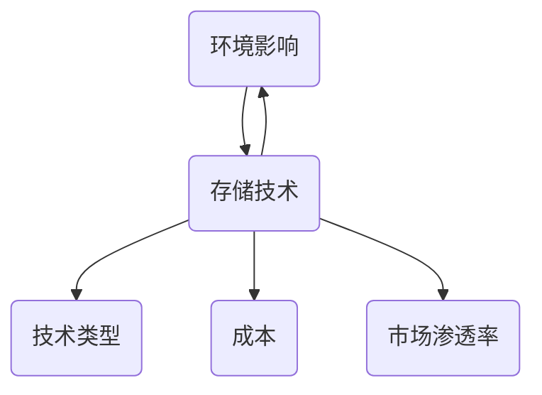
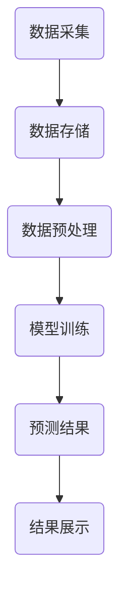

                 


# 可持续能源存储技术的市场渗透率预测

> 关键词：可持续能源、存储技术、市场渗透率、预测模型、时间序列分析、机器学习

> 摘要：本文详细探讨了可持续能源存储技术的市场渗透率预测方法，从技术背景、核心概念、算法原理、系统架构到实际案例分析，系统地分析了影响市场渗透率的关键因素，并提出了基于时间序列分析和机器学习的预测模型。通过详细的技术分析和实例演示，为读者提供了一套完整的市场渗透率预测方案。

---

# 第一部分: 可持续能源存储技术的背景与现状

## 第1章: 可持续能源存储技术的背景

### 1.1 可持续能源存储技术的背景

#### 1.1.1 可持续能源的发展现状
随着全球能源需求的增长和环境问题的加剧，可持续能源（如太阳能、风能、生物质能等）的开发和应用变得尤为重要。这些能源具有可再生、低碳或零碳排放的特点，是实现能源结构转型的重要方向。

然而，可持续能源的输出具有间歇性和波动性，例如太阳能仅在光照充足时才能发电，风能则受天气条件的影响较大。这种不稳定性使得能源的储存和调度变得必要。因此，能源存储技术在可持续能源系统中扮演着至关重要的角色。

#### 1.1.2 存储技术在能源系统中的重要性
能源存储技术（如电池储能、氢储能、热储能等）能够将多余的能量存储起来，在能源需求高峰期或供应不足时释放，从而保障能源系统的稳定性和可靠性。通过存储技术，可以减少对化石燃料的依赖，降低碳排放，同时提高可再生能源的利用率。

#### 1.1.3 市场渗透率预测的必要性
市场渗透率是指某项技术或产品在目标市场中的普及程度。对于可持续能源存储技术而言，准确的市场渗透率预测可以帮助企业制定合理的市场进入策略，政府规划能源政策，以及投资者评估市场潜力。然而，由于技术复杂性和市场动态的不确定性，市场渗透率的预测需要结合技术性能、成本、政策支持、市场需求等多方面因素进行综合分析。

---

### 1.2 市场渗透率预测的核心概念

#### 1.2.1 市场渗透率的定义与计算方法
市场渗透率的定义是：某项技术或产品在特定市场中的普及程度，通常以该技术或产品的用户数占目标市场的比例来衡量。计算公式为：
$$ \text{市场渗透率} = \frac{\text{已采用技术的用户数}}{\text{目标市场的总用户数}} \times 100\% $$

#### 1.2.2 可持续能源存储技术的分类与特点
可持续能源存储技术主要包括以下几类：
1. **电池储能**：包括铅酸电池、锂离子电池、钠硫电池等，具有较高的能量密度和快速响应能力。
2. **氢储能**：通过电解水制氢并储存，适用于大规模储能。
3. **热储能**：通过储热材料存储热量，常用于工业和建筑领域。
4. **飞轮储能**：利用动能进行储能，适用于电网调频和备用电源。

每种技术都有其优缺点。例如，电池储能技术成熟、应用广泛，但成本较高；氢储能技术适用于大规模储能，但目前氢气的制备和运输成本较高。

#### 1.2.3 预测模型的边界与外延
在市场渗透率预测中，需要考虑的主要因素包括技术性能（如储能效率、循环寿命）、成本（如初始投资、运维成本）、政策支持（如政府补贴、税收优惠）、市场需求（如电力需求增长、用户接受度）等。此外，还需要考虑市场竞争情况，即其他储能技术或替代技术的市场表现。

---

## 第2章: 可持续能源存储技术的核心概念与联系

### 2.1 可持续能源存储技术的核心原理

#### 2.1.1 储能技术的基本原理
储能技术的核心原理是将能量以某种形式存储，并在需要时将其转换回可用的能量形式。例如，电池储能通过化学反应将电能转化为化学能存储，再通过放电过程将化学能转化为电能。

#### 2.1.2 不同存储技术的优缺点对比
下表列出了几种常见储能技术的优缺点对比：

| 技术类型 | 优点 | 缺点 |
|----------|------|------|
| 电池储能 | 高效率、快速响应、技术成熟 | 成本高、寿命有限、材料依赖 |
| 氢储能    | 大规模储能、能量密度高 | 制氢成本高、储存和运输困难 |
| 热储能    | 成本低、适合长周期储能 | 适用场景有限、效率较低 |

#### 2.1.3 技术成熟度与成本分析
技术成熟度通常与成本呈负相关关系。例如，电池储能技术较为成熟，但其成本较高；而氢储能技术尚处于发展阶段，成本相对较低，但技术和基础设施的不完善导致实际应用受限。

---

### 2.2 核心概念的属性特征对比

#### 2.2.1 技术属性对比表
下表列出了几种储能技术的技术属性对比：

| 技术类型 | 储能效率 | 响应时间 | 储能容量 | 循环寿命 |
|----------|----------|----------|----------|----------|
| 电池储能 | 70%-90% | 几秒至几分钟 | 几十千瓦至兆瓦 | 几千次至几万次 |
| 氢储能    | 60%-80% | 数小时 | 兆瓦至百兆瓦 | 数万次以上 |
| 热储能    | 50%-70% | 数小时至数天 | 兆瓦级 | 无限次 |

#### 2.2.2 经济属性对比表
经济属性是影响市场渗透率的重要因素，下表列出了几种储能技术的经济属性对比：

| 技术类型 | 初始投资成本 | 运维成本 | 维护周期 | 投资回收期 |
|----------|--------------|----------|----------|------------|
| 电池储能 | 高 | 中 | 几年 | 5-10年 |
| 氢储能    | 中 | 低 | 十年 | 10-20年 |
| 热储能    | 低 | 中 | 十年 | 8-15年 |

---

### 2.3 ER实体关系图架构



---

## 第3章: 可持续能源存储技术的市场渗透率预测

### 3.1 市场渗透率预测的数学模型

#### 3.1.1 预测模型的选择
市场渗透率预测模型的选择需要考虑数据的可获得性、模型的复杂性和准确性。常见的模型包括：
1. **时间序列分析模型**（如ARIMA、GARCH）。
2. **机器学习模型**（如随机森林、XGBoost）。
3. **混合模型**（如将时间序列分解与机器学习特征工程相结合）。

#### 3.1.2 时间序列分析模型
时间序列分析模型适用于历史数据充足且具有明显趋势或周期性的场景。例如，使用ARIMA模型预测未来几年的市场渗透率。

#### 3.1.3 机器学习模型
机器学习模型能够捕捉复杂的非线性关系，适用于多变量预测场景。例如，使用随机森林模型结合技术性能、成本、政策等因素进行预测。

---

### 3.2 时间序列分析模型

#### 3.2.1 ARIMA模型的原理
ARIMA（自回归积分滑动平均模型）是一种常用的时间序列预测模型。其基本假设是历史数据中包含足够的信息来预测未来趋势。模型的数学表达式为：
$$ ARIMA(p, d, q) $$
其中：
- \( p \) 是自回归阶数。
- \( d \) 是差分阶数。
- \( q \) 是滑动平均阶数。

#### 3.2.2 ARIMA模型的实现
以下是使用Python实现ARIMA模型的示例代码：

```python
from statsmodels.tsa.arima.model import ARIMA
import pandas as pd

# 示例数据
data = pd.DataFrame({
    'year': [2010, 2011, 2012, 2013, 2014],
    'penetration': [10, 15, 20, 25, 30]
})

# 模型训练
model = ARIMA(data['penetration'], order=(1, 1, 1))
model_fit = model.fit()

# 预测结果
forecast = model_fit.forecast(steps=5)
print('预测渗透率:', forecast)
```

---

### 3.3 机器学习模型

#### 3.3.1 随机森林模型的原理
随机森林是一种基于决策树的集成学习方法，适用于高维数据和非线性关系的预测。其基本思想是通过构建多棵决策树并进行投票或平均来提高预测准确性和稳定性。

#### 3.3.2 随机森林模型的实现
以下是使用Python实现随机森林模型的示例代码：

```python
from sklearn.ensemble import RandomForestRegressor
from sklearn.model_selection import train_test_split
import pandas as pd

# 示例数据
data = pd.DataFrame({
    'year': [2010, 2011, 2012, 2013, 2014],
    'penetration': [10, 15, 20, 25, 30],
    'cost': [100, 90, 80, 70, 60]
})

# 数据分割
X = data[['year', 'cost']]
y = data['penetration']
X_train, X_test, y_train, y_test = train_test_split(X, y, test_size=0.2, random_state=42)

# 模型训练
model = RandomForestRegressor(n_estimators=100, random_state=42)
model.fit(X_train, y_train)

# 预测结果
predictions = model.predict(X_test)
print('预测渗透率:', predictions)
```

---

### 3.4 预测模型的优缺点对比

| 模型类型 | 优点 | 缺点 |
|----------|------|------|
| 时间序列模型 | 善于捕捉趋势和周期性 | 不适合处理多变量预测 |
| 机器学习模型 | 能够捕捉复杂非线性关系 | 需要大量数据和特征工程 |

---

## 第4章: 可持续能源存储技术的市场渗透率预测实战

### 4.1 项目介绍与数据准备

#### 4.1.1 项目背景
假设我们希望预测未来5年某地区电池储能技术的市场渗透率。数据来源包括历史市场渗透率数据、技术成本数据、政策补贴数据等。

#### 4.1.2 数据准备
以下是示例数据：

| 年份 | 渗透率 | 技术成本 | 补贴政策 |
|------|--------|----------|----------|
| 2010 | 10%    | 100      | 无       |
| 2011 | 15%    | 90       | 有       |
| 2012 | 20%    | 80       | 有       |
| 2013 | 25%    | 70       | 无       |
| 2014 | 30%    | 60       | 有       |

---

### 4.2 系统功能设计

#### 4.2.1 数据采集模块
负责收集市场渗透率数据、技术成本数据、政策补贴数据等。

#### 4.2.2 模型训练模块
负责对数据进行特征工程和模型训练，选择合适的预测模型。

#### 4.2.3 结果展示模块
负责将预测结果以可视化形式展示，便于用户理解和分析。

---

### 4.3 系统架构设计



---

### 4.4 系统实现

#### 4.4.1 数据预处理
对数据进行清洗、归一化等处理，确保数据适合模型训练。

#### 4.4.2 模型训练
使用随机森林模型进行训练，结合技术成本和政策补贴作为特征。

#### 4.4.3 结果展示
将预测结果可视化，例如绘制实际值与预测值的对比图。

---

## 第5章: 总结与展望

### 5.1 总结
本文详细探讨了可持续能源存储技术的市场渗透率预测方法，从技术背景、核心概念、算法原理到系统实现，提供了一套完整的预测方案。通过对比不同储能技术的特点和优缺点，结合时间序列分析和机器学习模型，为读者提供了多种预测方法。

### 5.2 展望
未来，随着技术的进步和数据的积累，市场渗透率预测将更加精准。同时，随着人工智能和大数据技术的发展，预测模型将更加复杂和多样化，例如引入深度学习模型（如LSTM）进行时间序列预测。

### 5.3 最佳实践 tips
- 数据的准确性和完整性是预测模型准确性的关键。
- 在实际应用中，建议结合领域知识对模型进行调优。
- 预测结果应结合实际情况进行验证和调整。

---

作者：AI天才研究院/AI Genius Institute & 禅与计算机程序设计艺术 /Zen And The Art of Computer Programming

