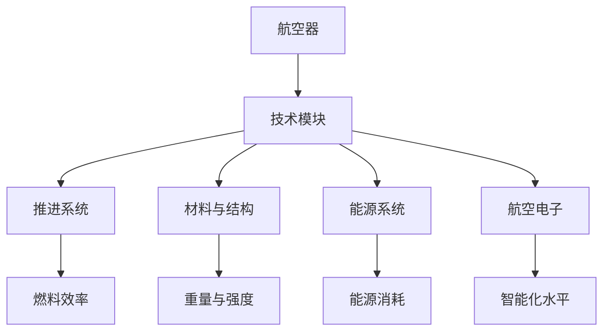
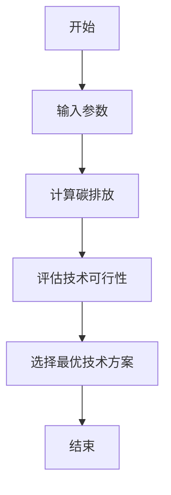
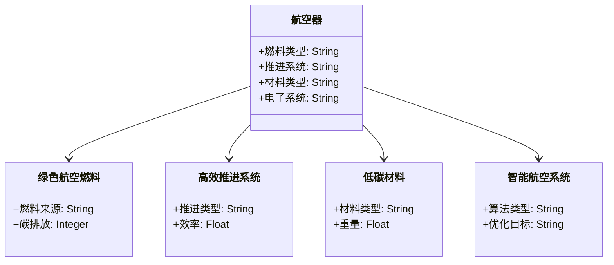
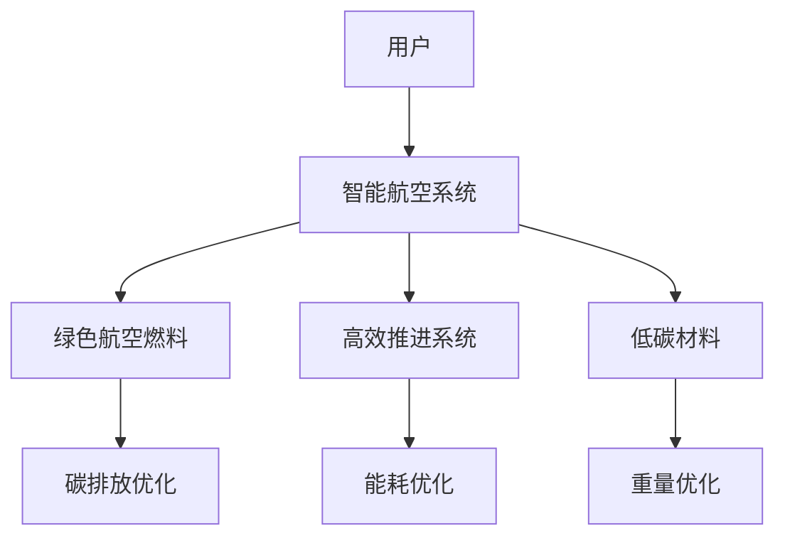
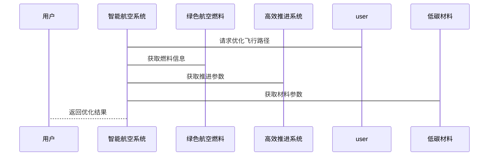

                 


# 可持续航空技术的研发投入与市场前景

## 关键词：可持续航空技术、绿色航空燃料、高效推进系统、低碳材料、智能航空系统

## 摘要：  
随着全球气候变化的加剧和航空业碳排放问题的突出，可持续航空技术的研发和市场应用成为全球关注的焦点。本文将从技术、经济、政策等多维度分析可持续航空技术的研发投入与市场前景，探讨其关键技术和未来发展方向。

---

## 第1章：可持续航空技术的背景与定义

### 1.1 可持续航空技术的核心概念  
可持续航空技术是指通过技术创新和优化，减少航空业碳排放、能源消耗和环境影响的技术。其核心目标是在满足航空需求的同时，实现资源的高效利用和环境的可持续性。

#### 1.1.1 可持续航空技术的定义  
可持续航空技术包括绿色航空燃料、高效推进系统、低碳材料与制造技术、智能航空系统等，旨在降低航空活动对环境的影响。

#### 1.1.2 可持续航空技术的必要性  
航空业是全球碳排放的主要来源之一。随着全球气候变化问题的加剧，航空业必须通过技术创新实现低碳转型，以满足全球碳中和目标。

#### 1.1.3 可持续航空技术的核心要素  
- **绿色航空燃料**：替代传统化石燃料，减少碳排放。  
- **高效推进系统**：通过技术优化减少能源消耗。  
- **低碳材料与制造**：降低飞机重量和生产过程的碳排放。  
- **智能航空系统**：通过数字化技术优化飞行效率。

### 1.2 可持续航空技术的分类与特点  

#### 1.2.1 绿色航空燃料  
绿色航空燃料包括生物燃料、氢燃料等，其碳排放相对于传统燃料大幅减少。  
- 生物燃料：由植物油、动物脂肪等可再生资源制成。  
- 氢燃料：通过燃料电池提供动力，实现零碳排放。

#### 1.2.2 高效推进系统  
高效推进系统通过技术优化减少能源消耗。  
- 混合动力推进系统：结合传统发动机和电动机，提高效率。  
- 电动推进系统：适用于短途飞行，完全零排放。

#### 1.2.3 低碳材料与制造  
低碳材料与制造技术通过降低飞机重量和生产过程的碳排放。  
- 高强度轻量化材料：如碳纤维复合材料。  
- 数字化制造：通过3D打印等技术减少材料浪费。

#### 1.2.4 智能航空系统  
智能航空系统通过数字化技术优化飞行效率。  
- 智能飞行控制：通过AI算法优化飞行路径，减少燃料消耗。  
- 航空电子系统：通过数据共享和协同优化提高整体效率。

### 1.3 可持续航空技术的全球发展趋势  

#### 1.3.1 全球航空业的碳排放问题  
航空业的碳排放约占全球总排放的2-3%，且呈上升趋势。国际社会通过《巴黎协定》等推动航空业低碳转型。

#### 1.3.2 各国政府的政策支持  
- 欧盟：通过“绿色新政”推动航空业脱碳。  
- 美国：提供研发资金支持绿色航空技术。  
- 中国：提出碳中和目标，支持绿色航空技术发展。

#### 1.3.3 企业研发投资的现状  
全球主要航空公司和航空设备制造商加大研发投入，推动绿色航空燃料、电动推进系统等技术的发展。

### 1.4 可持续航空技术在中国的发展现状  

#### 1.4.1 中国航空业的碳中和目标  
中国政府提出在2060年前实现碳中和，航空业是重点减排领域。

#### 1.4.2 国内企业的研发进展  
- 中国商飞：积极推进C919飞机的绿色技术应用。  
- 国内科研机构：在绿色航空燃料、电动推进技术等领域取得突破。

#### 1.4.3 政策支持与行业标准  
中国政府出台多项政策支持绿色航空技术发展，推动行业标准的制定与实施。

---

## 第2章：可持续航空技术研发的背景与问题背景

### 2.1 碳排放与气候变化的危机  

#### 2.1.1 航空业碳排放对环境的影响  
航空业的碳排放主要来自燃料燃烧，是全球气候变化的重要因素。

#### 2.1.2 气候变化对航空业的威胁  
气候变化可能导致极端天气事件增多，影响航空安全和运营效率。

#### 2.1.3 可持续航空技术的必要性  
通过技术创新减少碳排放是航空业应对气候变化的关键。

### 2.2 航空业的能源转型挑战  

#### 2.2.1 石油基燃料的局限性  
传统航空燃料依赖化石能源，不可再生且碳排放高。

#### 2.2.2 可再生能源在航空领域的应用  
- 生物燃料：利用可再生资源生产航空燃料。  
- 氢能：作为清洁的替代能源。

#### 2.2.3 航空燃料的替代技术  
- 电力驱动：适用于短途飞行。  
- 混合动力：结合传统燃料和电动推进。

### 2.3 可持续航空技术研发的边界与外延  

#### 2.3.1 技术研发的边界  
- 技术可行性：现有技术的局限性。  
- 经济性：研发和应用成本的平衡。

#### 2.3.2 市场应用的外延  
- 技术的商业化路径。  
- 用户接受度和市场推广。

#### 2.3.3 政策与经济的双重影响  
政府政策对技术研发和市场推广的双重作用。

---

## 第3章：可持续航空技术的核心概念与联系

### 3.1 核心概念原理  

#### 3.1.1 可持续航空技术的系统性  
各技术模块协同作用，实现整体效率提升和碳排放降低。

#### 3.1.2 各技术模块的协同作用  
- 绿色燃料与高效推进系统结合，优化能源利用。  
- 轻量化材料与智能系统协同，提高飞行效率。

#### 3.1.3 技术与市场的双向驱动  
技术研发推动市场应用，市场需求反过来促进技术进步。

### 3.2 核心概念属性特征对比  

#### 3.2.1 不同技术路径的对比分析  
| 技术路径       | 优点                           | 缺点                           |
|----------------|--------------------------------|--------------------------------|
| 绿色航空燃料   | 碳排放大幅降低                 | 成本高，供应链不完善             |
| 高效推进系统   | 能耗低，效率高                 | 技术成熟度较低                 |
| 低碳材料       | 重量轻，能耗低                 | 生产成本高                     |
| 智能航空系统   | 优化飞行路径，提升效率         | 依赖数字化基础设施             |

#### 3.2.2 技术成熟度与成本效益的对比  
- 绿色燃料：技术成熟度中等，成本较高。  
- 电动推进系统：技术成熟度低，但成本下降潜力大。

#### 3.2.3 市场接受度与政策支持的对比  
- 政策支持高：技术更容易被市场接受。  
- 市场需求大：推动技术更快商业化。

### 3.3 ER实体关系图  



---

## 第4章：可持续航空技术的算法原理

### 4.1 算法原理概述  

#### 4.1.1 可持续航空技术的优化算法  
通过优化算法，实现飞机设计和运行效率的提升。例如，遗传算法用于飞机结构优化。

#### 4.1.2 碳排放计算模型  
通过碳排放模型，评估不同技术路径的碳排放效果。

#### 4.1.3 技术可行性评估方法  
通过技术可行性分析，评估不同技术的商业化潜力。

### 4.2 算法流程图  



---

## 第5章：可持续航空技术的系统分析与架构设计方案

### 5.1 问题场景介绍  
航空业碳排放问题日益严峻，需要通过技术创新实现低碳转型。

### 5.2 项目介绍  
某航空公司计划引入绿色航空燃料和电动推进系统，降低碳排放。

### 5.3 系统功能设计  

#### 5.3.1 领域模型  


### 5.4 系统架构设计  



### 5.5 系统接口设计  
- 用户接口：飞行员和地面控制人员的操作界面。  
- 技术接口：与绿色航空燃料、推进系统等的技术集成。

### 5.6 系统交互  



---

## 第6章：可持续航空技术的项目实战

### 6.1 环境安装  
- 安装绿色航空燃料生产设备。  
- 配置高效推进系统和智能航空系统。

### 6.2 系统核心实现源代码  

#### 6.2.1 绿色航空燃料生产  
```python
def produce_green_fuel(source_material):
    # 生产绿色航空燃料
    return "green_fuel"
```

#### 6.2.2 高效推进系统控制  
```python
def control_efficient_system(fuel_level):
    if fuel_level < 10%:
        return "recharge"
    else:
        return "continue"
```

#### 6.2.3 智能航空系统优化  
```python
def optimize_flight_path(weather, traffic):
    # 优化飞行路径
    return "optimal_path"
```

### 6.3 代码应用解读与分析  
通过上述代码实现绿色航空燃料的生产、高效推进系统的控制和智能航空系统的优化。

### 6.4 实际案例分析  
以某航空公司为例，分析绿色航空燃料的应用效果和经济效益。

### 6.5 项目小结  
通过项目实战，验证了可持续航空技术的可行性和有效性。

---

## 第7章：可持续航空技术的最佳实践、小结、注意事项、拓展阅读

### 7.1 最佳实践 tips  
- 加强技术研发投入。  
- 推动政策支持和行业标准制定。  
- 加强国际合作，共同推动可持续航空技术发展。

### 7.2 小结  
可持续航空技术是实现航空业低碳转型的关键，其研发和应用需要技术、经济和政策的多方面支持。

### 7.3 注意事项  
- 技术研发需考虑经济性和可行性。  
- 政策支持是技术推广的重要保障。  
- 用户接受度是技术市场化的重要因素。

### 7.4 拓展阅读  
- 《绿色航空燃料的生产技术与应用》  
- 《高效推进系统的优化算法研究》  
- 《智能航空系统的数字化转型》

---

## 作者：AI天才研究院/AI Genius Institute & 禅与计算机程序设计艺术 /Zen And The Art of Computer Programming

---

**文章总结：**  
可持续航空技术的研发投入与市场前景密切相关。通过技术创新、政策支持和市场推广，可持续航空技术将在未来航空业中发挥重要作用，推动航空业实现低碳转型。

