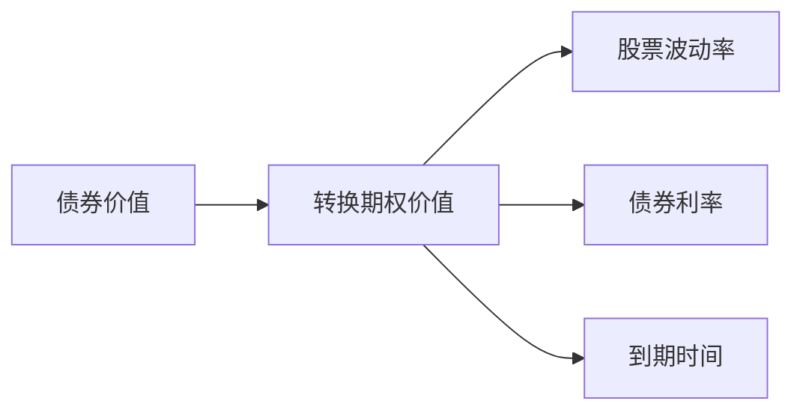
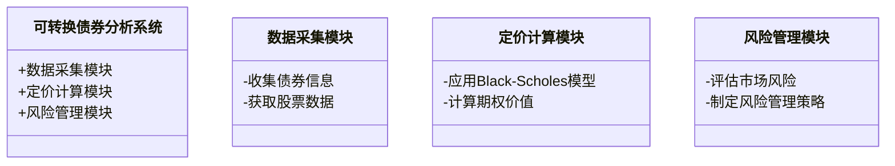
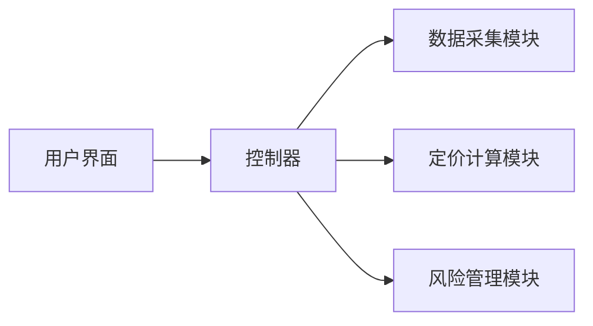

                 


```markdown
# 可转换债券策略：兼具股债特性的灵活工具

> 关键词：可转换债券，债券，股票，投资策略，金融工具

> 摘要：可转换债券是一种结合了债券和股票特性的金融工具，具有灵活性和多样性。本文将深入探讨可转换债券的基本概念、定价模型、市场分析及系统设计，帮助读者全面理解其在投资中的应用。

---

# 第一部分: 可转换债券的基本概念与市场背景

## 第1章: 可转换债券的定义与特点

### 1.1 可转换债券的基本定义
可转换债券（Convertible Bonds）是一种特殊类型的债券，允许投资者在特定条件下将其转换为公司股票。这种工具结合了债券的固定收益特性和股票的成长性，为投资者提供了灵活的投资选择。

- **基本定义**：可转换债券是一种债务工具，附带期权属性，允许持有人在指定时间内将其转换为发行公司的股票。
- **主要要素**：包括面值、票面利率、转换价格、到期日和赎回条款等。

### 1.2 可转换债券的核心特点
- **债券属性**：提供固定的利息收入，到期偿还本金。
- **股票属性**：附带期权，可按预定价格转换为股票，分享公司股价上涨的收益。
- **灵活性**：投资者可以根据市场情况选择持有债券或转换为股票，平衡风险和收益。

## 第2章: 可转换债券的市场背景与投资价值

### 2.1 可转换债券的市场现状
- **全球市场**：可转换债券在欧美市场较为成熟，近年来亚洲市场发展迅速。
- **中国市场**：随着资本市场的开放，中国可转换债券市场逐步发展，成为企业融资的重要工具。

### 2.2 可转换债券的投资价值分析
- **风险分散**：结合债券和股票的优势，适合不同风险偏好的投资者。
- **收益潜力**：在股价上涨时可获得超额收益，而在市场低迷时可获得稳定的债券利息。

---

# 第二部分: 可转换债券的核心概念与结构分析

## 第4章: 可转换债券的结构与定价原理

### 4.1 可转换债券的基本结构
- **债券部分**：包括面值和票面利率，确保投资者获得固定收益。
- **转换期权**：赋予投资者在特定条件下将债券转换为股票的权利。

### 4.2 可转换债券的定价模型
使用Black-Scholes模型评估转换期权的价值，考虑股票波动率、债券利率和到期时间等因素。



定价公式：
$$ C = S_0 \times N(d_1) - K e^{-rT} \times N(d_2) $$
其中，\( d_1 = \frac{\ln(S_0/K) + (r + \sigma^2/2)T}{\sigma \sqrt{T}} \)
\( d_2 = d_1 - \sigma \sqrt{T} \)

## 第5章: 可转换债券的核心要素分析

### 5.1 转换价格与转股期限
- **转换价格**：债券持有人可以按预定价格转换为股票。
- **转股期限**：规定了转股的最后截止日期，影响债券的流动性。

### 5.2 票面利率与债券期限
- **票面利率**：决定债券的固定利息收入。
- **债券期限**：影响债券的市场价值和流动性。

---

# 第三部分: 可转换债券的系统分析与架构设计

## 第6章: 系统功能设计

### 6.1 系统模块划分
- **数据采集模块**：收集债券市场数据和公司股票信息。
- **定价计算模块**：使用模型计算可转换债券的理论价值。
- **风险管理模块**：评估投资风险并制定规避策略。



## 第7章: 系统架构设计

### 7.1 系统架构图


---

# 第四部分: 项目实战与案例分析

## 第8章: 项目实战

### 8.1 环境安装
- **Python环境**：安装Anaconda或Miniconda，配置Jupyter Notebook。
- **依赖库安装**：使用pip安装numpy、pandas、scipy和matplotlib。

### 8.2 核心代码实现

```python
import numpy as np
from scipy.stats import norm

def black_scholes(S, K, r, sigma, T):
    d1 = (np.log(S/K) + (r + sigma**2/2)*T) / (sigma*np.sqrt(T))
    d2 = d1 - sigma*np.sqrt(T)
    C = S * norm.cdf(d1) - K * np.exp(-r*T) * norm.cdf(d2)
    return C

# 示例计算
S = 100
K = 105
r = 0.05
sigma = 0.3
T = 1

price = black_scholes(S, K, r, sigma, T)
print(f"转换期权价格：{price}")
```

### 8.3 案例分析
分析某公司发行的可转换债券，计算其理论价值并评估市场风险。

---

# 第五部分: 总结与展望

## 第9章: 总结与展望

### 9.1 全文总结
可转换债券结合了债券和股票的特性，是一种灵活的投资工具。本文详细介绍了其基本概念、定价模型和系统设计，为投资者提供了理论支持和实践指导。

### 9.2 未来展望
未来，可转换债券的研究将结合大数据和机器学习，进一步优化定价模型和风险评估方法。

---

# 作者

作者：AI天才研究院 & 禅与计算机程序设计艺术

---

感谢您的阅读！如需进一步了解可转换债券的相关知识，欢迎访问我们的网站或关注我们的社交媒体账号。
```

